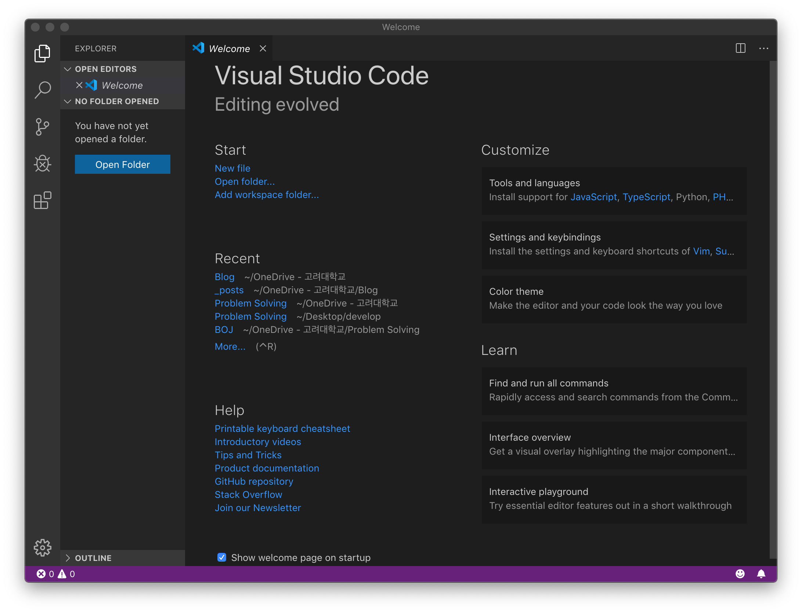
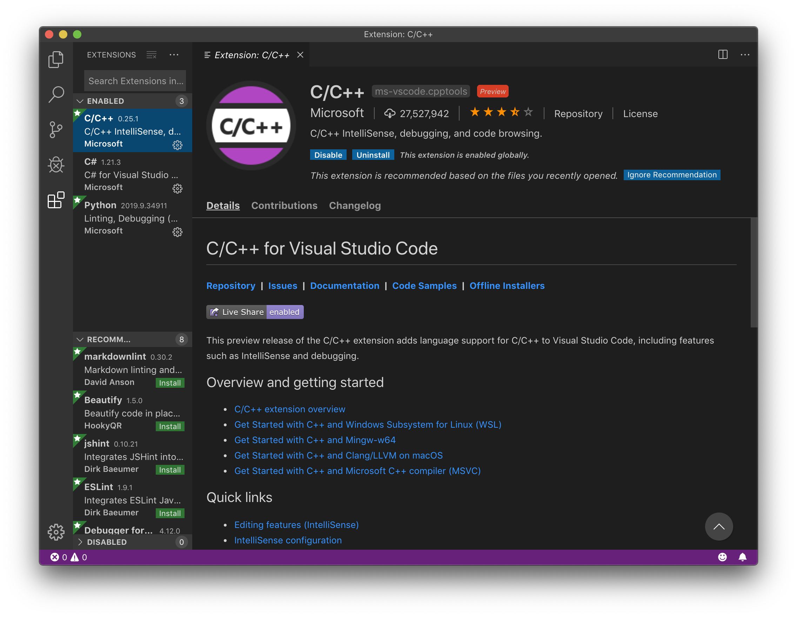
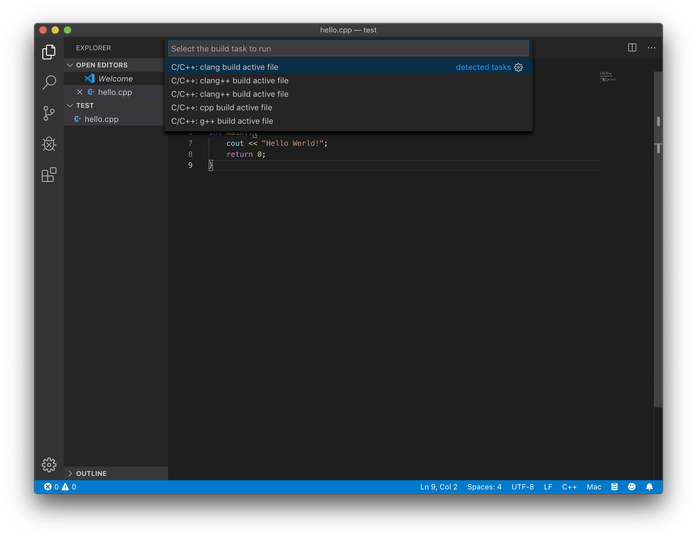
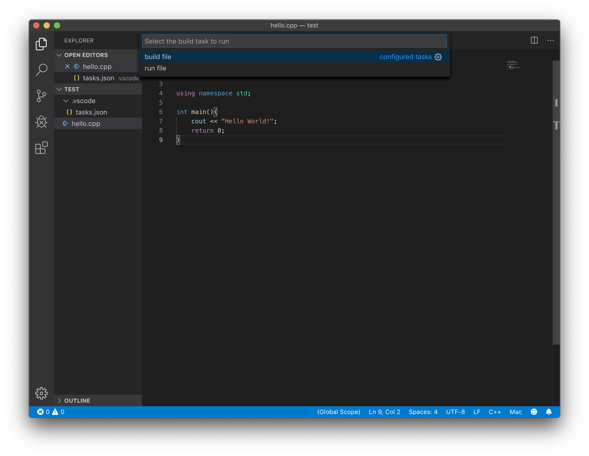
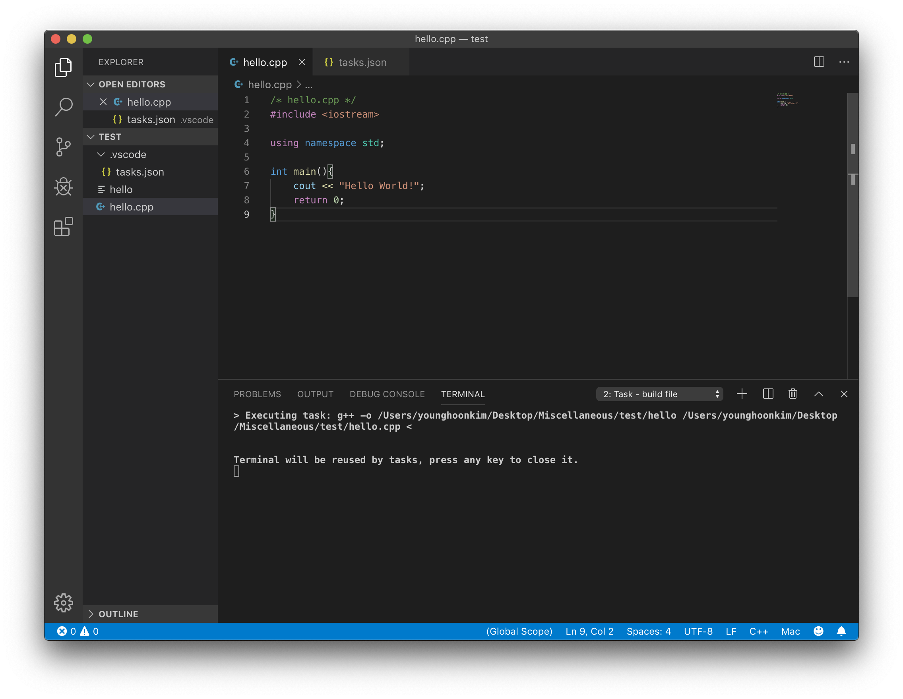
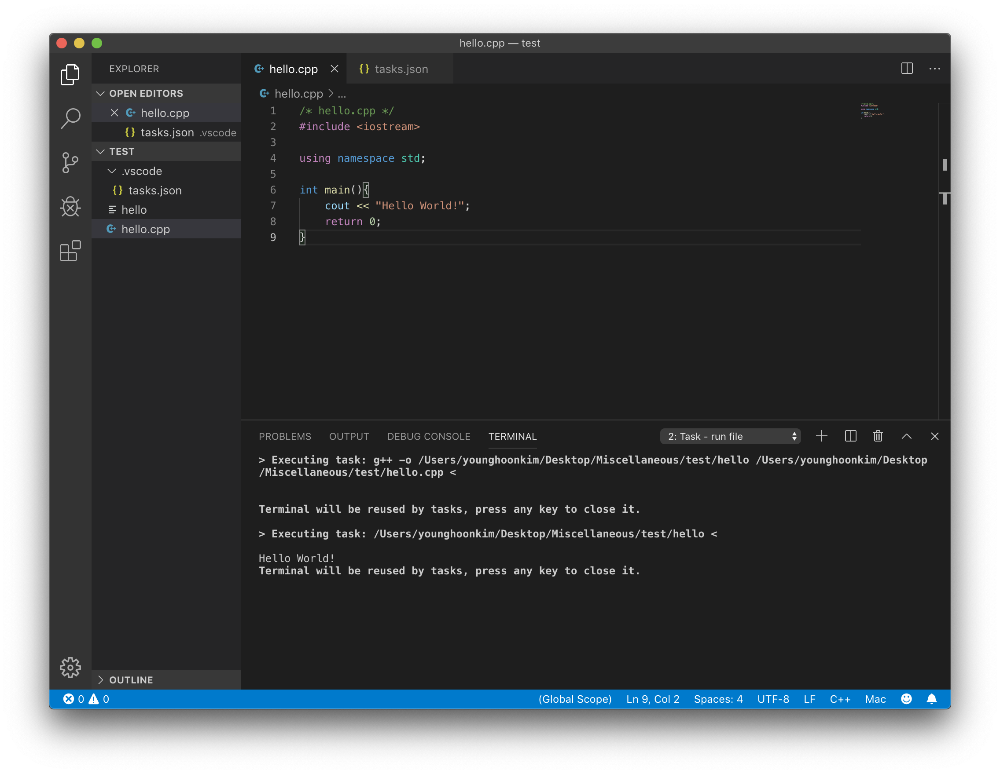

## 맥에서 VS Code로 C++ 빌드를 해보자

우선 VS Code 를 열어서 원하는 디렉토리로 이동한다.
(`Cmd+Shift+E` 로 explorer tab 을 열 수 있다.)  


VS Code에서 C++을 이용하려면 Microsoft에서 제공하는 C/C++ extension을 설치해야한다.  
  
설치가 완료되었으면 연습용 cpp 파일을 만들어서 간단하게 코드를 짜보자.  
  
역시 연습용 코드는 국룰인 hello world
``` cpp
/* hello.cpp */
#include <iostream>

using namespace std;

int main(){
    cout << "Hello World!";
    return 0;
}
```

이제 빌드를 해야한다. Run Build Task 를 실행시키기 위해 `Cmd+Shift+B` 를 이용한다.  
또는 해당 폴더의 루트 디렉토리에 __`.vscode`__ 라는 폴더를 만든 후 tasks.json을 만들어도 된다.




tasks.json은 이렇게 생겼다.

```json
/* tasks.json */
{
    // See https://go.microsoft.com/fwlink/?LinkId=733558 
    // for the documentation about the tasks.json format
    "version": "2.0.0",
    "tasks": [
        {
            "type": "shell",
            "label": "clang build active file",
            "command": "/usr/bin/clang",
            "args": [
                "-g",
                "${file}",
                "-o",
                "${fileDirname}/${fileBasenameNoExtension}"
            ],
            "options": {
                "cwd": "/usr/bin"
            },
            "problemMatcher": [
                "$gcc"
            ],
            "group": "build"
        }
    ]
}
```
여기서 `tasks` 부분을 변경하여 원하는대로 명령어를 실행할 수 있다.

``` json
"tasks": [
        {
            "label": "build file",
            "type": "shell",
            "command": "g++",
            "args": [
                "-o",
                "${fileDirname}/${fileBasenameNoExtension}",
                "${file}"
            ],
            "group": {
                "kind": "build",
                "isDefault": true
            },
            "problemMatcher": [
                "$gcc"
            ]
        },
        {
            "label": "run file",
            "type": "shell",
            "command": "${fileDirname}/${fileBasenameNoExtension}",
            "args": [
            ],
            "group": {
                "kind": "build",
                "isDefault": true
            },
            "problemMatcher": []
        },
    ]
```

나는 이렇게 세팅해두고 build 와 run 을 한다. 구성을 마치게 된다면 이제 `Cmd+Shift+B` 를 통해 task를 실행시킬 수 있다.



빌드를 하게 되면 g++로 컴파일 결과를 알려주고



실행을 하게되면 다음과 같이 프로그램이 실행된다.



설정에 따라 실행파일의 위치나 이름 등을 커스텀할 수 있다.
