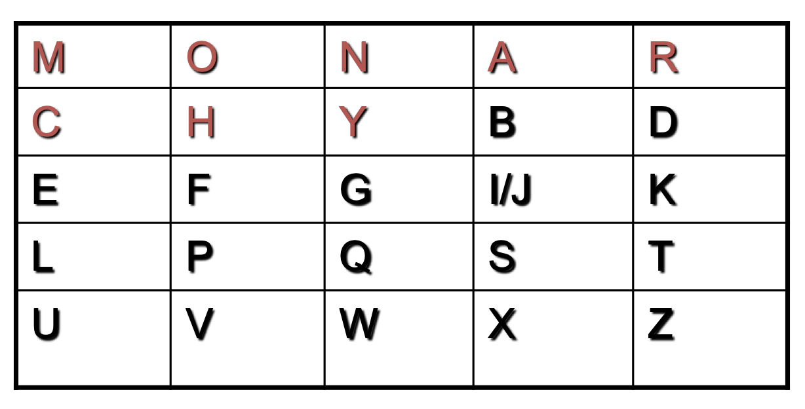

## 고전적인 암호화 기법

먼저, 기본적인 용어에 대해 정리를 하고 진행해보자.

- Plaintext : 평문
- Ciphertext : 암호문
- Cipher : 평문에서 암호문으로 바꾸는 알고리즘
- Key : cipher에서 사용되는 정보로 송/수신자만 알고 있는 정보
- Encipher(encrypt) : 평문에서 암호문으로 바꾸는 과정(암호화)
- Decipher(decrypt) : 암호문에서 평문으로 바꾸는 과정(복호화)
- Cryptography : 암호학
- Cryptanalysis(codebreaking) : key를 모르는 상태에서 복호화 방법을 연구하는 학문
- Cryptology : cryptography + cryptoanalysis
  
<br>

- Unconditional Security : resource 제한 없이 보안이 가능
- Computational(conditional) Security : 한정적인 resource 환경에서 보안이 가능. 아래의 두 경우에 safe 하다고 판단한다.
    1. cost of breaking cipher > value of information
    2. time to break cipher > usefule lifetime of info


## Symmetric Cipher Model

Symmetric Cipher Model 의 과정은 다음과 같다.

1. 평문 $X$를 Key $K$와 암호화 알고리즘을 이용해 ciphertext $Y$ 로 만든다.
2. ciphertext $Y$ 를 전송한다.
3. 수신자는 받은 ciphertext $Y$ 를 Key $K$와 복호화 알고리즘을 이용해 평문 $X$를 얻는다.

이 때, Key $K$ 는 송/수신자가 미리 공유한 비밀 키이다.  
<small>이 비밀 키를 안전하게 공유하는 것도 중요한 이슈이나 우선 안전하게 공유된 상태라고 가정하자.</small>  

이런 Symmetric Cipher Model 구조상 보안을 위해 두 가지가 요구되는데 ___강한 암호화 알고리즘___ 과 ___비밀 키의 기밀 유지___ 이다.

공격자 입장에서는 하나의 ciphertext 를 복호화하는데 성공하는 것 보다 Key 를 탈취하는게 impact level 이 더 크다. 따라서 ciphertext 를 복호화하는게 쉽지 않도록 복잡한 알고리즘을 적용하거나 Key 를 잘 숨길 수 있어야 한다.  

아래는 두 가지 공격 모델을 나타낸다.

- attack model
    - passive : ciphertext-only attack / Known-plaintext attack
    - active : Chosen-plaintext attack / Chosen-ciphertext attack

이러한 공격의 최종 목표는 Key 를 얻는 것이다.  

그리고 이러한 것을 방어하기 위한 학문으로 암호학(Cryptography)이 발전하게 되었다.

### Cryptography

암호학에서는 다음과 같은 암호화 방법에 대해 논한다.

1. 암호화 방법의 종류
    - Substitution : text의 변화
    - Transposition : 위치 변화
    - Product : 여러 가지를 섞어 씀
2. Key 의 개수
    - Single-key 또는 private key
    - Two-key 또는 public key
3. cipher에서 plaintext의 size
    - Block cipher : 고정된 크기(예. 128-bit)를 한 번에 암호화
    - Stream cipher : bit 또는 byte 단위로 암호화

### Cryptanalysis

우리 말로 _암호 분석_ 정도로, 알고리즘의 취약점을 공격하는 __Cryptanalytic attack__ 과 알고리즘 고려 없이 모든 경우를 산정해 공격하는 __Brute-force attack__ 이 있다.  

이들의 목적은 Key 를 얻어내는 것이다. (impact level 이 더 크기 때문!)

위에서 잠깐 언급한 공격 모델을 서술하면 아래와 같다.

|Type|Known to Cryptanalyst|
|:---|:---|
|Ciphertext Only|<ul><li>암호화 알고리즘</li><li>암호문</li></ul>|
|Known Plaintext|<ul><li>암호화 알고리즘</li><li>암호문</li><li>평문-암호문 쌍(비밀 키로 만들어짐)</li></ul>|
|Chosen Plaintext|<ul><li>암호화 알고리즘</li><li>암호문</li><li>암호 분석가에 의해 선택 된 plaintext와 이것이 해독된 ciphertext</li></ul>|
|Chosen Ciphertext|<ul><li>암호화 알고리즘</li><li>암호문</li><li>암호 분석가에 의해 선택 된 ciphertext와 이것이 해독된 plaintext</li></ul>|
|Chosen Text|<ul><li>암호화 알고리즘</li><li>암호문</li><li>암호 분석가에 의해 선택 된 plaintext와 이것이 해독된 ciphertext</li><li>암호 분석가에 의해 선택 된 ciphertext와 이것이 해독된 plaintext</li></ul>|

아래로 갈 수록 강력한 공격 방법이고, 상위 공격이 가능하면 하위 공격이 모두 가능하다.  

## Substitution Techniques

고전적이면서도 알려진 암호화 방법 중 가장 오래된 카이사르 암호화(Caesar Cipher) 방법을 먼저 살펴보자.

### Caesar Cipher

굉장히 간단하다.  
모든 글자에 대해 알파벳 순서에서 3칸 씩 shift 한 것이다.  
  
예시 )
```
plain : hello world
cipher : KHOOR ZRUOG
```

수학적으로 표현하면 Caesar Cipher 는 아래와 같이 표현 할 수 있다.  
a부터 z까지 0~25 까지의 숫자를 부여할 때  

$c = E(k, p) = (p + k) \mod{26}$  
$p = D(k, c) - (c - k) \mod{26}$
  
Caesar Cipher 에 대해 Cryptanalysis 를 적용하면 아래와 같이 brute-force 를 적용할 수 있음을 알 수 있다.

1. 암호화/복호화 알고리즘이 알려져 있다.
2. 25개의 키만 시도해보면 된다.
3. 평문에 관한 언어(<small>로마자</small>)가 알려져있고 쉽게 식별이 가능하다.

이와 같이 brute-force 로 모든 것을 시도하면 쉽게 복호화할 수 있으나, 언어로 이루어진 평문을 얻기에 사람이 직접 문장을 확인해야 정확하게 알 수 있다.(<small>아니면 기계가 언어를 이해할 수 있도록 NLP..?</small>)  

> 이와 관련하여 honey encryption 이라는 것도 있는데 나중에 포스팅 해야겠다.  

### Monoalphabetic Cipher

_Caesar Cipher_ 에서 조금 더 발전해서 일정하게 shift 하는 것이 아닌, 한 문자가 정해진 다른 문자로 암호화 되는 방법이다.

예 )
```
Plain :  abcdefghijklmnopqrstuvwxyz
Cipher : DKVQFIBJWPESCXHTMYAUOLRGZN

plaintext :  ifwewishtoreplaceletters
ciphertext : WIRFRWAJUHYFTSDVFSFUUFYA
```

이제 26! 만큼의 key 를 가지게 되어서 안전하다고 생각할 수 있겠지만...  
___언어의 특성___ 때문에 그렇지 못하다!

통계학적인 방법을 이용한다면, 영어의 경우 E가 가장 많이 나타나는 문자이고, T, R, N, I, O, A, S 가 그 뒤를 잇는다고 한다.  
하나의 문자 뿐 아니라, 두 문자, 세 문자의 통계적 결과가 나타나 있는 표 등의 정보가 있다면 어떨까??  
몇 가지 문자에 대해 추측을 하고 통계적 특성에 비추어 보게 된다면?  
  
이런 식으로 side information 을 이용해 복호화 시킬 수 있게 된다.

### Playfair Cipher

위의 문제로 인해 두 개의 문자를 동시에 암호화 하는 방법을 생각해 볼 수 있다.

그것이 바로 꽤 오래 사용되였던 __playfair cipher__ 이다. <small>1차 세계대전 에서도 쓰였다는 설이..</small>

5*5 matrix 에 특정한 keyword 를 이용해 암호화 하는 방식으로 나머지는 안 쓰인 문자들로 채운다.  

예 )

$keyword$ = MONARCHY



위와 같이 채울 수 있으며, 암호화 방법은 다음과 같을 수 있다.
  
1. 연속된 문자가 쓰이면 X로 치환한다.
2. 같은 행에 있는 두 문자의 경우 오른쪽 문자로 치환한다. e.g. 'ar' -> 'RM'
3. 같은 열에 있는 두 문자의 경우 아래쪽 문자로 치환한다. e.g. 'mu' -> 'CM'
4. 나머지 경우 상대 문자의 행/열에 대응하는 문자로 치환한다. e.g. 'ea' -> 'IM' 또는 'JM'

이런 식의 암호화 방법이라면 26*26 = 676의 조합이 생겨나고, 앞서 26개의 문자에 대한 통계적 자료에 비해 676개의 통계적 자료가 필요해지게 된다.  
이는 보안이 향상되는 것을 의미한다.  

> key 의 개수는 얼마일까?
>> 24!(5 by 5 matrix 여서 25!에 shift 해도 동일한 결과를 가지기에 $25! \div 25 = 24!$)

### Hill Cipher

_Hill Cipher_ 는 matrix 를 이용한 암호화 기법이다.

$(c1, c2, c3) = (p1, p2, p3)\begin{pmatrix} k_{11} & k_{12} & k_{13} \\ k_{21} & k_{22} & k_{23} \\ k_{31} & k_{32} & k_{33} \end{pmatrix} \mod{26}$

위와 같이 구할 수 있으나 공격자가 inverse of matrix(역행렬)을 계산해 낼 수 있으면 유리해진다.

### Polyalphabetic Cipher

여러 _monoalphabetic substitution_ 을 적용하는 기법이다.  
이는 보안성 증대를 가져올 수 있는데 간단한 방법에 대해 설명해 보겠다.

#### Vigenère Cipher

cipher 에 쓰일 key $K$ 는 여러 문자를 가진 key 이다.  
$K=k_1k_2...k_m$  

방법은 다음과 같다.

1. plaintext 를 작성한다.
2. key를 그 위에 반복해서 쓴다.
3. 각 문자에 _Caesar Cipher_ 를 적용한다.

즉, 수학적으로 표현하면 아래와 같다.

$Encryption : C_i = (p_i + k_{i \mod{m}}) \mod{26}$  
$Decryption : p_i = (C_i - k_{i \mod{m}}) \mod{26}$  

예 ) keyword = "deceptive"
```
key :        deceptivedeceptivedeceptive
plaintext :  wearediscoveredsaveyourself
ciphertext : ZICVTWQNGRZGVTWAVZHCQTGLMGJ
```

이러한 방식에도 문제가 있는데, 같은 위치에 있는 정보들은 같게 encryption 되었고, 이 정보들을 모으면 _simple Monoalphabetic Cipher_ 와 같아지게 된다.  
e.g. m=9(길이가 9)인 경우 첫 번째, 열 번째, 열아홉 번째가 같게 암호화  

그렇다는 것은 frequency characteristic 을 이용한 공격이 가능하게 된다.

#### Autokey Cipher

keyword 를 반복하는 것을 막기 위한 방법으로, 처음에만 keyword 를 사용하고 그 뒤로는 원문을 사용하는 방식이다.  
  
예 ) keyword = "deceptive"
```
key :        deceptivewearediscoveredsav
plaintext :  wearediscoveredsaveyourself
ciphertext : ZICVTWQNGKZEIIGASXSTSLVVWLA
```

keyword를 안다면 첫 몇 글자를 알 수 있고, 이를 이용하면 여전히 frequency characteristic으로 공격할 수 있다.

### Vernam Cipher

그렇다면 이러한 문제를 해결하기 위한 방법은 무엇일까?  
keyword 의 길이가 plaintext 만큼 길고, 통계적 연관성이 없다면 이러한 공격을 피할 수 있을 것이다.  

이를 위해 binary data 에 대한 암호화 기법인 _Vernam Cipher_ 에 대해 알아보자.

Vernam Cipher 는 _synchronised Key stream generator_ 를 이용한다.  
이것은 아주 긴 key를 만들어 내는 것과 동일한 효과를 얻게 되는데,  
Plaintext의 bit stream($p_i$)에 대해 Cryptographic bit stream($k_i$)가 발생되는 이 generator는 이를 이용해 ciphertext($c_i$)를 만들어내게 되고, 수신자 측에서는 다시 generator 를 이용해 $p_i$를 얻으면 된다.  

그러나 ___현실적으로 이를 구현하는 것은 힘들다___.  
아주 길면서도 통계적 연관성이 없는 bit stream 을 만들어내는 것은 truly random number를 발생시켜야 하는 것인데, 이것이 문제이다.  
따라서 여기서 이론과 현실 사이의 타협이 필요하게 된다.  

#### One-Time Pad

Vernam Cipher 를 구현한 것이 _One-Time Pad_ 이다.  

_One-Time Pad_ 는 Unconditional security 가 가능하나, 이는 두 가지 조건이 필요한데,

1. 완전히 랜덤한 수(truly random)
2. 키가 한 번만 쓰여야 함

이러한 경우에서만 가능하다.
그러나 이것은 현실적으로 어렵다.  

---

## Transposition Techniques

이제는 문자의 순서를 재배열하므로써 암호화하는 기법에 대해 살펴보자.  

### Rail Fence Cipher

가장 간단한 방법 중 하나인 이 기법은 rail 의 depth 에 따라 암호화가 진행된다.

1. 평문의 글자들을 대각선 방향으로 작성한다.
2. 행을 따라 글을 암호문으로 작성한다.

예 ) depth = 2
```
plaintext : helloworld

h l o o l 
 e l w r d

ciphertext : HLOOLELWRD
```

### Row Transposition Cipher

이 번에는 transposition의 순서가 key로 작용하는 _Row Transposition Cipher_ 에 대해 살펴보자.  

1. 평문을 key의 길이에 맞게 행/열의 형태로 작성한다.<small>(남는 곳은 적당하게 채워 넣는다)</small>
2. key에 대응하도록 열 단위 transposition 을 수행한다.

예 )
```
key :        4 3 1 2 5 6 7
plaintext :  a t t a c k p
             o s t p o n e
             d u n t i l t
             w o a m x y z
ciphertext : TTNAAPTMTSUOAODWCOIXKNLYPETZ
```

### Product Cipher

substitution 과 transposition 은 각각 언어적 특성에 의해 취약하다.  
따라서 암호화 기법을 섞어 써서 보안을 강화할 수 있다.

이것이 고전적인 암호화 기법에서 현대적인 암호화 기법으로의 전환점이 되게 된다.

### Rotor Machine

moder cipher 이전에 있었던 획기적인 암호화 방식은 바로 _rotor machine_ 이었다.  
이는 독일군이 2차 세계대전 당시에 사용한 Enigma 가 대표적인데, 복잡하고 다양한 substitution cipher를 이용한 방식이었다.  

여러 개의 관(cylinder)을 이용, 암호화가 진행될 때 마다 cylinder 가 회전해서 _rotor machine_ 이라고 불렸다.  

## Steganography

이 외에도 _steganography_ 라는 기법도 있다.  
세로드립이라고 들어 봤는가?  
흔히 인터넷에서 돌아다니는 글 중, 문단의 내용을 읽었을 때와 문단에 위치한 문장의 첫 음절을 이어서 읽으면 또 다른 메세지가 나오는 식의 글이 바로 _steganography_ 이다.  
이는 글에만 국한되지 않고 image 에도 적용이 가능한데, image 의 LSB 에 정보를 숨겨 암호화를 진행하는 방식이 될 수 있다.  

이는 참신한 방법이긴 하나 크기에 비해 암호화할 내용이 상대적으로 매우 작아 overhead 가 큰 문제가 있다.  

> 본 포스트는 _정보보호_ 를 공부하며 정리한 글 입니다.  
> 잘못된 내용이 있다면 알려주세요!  
> 감사합니다 :)
