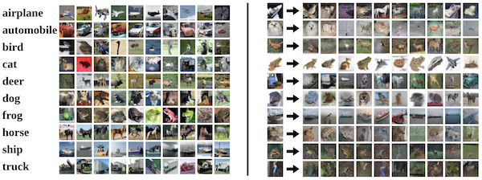

<small>최종 수정일 : 2019-10-16</small>

> 이 포스트는 스탠포드의 [cs231n](http://cs231n.stanford.edu) 강의를 보고 공부한 포스트입니다.  
> 잘못된 것이 있을 수 있습니다.  
> 댓글로 알려주시면 감사합니다!  

## Image Classification

Image Classification 은 Computer Vision 에서 핵심적인 작업이다.

  
*figure 1*
  
\[figure 1\]처럼 사진을 보고 개인지 고양이인지 분류하는 것이 Image Classification 인데, 사람이 보기에는 쉽게 고양이인지 알 수 있으나, 컴퓨터는 \[그림2\]와 같이 보기 때문에 사람이 직관적으로 알아차리는 것과는 상당한 갭이 있다.

*figure 2*
  
또한, Image Classification 분야에서는 여러 당면한 문제들이 있는데,

1. 카메라가 움직이면 모든 픽셀의 정보가 또 다시 바뀐다는 것(viewpoint variation)
2. 주변 환경과 비슷한 물체에 대한 인식(background clutter)
    
3. 광량에 따른 이미지의 변화(illumination)
    
4. 해당 객체의 자세 변화(deformation)
    
5. 객체의 일부분만 보이는 경우(occlusion)
    
6. 같은 종의 다양성(intraclass variation)
    

등등의 문제들이 있다.<small>(이 강의의 교수자는 고양이를 좋아하는 것일까...! 문득 드는 생각ㅋㅋ)</small>
  
위의 문제들을 보면서 이런 생각을 할 수 있다.  

> 인간은 어떻게 이런 문제들을 해결하지?  

명확한 분류 기준은 모르겠다. 그러나 직관적으로 인간은 잘 분류해 내는 모습을 보인다.(약 5%의 오차)  
기존의 컴퓨터로 푸는 문제들 중, 문제의 조건이 명확하다면 coding 을 통해 문제 해결을 쉽게 해낼 수 있었으나, 이런 분류 문제는 명확한 기준을 세우기가 힘들다.  
귀의 모양을 봐야하나? 수염의 유무? 털의 색?  
기준으로 생각할 부분도 많고, 특징(feature)으로 여겨지는 부분들이 너무나도 많고 불명확하기에 이전의 시도들은 좋은 성과를 내기 힘들었다.  

그러던 중, Machine Learning 분야에 Data-Driven Approach 라는 개념이 생겨났고, 이는 다음과 같은 과정을 거치게 만들었다.

1. 이미지와 label을 수집해 dataset을 구성한다.
2. Machine Learning을 통해 classifier를 학습시킨다.
3. 새로운 이미지에 대해 classifier로 평가해본다.


```python
def train(images, labels):
    # Machine Learning!
    return model

def predict(model, test_images):
    # Use Model to predict labels
    return test_labels
```
  
즉 이런 구조를 지닌 코드를 작성할 수 있게 된 것이다.
  
## Nearest Neighbor

Machine Learning 기법 중 Nearest Neighbor(최근접 이웃) 기법으로 한 번 살펴보자.  

CIFAR-10 이라는 dataset에 대해 NN(Nearest Neighbor)를 적용하면 아래와 같다.

  
<small>_CIFAR-10은 10개의 클래스, 5만 장의 training image, 1만 장의 test image로 구성되어 있다._</small>  
우측의 결과가 input image에 대한 10개의 최근접 이미지이다.  
잘 보면 첫 사진이 배(ship)인데 가장 근접한 사진이 새(bird)로 나타나고 있다.  

그나저나 어떻게 NN을 구현하는 것일까?  
NN 은 _distance metric_ 을 이용한다.  
L1 또는 L2 distance metric 이 있는데, L1 을 먼저 보자.

L1 distance : $d_1(I_1,I_2)=\sum_p \left| I_1^p-I_2^p \right|$

실제 예를 들면 다음과 같다.  


  
> 그렇다면 NN은 N개의 예제에 대해 training 과 prediction 이 얼마나 빠를까?  
>> 하나의 예제 당 각각 O(1), O(N) 이 걸리게 된다.  

이것은 좋지 못한 성능을 나타내는데, train에서는 어느 정도 느려도 괜찮으나 test 시에 빠른 classifier를 원하기 때문이다.  

---

## K-Nearest Neighbors

앞서 NN의 성능이 좋지 못하고 얘기했는데, 이를 조금 보완한 방법이 바로 kNN 이다.


  
K=1 인 경우가 NN 이었다면 K=3, 5, ... 로 가장 근접한 K개의 이웃들로부터 classification 을 수행하는 것이 kNN 이다.  
  
kNN 역시 distance metric 을 이용하는데 L1, L2 가 있다.  

앞서 본 L1 distance 는 Manhattan distance 라고도 하며, L2 distance 는 유클리드 거리라고도 한다.  

L2(Euclidean) distance : $d_2(I_1,I_2)=\sqrt{\sum_p(I_1^P-I_2^P)^2}$

로 표현할 수 있다.  

L1, L2는 각각 좌표평면에서 그래프로 그릴 때 사각형과 원의 모양을 나타내게 된다.  


L1과 다르게 L2를 사용할 경우 경계선이 조금 더 부드러워 지는 것을 볼 수 있다.  

그렇다면 여기서 우리는 생각을 해 볼 것이

1. 최적의 k는 무엇인가?
2. distance metric 은 무엇을 써야 하는가?  

인데, 이는 학습으로 한다기 보다는 우리가 미리 정해줘야하는, 즉, ___hyperparameter___ 인 것이다.  

hyperparameter 들은 문제에 따라 매우 상이하기에 try-out 을 해보는 것이 바람직하다.  

kNN 은 이미지 트레이닝에 절대 쓰이지 않는데, 테스트 시 매우 느릴 뿐 아니라 distance metric 이 pixel 에 대해서 별 쓸모가 없기 때문이다.  

---

## Linear Classification

우리는 이제 이미지로부터 클래스를 분류하려고 한다.  

이 때, Linear Classification 으로 하려 하는데, 이는 parametric approach 기법을 이용한다.  

$f(x,W)$ 처럼 나타낼 수 있는데, $x$는 input 이고, $W$가 parameter이다.  


그림은 위에서 언급했던 CIFAR-10 데이터셋에 대한 과정을 나타내는 것으로, 10개의 클래스를 가진다.  

여기서부터는 데이터와 파라미터의 값을 보통 column vector 와 matrix 로 표현한다.  
간략하게 matrix의 차원을 살펴보고 가면, $f(x,W)$는 10\*1, $W$는 10\*3072, $x$는 3072\*1 이라는 것을 알 수 있다.  

linear classification 에서는 편향 오차를 보정하기 위해 $b$ 를 더해주게 되는데, 최종적으로는 아래와 같은 식으로 표현할 수 있다.(<small>$b$의 차원은 10\*1</small>)  

$f(x,W) = Wx + b$  

이제 아래와 같이 대수학적(algebraic viewpoint)으로 표현해 볼 수 있다.  


matrix 계산을 통해 3개의 클래스에 대한 점수를 얻어보았다.  
무엇을 관찰할 수 있는가?  
사진 속의 물체는 고양이로 보이는데 cat score 가 다른 것에 비해 낮은 것을 볼 수 있다.  
이는 $W$의 값이 알맞지 않은 것이고, training 과정이라면 학습이 덜 된 상태라고 볼 수 있다.  

다음은 CIFAR-10의 파라미터들을 학습시킨 결과를 시각화(visual viewpoint)한 모습이다.

  

관찰할 수 있는 부분은

1. 차량의 학습 결과는 붉은색 이미지로 나타났다. 데이터셋에 붉은 계열의 차량이 많았던 것 같다.
2. 말의 경우 왼쪽을 바라보는 말이 조금 더 많았던 것 같다.

등등이 있을 수 있겠다.  

또한, 기하학적(geometric viewpoint)으로도 해석해 볼 수 있는데,


이와 같이 생각을 해 볼 수 있다.  

물론 현실에서의 분류는 이차원 평면상에서 진행되는 것이 아닌 n차원 공간에서 이루어 질 수 있으므로, 초평면(hyperplane)이 나누는 공간에 대해 각 클래스를 분류하게 되는 것이다.  
그림의 왼쪽 하단에 나온 것이 3차원에서 hyperplane 을 표현해 본 것이다. <small>_hyperplane 은 convex optimization 에서 더 다뤄보자!_</small>  
