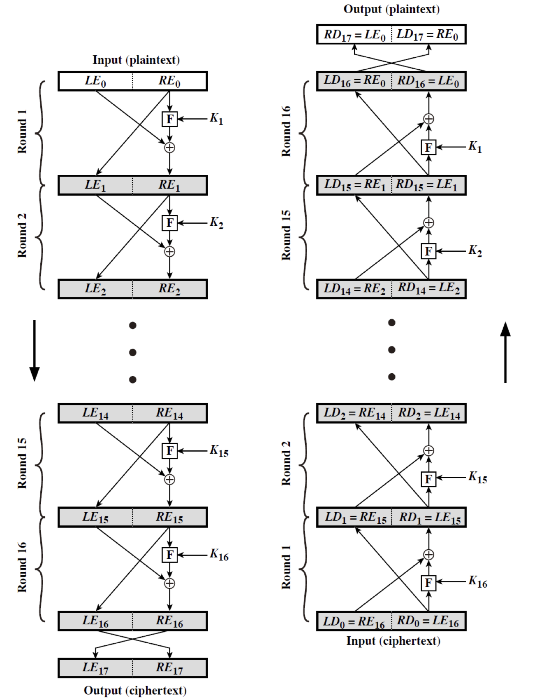
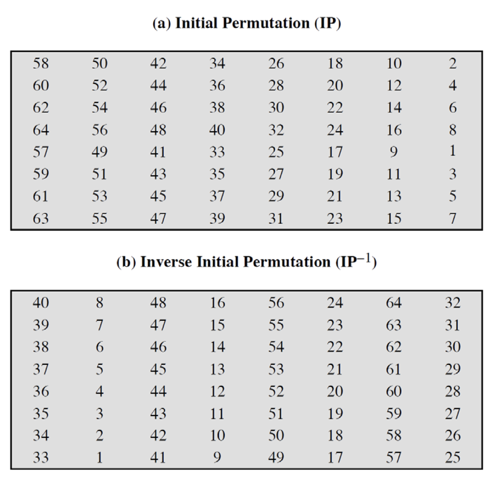
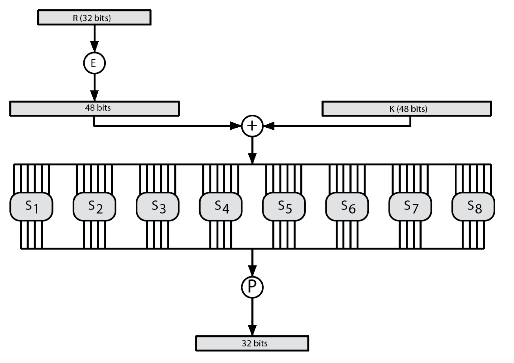
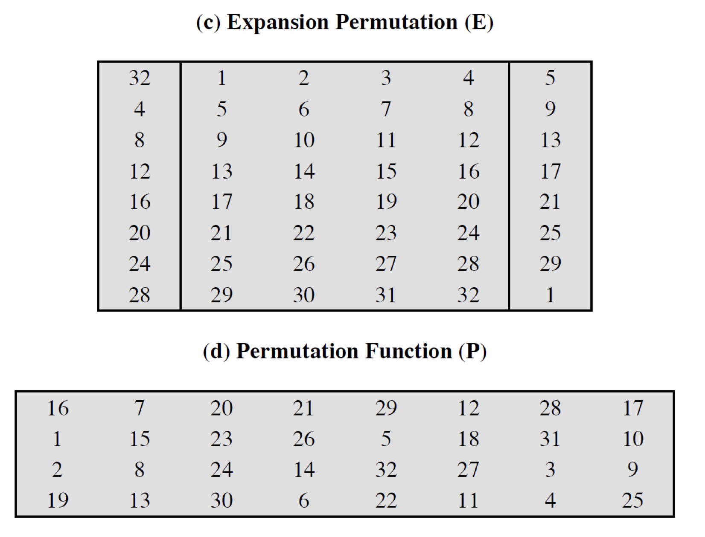
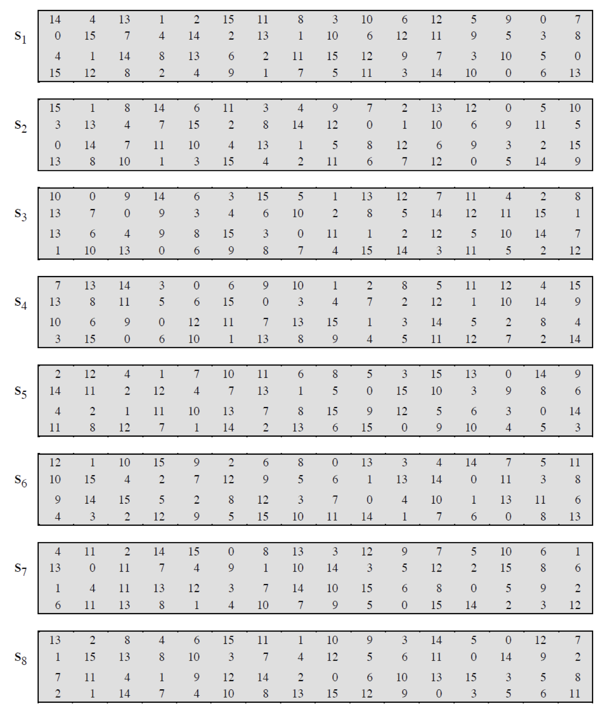
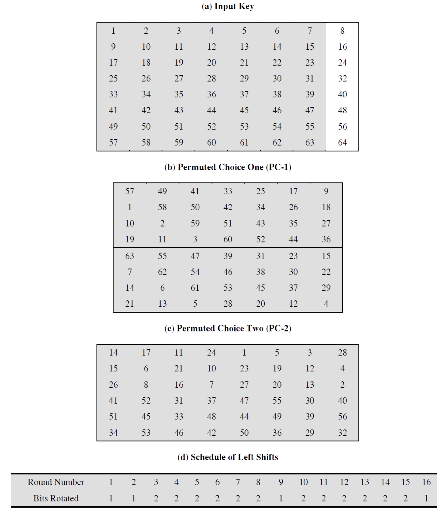
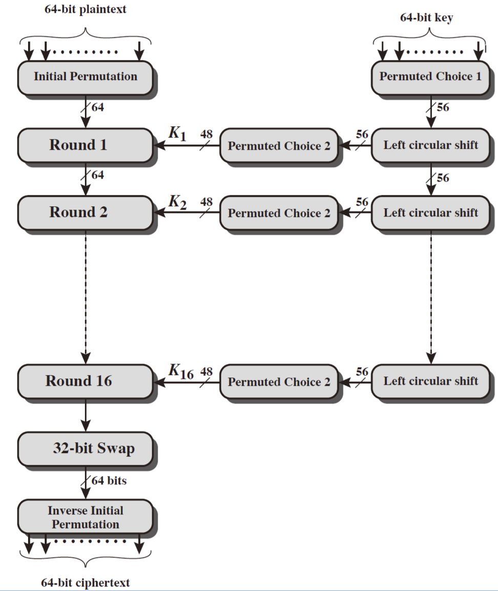

## Block Ciphers

이전 포스트에서 배운 전통적인 암호화 기법들을 넘어서 이제는 현대적인 암호화 기법 중 가장 많이 쓰였던 암호화 알고리즘인 _DES(Data Encryption Standard)_ 에 대해 알아보자.  

_DES_ 는 _Block Cipher_ 를 잘 보여주는 대표적인 예로 매우 잘 설계된 알고리즘이다.  
이름도 심지어 standard 이다!  

어떤 구조를 가지는지, 왜 이제는 쓰이지 않는지에 대해 살펴보자.  

---

우리는 _Block Cipher_ 와 _Stream Cipher_ 에 대해 학습했었다.  
_Block Cipher_ 는 한 번에 n-bit 의 정보(block)를 암호화 하는 방식이며, _Stream Cipher_ 는 bit 단위의 암호화가 일어난다.  

이상적인 _Block Cipher_ 는 평문(plaintext) 블록에 대해 가능한 모든 경우에 대한 암호화 매핑이 가능하게 된다.

이는 작은 블록에 대해서는 substitution cipher 와 동일하며 통계적 분석을 통한 공격에 취약하다는 것을 배웠었다.(사이즈가 작아서)  
큰 블록에 대해서는 통계적 분석에 취약하지는 않지만 현실적으로는 구현하기 힘들다.  
_n-bit_ 의 이상적인 _block cipher_ 는 $n \times 2^n$ 만큼의 bit 를 가진 키가 필요하게 된다.  
이는 너무 길어서 사이즈를 줄일 수 밖에 없고, 적당히 길이와 보안성에 대해 타협점을 찾아야한다.  

## Feistel Cipher

_Feistel Cipher_ 는 이상적인 _block cipher_ 에 가까운 암호화 기법으로 두 개 이상의 simple cipher(substitution, permutation) 를 이용한다.  

_S-P network_ 라고도 불리는 _Shannon's substitution-permutation_ 을 기반으로 한다.  
이 _S-P network_ 는 __S-box__ 와 __P-box__ 로 불리우는 substitution 과 permutation 을 이용하게 되는데, 이를 통해 메세지와 키에게 confusion 과 diffusion 을 제공한다.  

- diffusion : 평문과 암호문의 통계적 연관성의 복잡도를 최대화
- confusion : 암호문과 키의 통계적 연관성의 복잡도를 최대화

그렇다면 _Feistel Cipher_ 의 구조에 대해 알아보자.  

기본적으로 input 으로 사용되는 블록을 반으로 나눠서 암호화를 진행하는데, 암호화는 여러 라운드(round)에 걸쳐 진행되며, 매 라운드마다 왼쪽 절반에 대해 substitution 을 적용하고나서 각각의 반을 permutation 으로 섞어버린다.  

전체적인 진행은 아래와 같다.  



왼쪽의 과정이 암호화(Encryption), 오른쪽의 과정이 복호화(Decryption)이다.  

특징적으로, 암호화를 반대 방향으로 진행하는 것이 복호화임을 볼 수 있는데 이는 암호화와 복호화가 같은 알고리즘을 이용한다는 의미이다.  
즉, 하나의 알고리즘으로 암호화/복호화가 가능하다!  

이러한 _Feistel Cipher_ 를 구성하는 요소들은 아래와 같다.

- 블록 사이즈 및 키 사이즈
    > 사이즈의 크기가 크면 보안성이 강화되나 속도가 느려지게 된다.
- 라운드의 횟수
- subkey 생성 알고리즘과 라운드 함수 F
    > 암호 분석(Cryptoanalysis)에 대한 저항을 갖게 된다.
- 빠른 알고리즘(암/복호화 가능)
- 분석이 용이

## DES(Data Encryption Standard)

앞서 언급했듯이 가장 광범위하게 사용된 _block cipher_ 인 DES 는 64-bit 의 데이터를 하나의 블록으로 사용하며 56-bit 의 키 사이즈를 가진다.  

이 암호화 기법은 IBM 에서 개발되었는데, 초기(Lucifer)에는 128-bit 의 키 사이즈를 가졌지만 DES 로 채택될 때에는 56-bit 의 키 사이즈로 채택이 되어 보안성에 관한 논쟁이 있었다고 한다.  

현재는 key size 이슈로 사용하지 않는 암호화 기법이다.  
> 컴퓨팅 성능이 좋아짐에 따라 brute-force attack 으로 뚫리게 되었다...

그럼에도 불구하고 이는 정말 잘 설계된 알고리즘이다.  
지금부터 그 구조에 대해 살펴보자.  

### DES Encryption

#### DES Initial Permutation(IP)

DES는 미리 정해진 다양한 테이블을 참조해서 암호화를 진행하게 된다.  
먼저 살펴볼 것은 _Initial Permutation(IP)_ 테이블이다.



최초에 input data bit 를 섞는 것으로 짝수 번째 비트는 모두 왼쪽 절반에 위치하게 되고, 홀수 번째 비트는 모두 오른쪽 절반에 위치하게 된다.  
이는 표준으로 정의된 것이다.  

#### DES Round Structure

이렇게 반으로 나눈 비트들을 Round 마다 다음과 같은 방식으로 처리해준다.  

$L_i = R_{i-1}$  
$R_i = L_{i-1} \oplus F\left(R_{i-1}, K_i \right)$  

여기서 $\oplus$ 는 __XOR__ 연산을 의미한다.  

위의 수식을 해석하면 오른쪽 반은 다음 라운드의 왼쪽 반이 되고, 왼쪽 반만 XOR 연산을 거치게 되는데 여기에서의 $F$ 는 오른쪽 반과 48-bit 의 subkey 를 이용하게 된다.<small>초기에 key size=56-bit 였던 것과 다름!</small>  

32-bit data block(R) 과 48-bit subkey 는 bit 수가 차이가 난다. $F$ 는 다음과 같은 과정을 거친다.

1. R 는 __E(Expansion) table__ 을 이용해 48-bit 로 확장한다.
2. subkey 와 XOR 연산을 한다.
3. 8개의 _S-Box_ 를 통과해 32-bit 의 결과값을 얻는다.
4. __P(Permutation) table__ 을 이용해 최종적으로 섞인 32-bit 데이터를 얻는다.

이를 도식화 하면 아래와 같다.  

  

__E__ 와 __P__ 테이블은 아래와 같이 정의된다.  

  

#### DES S-BOX

_S-BOX_ 를 사용한다고 하였는데 _S-Box_ 역시 미리 정해진 테이블이며, 이를 해석하는 방법은 아래와 같다.  

우선 _S-BOX_ 는 6-bit 를 4-bit 로 매핑해주며 각 _S-BOX_ 는 4개의 4-bit box 로 구성되어 있다.

- 외각 bit(bit 1 & bit 6) 는 __row__ bit로 0~3 의 값을 가지며 해당 row 를 가리킨다.
- 내부 bit(bit 2, 3, 4, 5) 는 __col__ bit로 0~15 의 값을 가지며 해당 col 을 가리킨다.
- 총 8개의 _S-BOX_ 를 통해 4개씩 32-bit 의 데이터가 만들어지게 된다.

```
e.g. in S1, input 011001
row = 01 = 1
col = 1100 = 12

output = 9 (1001)
```

위의 예제는 아래의 _S-BOX_ 를 통해 계산된 값이다.  



#### DES Key Schedule

56-bit 의 key 를 이용하는 DES 는 48-bit 의 subkey 를 이용한다고 하였다.  
이는 초기 64-bit 의 Key 에서 먼저 매 8번 째 bit를 버림으로써 56-bit Key 를 만들고, 그 후 initial permutation을 _PC-1_ 을 통해 생성한다. 여기서 절반인 28-bit 로 중간 계산에서 이용한다.  

이 반으로 나뉜 키는 16번의 round 에서 __key rotation schedule__ 에 따라 변경되고, 각 절반에서 24-bit 를 _PC-2_ 를 이용해 추출하여 round function _F_ 에서 사용한다.  



---

지금까지 살펴본 _DES_ 의 암호화 과정을 요약하면 다음과 같다.



### DES Decryption

_Feistel Cipher_ 구조를 따르는 알고리즘은 복호화 과정에서 암호화 과정과 동일한 알고리즘을 사용한다.  

따라서, subkey 를 반대 순서로($K_{16} ... K_1$)로 사용한다면 복호화 과정이 완료된다.  

### Example

plaintext = 02468aceeca86420 이라는 대칭적인 input 에 대해 DES encryption 을 진행해보자.  
key = 0f1571c947d9e859 일 때 다음과 같은 암호문을 얻게 된다.  
ciphertext = da02ce3a89ecac3b  

### Avalnche Effect

쇄도 효과(눈사태 효과, Avalanche Effect)는 input 이나 key 의 한 bit 가 변화했을 때 암호문의 차이가 꽤 나는 효과를 말한다.  

암호화 알고리즘의 중요한 요구 사항으로써 보통 절반 정도의 output bit 가 변화할 때 이 효과가 있다고 말한다.  
이러한 변화가 작을 경우, 평문이나 키를 찾아보는데 적은 비용이 들게 됨을 의미한다.  

DES 의 _Avalanche effect_ 를 확인해보자.  

앞서 입력으로 사용했던 02468aceeca86420 을 12468aceeca86420 으로 변경했을 때 결과는 아래와 같이 바뀐다.  

da02ce3a89ecac3b $\to$ 057cde97d7683f2a  

이를 비트 단위의 차이로 계산한다면 32비트만큼의 차이가 난다.  
절반의 비트가 변화한 것이다. 즉, _Avalanche effect_ 의 정의에 부합한다.

### DES의 보안성

56-bit 의 키 사이즈를 갖는 DES 는 $2^{56} \approx 7.2 \times 10^{16}$ 정도의 경우의 수를 갖는다.  
이는 완전탐색으로 찾기 어려워 보일 정도의 큰 수였으나 현대 컴퓨팅 성능의 비약적인 발전으로 더이상 불가능한 영역의 계산은 아니게 되었다.  

따라서 _DES_ 를 대체할 다른 암호화 기법(_AES_, _Triple DES_, ...)이 필요하게 된다.  

또한, _DES_ 가 공개되고 시간이 많이 흐른 지금 _analytic attack_ 도 많이 개발이 되었는데, _Differential cryptanalysis, Linear cryptanalysis, Related key attacks_ 등이 있다.  

#### Timing Attack

이는 cipher 의 구현 과정을 공격하는 방법으로써 _side channel attack_ 의 일종이다.  
공격자는 사전정보와 암/복호화 과정의 경과 시간을 재서 공격하게 되는데 이를 방어하기 위해서는 indistingushable, 즉, 식별할 수 없도록 하는 방법이다.  
모든 경우에 대해 경과 시간 등이 비슷하게 보이도록 하는 방법인데 이는 _universal solution_ 이고, 이를 통해 _no side channel attack_ 이 되나 현실적으로 힘들다.  

이와 같은 방법이 가능한 이유는 암호화와 복호화의 소요 시간이 미세하게 다른 점을 이용하는데, 특히 컴퓨팅 자원이 한정적인 기기(e.x. IoT)등에 주로 사용된다.  

#### Differential Cryptanalysis

Cryptanalysis 의 큰 발전을 이룬 공격 기법으로 _Feistel cipher_ 에 대한 통계적 공격을 가능케 한다.  

text block 의 __쌍__ 을 관찰하면서 이들이 암호화되는 과정을 살핀다. 이 과정에서 어떤 input 에 대한 어떤 output이 p 만큼의 확률적으로 차이가 난다는 정보(사전정보)를 이용해서 어떤 instance 가 그러한 p 에 부합되는 것을 관찰하게 된다면, 이를 이용해 해당 라운드의 subkey 를 유추할 수 있게 된다.  
위의 과정을 반복적으로 수행하게 되면 결국에는 키의 모든 비트를 특정할 수 있게 된다.  

이는 수학적으로 $2^{47}$ 만큼의 encryption 과정에 대한 정보(즉 평문 -> 암호문)가 필요한데, 이는 여전히 overhead 가 크다.  
그러나 이는 이론적으로 굉장히 의미가 있는 바로써, 비록 brute-force attack 이 더 유리할 수도 있으나 Cyrptanalysis 분야의 시작점이 된 큰 의미를 가진다.  

#### Linear Cryptanalysis

이것도 역시 통계적 접근 방법이다.  
$P_1 \oplus P_3 \oplus C_1 = K_2$  의 형태로 선형적인 식을 통해 키를 알아내는 방법이다.
$2^{43}$ 만큼의 정보량으로 DES 를 공격해낼 수 있다.  
여전히 overhead 가 크긴 하다.  

이러한 통계적 공격 기법에 대해 안전하기 위해서는 정보가 uniformly distributed 해야 된다.  
이 말은 통계적으로 접근했을 때 모든 경우에 대한 존재 확률이 모두 동일한 결과를 가지기에 통계적인 방법으로는 연관성을 찾을 수 없게 되는 효과를 보인다.  

> 본 포스트는 _정보보호_ 를 공부하며 정리한 글 입니다.  
> 잘못된 내용이 있다면 알려주세요!  
> 감사합니다 :)
