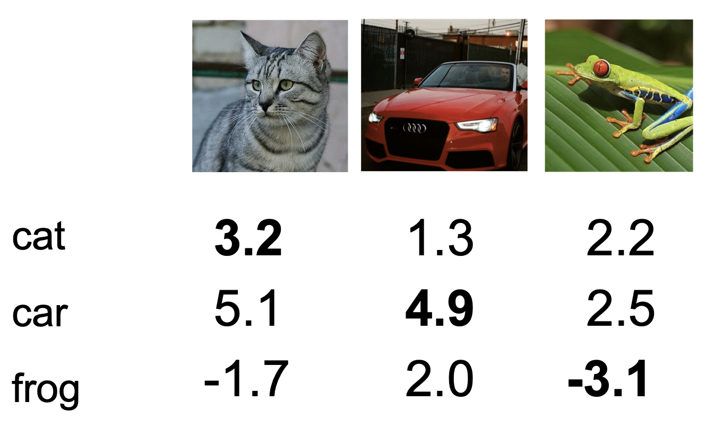
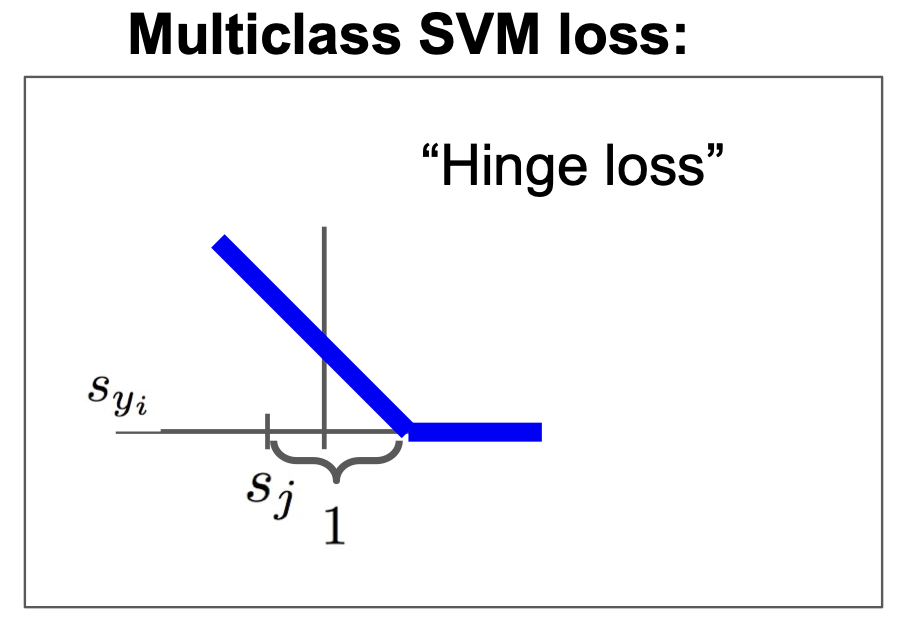
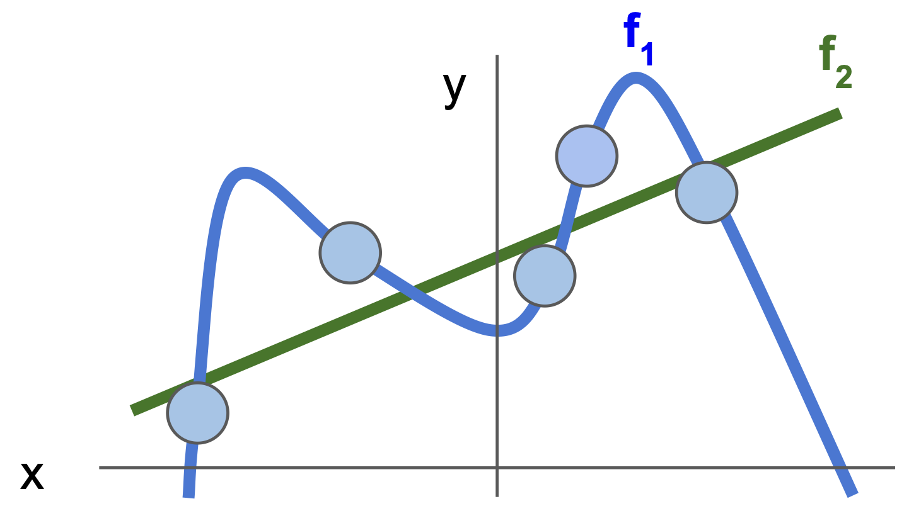
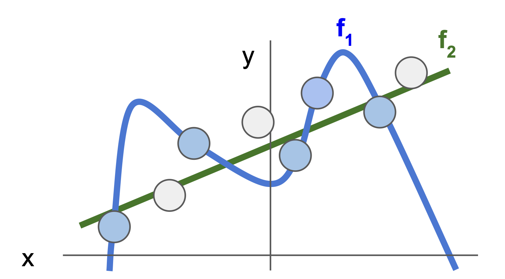
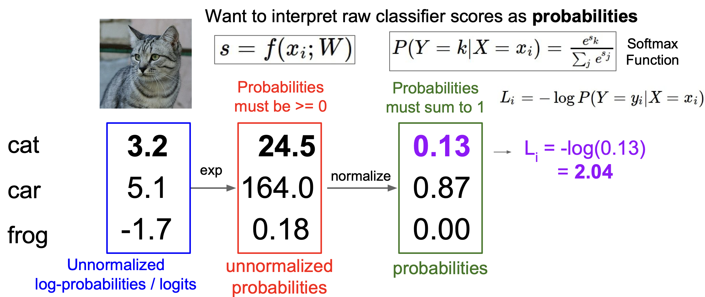
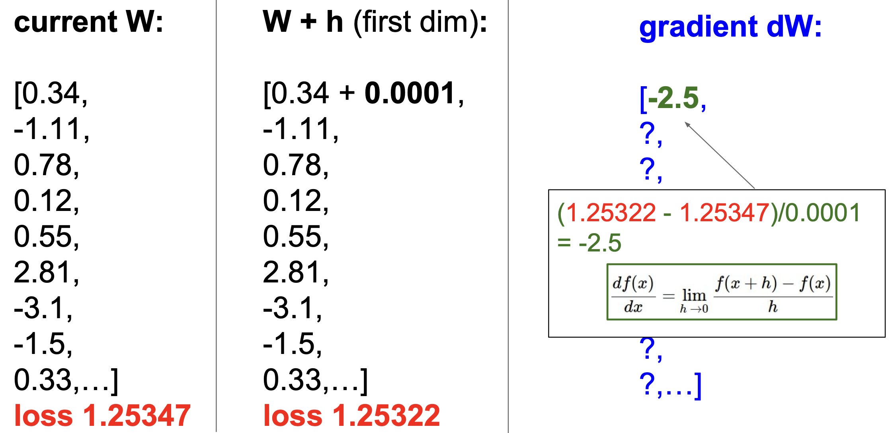
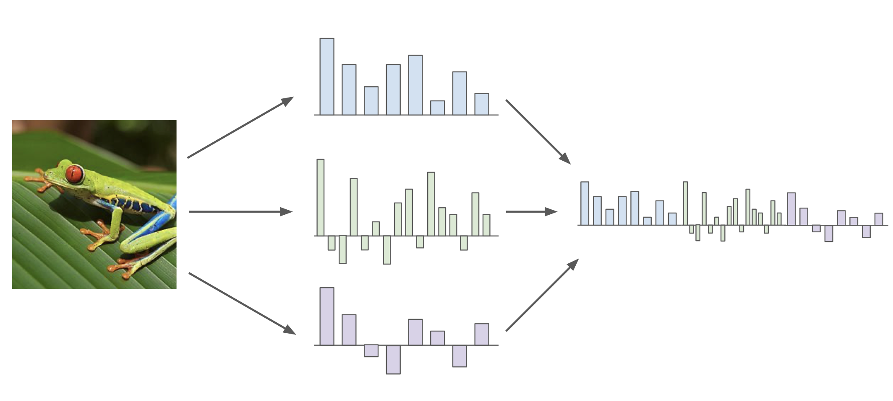
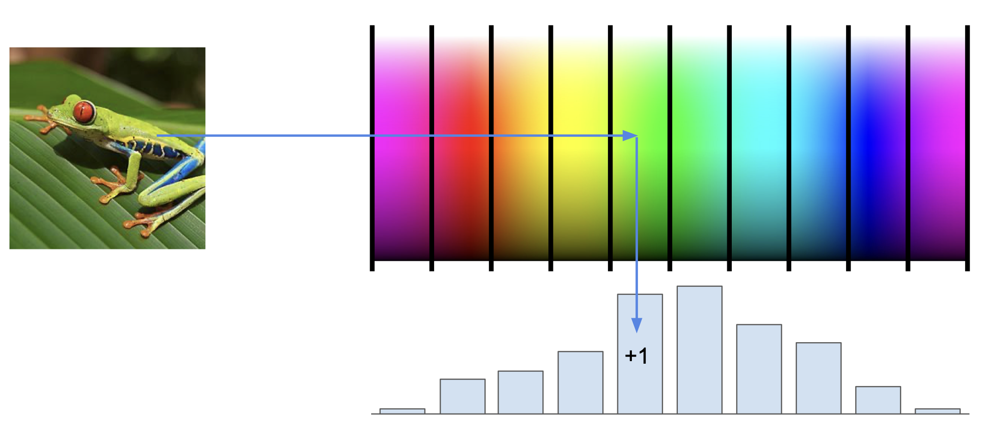
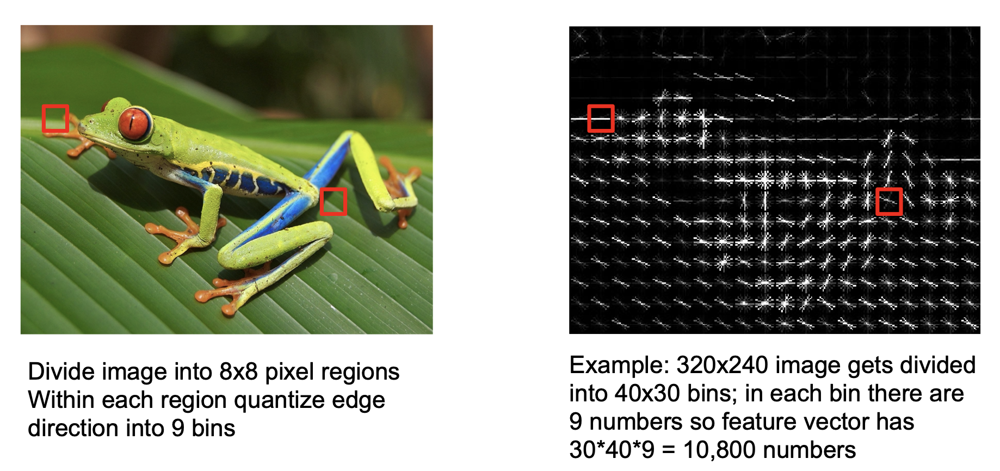
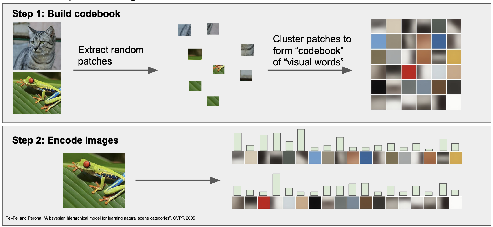

<small>최종 수정일 : 2019-10-17</small>

> 이 포스트는 스탠포드의 [cs231n](http://cs231n.stanford.edu) 강의를 보고 공부한 포스트입니다.  
> 잘못된 것이 있을 수 있습니다.  
> 댓글로 알려주시면 감사합니다!  

# Loss Functions and Optimization

지난 강의를 정리한 포스트([lec2](https://younghk.github.io/cs231n-Image-Classification-Pipeline/))에서는 $f(x, W)=Wx$ 를 이용해 $W$의 값을 구해본다고 했다.  
아래의 예시를 보자.  



이러한 $W$ 를 얻었다고 했을 때, _loss function_ 으로 무엇을 할 수 있을까?  

## Loss Functions

바로 우리의 classifier 가 얼마나 잘 분류하는지 알려주는 척도가 될 수 있다.  
우리는 지금 분류기를 만들고 있고, 이 분류기의 성능을 높이려 한다. 이 때 loss function 을 이용해 분류기를 평가하고 방향을 생각해 볼 수 있는 것이다.  

__loss__ 는 data 들에 대한 개별 loss 의 평균으로 계산할 수 있으며, 이를 수식으로 표현하면 다음과 같다.

$L = {1 \over N} \sum_iL_i\left(f\left(x_i, W\right),y_i\right)$

우리는 두 개를 분류할 수도 있지만(0, 1) 더 많은 클래스를 분류할 경우가 훨씬 많다.  
이를 위해 _Multiclass SVM loss_ 을 사용할 수 있는데, 개별 loss $L_i$ 는 다음과 같다.  
$\begin{aligned} L_i &= \sum_{j \ne y_i}\begin{cases}0 & \text{if } s_{y_i} \geq s_j + 1 \\ s_j - s_{y_i} + 1 & \text{otherwise } \end{cases} \\ &= \sum_{j \ne y_i } max(0, s_j - s_{y_i} + 1) \end{aligned}$



이는 _Hinge Loss_ 라고도 불린다.<small>(경첩..?)</small>

위의 식 $L_i = \sum_{j \ne y_i } max(0, s_j - s_{y_i} + 1)$ 을 이용해 $L_i$ 를 구해보면 각각 _2.9, 0, 12.9_ 가 된다.  
이를 평균 낸 것이 $L$ 이 되므로, _L = 5.27_ 이 된다.  
나중에 자세하게 보게 되겠지만, _loss L_ 이 작아지는 방향으로 설계를 해야 제대로 된 학습이 이루어지는 것을 의미하게 된다.  

여기서 몇 가지 질문을 생각해 볼 수 있는데,
  
1. car 의 score 가 조금 변화하면 _loss_ 에는 어떤 변화가 있을지?  
2. _loss_ 의 최대/최소 는?  
3. 초기에 _W_ 와 그 때의 _loss_ 는?  
4. $j = y_i$ 를 포함했을 때 _loss_ 는?  
5. 합 대신 평균값을 이용하게 된다면 어떤 차이를 가지고 오는가?  
6. $L_i = \sum_{j \ne y_i } max(0, s_j - s_{y_i} + 1)^2$ 을 사용하면 어떻게 되는가?

등등이 있다. 각각의 답은 어떨까?  

1. _loss_ 변화는 없다. _Multiclass SVM loss_ 에서는 오직 정확한 score 를 잘못된 score보다 1만큼 더 크도록 하는 과정이고, 이미 car score 는 다른 score 들에 비해 충분히 크므로 car score 가 조금 변화한다고 해서 _loss_ 에 차이가 발생하지는 않는다.(이미 0의 구간에 위치)
2. min = 0, max = $\infty$ (그래프 참조)
3. class의 개수 N보다 1만큼 작은 _N-1_이 된다. 초기 _W_ 는 모두 0이고, 이에 따라 $L_i$ 는 각각 _N-1_ 이 될 것이다. _loss_ 는 결국 _N-1_ 이 된다.
4. 이는 $L_i$ 가 각각 1씩 증가하게 되는 것으로, 결국 _loss_ 도 1 증가하게 된다.
5. 딱히 변화는 없다. 우리는 true value 또는 true loss 를 찾기를 원하고 그 과정 속에서 scale 하는 방법의 차이가 있을 뿐 결과적으로는 같은 방향으로 나아가게 되기 때문이다.
6. 차이가 생긴다. _Hinge loss_ 에서는 1차, 즉 linear 한 부분이 있는데, 이는 2차의 부분이 생기게 되고(squared) 이러한 nonlinear 함은 다른 _loss function_ 이 되게 된다.

또 다른 질문도 있다.

$f(x, W) = Wx$  
$L = {1 \over N} \sum_{i=1}^N \sum_{j \ne y_i} max\left(0, f\left(x_i;W\right)_j - f\left(x_i;W\right)_{y_i} + 1 \right)$  
이러한 _W_ 와 _L_ 에 대해서 $L=0$ 이 되는 $W$ 를 찾았을 때, $W$ 는 유일한가? 라는 질문이다.  

물론 $W$ 는 유일하지 않은데, $2W$ 에 대해 생각해보자.  

0이 된다는 것은 max 부분에서 0와 음수가 비교된 것이고, 이는 이미 correct score 와 incorrect score 의 차이가 1보다 크다는 의미이다. 이 때 2배를 해주면 여전히 그 차이는 1보다 크기 때문에 여전히 0 이 나오게된다.  

우리는 이제 위의 질문들에 대해 유념하며 $W$ 를 어떻게 잘 구할 것인가를 생각해보아야 한다.  

위의 문제가 발생한 이유는 우리가 classifier 에게 training data 에 대해 $W$ 를 맞추라는 이야기만 하고 있기 때문이다.  
그러나 현실에서는 꼭 training data 에 대해 맞는 $W$ 를 구할 필요는 없다.  
이는 Machine Learning 의 관점에서 보면, 우리는 결국 training data 로 만들어 낸 모델을 test data 에 적용시켜서 문제를 해결하려는 것이기에 사실 training data 에서의 성능보다는 test data 에서의 성능이 훨씬 더 중요하기 때문이다. 그리고 이 test data 는 training data 와는 다를 수 있다.  
즉, test data 에서의 성능을 위해 training data에 완벽히 맞추지 않고 적당히 맞추는 과정이 필요한데, 이것이 바로 _Regularization_ 이다.

---

## Regularization

우리는 지금까지 다음과 같은 _loss function_ 에 대해 살펴보았다.

$L(W) = {1 \over N} \sum_{i=1}^N L_i\left( f \left( x_i, W \right), y_i \right)$  

이제 _Regularization_ 을 적용해서 수식을 보자.

$L(W) = {1 \over N} \sum_{i=1}^N L_i\left( f \left( x_i, W \right), y_i \right) + \lambda R \left( W \right)$  

우변의 첫 번째 항이 _data loss_ 가 되고, 두 번째 항이 _regularization_ 이 된다.  
_data loss_ 는 모델이 training data 에 대해 학습할 수 있도록 해주며, _regularization_ 은 모델이 너무 training data 에 매몰되지 않도록 해주는 역할이다.  

여기서 $\lambda$ 는 __hyperparameter__  로, 적합한 값을 선택해 주어야 한다.

_regularization_ 을 하는 방법은 다양한데, 간단하게  L1, L2 regularization 이 있으며, 이 둘을 같이 사용하는 Elastic net 도 있다.  

L2 : $R(W) = \sum_k \sum_l W_{k,l}^2$  
L1 : $R(W) = \sum_k \sum_l \left| W_{k,l} \right|$  
Elastic net : $R(W) = \sum_k \sum_l \beta W_{k,l}^2 + \left| W_{k,l} \right|$  

그 외에도 _dropout_, _batch normalization_, _stochastic depth_, _fractional pooling_ 등이 있다.  

정규화를 하는 이유는 다음과 같다.

1. 가중치에 대한 선호도를 표현(express preferences)
2. 모델을 simple 하게 만들어 test data 에서 사용
3. 곡률을 추가하므로써 최적화 향상

__(1)__ 에 대해 조금 살펴보자.  

$x = \left[ 1,1,1,1 \right]$  
$w_1 = \left[ 1,0,0,0 \right]$  
$w_2 = \left[ 0.25,0.25,0.25,0.25 \right]$  

로 주어졌을 때,

$w_1^Tx = w_2^T = 1$ 이지만, _L2 regularization_ 은 $w_2$ 를 더 선호한다.  
이는 가중치가 더 고루 퍼져있기 때문이다.  그러나 이는 항상 고정적이지는 않고 경우에 따라 다를 수 있다.  

__(2)__ 는 아래의 그림을 보면 이해가 쉽다.  



f1은 training data 에 많이 fit 시켜놓은 것이고 f2 는 느슨하게 fit 시켜놓은 상태이다.  
여기서 test data 가 아래의 회색처럼 들어오게 된다면,



f1과 f2 각각의 test data 와 gap 을 비교해보면 f2 가 더 test data 에 근접함을 볼 수 있다.  

이처럼 정규화를 통해 모델을 더 simple 하게 만들면 test data 에서 더 좋은 성능을 얻을 수 있으며, 현실의 문제에서도 이러한 접근법이 타당하다는 것이 실증적으로 나타나있다.  

---

## Softmax Classifier 

이제 softmax 에 대해 알아보자.  
softmax 는 입력받은 값을 출력으로 할 때 0~1 사이의 값을 가지며, 그 총합이 1이 되도록 하는 함수이다.  
수식은 다음과 같다.

$P \left(Y = k | X = x_i \right) = { e^{s_k} \over \sum_j e^{s_j} }$

그리고 이에 따른 _loss_ $L_i$ 는 다음과 같다.

$L_i = -\log P \left(Y = y_i | X = x_i \right)$
  
위의 내용들을 정리해 보면,



여기서 $L_i$ 는 _cross-entropy loss_ 라고도 불린다.

앞서 _SVM loss_ 를 했을 때 했던 질문처럼 여기서도 비슷한 질문을 던질 수 있는데,

1. _loss_ 의 최대/최소는?
2. 초기의 _loss_ 값은?

마찬가지로 생각해서 답을 해 볼 수 있다.

1. min = 0, max = $\infty$
2. log(C), 여기서 C는 클래스의 개수이다.

여기서 loss 의 값이 0~$\infty$ 값을 가지게 되는데 이것은 좋지 못한 것이다.  
그러나 실제적으로는 양 극단의 값을 갖기 매우 어렵기에 현실적으로 그러한 문제가 발생하기는 드물다.<small>(0이 나오려면 correct score 가 정확히 모두 맞는 경우(=1)여야 하는데(이 때, -log 1 이 되서 loss=0), 이러한 경우가 드물기 때문. $\infty$ 도 같은 맥락에서 볼 수 있다.(완전히 틀린 경우, correct score = 0)). 이 때 확률분포에 따라 모두 맞는 것이라면 $\infty$ 의 값이 필요하고, 마찬가지로 모두 틀리려면 $-\infty$ 의 값이 필요하게 된다. 컴퓨터는 이러한 무한과 관련한 연산을 하기 힘들기에 우리가 실제적으로 이렇게 양 극단의 loss 값을 갖는 것은 어렵다.</small>  

> 초기의 _loss_ 값을 생각하고 넘어가는 이유는 뭘까? 바로 sanity check 를 할 수 있기 때문인데, debugging 시 초기화를 한 후 실제로 저 값이 나오는 지를 테스트해서 만약 다른 값이 나온다면 코드에 문제가 있음 알 수 있다.

_SVM loss_ 와 _softmax_ 의 차이가 무엇이 있을까?  

간략하게 생각하면 _SVM loss_ 는 correct score 와 incorrect score 의 차이에 대해 본다면, _softmax_ 는 correct score 가 점수가 높고, incorrect score 가 점수가 낮을 경우, 이것을 더욱 모아서 correct score 는 +$\infty$로 보내려하고, incorrect score 는 -$\infty$ 로 보내려하는 차이가 있다!

---

여기까지 _loss_ 와 _loss function_ 그리고 _regularization_ 까지 간략하게 살펴보았다.  
우리의 목표는 좋은 $W$ 를 찾아 _loss_ 를 최소화하고 싶은 것인데, 그렇다면 이 __좋은 $W$__ 는 어떻게 찾을 수 있을까?  

## Optimization

들어가기에 앞서, 다음의 예시를 생각해보자.  

> 당신은 지금 산 속 어딘가에 위치해있다. 현재 당신의 목표는 산에서 내려가는 것이다. 어떻게 내려갈 것인가?  

위의 질문은 현실 속의 문제를 아주 간략하고 추상화한 문제이다.  
우리가 앞서 살펴보았던 _loss_ 와 _W_ 의 최적화된 값을 구할 때, 정말 고도의 분석력을 이용해 한 번에 답(minimizer)을 적어내려갈 수 있을까?  

이는 위 질문에서 이렇게 답하는 것과 같다.

> 나는 산 중턱 어딘가에 있는데, 순간이동을 통해 산 아래로 내려가는 거야.  

순간이동이라니! 솔직히 이는 말이 안된다. 조금 더 현실적으로 산에서 내려올 방법을 강구해보자.  

> 방향을 정확하게 모른다면 이 곳이나 저 곳이나 가 볼 수 밖에 없겠지  

이러한 방법이 바로 random search 가 되겠다. 산에서 눈을 가리고 그냥 돌아다니다가 얻어 걸리라는 식의 방법이다. 이런 식으로 산에서 내려와 볼 때, 무사히 내려올 수 있을 확률이 얼마나 될까?  

15.5% 이다. 이 정도면 막무가내로 그냥 한 것 치고는 나쁘지 않지 않은가?  
이 수치는 실제로 random search 를 CIFAR-10 에 적용했을 때 나오는 수치이다. 그러나 가장 좋은 성능을 내는 모델의 경우 무려 95%의 성능이 나온다!

그렇다면 좀 더 현실적으로 생각해보자.  
현재 시점에서 아래로 가는 방향을 찾아서 그 방향으로 간다면 산 아래로 끝까지 갈 수 있지 않을까? 어쨌든 우리는 아래로 가는 것이 목표였으니까!

### Gradient Descent

이렇게 해서 만들어 낸 방법이 바로 경사하강법(Gradient Descent)이다.  

미적분학 시간에 배운 순간기울기를 잠시 생각해보자.

${ df\left(x \right) \over dx} = \lim_{h \to 0}{f\left(x + h \right) - f \left( x \right) \over h}$

이를 이용해서 현재의 $W$ 에서 아주 조금씩 바꿨을 때의 변화(순간기울기)를 구해 볼 수 있다.  
아래는 그 과정이다.



그러나 이렇게 하나씩 gradient 를 구하는 것은 너무 느린 작업이다. 
우리는 이미 미분을 할 수 있지 않은가?  
즉, $\nabla_W L$을 구하면 그만이다. 이를 analytic gradient 라고 한다.<small>위의 방식으로 구하는 것은 numeric gradient</small>  

numeric gradient 는 마찬가지로 gradient check(진짜 잘 계산 되는지) 에서나 쓰고 analytic gradient 로 빠르게 계산해보자.  

Gradient Descent는 다음과 같이 코드로 작성될 수 있다.

```python
# Vanilla Gradient Descent

while True:
  weights_grad = evaluate_gradient(loss_fun, data, weights)
  weights += - step_size * weights_grad # perform parameter update
```

여기서 `step_size` 는 한 번에 얼만큼 그 방향으로 진행할 지를 의미하는데, 이는 __hyperparameter__ 이다. `learning rate` 라고도 불리는 이 __hyperparameter__ 는 아주 중요한 것으로써 학습 시 매우 신중하게 설정해야 좋은 성능을 가진 모델을 학습시킬 수 있다.  

또한 weight 에 - 로 업데이트 하는 이유는 gradient 가 그 방향의 최대가 되는 값이고 우리가 구하려는 것은 최소(<small>내려간다!</small>)이기 때문에 반대 방향으로 값을 주어야 한다.  

이렇게 `step_size` 와 `gradient` 로 학습을 시키게 되는데, 다양한 _update rule_ 에 대해 천천히 학습해보도록 하자.  

그 전에 _Stochastic Gradient Descent(SGD)_ 에 대해 간단하게 살펴보자.  

_loss_ 를 구할 때 우리는 전체 N 에 대해 값을 계산해주었다.  
만약 N 이 아주 큰 숫자라면? _loss_ 를 한 번 구하는데 굉장히 오래 걸리게 될 것이다.  
이러한 문제를 피하기 위해 우리는 표본(<small>minibatch, 보통 2의 제곱 크기(32, 64, 128, ...)</small>)을 추출해 _loss_ 를 구하고 이것을 전체 데이터셋이라고 가정한 뒤 업데이트를 진행하는 방식을 생각할 수 있다. 

## Image Feature

이미지를 분류하는 고전적인 방법에 대해서 간단하게 봐보자.  

image 에서 feature를 추출해 낸 다음에 여기에 linear classification 을 적용했었다.  



### color histogram

여러 feature 들을 추출한 다음에 이를 concatenation(붙이기) 시켜서 이어 붙인 후 적용시키는게 일반적이었는데, feature 를 추출하는 대표적인 방법으로는 _color histogram_ 이 있다.  

이는 픽셀이 나타내는 색상에 해당하는 값을 +1 증가하여 histogram 으로 표현하는 방법이다.  



### histogram of oriented gradient

이미지에서 8*8 픽셀의 edge 에 대해 아홉 가지 방향에 대한 값을 바탕으로 feature 를 추출하는 방식도 있다.



### bag of words

또는 임의의 patch 로 이미지들을 분리한 다음 _codebook_ 의 형태로 이미지에 대한 모임을 만들어 놓은 뒤 해당 하는 이미지에 대한 대응 값을 토대로 histogram 을 만드는 기법도 있다.



---

전통적인 방법을 아주 간단히 살펴보고 image feature 를 어떻게 추출해서 학습하는지 간략하게 생각해보았다.  

다음에는 이러한 전통적인 방법과 현대의 ConvNet 의 차이점에 대해서 알아볼 것이다.  

간단하게 요약하면 다음과 같다.  

전통적인 방법으로는 image feature 를 찾아내 이를 이용한 분류 작업을 진행했다면,  
ConvNet 에서는 찾아내는 것 없이 스스로 parameter 를 학습해서 분류 작업을 진행하게 된다.  
