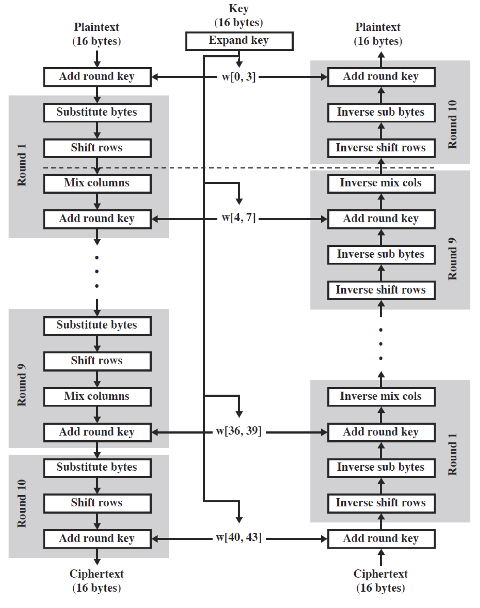
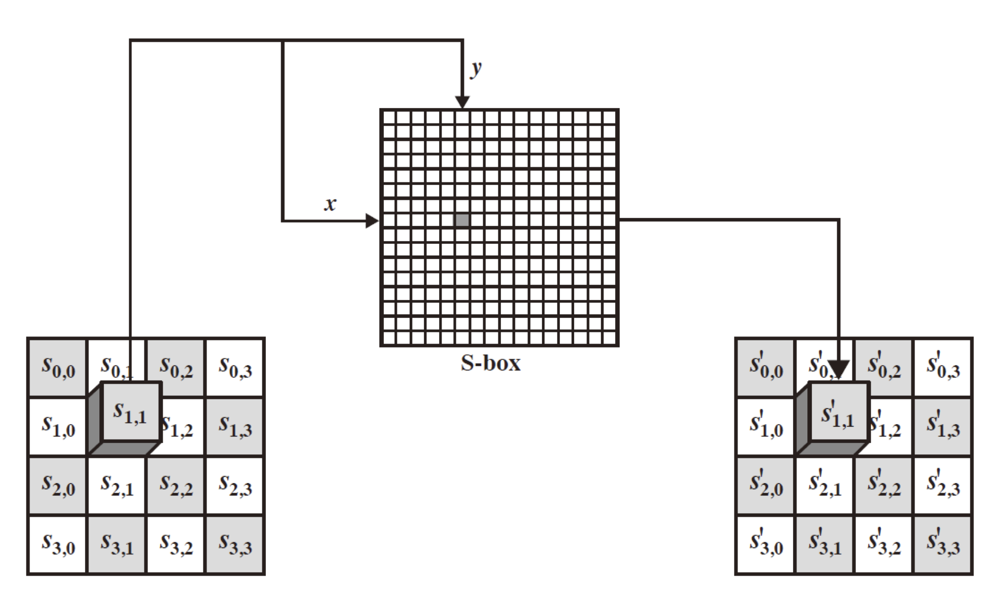
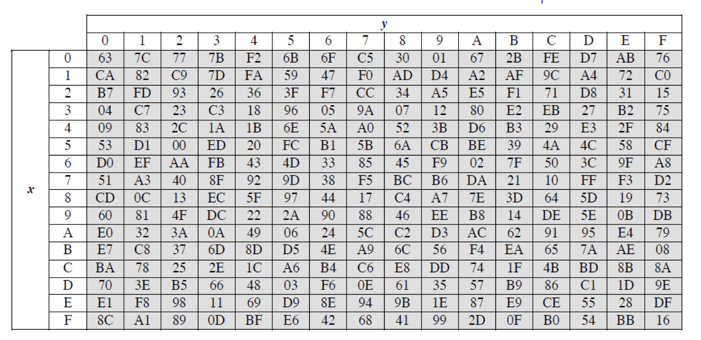
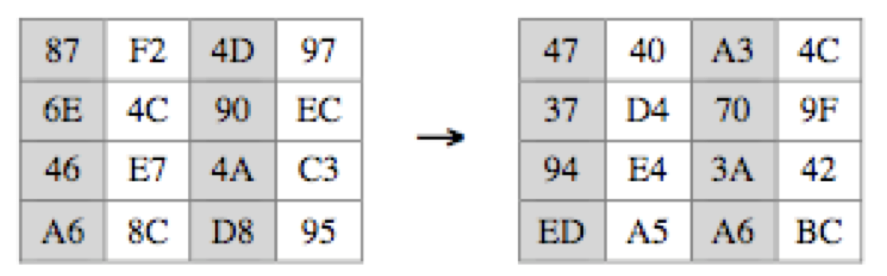
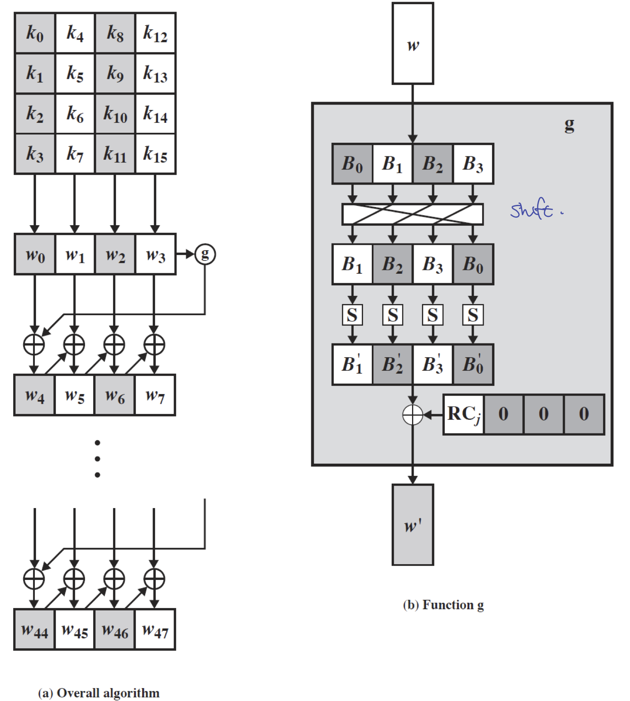
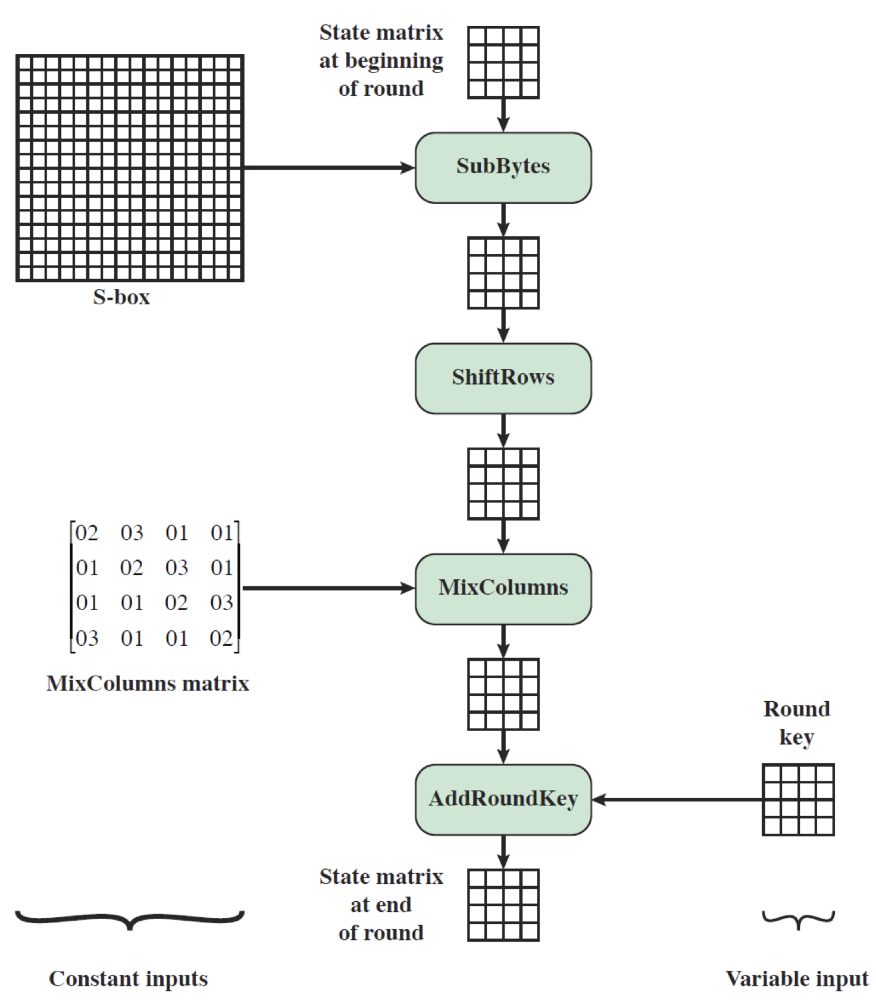
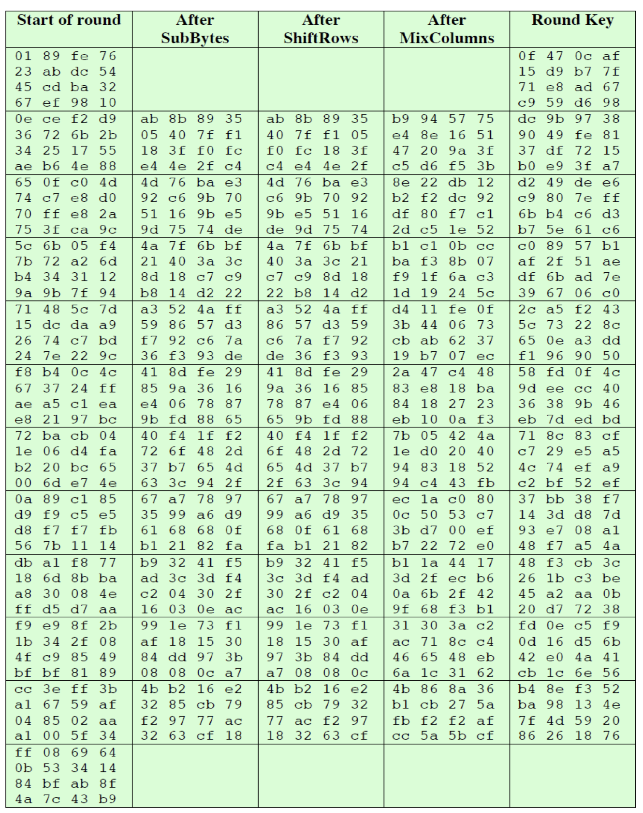

## AES

이 전 [포스트](../Block-Ciphers-and-the-Data-Encryption-Standard/)에서 _DES_ 에 대해 알아보았다.  

이는 아주 잘 고안된 암호화 알고리즘이고 굉장히 많이 쓰인 암호화 알고리즘이었으나 키 사이즈의 한계로 더 이상은 쓰지 않는 기법이 되었다.  
그래서 이를 보완하기 위해서 _Triple-DES_ 등으로 활용해보기도 하였으나 S/W 수준에서 느리다는 단점이 있었다.  
결국 새로운 암호화 알고리즘에 대한 필요성이 대두되었고, _Rijndael_ 이 결국 _AES_ 로 채택되었다.  

새로운 표준이 된 _Rijndael_ 은 Rijmen-Daemen 에 의해 고안되었으며 128/192/256 bit 의 키를 가지며 128-bit data 를 한 블록으로 사용한다.  

이는 _Feistel cipher_ 를 사용하지 않고 ___iterative___ 방식을 이용하는데 속도가 굉장히 빠르며 간결하게 설계된 특징이 있다.  

## Finite Field Arithmetic

_AES_ 는 finite field _GF($2^8$)_ 의 $m(x) = x^8 + x^4 + x^3 + x + 1$ 의 다항식을 사용하는데, finite field arithmetic 은 나중에 정리해 보도록 하겠다.  

## AES Structure

_AES_ 는 바이트 단위의 4*4 정사각 행렬을 데이터 블록으로 이용한다.  
___iterative___ (반복)이기에 라운드가 존재하며,  
키는 word 배열에 의해 확장되며 9/11/13 라운드를 수행하게 되는데 각각,

1. Byte substitution (각 바이트마다 하나의 S-Box 가 사용)
2. Shift rows (그룹별/열별 permutation)
3. Mix columns (matrix multiply)
4. Add round key (키에 대해 XOR 연산 적용)

이러한 과정을 거치게 된다.  

세부적으로 살펴보았을 때 XOR 과 table lookup 만 사용해서 이를 구현할 수 있는데, 이는 매우 빠른 속도로 동작할 수 있음을 의미한다.  

위의 과정을 도식화 하면 다음과 같다.  



키 확장은 44개의 32-bit word 로 이루어진 배열에 의해 이루어지게 된다.  

이러한 _AES_ 는 다음과 같은 특징을 가진다.  

- 보다시피 복잡하지 않고 단순한 구조를 가지고 있으며, Add round key 에서만 키를 사용한다.  
- 이 Add round key 는 Vernam cipher 의 형식을 가진다.  
- 매 단계는 쉽게 역수행이 가능하다(easily reversible)
- 복호화는 키를 반대 순서로 사용하면 된다
- 마지막 단계는 3개의 stage만을 가진다(mix column stage 가 없음)

### 1. Substitute Bytes

첫 단계인 Substitute Bytes 는 table lookup(_S-Box_) 을 통해 진행된다.  
16 by 16 matrix 를 이용하며 총 256 개의 8-bit 정보를 갖고 있는 이 테이블은 input에 대해 각 바이트가 갖고 있는 정보에 해당하는 행/열에 적힌 값으로 대체시켜버린다.  
왼쪽 4-bit 는 행(row)을 나타내고 오른쪽 4-bit 는 열(col)을 나타내게 된다.  

e.g. 95 라는 바이트는 _S-Box_ 의 9행 5열에 적힌 2A 로 변환된다.  



위의 그림은 $S_{1,1}$ 의 정보가 _S-Box_ 에 대응되어 변환되는 것을 도식화한 그림이다.  

_S-Box_ 는 다음과 같이 정의되어 있다.  

  

> 위의 테이블에서 앞의 예제 $95 \to 2A$ 를 확인해보자.  

이러한 _S-Box_ 는 단순하게 아무 값이나 만들어진 것이 아닌 GF($2^8$)를 이용해 만들어진 테이블이다.<small>여기서는 _Inverse of GF($2^8$)_</small>  

### 2. Shift Rows

두 번째 단계인 shift 는 매우 단순하다.  
shift는 행단위로 이루어지며 각 행의 shift 연산은 다음과 같다.  

1. 첫 번째 행은 변하지 않는다.
2. 두 번째 행은 왼쪽으로 1 byte shift 된다.
3. 세 번째 행은 왼쪽으로 2 bytes shift 된다.
4. 네 번째 행은 왼쪽으로 3 bytes shift 된다.

모든 shift 연산은 circular shift 로써, 왼쪽 끝에서 shift 하게 되면 오른쪽 끝으로 가게 된다.  

위에서 보면 알겠지만 이는 암호화(encryption) 시 shift 를 서술한 것이다.  
복호화(decryption) 시에는 오른쪽으로 shift 하면 된다.  

### 3. Mix Columns

세 번째 단계는 각 열에 대해 개별적으로 진행된다.  
4 by 4 matrix 를 이용하는데 이 때 사용되는 matrix 는 아래와 같다.  

$\left( \begin{matrix} 2&3&1&1 \\ 1&2&3&1 \\ 1&1&2&3 \\ 3&1&1&2 \end{matrix} \right)$

이 2, 3, 1, 1 이라는 숫자는 의도적으로 사용되는 숫자들이다.  

> bit 단위에서  
> $\times 1$ 은 아무런 변화가 없다.  
> $\times 2$ 는 왼쪽으로 1-bit shift
> $\times 3$ 은 왼쪽으로 1-bit shift 및 XOR 

이 때 8-bit인 바이트에 대해서 addition 과 multiplication 이 진행되면 8-bit 를 넘어가게 되는 경우에 대해 의문점이 생길 수 있다.  

여기에서 우리는 GF($2^8$) 의 필드 안에서 이루어지는 arithmetic operation 이라는 사실을 꼭 생각하고 넘어가야 한다.<small>prime polynomial $m(x)=x^8+x^4+x^3+x+1$</small>



위의 예제에서 1행 1열에 대한 계산 과정을 풀어보면 다음과 같다.  

$\begin{aligned} \{02\} \times \{87\} &= (0000 1110) \text{ XOR } (0001 1011) \\ &= (0001 0101) \\ \{03\} \times \{6E\} &= \{6E\} \text{ XOR } (\{02\} \times \{63\}) \\ &= (0110 1110) \text{ XOR } (1101 1100) \\ &= (1011 0010) \\ \{46\} &= (0100 0110) \\ \{A6\} &= (1010 0110) \\ \end{aligned}$  

$\{02\} \times \{87\} \text{ XOR } \{03\} \times \{6E\} \text{ XOR } \{46\} \text{ XOR } \{A6\} \mod{m(x)} = 0100 0111 = \{47\}$

이런 식으로 _mix columns_ 를 진행할 수 있다.  

복호화 과정에서는 inverse matrix 가 필요하다.

### 4. Add Round Key

유일하게 _key_ 를 이용하는 단계이고, 열에 대해 키를 이용한 연산을 수행하게 된다.  

128-bit 키에 대해서 44/52/60 개의 32-bit words 를 가진 배열을 이용해 확장(expand)을 시킨다.  
우선 첫 네 개의 word를 복사한다.  
그리고 반복적으로 이전의 word에 의존하여 word를 만들어낸다.  

도식화하여 보면 다음과 같다.  



위의 그림에서 _g_ 함수 안에 이용되는 $RC_j$ 는 _Round Constant_ 로 _RC\[1\]=1_ 을 시작으로 매 라운드마다 2배씩 커진다.  

$RC[1]=1, RC[j]=2\times RC[j-1]$  

이에 따른 _RC table_ 은 아래와 같다.  

| j     | 1  | 2  | 3  | 4  | 5  | 6  | 7  | 8  | 9  | 10 |
|-------|----|----|----|----|----|----|----|----|----|----|
| RC\[j\] | 01 | 02 | 04 | 08 | 10 | 20 | 40 | 80 | 1B | 36 |  

즉, AES 에서 _key_ 는 다음과 같이 진행된다.  

1. 왼쪽으로 circular shift 1
2. S-Box 에 적힌 값으로 각각 변경(여기서 S-Box 는 위에 나온 것과 동일)
3. 첫 바이트는 RC\[j\] 와 XOR
4. 이렇게 나온 값이 다음 key 가 되는 네 개의 words

다음의 간단한 예시를 보고 넘어가겠다.

```
input key   = all zero(=0)
first key   : 0   0   0   0
---
(for one word)
shift       : 0   0   0   0
S-Box       : 63  63  63  63
RC          : 62  63  63  63
second key  : 62  63  63  63
---
all the same w4=w5=w6=w7
```

이렇게 AES 의 한 라운드에 대한 모든 stage 를 살펴보았다.  

이를 정리하면 다음과 같은 도식으로 표현할 수 있다.  



### 5. AES Exmaple

간단하게 _AES_ 를 적용시킨 것을 보자.

```
plaintext   : 0123456789abcdeffedcba9876543210
key         : 0f1571c947d9e8590cb7add6af7f6788
ciphertext  : ff0b844a0853bf7c6934ab4364148fb9
```

과정에 대한 각 단계의 내용들을 표에 정리하면 다음과 같다.  



시작 단계에서 plaintext의 배치가 열 단위로 이루어짐을 주목하자.  

AES 는 기본적으로 word 단위의 연산을 주로 행하므로 위와 같이 시작해야한다.  

## AES Avalnche Effect

_AES_ 는 쇄도 효과(눈사태 효과, Avalanche Effect)가 일어날까?  

_DES_ 에서도 확인해보았듯이 _AES_ 에서도 확인해보자.  

위의 예시에서 사용했던 plaintext 에서 두 번째 비트를 1 에서 0으로 바꾸고 암호화를 진행하면 다음과 같은 암호문을 얻는다.

```
plaintext   : 0023456789abcdeffedcba9876543210
key         : 0f1571c947d9e8590cb7add6af7f6788
ciphertext  : 612b89398d0600cde116227ce72433f0
```

이는 bit 단위로 보았을 때 58-bit 의 차이가 나타났음을 확인할 수 있다.  

마찬가지로 키에 대해서도 비트를 하나 바꿔봤을 때 쇄도효과를 확인해 볼 수 있다.  

## AES Decryption

지금까지 _AES_ 의 암호화 과정을 살펴보았다.  

그렇다면 복호화 과정은 어떨까?  

_DES_ 처럼 같은 알고리즘을 이용해 복호화 할 것일까?

결론적으로는 ___동일하지 않다.___  

그러나 우리는 __equivalent inverse cipher__ 를 생각할 수 있다.

이는 _AES_ 는 matrix 기반 연산이 있다는 점, 복호화는 암호화를 역으로 수행하는 과정이라는 점을 생각하면 inverse of matrix, 즉, 역행렬을 이용해서 _equivalent inverse cipher_ 를 생각해 낼 수 있는 것이다.  

여기서 _byte substitution_ 과 _shift row_ 를 _swap_ 해주고,  
_mix columns_ 과 _add round key_ 를 _swap_ 해서 구체적으로 진행할 수 있다.  

이는 조금 복잡한 것이지만 이렇게 하면 같은 H/W 와 S/W 에서 동작시킬 수 있게 된다.  

## Implementaion Aspects

이러한 _AES_ 의 구조는 8-bit CPU 에서 효율적으로 구현이 가능한데,  

_Byte Substitution_ 에서 256개의 entry(16 by 16 matrix)를 가진 테이블을 이용할 수 있고,  
_Shift Row_ 역시 비트 연산이며,  
_Add Round Key_ 역시 비트 연산(XOR) 이기 때문이다.  

그러나 _Mix Column_ 은 matrix multiplication 이기에 위의 세 단계와 비교했을 때 overhead 가 있을 수 밖에 없다.  

이는 table lookup 과 byte XOR 를 적절하게 사용하면 완화되는 이슈인데, 여기서 _mix column_ 의 구조적 중요성이 나타난다.  

X2 라는 256-byte 저장공간에 다음과 같은 정보가 있다고 하면,

$X2[i] = \{02\} \times i$  

다음과 같은 식을 만들 수 있다.  

$Tmp = s_{0,j} \oplus s_{1,j} \oplus s_{2,j} \oplus s_{3,j}$  
$s'_{0,j} = s_{0,j} \oplus Tmp \oplus \left[ 2 \cdot \left(s_{0,j} \oplus s_{1,j} \right) \right]$  
$s'_{1,j} = s_{1,j} \oplus Tmp \oplus \left[ 2 \cdot \left(s_{1,j} \oplus s_{2,j} \right) \right]$  
$s'_{2,j} = s_{2,j} \oplus Tmp \oplus \left[ 2 \cdot \left(s_{2,j} \oplus s_{3,j} \right) \right]$  
$s'_{3,j} = s_{3,j} \oplus Tmp \oplus \left[ 2 \cdot \left(s_{3,j} \oplus s_{0,j} \right) \right]$  

$s'_{0,j} = s_{0,j} \oplus Tmp \oplus X2 \left[ s_{0,j} \oplus s_{1,j} \right]$  
$s'_{1,j} = s_{1,j} \oplus Tmp \oplus X2 \left[ s_{1,j} \oplus s_{2,j} \right]$  
$s'_{2,j} = s_{2,j} \oplus Tmp \oplus X2 \left[ s_{2,j} \oplus s_{3,j} \right]$  
$s'_{3,j} = s_{3,j} \oplus Tmp \oplus X2 \left[ s_{3,j} \oplus s_{0,j} \right]$  

비슷하게 32-bit CPU 에서도 효율적으로 구현이 가능한데,  

__4 table lookup + 4 XOR__ 을 이용할 경우 4KB 의 저장공간으로 그 효율이 굉장히 높다.  
이 4개의 테이블은 256-word 로 구성되며, 각 스텝들은 32-bit word 를 사용하도록 재정의된다.  

각 state 를 우선 정리하면 다음과 같다.  

|SubBytes|$b_{i,j} = S\left[a_{i,j}\right]$|
|:---|:---:|
|ShiftRows|$\left[ \begin{matrix} c_{0,j} \\ c_{1,j} \\ c_{2,j} \\ c_{3,j} \end{matrix} \right] = \left[ \begin{matrix}  b_{0,j} \\ b_{1,j-1} \\ b_{2,j-2} \\ b_{3,j-3} \end{matrix} \right]$|
|MixColumns|$\left[ \begin{matrix} d_{0,j} \\ d_{1,j} \\ d_{2,j} \\ d_{3,j} \end{matrix} \right] = \left[ \begin{matrix} 02 & 03 & 01 & 01 \\ 01 & 02 & 03 & 01 \\ 01 & 01 & 02 & 03 \\ 03 & 01 & 01 & 02 \end{matrix} \right] \left[ \begin{matrix}  c_{0,j} \\ c_{1,j} \\ c_{2,j} \\ c_{3,j} \end{matrix} \right]$|
|AddRoundKey|$\left[ \begin{matrix} e_{0,j} \\ e_{1,j} \\ e_{2,j} \\ e_{3,j} \end{matrix} \right] = \left[ \begin{matrix} d_{0,j} \\ d_{1,j} \\ d_{2,j} \\ d_{3,j} \end{matrix} \right] \oplus \left[ \begin{matrix} k_{0,j} \\ k_{1,j} \\ k_{2,j} \\ k_{3,j} \end{matrix} \right]$|

이를 한 번에 정리하면 다음과 같다.  

$$
\left[ \begin{matrix} e_{0,j} \\ e_{1,j} \\ e_{2,j} \\ e_{3,j} \end{matrix} \right] = \left[ \begin{matrix} 02 & 03 & 01 & 01 \\ 01 & 02 & 03 & 01 \\ 01 & 01 & 02 & 03 \\ 03 & 01 & 01 & 02 \end{matrix} \right] \left[ \begin{matrix} S\left[ a_{0,j} \right] \\ S\left[ a_{1,j-1} \right] \\ S\left[ a_{2,j-2} \right] \\ S\left[ a_{3,j-3} \right] \end{matrix} \right] \oplus \left[ \begin{matrix} k_{0,j} \\ k_{1,j} \\ k_{2,j} \\ k_{3,j} \end{matrix} \right]
$$

이러한 효율적인 구현 가능성이 _AES_ 에서의 중요한 요소로 생각되었다.  

> 본 포스트는 _정보보호_ 를 공부하며 정리한 글 입니다.  
> 잘못된 내용이 있다면 알려주세요!  
> 감사합니다 :)
