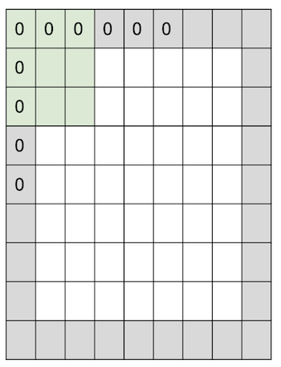

<small>최종 수정일 : 2019-10-12</small>

> 이 포스트는 스탠포드의 [cs231n](http://cs231n.stanford.edu) 강의를 보고 공부한 포스트입니다.  
> 잘못된 것이 있을 수 있습니다.  
> 댓글로 알려주시면 감사합니다!  

이제 우리는 _CNN_ 에 대해 본격적으로 알아 볼 것이다.  

그 전에 _CNN_ 이 나타나기까지의 역사를 간략히 보고 가자.  

## CNN의 역사

우리는 신경망의 구조를 본따 인공신경망을 구성하였다.  

여기서 사용하게 되는 개념이 바로 _perceptron_ 이었다.  

기계 학습 분야에 있어서 중요한 개념인 이 _perceptron_ 은 뉴런들로부터 들어온 신호와 가중치를 이용해 그 값에 따라서 0 또는 1의 출력값을 갖는 구조이다.  

이 _perceptron_ 개념이 처음으로 구현된 것이 __Mark 1 Perceptron__ 이다.  

이 때에도 update rule($w_i(t+1) = w_i(t) + \alpha (d_j - y_j(t))x_{j,i}$) 이 존재했지만 _backpropagation_ 의 개념은 아직 확립되지 않은 상태였다.  

이 후로 전기 회로(circuit)를 이용한 기계 장치 등이 개발되기도 하였다.  

그러나 학습 방법의 미약함으로 인공지능 분야의 암흑기가 이어지던 중 드디어 1986년 _backpropagation_ 의 등장으로 인공지능 분야의 새로운 시대가 도래하게 되었다.  

2006년에는 Hinton 과 Salakhutdinov 의 restricted Boltzmann machine 에 의해 이미지에 대한 fine tuning 등의 성과를 보일 수 있었고,  

드디어 2012년 _CNN_ 구조의 ___AlexNet___ 의 등장으로 _CNN_ 이 대세로 자리잡게 되었다.  

이러한 _CNN_ 의 발전은 광학수용에 관한 과거 연구들이 기반이 되었는데, Hubel & Wiesel 의 고양이의 단일 뉴런(at 1959)과 시각 피질의 수용 영역(receptive field)에 관한 연구(at 1962)가 토대가 되었다.  

이 수용 영역 개념을 기반으로 이미지 처리에 대한 연구가 진행되어 1998년에 이르러 _LeNet-5_ 가 발표되었다.  
이는 LeCun 이 gradient-based learning 을 이용해 문서를 인식해 본 것으로, convolution 또는 subsampling 을 사용하는 5개의 layer 를 이용해 필기체를 인식하는 모델이다.  

그리고는 언급했듯이 2012년, _AlexNet_ 의 발표와 당시 압도적인 성능(2위와의 격차가 16%)에 고무되어 매년 뛰어난 성능을 가진 모델들이 계속 발표되고 있다.  

이렇게 대세로 자리매김한 ConvNet 은 굉장히 넓은 분야에서 사용되고 있는데, 이미지 분류, 탐지, 구분, 자율주행 등의 시각적 정보 처리 분야에 있어서 빼놓을 수 없는 것이 되었다.  

위에 언급한 것들 외에도 자세 인식, 위성 사진 판별(e.x. 고래), 천문학 사진 판별, 예술 작품 창작 등의 작업까지도 수행하게 되었다.  

## Fully Connected Layer

32\*32\*3 의 이미지가 있다고 하자.  
FC(Fully Connected) layer 에 이 이미지를 이용한다고 하면  
우선 $32\times 32 \times 3 = 3072$ 으로 펼친 다음(stretch out) 지난 시간에 배웠던 $f(x,W) = Wx$ 으로 10개의 output 을 이끌어 낼 수 있다.  

10개의 output 에 대해 각각의 값은 _dot product_ 를 수행한 결과이다. <small>(그림의 예제에서는 3072차원의 _dot product_)</small>  

## Convolution Layer

_Convolution Layer_ 는 input data 의 공간 구조를 유지하며 특성을 추출할 수 있게 한다.  
_filter_ 라고 불리는 것을 이용하는데, _filter_ 로 이미지를 _convolve_ 하는데 ___convolve___ 의 의미는 다음과 같다.  

> slide over the image spatially, computing dot products  

그러니까 필터를 슥 움직이면서 _dot product_ 를 수행하는 것이 _convolve_ 인 것이다.

위의 그림은 32\*32\*3 이미지와 5\*5\*3 필터인데, 여기서 3은 _channel_ 이다.(나머지는 height & width)  
이 _channel_ 은 __반드시 일치__ 해야 한다.<small>depth 라고도 하는 것 같다.</small>  

여기서 나오는 정보는 _FC layer_ 에서 했던 것처럼($Wx$) 하게 되는데, 이를 조금 더 수식적으로 다듬어서 표현하면 다음과 같다.  

$w^Tx + b$ 여기서 $b$ 는 bias 이다.  

이렇게 하나씩 계산을 해서 하나의 map 을 얻을 수 있는데, 위의 예제에서 필터로 만들게 되는 activation map 의 크기는 어떨까?  

이와 같이 28\*28 이 되게 된다.  
왜 28\*28 일까? 가로로 움직이는 경우에 대해 생각해 보면, 5칸 짜리가 32칸 안에서 한 칸 씩 이동하면서 output 값이 하나씩 나오게 되므로 32-5+1 = 28 이 된다.  
곧 있을 ___stride___ 과정에서 조금 더 살펴보기로 하자.  

위의 그림은 필터를 이용해 한 번 _convolve_ 를 수행한 것으로, 하나의 _activation map_ 을 얻은 것이다.  
우리는 하나 이상의 _activation map_ 이 필요할 수 있고, 이를 위해서는 또 다른 filter 를 이용해 _convolve_ 를 수행하면 된다.  

이렇게 또 하나의 _activation map_ 을 얻게 되었다.  
만일 6개의 _activation map_ 이 필요하다면 6개의 필터를 이용해 원하는 것을 얻을 수 있을 것이다.  

이렇게 얻은 _activation map_ 은 _feature_ 를 담고 있게 된다.  

이런 식으로 _CNN_ 은 _Convolution Layer_ 을 이용하는데, 중간 중간 _activation function_ 을 같이 사용하는 방식으로 구성이 되어 있다.(+ pooling, ...)

위의 과정을 봐보자, layer 을 한 번씩 거칠 수록 데이터의 크기가 32\*32 -> 28\*28 -> 24\*24 로 작아지는 것을 볼 수 있다.  
또, 채널의 수는 3 -> 6 -> 10 으로 증가를 하게 된다.  

> 덧붙이면, _convolution layer_ 를 사용할 경우 점점 데이터 사이즈가 작아질 수 밖에 없고 이는 정보의 손실을 의미하게 된다. 그래서 그에 맞게 _channel_ 수가 증가를 하게 되는 것인데, 이러한 관점에서 _channel_ 은 임의로 정해지는 것이 아닌, 연산에 있어서 각 단계의 연산 크기가 일정한 수준에서 유지되도록 하는 수를 선택하게 된다.  

위의 과정은 이미지 처리에 대해 단계가 진행되면서 다음과 같은 의미를 가진다 볼 수 있다.  

  

여기서 실제적인 예시를 봐보자.  

32개의 5\*5 필터를 왼쪽 위의 사진(<small>차량의 모서리 부분인듯</small>)에 적용했을 때 나타나는 _activation map_ 을 볼 수 있다.  
붉은 박스 안의 _activation map_ 은 원본 이미지의 edge 에 대한 특성들을 담고 있는 것으로 보인다.  

오른쪽에 나타난 수식을 보면 왜 이름이 _CNN(Convolutional Neural Network)_ 인지 알 수 있다.(Convolution = 합성곱)

### Stride

앞 서 보았던 32\*32\*3 이미지에 5\*5\*3 필터를 적용하면 28\*28\*1 의 _activation map_ 이 나왔던 것을 생각해 보자.  
위에서도 계산을 해 봤지만, 아까 언급했던 _stride_ 개념에 대해 조금 더 알아보기 위해 조금 더 간단한 예제에 대해서 그 과정을 살펴보자.  

7\*7 input 에 대해 3\*3 filter 를 적용해본다고 하자.  

위와 같이 필터가 움직이게 되는데, 총 5번의 움직임이 있다는 것을 알 수 있다.  
이렇게 만들어지는 output 은 __5\*5__ 가 될 것이다.

그렇다면 _stride_ 는 무엇일까?  
쉽게 생각해서 한 번에 움직일 칸 수 이다.  
위의 예제에서는 _stride = 1_ 인 상태인 것이다.

_stride_ 가 2인 경우를 보자.  

이처럼 한 번에 두 칸씩 이동하게 되어 만들어지는 output 은 __3\*3__ 이 된다.  

만약 _stride = 3_ 의 경우에는 어떨까?  

이는 fit 하지 못하다는 것을 알 수 있다.(정수로 나누어 떨어지지 않기에, $\approx 2.33$)  
때에 따라 이렇게 나누어 떨어지지 않는 filter 도 예외적으로 처리해서 사용하기는 하나 우리는 우선 나누어 떨어지는 fit 한 경우에 대해서만 생각하기로 하자.  

이러한 _stride_ 에 대해서 정리하면 다음과 같다.  

$$
{ \left( N - F \right) \over \text{stride} } + 1
$$

여기서 $N$ 은 input size, $F$ 는 filter size 이다.  

### Padding

이런 식의 stride 기법은 모서리 부분(corner)의 정보가 상대적으로 손실이 발생할 수 있게 된다.  
> 위의 예제로 생각해보면 filter 는 이동하면서 공간을 볼 때 겹쳐서(중복으로) 보게 되는 부분이 있다. corner 부분은 상대적으로 겹치는 횟수가 작을 수 있는데, 이는 상대적으로 정보의 손실이 발생할 수 있게 된다.  

이를 방지하기 위해 우리는 _padding_ 을 사용하게 되는데, 가장 일반적으로 사용되는 _zero padding_ 에 대해 살펴보자.  

이렇게 경계(border) 부분에 0을 채워 넣는 것이 _zero padding_ 이 되겠다. 

위의 예제는 7\*7 input 에 3\*3 filter 에다가 _stride = 1, pad with 1 pixel_ 을 적용한 것이다. 이 때 output 을 생각해보면,  

__7\*7__ 이 나오게 된다!  

input size 와 동일한 output 을 얻게 되었는데, 이처럼 _padding_ 을 적절히 사용하면 size 가 작아지지 않고 유지할 수 있게 된다.  

일반적으로, _stride = 1_ 의 경우 filter 가 $F \times F$ 라면 _zero padding_ 을 ${F-1 \over 2}$ 만큼 줬을 때 size 가 유지된다.  

이렇게 한다면 위에서 보았던 문제를 해결할 길이 열리는 것인데, 

이처럼 사이즈가 줄어드는 문제를 padding 을 통해 막을 수 있다.  

### Example

이제 _stride_ 와 _padding_ 에 대해 알아보았으니 예제를 통해 한 번 계산해보자.  

input size  : _32\*32_\*3  
filter      : __5\*5__\*3, $10$개  
stride = ___1___, pad(zero) = $2$ 일 때, output size 는?

(_32_+2\*$2$-__5__)/___1___+1 = 32 이므로 32\*32\*$10$ 이 된다.

그렇다면 우리가 여기서 계산해야 할 _parameter_ 의 양은 얼마나 될까?  
같은 예제에 대해 계산을 해보면 다음과 같다.  

각각의 필터는 5\*5\*3 + 1 = 76 params (+1 for bias) 만큼 가지고 있고, 10개의 필터를 이용했으니  
$\Longrightarrow$ 76\*10 = 760 가 된다.  

750이라고 생각하기 쉬우나, 1 만큼의 _bias_ 가 있음에 유의하자.  

일반화한다면 다음과 같다.  

input size  : $W_1 \times H_1 \times D_1$  
filter no.  : $K$  
filter      : $F$
stride      : $S$
pad(zero)   : $P$  

output size : $W_2 \times H_2 \times D_2$ 로 정의하면,  
$W_2 = {\left( W_1 - F + 2P \right) \over S} + 1$  
$H_2 = {\left( H_1 - F + 2P \right) \over S} + 1$  
$D_2 = K$  
이 됨을 알 수 있다.  

여기서 $K, F, S, P$ 는 각각 ___hyperparameter___ 이다.

가장 흔하게 쓰이는 설정은 다음과 같다.

- $K$ = $2^N$ 꼴(32, 64, 128, 512, ...)
- $F=3, S=1, P=1$
- $F=5, S=1, P=2$
- $F=5, S=2, P=fit$ 한 아무거나
- $F=1, S=1, P=0$

여기서 $1 \times 1$ convolution layer 는 어떨까?  
이게 무슨 의미를 가질까 싶지만 놀랍게도 의미를 가진다!  
단순히 생각했을 때 아무 의미가 없을 것 같지만 __channel__, 그러니까 전체 __depth__ 에 대해서 _dot product_ 연산을 수행하게 되는 이 $1\times1$ conv. layer 는 그림과 같이 input 을 output 으로 변환시켜 준다.  

---

추가적으로 뉴런의 관점에서 conv. layer 를 살펴보자.  
_perceptron_ 의 구조를 생각해보면서 conv. layer를 보면 필터를 거치게 되었을 때 이와 같이 하나의 값이 나오는 것은 하나의 뉴런이 이미지의 한 부분(5 by 5)에 대해 바라보고 있는 것이며, _parameter_ 들을 공유하는 상태인 것이다.  

즉, $5 \times 5$ filter 는 각 뉴런의 $5 \times 5$ _receptive field_ 가 되는 셈이다.  

여기서 __depth = 5__ 라면 conv. layer 가 나타내는 것은 뉴런들(28\*28\*5)을 3차원 그리드 안에 표현하게 되는 것이고,  
다섯 개의 다른 뉴런들이 input 에 대해 같은 영역을 바라보고 있게 되는 것이다.  

이 개념을 처음에 언급했던 _FC layer_ 에 대해 적용하면 각 뉴런들이 전체 input 에 대해서 바라보고 있게 되는 것을 의미하게 된다.

## Pooling Layer

이제 _pooling layer_ 에 대해 알아보자.  

쉽게 생각해서 데이터의 사이즈를 줄이는 작업인데, 데이터를 작게 만듦으로써 다루기 쉽게 하기 위함이 있다.  
이 작업은 각 _activation map_ 에게 독립적으로 시행된다.  
즉, input 에 대한 _downsampling_ 과정인 것이다.  

이런 식으로 이미지의 크기 자체가 줄어드는 모습을 볼 수 있는데, 주의해야할 점은 _spatial_ 한 조작이 이루어지는 것일 뿐, _depth_ 에는 영향을 미치지 않는 다는 것이다.  
이렇게 _downsampling_ 과정을 거치면 계산해야할 _parameter_ 의 수가 줄어든다는 이점도 있다.  

### Max Pooling

가장 흔하고 간단한 _Max Pooling_ 을 살펴보자.  
_Max Pooling_ 은 해당 영역 중 가장 큰 값만 가지고 가는 것이다.  
아래의 예제를 보자.  

2\*2 filter 를 _stride = 2_ 적용했을 때 각 영역별로 _max pool_ 을 시행하면 (6, 8, 3, 4) 가 남는 것을 볼 수 있다.  

이는 의도적으로 정보의 손실을 가져오는 것인데, 일반적으로 생각했을 때 정보의 손실이 좋지 않겠지만 놀랍게도 이러한 pooling 은 모델의 성능 향상에 도움을 준다.  

차량을 생각해보자. 그 중에서도 차의 핸들 부분에 대한 사진이라고 했을 때 우리가 이 사진을 보고 차량의 핸들이라는 것을 판단하려면 핸들 부분(위와 같이 matrix 로 값을 표현한다면 중앙)의 값들이 커야 할 것이다.(큰 값이 좋은 값이라고 기준지었을 때)  
이런 경우 주변의 값들은 noise 로써 모델의 학습을 방해하는 요소가 된다.  
즉, 이런 식으로 의도적인 정보의 손실로써 모델의 성능에 긍정적인 영향을 미칠 수 있게 된다.  

> _average pooling_ 보다 _max pooling_ 을 좀 더 많이 사용하게 되는데, 직관적으로 생각할 때 이는 타당하다.  
> _max pooling_ 은 뉴런의 입장에서 볼 때, 활성화 되어야 할 가장 큰 값을 알려주는 것이다.  
> 이는 우리가 이미지를 인식할 때 어떤 부분에 있어서 시각적으로 처리하는 것을 생각해보면 가장 도드라지는 부분을 인식한다는 것과 같은 맥락으로 볼 수 있다.  

조금 생각해보면 _stride_ 를 적절히 사용하면 _pooling_ 과 비슷한 효과를 얻을 수 있다는 것을 알 수 있다.  
실제로도 최근의 _Neural Network_ 들에서는 이러한 시도를 보이고 있는데, 그럼에도 불구하고 여전히 이 _pooling_ 을 이용한 _downsampling_ 기법은 단순하면서도 성능을 올리는데 좋은 역할을 하고 있다.  

_pooling_ 의 in/out size 를 정리하면 다음과 같다.  

input size  : $W_1 \times H_1 \times D_1$
filter      : $F$
stride      : $S$

output size : $W_2 \times H_2 \times D_2$ 라 할 때,  
$W_2 = {W_1-F \over S} + 1$  
$H_2 = {H_1-F \over S} + 1$  
$D_2 = D_1$  

여기서 $F, S$ 는 역시 ___hyperparameter___ 이다.  

일반적으로 $F=2, S=2$ 또는 $F=3, S=2$ 를 많이 사용하고 있다.  

보통 _pooling_ 을 할 때 overlap 되지 않게 한다고는 하나 $F=3, S=2$ 도 많이 쓰인다고 한다.  
