<small>최종 수정일 : 2019-10-13</small>

우리는 _Neural Network_ 를 학습시키기 위한 기초적인 것들을 살펴보았다.  
이제 _Neural Network_ 를 학습시키는 과정과 그 속에서 필요한 것들에 대해 알아보자.  

## Overview

_NN_ 을 만드는 과정은 다음과 같이 정리할 수 있다.  

1. 초기 설정 : 활성 함수(_activation function_), 전처리(_preprocessing_), 가중치 초기화(_weight initialization_), 정규화(_regularization_), _gradient checking_(_sanity check_)
2. 학습 : _learning process_, _parameter update_, __hyperparameter__ optimization
3. 평가 : 앙상블(_model ensemble_), _test-time augmentation_(테스트 시 데이터셋을 늘리는 기법)

<a name="activation-functions"></a>

순서대로 한 번 살펴보자.  

## Activation Functions

우리는 이미 _perceptron_ 모델과 여러 활성 함수들에 대해 간략히 살펴 보았다.  

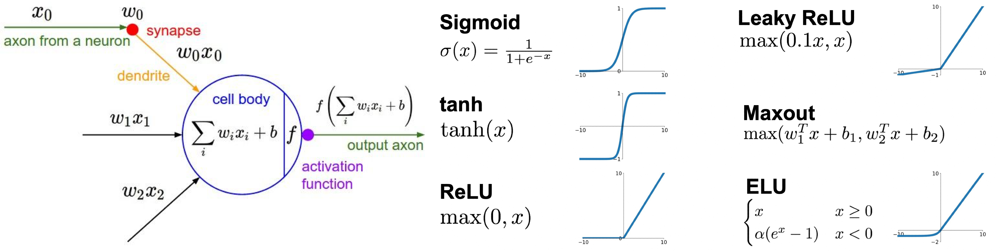

각 활성 함수들에 대해 조금 더 자세히 알아보자.  

### Sigmoid

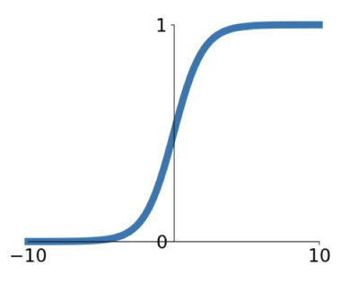

0~1 사이의 값을 갖도록 하는 sigmoid 는 뉴런의 'firing rate' 의 동작 구조와 상당히 비슷해서 많이 쓰였었다.  
그러나 현재에는 거의 쓰이지 않는 함수인데 다음과 같은 세 가지 문제점을 볼 수 있다.  

1. ___kill gradient___      
    그래프를 보면 알 수 있듯이 양 극단에서의 기울기가 0에 수렴하는 현상이 있다.  
    saturated regime 이라고 하는 이 구간에 대해서는 기울기가 0에 가까워 _gradient update_ 가 사실상 일어나지 않게 된다.  
    이렇게 _saturated neuron_ 이 생기게 되고 이들은 gradient 를 ___kill___ 하게 된다.  
    즉, x=-10 또는 x=10 과 같은 경우에 _backpropagation_ 이 ___stopped___ 하게 되는 문제가 발생한다.  
2. ___non zero-centered___  
    그래프를 보면 _sigmoid_ 함수는 그 중간이 0(원점)이 아님을 알 수 있는데, 함수의 모양에서도 볼 수 있듯이 어떤 x 에 대해서도 항상 양수(0보다 항상 큼)의 출력 값을 가진다는 것을 볼 수 있다.  
    _chain rule_ 에 의해 우리는 다음과 같은 식 ${dL \over dw_i} = {dL \over df} \times {df \over dw_i} = {dL \over df} \times x_i$(여기서, $f\left( \sum_iw_ix_i + b \right)$)을 구할 수 있고, $x_i$ 가 양수면 _gradient_ 도 양수, $x_i$ 가 음수면 _gradient_ 도 모두 음수가 된다. 즉,  
    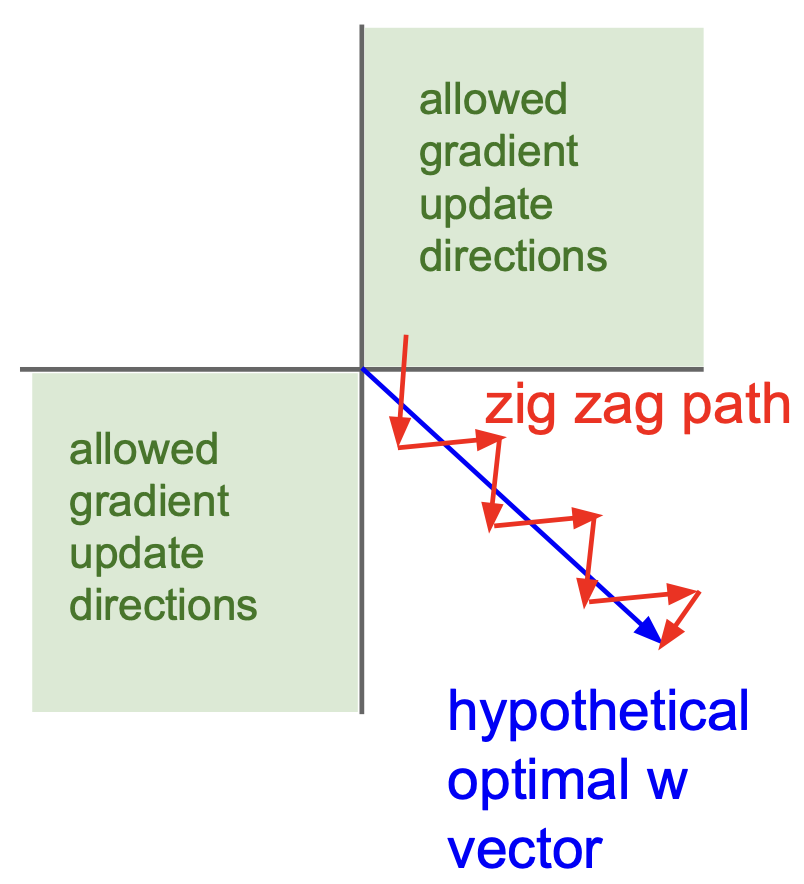  
    그림에서 볼 수 있듯이 _hypothetical optimal w vector_ 가 파란색처럼인 경우 _inefficient update_ 를 하게 된다. 이는 _gradient_ 가 모두 같은 부호의 값을 가지기 때문이고, 이는 zero mean 이 아니기 때문이다.
3. ___exp 연산___  
    exp 연산은 계산 상 그 cost 가 높은 부분이다. 이는 조금 minor 이슈인데, 우리는 이미 deep learning 에서 _dot product_ 등의 연산을 하게 되기 때문이다.

### tanh(hyperbolic tangent)

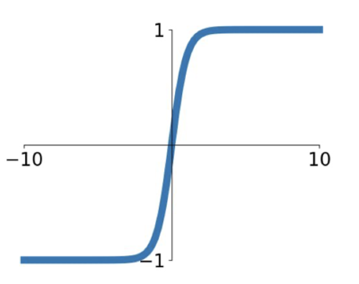

이는 zero mean 을 가지게 되어 _sigmoid_ 에서 갖고 있던 _zero-centered_ 문제를 해결할 수 있으나 여전히 saturated 의 경우 gradient 를 kill 한다.

### ReLU(Retified Linear Unit)

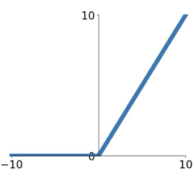

가장 보편적으로 쓰이는 활성 함수이다.  
우리가 앞서 보았던 $f(x) = max(0,x)$인데 다음과 같은 이점이 있다.

- \+ 영역에서 saturate 하지 않는다.
- linear 이기에 계산이 매우 효율적이다.
- _sigmoid, tanh_ 보다 매우 빠르게 수렴함을 보인다.(약 6배)

그러나 zero-centered 하지 않은 output 을 내보내는 문제점이 있다.  
이는 half regime(\- 영역)에서 _kill gradient_ 하게 되는 문제점도 있으며, 0에서는 미분불가능하기 때문에 _gradient_ 가 undefined 하게 된다.  

또한 간헐적으로 _dead ReLU_ 가 되기도 하는데, weight 를 잘못 초기화 하거나 learning rate 가 너무 높을 때 발생하게 된다. _dead ReLU_ 는 입력 값에 대해서 하나도 활성화되지 않는 경우를 뜻하는데, 이차원 평면에서의 예제를 보면 아래와 같은 경우이다.  

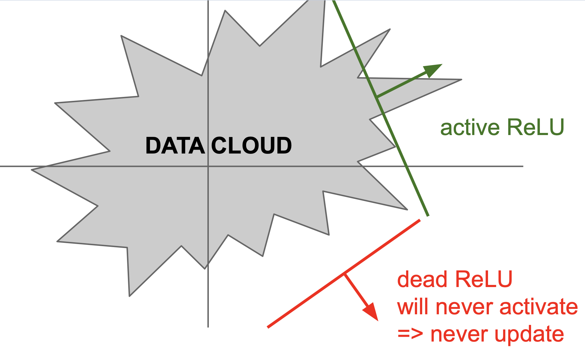

현실에서는 이차원 평면이 아닌 다차원 공간에서의 hyperplane 으로 나뉘는 공간에 대해 activation 하는 점을 명심하자.  
이러한 dead ReLU 현상을 피하기 위해 사람들은 positive bias(0.01) 정도를 초기에 설정하게 되는데 이는 검증되지는 않았지만 그냥 그러한 경향으로 사용하고 있다.  

### Leacky ReLU

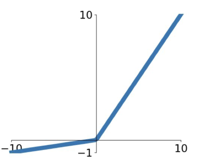

_ReLU_ 에서 조금 변형한 함수로, _kill gradient_ 가 일어나지 않도록 \- 영역에서 slight slope(0.01)의 값을 이용해 no saturating regime 을 만들어냈다.  

그러나 이는 앞서 말했듯이 검증되지 않은 활성 함수이다.  

덧붙여서, 저 slight slope 도 파라미터로 취급해 학습하면 더 낫지 않을까라는 생각에 _PReLU(Parametric Rectifier)_ 라는 함수를 쓰기도 한다.  
$f(x) = max(\alpha x, x)$  
이는 조금 더 activation 에 유연함(flexibility)을 부여하게 해준다.  

### ELU

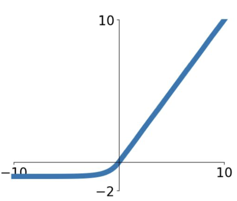

_ReLU_ 의 이점을 모두 가지며 zero mean 에 가까운 output 을 내도록 하는 활성 함수이다. _Leacky ReLU_ 와는 다르게 negative saturation regime(\- 영역이 깊어질 수록)이 존재한데, 사실 이것은 noise 에 좀 더 강한 robustness 를 부여하게 된다.
> negative 는 noise 일 확률이 높기 때문에(그 값이 true negative 라면) 학습을 하면 overfitting 되거나 성능에 악영향을 미칠 수 있다.  

$f(x) = \begin{cases} x & \text{if } x \gt 0 \\ \alpha \left( e^x -1 \right) & \text{if } x \le 0 \end{cases}$

위의 negative 영역에서의 함수는 의도적으로 설계된 함수인데, 관련 논문을 읽어보자!

이는 꽤 괜찮은 함수이나 exp 연산으로 인해 computational cost 가 증가한다는 단점이 있다.  

### Maxout

_ReLU_ 와 _Leacky ReLU_ 를 일반화한 것으로 linear regime 을 가지고 saturate 하지 않고 kill gradient(die)도 없다.  

$max \left( w_1^Tx + b_1, w_2^Tx + b_2 \right)$  

로 표현되나 파라미터/뉴런의 개수가 2배가 된다는 문제가 있다.

---

여기까지 정리하면, 기본적으로 __ReLU__ 를 사용하는 것이 좋다.(보편적)  
learning rate 를 조심스럽게 설정하여 여러 시도를 통해 적합한 learning rate 를 찾아보고, 다른 활성 함수들도 적용해보면 좋다.  

그러나 _tanh_ 는 좋은 성능을 내기는 어렵고, _sigmoid_ 는 ___사용하지 마라___.

## Data Preprocessing

데이터 전처리는 _Data Science_ 와 _Machine Learning_ 분야에 있어서 매우 중요한 과정이다.  
우리가 앞서 보았던 문제점 중 _zero-centered_ 하지 않아서 발생하는 문제가 있었다.  
데이터를 중앙으로 모으면(_zero-centered_) 어느 정도 해결할 수 있을 것임을 유추할 수 있다. <small>어느 정도라고 하는 이유는 layer 가 깊어질 수록, 즉 forward pass 로 진행이 될 수록 문제점들이 계속 나타나고 이러한 과정만으로는 완벽하게 보정하기 힘들기 때문이다. 그래서 이런 preprocessing 과정은 가장 앞쪽 layer에서 보통 해준다.</small>  

_data preprocessing_ 과정에는 _normalization_ 도 있는데, 이는 같은 영역 안에 데이터들이 위치하도록 만들어서 기여하는 영향의 정도를 동일하게 만들어주는 의미를 가진다. 그러나 이미지 영역에서는 이미 pixel 들이 localty 라던가 하는 지역적 정보를 가지고 있기에 이러한 normalization 은 좋지 못하다.  

그 외에도 _PCA_, _whitening_ 등도 image(pixel value)에는 적합하지 못한 전처리 과정이다.  

그러므로 image 에는 ___center___ 만 전처리로 해주자!  

실제 _ConvNet_ 들이 해준 _center_ 과정은 아래와 같다.

- 이미지의 평균 값을 빼줌(_AlexNet_)
- 채널의 평균 값을 빼줌(_VGGNet_)
- 채널의 평균 값을 빼고 분산으로 나눠줌(_ResNet_)<small>정규분포의 냄새가 나지 않는가?</small>

## Weight Initialization

가중치 초기화는 굉장히 중요한 부분이다. 다음의 _FC layer_ 모형에 대해 잠깐 생각하는 시간을 가져보자.

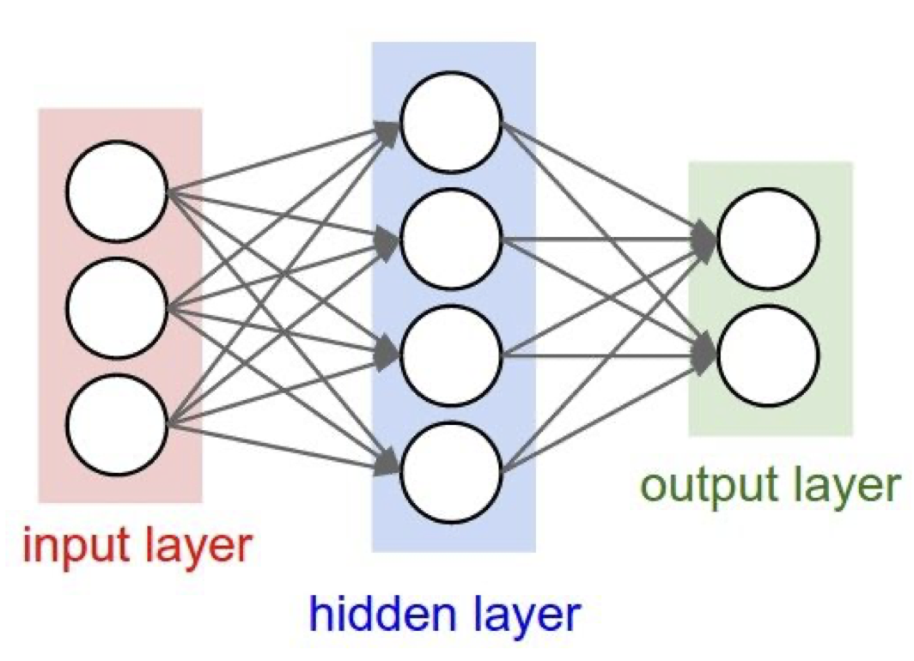

이 때, $W$ 의 값이 모두 같다면 어떤 현상이 있게 될까?

> dead, 죽는다고 생각할 수도 있는데 죽는 것은 아니고 모든 neuron 에 같은 일이 일어나게 된다. 이는 모두 동일한 output 을 내보내게 되고, backpropagation 할 때도 모두 같은 gradient 를 갖게 된다. 이는 뉴런의 비대칭성(asymmetric)을 해치는 것으로도 볼 수 있다.

이렇듯 단순하게 같은 값으로 초기화(0, 1, ...)하면 안되니 어떻게 초기화를 하는 것이 좋을까?

### 1. 작은 임의의 수로 초기화

무작위의 숫자로 초기화(+ gaussian 분포)하면 어떤 결과를 얻게되는지 살펴보자.  
이 방법은 작은 network 에서는 괜찮으나 network 가 깊어지면 문제가 발생한다.  

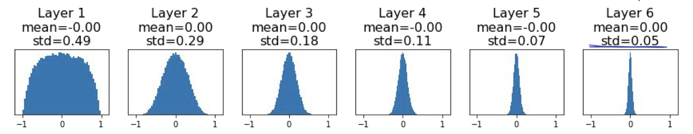

```python
dims = [4096] * 7
hs = []
x = np.random.randn(16, dims[0])
for Din, Dout in zip(dims[:-1], dims[1:]):
    W = 0.01 * np.random.randn(Din, Dout)
    x = np.tanh(x.dot(W))
    hs.append(x)
```

위의 결과는 6-layer with hidden size 4096 의 net에서 forward pass 를 진행한 결과이다. _tanh_ 를 활성 함수로 사용하였는데 이 함수는 zero-centered 이기에 평균이 0 이 나오는 것을 확인 할 수 있다.  
문제는 분산(_std_) 의 값이 빠르게 0으로 수렴하는 것인데, 이는 activation 이 0이 된다는 의미고 다시 말해 _update_ 가 일어나지 않게 된다는 뜻이다. $\to$ ___die___

이렇게 _gradient = 0_ 이 되어버리는 문제가 있는데, 작은 수로 초기화 했기 때문에 이런 현상이 일어나는 것은 아닐까?  

이번에는  
```python
W = 0.05 * np.random.randn(Din. Dout)
```
으로 늘렸을 때를 살펴보자.  

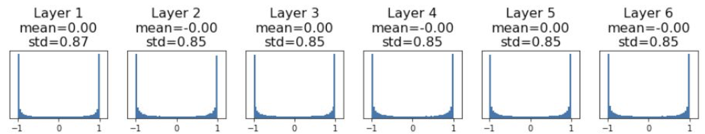

여전히 _gradient = 0_ 이 되는 것을 피할 수는 없다.  

이런 식으로는 학습을 진행할 수 없는데, 2010년 ___Xavier___ _initialization_ 이라는 방법이 _Glorot_ 에 의해 고안되었다.  
이 방식은 다음과 같다.
```python
W = np.random.randn(Din, Dout) / np.sqrt(Din)
```

이렇게 초기화한 값을 통해서 다음과 같은 결과를 얻을 수 있는데

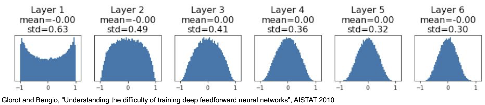

적당하게 수렴하는 모습을 볼 수 있으며, 성능 역시 적절하게 나타나는 것을 알 수 있었다.  
<small>activation 이 적절하게 모든 layer 에서 scaled 되는 것을 알 수 있음</small>

> _conv. layer_ 에서 _Din_ 은 kerner size^2 * input_channels
> Xavier Initialization 의 유도 과정  

$$
\begin{aligned}
Var(y_i)    &= D_{in} \times Var(x_iw_i) \\
            &= D_{in} \times \left( E\left[x_i^2 \right] E\left[ w_i^2 \right] - E \left[ x_i \right]^2 E\left[w_i \right]^2 \right)\\ 
            &= D_{in} \times Var(x_i) \times Var(w_i)
\end{aligned}
$$  

<br>  

$$
\text{if } Var(w_i) = {1 \over D_{in}} \quad \text{then } Var(y_i) = Var(x_i)
$$
이는 간단하게 정리를 해 본 것인데, 이렇게 전개가 가능한 것은 다음의 가정들이 있기에 가능하다.

- $w_i, x_i$ 는 동일한 확률분포를 가짐
- 두 개 모두 평균 0(_ReLU_ 에서는 평균이 0보다 조금 크기에 항상 적용할 수 있는 것은 아닌 것에 주의!)

마지막의 ${1 \over D_{in}}$ 이 되기 위해서 분산의 성질을 생각해보면 $\sqrt{D_{in}}$으로 가중치를 초기화해주면 된다는 것을 알 수 있다.  <small>$Var(aX) = a^2Var(X)$</small>

지금까지는 _tanh_ 을 이용했는데 _ReLU_ 에 _Xavier initialization_ 을 적용하면 어떻게 될까?  

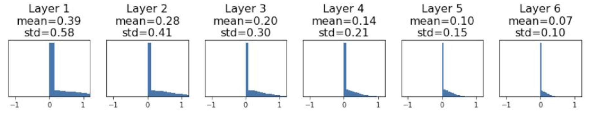

위에서 주의사항을 언급했듯이, _ReLU_ 의 평균은 0보다 크나, _Xavier init_ 은 _zero-centered_ 를 가정한 원리이기에 문제가 발생한다.  
또다시 activation 이 0 으로 collapse 하게 되어 학습이 진행되지 않게 되는데, 2015년 He 에 의해 적당히 초기화하는 방법이 만들어졌다.  

이는 _Xavier init_ 개선시킨 것인데, 놀랍게도 아주 간단한 개선이지만 성능에는 많은 영향을 끼친다.  

```python
W = np.random.randn(Din, Dout) * np.sqrt(2/Din)
```

차이점이 느껴지는가? _ReLU_ 의 특성을 보정하기 위해 sqrt(Din) 대신 sqrt(2/Din) 이 사용되었다.

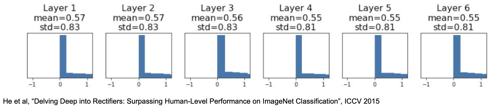

그 결과, activation 이 다시 적당하게 되게 되었다.

_Xavier/2_ 로도 불리는 이 기법이 현재에는 가장 잘 쓰이는 초기화 기법이다.  

## Batch Normalization

우리는 데이터가 gaussian range에서 activation 이 꾸준히 잘 되기를 원하고 있다.  

그렇다면 그렇게 하면 되지 않는가?  
에서 출발한 것이 바로 배치 정규화(_Batch Normalization_)이다.  

현재 배치에서 정규분포화 하기 위해 다음을 적용하는 것이다.  

$$
\hat{x}^{(k)} = {x^{(k)} - E\left[ x^{\left( k \right)} \right] \over \sqrt{Var\left[ x^{(k)} \right]}}
$$

이러한 배치 정규화는 training 때에만 진행해야 한다.  
test 시에는 학습된 값을 이용해 구하기만 한다.  

$$
\begin{aligned}
\mu_\beta &\leftarrow {1 \over m}\sum_{i=1}^m x_i \qquad &\text{ mini-batch 평균}\\
\sigma_\beta^2 &\leftarrow {1\over m}\sum_{i=1}^m\left(x_i - \mu_\beta \right)^2 \qquad &\text{ mini-batch 분산}\\
\hat{x}_i &\leftarrow {x_i - \mu_\beta \over \sqrt{\sigma_\beta^2 + \epsilon}} \qquad &\text{ normalize}\\
y_i &\leftarrow \gamma\hat{x}_i^2 + \beta \equiv BN_{\gamma,\beta}\left(x_i \right) \qquad &\text{ scale and shift}
\end{aligned}
$$

여기서 파라미터는 $\gamma, \beta$ 가 된다.

배치 정규화 과정은 보통 _FC layer_ 나 _Conv. layer_ 뒤, _non-linearity_ 위치하도록 해준다.  

이는 다음의 이점을 가져오게 해준다.  

- deep network 에서 학습이 쉽게 된다.
- gradient 의 흐름이 향상된다.
- learning rate 가 클 때도 잘 동작하며, 수렴 속도가 빨라진다.
- 강한 의존성을 제거하게되어 network 가 초기화에 대해 더 robust 해진다. (나쁜 초기화에 대한 영향에 대해 강해짐)
- train 시 _regularization_ 의 역할을 한다.
- test 시에 overhead 가 없다.(학습된 것을 사용만 함)

다만 앞에서 얘기했듯 train 과 test 시 행동이 다르기에 문제가 발생할 수 있다.  

_[paper for batch normalization](https://arxiv.org/abs/1502.03167)_ << 논문을 참고해보자! 

## Layer Normalization

_layer normalization_ 은 직관적으로 이해하기 힘들 수 있는데, 배치 정규화와 다른 점을 간략히 소개하면 아래와 같다.

> Batch normalization normalizes the input features across the batch dimension.  
> The key feature of layer normalization is that it normalizes the ___inputs across the features.___

배치 정규화와 다른 부분을 식을 통해 살펴보면 다음과 같다.

Batch Normalization :

$$
\begin{aligned}
\mu_j &\leftarrow {1 \over m}\sum_{i=1}^m x_{ij} \\
\sigma_j^2 &\leftarrow {1\over m}\sum_{i=1}^m\left(x_{ij} - \mu_j \right)^2 \\
\hat{x}_{ij} &\leftarrow {x_{ij} - \mu_j \over \sqrt{\sigma_j^2 + \epsilon}}
\end{aligned}
$$

Layer Normalization :

$$
\begin{aligned}
\mu_i &\leftarrow {1 \over m}\sum_{j=1}^m x_{ij} \\
\sigma_i^2 &\leftarrow {1\over m}\sum_{j=1}^m\left(x_{ij} - \mu_i \right)^2 \\
\hat{x}_{ij} &\leftarrow {x_{ij} - \mu_i \over \sqrt{\sigma_i^2 + \epsilon}}
\end{aligned}
$$

식의 차이가 $i, j$ 뿐임을 알 수 있다.  
조금 직관적으로 생각해보면, _batch normalization_ 과 _layer normalization_ 은 각각 행/열 에 대한 정규화를 수행하는 것이라 할 수 있는데 다음을 보면 조금 더 와닿을 것이다.

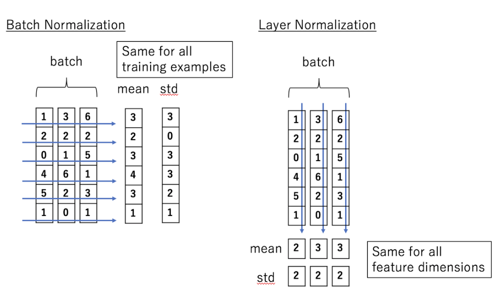

다시 확인하자면, 배치 정규화는 배치 차원에서 input feature 를 정규화 하는 것이며, 계층 정규화(layer normalization)는 feature 에 대해 input 을 정규화 하는 것이다.

<small>_[paper for layer normalization](https://arxiv.org/abs/1607.06450)_ << 논문을 참고해 보자</small>

## Instance Normalization

_instance normalization_ 은 _layer normalization_ 에서 한 걸음 더 나아간 것이다.  
쉽게 생각하면 이전에는 행/열 각각에 대해 정규화를 진행한 것이라면, 이번에는 행/열 __모두__ 에 대해 정규화를 진행한 것이다.

> 이는 이미지에 대해서만 가능한 정규화이고, _RNN_ 에서는 사용할 수 없다. _style transfer_ 에 있어서 배치 정규화를 대체해서 좋은 성능을 내는 것으로 보이며 _GAN_ 에서도 사용되었다고 한다.  

## Group Normalization

그룹 정규화(_group normalization_) 은 채널 그룹에 대한 평균 및 표준 편차를 계산한다.  
이는 _layer normalization_ 과 _instance normalization_ 의 조합인데, 모든 채널이 단일 그룹(G=C)이 된다면 _layer normalization_ 이 되고, 각 채널을 다른 그룹에 넣게 될 경우(G=1) _instance normalization_ 이 된다.  

그룹 정규화는 _ImageNet_ 에서 batch size 32 인 _batch normalization_ 의 성능에 근접하며, 더 작은 크기에서는 성능이 더 좋게 나타난다.  
또한, 높은 해상도의 이미지를 사용하여 물체를 감지(detection)하거나 분할(segmentation)하는 문제는 메모리 문제로 배치 크기를 늘리기 어려운데 이러한 문제에 대해 그룹 정규화는 매우 효과적인 정규화 방법이다.  

그룹 정규화가 _layer_ 또는 _instance_ 정규화에 비해 효과적인 이유는 다음과 같다.  
_layer normalization_ 의 가정은 평균을 계산할 때 모든 채널이 __동일하게 중요__ 하다는 것을 이용한다. 이는 항상 옳을 수 있는 것이 아니다. 이미지의 채널은 완전히 독립적일 수 없는데, 그룹 정규화는 다른 채널에 대해 다른 activation 통계를 계산할 때 모델에 필요한 유연성(flexibility)을 줄 수 있다. 이렇게 다른(근처) 채널의 통계를 이용할 수 있는 것이 바로 그룹 정규화의 이점이 된다.  

<small>_[paper for group normalization](https://arxiv.org/abs/1803.08494)_ << 논문을 참고해 보자</small>

각 정규화를 간단하게 시각화 하면 다음과 같다.

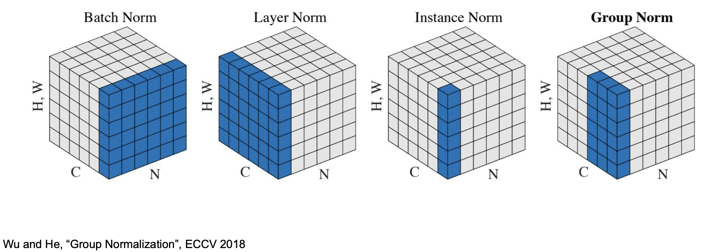  

> 위의 그림에서 이미지의 resolution 은 H,W 로 하나의 차원으로 표현되었으며, C 는 channel axis(채널의 개수), N 은 batch axis(배치의 개수) 이다.

---

## Summary

이번 강의에서 학습한 것을 간단히 요약하면 다음과 같다.

- Activation Function(default : ReLU)
- Data Preprocessing(for image : centered(subtract mean))
- Weight Initialization(Xavier/He init)
- Batch Normalization(권장함)

> 이 포스트는 스탠포드의 [cs231n](http://cs231n.stanford.edu) 강의를 보고 공부한 포스트입니다.  
> 잘못된 것이 있을 수 있습니다.  
> 댓글로 알려주시면 감사합니다!  
