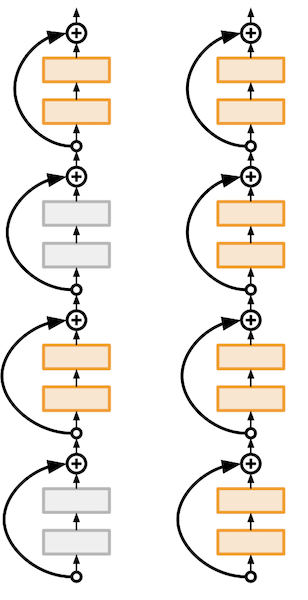

<small>최종 수정일 : 2019-10-14</small>

지난 시간, 우리는 활성 함수를 비롯해 초기화, 정규화 등에 대해서 학습하였다.  

_Neural Network_ 이려면 적당한 _activation function_ 이 필요하며 이것의 부재는 결국 linear function 이 될 뿐이다.  

계속해서 _Neural Net_ 을 학습하는데 필요한 것들을 살펴보자.  

## Optimization

이제 우리는 최적화(_Optimization_) 알고리즘에 대해 살펴볼 것이다.  
무엇을 최적화하는 것일까? 답을 찾아가는 과정이라고 생각하면 편할 것 같다.  

### SGD

이미 우리는 간단하게 _Stochastic Gradient Descent_ 를 학습했다.  
_SGD_ 는 _full GD(gradient descent)_ 를 하기에 힘든 경우, 하나만 보아서 그 속도를 높이는 방법이었다.  
이는 코드로 작성하기도 굉장히 쉽다.  

```python
# Vanilla Gradient Descent
while True:
    weights_grad = evaluate_gradient(loss_fun, data, weigths)
    weights += - step_size * weights_grad # perform parameter update
```


이러한 _SGD_ 로는 다음과 같은 하얀색 방향을 찾을 수 있고 우리는 여기서 가장 붉은 부분을 찾아 내려가고 싶은 것이다. 그림의 파란선처럼 따라가게 되면 적당할 것으로 보인다.

그러나 실제로 _SGD_ 가 저렇게 부드럽게 답을 찾아가는 것은 어렵다.  
다음의 예를 생각해보자.  
좌우로는 gradient 의 변화가 적으나 위아래로는 gradient 의 변화가 크다면? 즉, 한쪽 방향으로만 굉장히 sensitive 한 경우 어떻게 될 것인가?  


이와 같은 과정을 거치며 optimizer 로 향할 것이다. 이는 _full GD_ 가 아니기에 충분히 일어날 수 있는 일이다.

> 수학적으로, Hessian 의 condition number 가 크다는 것을 의미한다. 이는 poor conditioned matrix 가 되는데, 간단하게 생각했을 때 좌우로 굉장히 긴 ellipsoid 가 이러한 Hessian matrix 를 가지게 된다.  

저런 식의 진행은 굉장히 오랜 시간이 걸리는 작업이 된다. -> 좋지 못함!  

또는 __local minima__ 와 __saddle point__ 에서도 문제점을 확인할 수 있다.  

  

위와 같은 상태인데, 각각 _gradient = 0_ 이 되기 때문에 멈춰버리게된다.  
_saddle point_ 가 아니더라도 0에 굉장히 가깝다면 매우 느려지는 문제도 있다.  
이는 사실 _SGD_ 가 아닌 _GD_ 에서도 충분히 일어날 수 있는 문제이다.  
예시의 2차원이 아닌 다차원 공간에 이러한 지점이 얼마나 많을지 생각해보라!  

그리고 _SGD_ 는 그 방향이 최적화된 방향이 아니기에 실은 아래와 같이 움직이는게 더 일반적이다.  


### Momentum

이러한 문제는 사실 간단하게 해결할 수 있는데, 바로 __관성(Momentum)__을 이용하는 것이다!  
_SGD_ : $x_{t+1} = x_t - \alpha \nabla f(x_t)$  
에서 _속도(velocity)_ 를 이용한 관성을 추가해주면 다음과 같다.  
_SGD + Momentum_ :  

$$
\begin{aligned}
v_{t+1} &= \rho v_t + \nabla f(x_t) \\
x_{t+1} &= x_t - \alpha v_{t+1}
\end{aligned}
$$

```python
vx = 0
while True:
    dx = compute_gradient(x)
    vx = rho * vx + dx
    x -= learning_rate * vx
```

여기서 $\rho$ 가 _friction_ 으로 사용되게 되는데, 0.9 또는 0.99로 보통 값을 설정한다.  

이를 적용하면 조금은 부드러운 움직임을 보이게 된다.  


### Nesterov Momentum


이렇게 관성을 이용해 actual step 을 정하는 방법에서 더 나아가 _Nesterov Momentum_ 은 다음과 같이 다음 스텝을 정한다.  


이 _look ahead_ 라 불리는 방법은 관성을 줬을 때의 지점(point) 에서의 _gradient_ 를 계산해 이를 다음 step 으로 설정하는데 이용하는 것이다.  

이는 current point 에서 _gradient_ 를 이용해 다음으로 나아가는 방식을 깬 기법이다.  
수학적으로는 아래와 같이 표현할 수 있다.

$$
\begin{aligned}
v_{t+1} &= \rho v_t - \alpha \nabla f(x_t + \rho v_t) \\
x_{t+1} &= x_t + v_{t+1}
\end{aligned}
$$

그러나 우리는 current point 에서의 계산을 선호하므로 식을 조금 변형($\tilde{x}_t = x_t + \rho v_t$)하면 다음과 같이 쓸 수 있다.  


$$
\begin{aligned}
v_{t+1} &= \rho v_t - \alpha \nabla f(\tilde{x}) \\

\tilde{x}_{t+1} &= \tilde{x}_t - \rho v_t + (1 + \rho) v_{t+1} \\
&= \tilde{x}_t + v_{t+1} + \rho(v_{t+1} - v_t)
\end{aligned}
$$

```python
dx = compute_gradient(x)
old_v = v
v = rho * v - learning_rate * dx
x += -rho * old_v + (1 + rho) * v
```

이는 _SGD + Momentum_ 보다 더 부드러운 곡선을 그리며 진행하게 된다.  

> 굉장히 sharp 한 minima 같은 것이 존재해 거기에 빠져버리게 된다면 어떡하는가?  
> 물론 그럴 수도 있으나 data 를 충분히 모으게 되면 그런 sharp 한 minima 는 사라질 수 있다. 이러한 경우 이는 noise 인 셈이므로 bad minima 이다.  

### AdaGrad

이렇게 관성을 이용하면 _local minima_ 와 _saddle point_ 를 빠져나올 수 있고 부드럽게 움직이는게 가능하다. 이를 가능하게 하는 이유는 momentum 은 느린 부분이 모이면 가속되게 하고, 빠르게 진동하는 부분은 상쇄하는 효과를 가지기 때문이다.  

그렇다면 계속 가속되는 경우는 어떻게 대처해야 할까?  

그래서 우리는 관성 대신 `grad_squared` 라는 개념을 도입했다.  
이는 _adaptive learning rate_ 라고도 불리운다.  

```python
gard_squared = 0
while True:
    dx = compute_gradient(x)
    grad_squared += dx * dx
    x -= lerarning_rate * dx / (np.sqrt(grad_sqaured) + 1e-7)
```

이 `grad_squared` 를 도입하게 되면 무슨 변화가 있는 것일까?  
이는 진행 과정에 있어서 가파른 구간 _(steep)_ 에서는 상쇄하는 효과를 가져오며, 평평한 구간 _(flat)_ 에서는 가속하는 효과를 가져온다!  

그러나 시간이 지남에 따라 0으로 작아지게 되는 문제점이 있어서 _saddle point_ 나 그러한 구간이 길어지면 진행이 멈춰버리게 된다.  

여기서 `1e-7` 을 더하는 이유는 0으로 나누어지는 경우를 방지하기 위함이다. 검증된 수치는 아니나 충분히 작은 숫자이기에 현실적으로 잘 작동한다.  

### RMSProp

_RMSProp_ 은 _Leaky AdaGrad_ 이다.  
`grad_squared` 부분에 `decay_rate` 라는 개념을 도입했다.

```python
gard_squared = 0
while True:
    dx = compute_gradient(x)
    grad_squared = decay_rate * grad_squared + (1 - decay_rate) * dx * dx
    x -= lerarning_rate * dx / (np.sqrt(grad_sqaured) + 1e-7)
```

여기서 `decay_rate` = 0.9 또는 0.99 가 보편적이다.

이를 통해 조금 더 최적화한 움직임을 확인할 수 있다.

### Adam

우리는 관성과 _decay rate_ 에 대해 알아보았다.  
두 개를 같이 쓰면 더 좋은 결과가 있지 않을까?

다음은 관성과 _decay rate_ 를 사용하는 Adam 의 코드이다.

```python
first_moment = 0
second_moment = 0
while True:
    dx = compute_gradient(x)
    first_moment = beta1 * first_moment + (1 - beta1) * dx              # Momentum
    second_moment = beta2 * second_moment + (1 - beta2) * dx * dx       # AdaGrad / RMSProp
    x -= learning_rate * first_moment / (np,sqrt(second_moment) + 1e-7) # AdaGrad / RMSProp
```

첫 번째 step 에서 어떤 일이 있을까?  
second_moment 가 0에 가까울 것이다. 왜냐하면 어차피 0에 가까운 수를 곱하는 결과 이기 때문이다.  
이거를 해결하기 위해서는 아주 큰 step 을 이용해야하는데 이는 초기화를 굉장히 생각할 수 없는 방향으로 하는 것이라 좋은 결과를 가져올 수도 있으나 보통 이상한데로 가버려서 돌아오지 못하게 될 수 있다.  

__Adam__ 은 위와 같이 관성과 _decay rate_ 와 더불어 _bias correction_ 도 해주게 된다. 따라서 완전한 코드는 다음과 같다.

```python
first_moment = 0
second_moment = 0
for t in range(1, num_iterations):
    dx = compute_gradient(x)
    first_moment = beta1 * first_moment + (1 - beta1) * dx
    second_moment = beta2 * second_moment + (1 - beta2) * dx * dx
    first_unbias = first_moment / (1 - beta1 ** t) # bias correction
    second_unbias = second_moment / (1 - beta2 ** t) # bias correction
    x -= learning_rate * first_unbias / (np.sqrt(second_unbias) + 1e-7)
```

이러한 _bias correction_ 을 하는 이유는 first 와 second moment 가 0 에서 시작한다는 가정 때문이다.

beta1 = 0.9, beta2 = 0.999, learning_rate = 1e-3 또는 5e-4 의 _hyperparameter_ 를 이용하는 _Adam_ 은 굉장히 좋은 알고리즘이다. 대부분의 문제에 대해서 괜찮은 성능을 나타내는 것으로 알려져 있다.  
따라서 위의 설정으로 해본 후 다른 알고리즘을 try out 해보자.  

---

지금까지 배운 모든 알고리즘은 __learning rate__ 를 _hyperparameter_ 로 가지고 있다. 그렇다면 어떤 learning rate 가 가장 적당할까?


사실 다 괜찮다! 처음에 큰 learning rate 로 시작했다가 서서히 decay 시켜가며 확인해보는 것이 좋은 진행 과정이 될 것이다.

### Learning Rate Decay

learning rate decay 는 다양한 방법이 있을 수 있다. 진행 과정에서 learning rate 를 낮춰보는 다양한 방법을 살펴보자.


위의 방법은 0.1 만큼 곱해서 _learning rate_ 를 줄이는 _ResNet_ 의 예제이다. 30, 60, 90 epoch 에서 줄이는 것을 확인할 수 있다.  


다음과 같이 코사인 함수를 이용한 decay 방법도 존재한다.  

$\alpha_t = {1 \over 2}\alpha_0 \left( 1 + \cos\left(t\pi / T \right) \right)$  

이를 적용하여 loss 보면 다음과 같다.


선형 함수로도 learning rate 를 decay 해 볼 수 있다.


$\alpha_t = \alpha_0(1 - t / T)$ 로 표현되는 방식이다.


$\alpha_t = \alpha_0 / \sqrt{t}$ 인 inverse sqrt 를 이용하는 방식도 있다.  


초기에 learning rate 가 높으면 loss explode 를 일으킬 수 있기에 첫 5000번의 iteration 에서 linear 하게 learning rate 를 증가시킨 다음 서서히 낮추면 그러한 문제점을 방지할 수 있다.  

> 이처럼 다양한 learning rate decay 를 수행할 수 있다. 이 부분은 상당히 최근의 연구된 것들이라 관련 논문들에 대해 조금 더 찾아볼 필요가 있다.  

### First & Second-Order Optimization

지금까지 알아본 최적화 알고리즘들은 모두 _first-order Optimization_ 이다.  
이는 _linear approximation(선형 근사)_ 을 이용해 다음 스텝으로 나아가는 방식이다.  


이처럼 current point 에서 접선의 방정식을 구해 _gradient_ 를 얻고, approximation 이 최소가 되도록 스텝을 내딛는 것이다.  
그림을 보아도 그 갭이 꽤 있다는 사실을 금방 확인할 수 있는데, 그렇다면 _second-order Optimization_ 은 어떨까?


_second-order optimization(이차 근사)_ 는 approximation 을 일차 함수가 아닌 이차 함수로 하는 것이다.  
이는 gradient 와 __Hessian__ 을 사용해 _quadratic approximation_ 을 하고 최소값의 지점을 다음 스텝으로 하게 된다.  
이 때, 일차 근사와는 다르게 step size 가 없다는 사실을 확인할 수 있는데 이차 근사에서는 ___항상 최소값___ 으로 가면 된다.

이는 Tayolr expansion 을 이용해 수식으로 표현할 수 있다.

$$
J(\theta) \approx J(\theta_0) + \left( \theta - \theta_0 \right)^T \nabla_\theta J(\theta_0) + {1 \over 2}(\theta - \theta_0)^TH(\theta - \theta_0)
$$

이를 정리해서 풀어내면 _Hessian_ 의 역행렬로 다음 스텝을 구할 수 있게 된다.

$$
\theta^* = \theta_0 - H^{-1}\nabla_\theta J(\theta_0)
$$

이러한 _second-order Optimization_ 은 수렴 속도가 상당히 빠른데 deep learning 에서 이러한 테크닉은 잘 쓰이기 어렵다.  
_Hessian_ 은 $O(N^2)$의 시간 복잡도를 가지고 그 역행렬은 $O(N^3)$ 이기 때문에 N 이 큰 deep learning 에서는 너무나도 계산이 오래 걸리게 되기 때문이다.  

이를 보완하기 위해 _Quasi-Newton methods(__BFGS__)_ 라던가, ___L-BFGS___(Limited memory BFGS) 등도 있으나 여전히 큰 메모리이거나 메모리에 저장이 안되어서 힘들다.  

_L-BFGS_ 의 경우 full batch 에서는 잘 작동하기는 하나 mini-batch 에서는 아직 연구 중에 있다.  

<small>Convex Optimization 에서 조금 더 자세히 다뤄보자...</small>

현실적으로 우리는 ___Adam___ 이 좋은 선택지가 되며, _SGD + Momentum_ 도 learning rate 와 schedule 을 잘 설정하면 더 좋은 결과를 얻을 수 있을 것이다.

---

우리는 지금까지 최적화 알고리즘과 그 동작에 대해 배웠고, 이를 통해 loss 가 줄어드는 방향을 어떻게 찾아가는지 학습했다.


그러나 실제로 test 시에 정확도를 높이기 위해서는 어떤 방법을 사용해야할까?  
training set 에 대한 정확도 보다는 _unseen data_ 에서 좋은 성능을 원하는 우리가 할 수 있는 방법은 무엇이 있을까?  

최적화 알고리즘을 잘 설정한다면 loss 는 줄어드는 경향을 보일 것이다.  
그러나 정확도는 조금 다른 양상을 보일 수 있다.


이처럼 iteration(epoch)이 반복될 수록 test 시에 validation set 에 대한 성능이 낮아지는 경우가 있을 수 있다. 이러한 경우 learning 을 멈춰야 한다.(설령 training 에서 계속 올라가고 있다고 해도!)  
training 시간이 오래 걸리는 경우에도 항상 _model snapshot_ 을 통해 _val_ 에서 잘 작동하고 있는지 추적해줘야 한다.  

### Ensemble

모델의 정확도를 높여 좀 더 높은 성능을 얻기 위해서 시도해 볼 수 있는 방법 중 아주 간단하면서도 신기한 방법이 있다.  
바로 앙상블(_Ensemble_)이다.  
이 기법은 각각의 모델들을 학습시킨 후 그 결과를 평균 내는 방법이다.  
따로 무엇인가를 해주지 않지만 보편적으로 2%의 성능향상을 가지고 온다.  

이는 overfitting 을 줄이고 performance 를 향상시키는 것으로 해석이 가능한데, 비록 급격한 성능의 향상은 없어도 일정 부분 성능 향상을 이끌 수 있는 방법이다.  

그러나 우리는 단일 모델에 대한 성능을 높이고도 싶을 것이다. 여기에도 앙상블을 이용해 성능의 향상을 가지고 올 수 있는데, 단일 모델에 대해 여러 _snapshot_ 을 training 과정에서 사용하는 것이다.  

[paper for snapshot ensemble](https://arxiv.org/abs/1704.00109) << 자세한 내용은 논문을 확인하자!


위 도식은 링크된 논문에서 소개된 snapshot ensemble 을 시각화한 것이다.  
이런 식으로 하나의 모델에 대한 앙상블을 적용해(+ 스케쥴) 성능 향상을 도모할 수도 있다.  

## Regularization(제약)

단일 모델의 성능을 조금 더 향상시킬 수 있는 방법이 무엇이 있을까? <small>여기서 성능을 높이는 것은 _unseen data_ 에 대한 성능을 높이는 것이다.</small>  
그에 대한 답변으로 __Regularization__ 기법이 있다.  

__regularization__ 은 이전에도 살펴보았듯이 loss 를 얻기 위해 term 을 추가하는 것이다.  
간략하게 기억을 되살려보면,

$$
L = {1 \over N} \sum_{i=1}^N \sum_{j\ne y_i} max\left(0, f\left(x_i;W \right)_j - f\left(x_i;W \right)y_i + 1\right) + \lambda R\left( W \right)
$$

에서 $\lambda R(W)$ 가 _regularization_ 이었고 보통 __L2 regularization__ 을 많이 쓴다.

어떤 제약을 주는지 살펴보자.

### Dropout


forward pass 에서 임의의 뉴런을 꺼버리는 것이 __dropout__ 이다.  
굉장히 단순한데 뉴런을 꺼버리는 확률을 _zero Probability_ 라고 하며 __0.5__ 를 많이 사용한다.  

```python
p = 0.5 # probability of keeping a unit active. higher = less dropout

def train_step(X):
    """ X contains the data """

    # forward pass for example 3-layer neural network
    H1 = np.maximum(0, np.dot(W1, X) + b1)
    U1 = np.random.rand(*H1.shape) < p # first dropout mask
    H1 *= U1 # drop!
    H2 = np.maximum(0, np.dot(W2, H1) + b2)
    U2 = np.random.rand(*H2.shape) < p # second dropout mask
    H2 *= U2 # drop!
    out = np.dot(W3, H2) + b3

    # backward pass: compute gradients... (not shown)
    # perform parameter update... (not shown)
```

이와 같이 매우 간결한 코드로 수행이 가능하다.  
이 때, backward pass 에서 drop 된 뉴런도 되어야 한다.  

문득 생각해보면 어떻게 이게 좋은 결과를 가지고 오게 되는지 이해가 안갈 수 있다.  
_Dropout_ 은 network 에 강제로 중복된 표현(redundant representation) 을 부여하고, feature 들의 공동 적응(co-adaptation)을 방지해주는 효과를 가진다.  

고양이 사진에 대한 학습을 예로 생각해 보자.  
귀와 꼬리에 대한 뉴런이 각각 있다가 귀에 대한 뉴런이 dropout 되면, 주로 꼬리를 보다가 귀도 보게끔 학습이 이루어 지는 식이다.  
이는 너무 특정한 feature 에 매몰되는 것을 막는 것인데, 모든 부분에 대한 학습을 시도할 경우 제대로 학습이 안될 수도 있고, noise 를 제거하는 효과로도 생각할 수 있다.  

또 다른 관점은 _dropout_ 과정이 모델에 대한 거대한 ensemble 과정이라는 것이다. 가중치를 공유하는 여러 모델들이라고 생각을 할 때, 여러 번의  dropout 으로 생성되는 모델들의 결과가 모여 더 좋은 성능을 보여준다는 의미이다.  

그런데 이러한 _dropout_ 은 output 도 랜덤하게 만들 수 있다.  
오늘 _고양이_ 라고 판별한 사진이 내일 돌려보니 _나무_ 라고 판별된다면 이 모델을 신뢰할 수 있을까?  

우리는 그래서 test-time 에 있어서 _"average out"_ 이 필요하다. 그리고 이는 수학적으로 표현하면 다음과 같이 할 수 있다.  

$$
\begin{aligned}
y &= f_W(x,z) \qquad \text{ y is output, z is random mask }\\
y &= f(x) = E_z\left[ f(x,z) \right] = \int p(z)f(x,z)dz
\end{aligned}
$$

그러나 학습 과정에서 적분을 수행할 수 있을까...? 쉬울까...?  

다행히 approximated 한 적분 결과값을 얻는 방법이 있다.


위와 같은 단일 뉴런을 생각하자.  
test-time 때 우리는 $E[a] = w_1x + w_2y$ 가 됨을 알 수 있는데,  
각각의 경우에 대해 모두 계산하면 다음과 같은 결과를 얻게 된다.  

training time :

$$
\begin{aligned}
E[a] &= w_1x + w_2y \\
&= {1 \over 4}(w_1x + w_2y) + {1 \over 4}(w_1x - 0y) + {1 \over 4}(0x + 0y) + {1 \over 4}(0x + w_2y) \\
&= {1\over 2}(w_1x + w_2y)
\end{aligned}
$$

즉, test-time 때 dropout probability 를 곱해주게 된다는 것이다.  
이 확률을 test-time 때 고정적으로 사용하게 되면 일정한 output 을 얻게 된다.

```python
def predict(X):
    # ensembled forward pass
    H1 = np.maximum(0, np.dot(W1, X) + b1) * p # NOTE: scale the activations
    H2 = np.maximum(0, np.dot(W2, H1) + b2) * p # NOTE: scale the activations
    out = np.dot(W3, H2) + b3
```

test-time 에는 모든 뉴런이 항상 active 되어야 한다. => scale the activations 를 해야 각 뉴런에 대해 _output at test time = expected output at training time_ 이 된다.

여기서 우리는 test-time 때 scale 을 해주고 있게 되는데, 이를 train 때 미리 scaling 을 해줄 수도 있다!  
이는 test time 에서 변화가 없게(unchanged) 하는 방법인데, 보통 training 때 GPU 를 사용하기에 이 정도 연산이 추가되는 것은 큰 차이가 없으나, test-time 에 있어서는 더 효율적(efficiency)이게 될 수 있기 때문이다.  

따라서 코드를 정리하면 다음과 같다.  

```python
p = 0.5 # probability of keeping a unit active. higher = less dropout

def train_step(X):
    """ X contains the data """

    # forward pass for example 3-layer neural network
    H1 = np.maximum(0, np.dot(W1, X) + b1)
    U1 = (np.random.rand(*H1.shape) < p) / p # first dropout mask. Notice /p!
    H1 *= U1 # drop!
    H2 = np.maximum(0, np.dot(W2, H1) + b2)
    U2 = (np.random.rand(*H2.shape) < p) / p # second dropout mask. Notice /p!
    H2 *= U2 # drop!
    out = np.dot(W3, H2) + b3

    # backward pass: compute gradients... (not shown)
    # perform parameter update... (not shown)

def predict(X):
    # ensembled forward pass
    H1 = np.maximum(0, np.dot(W1, X) + b1) # no scaling neccesary
    H2 = np.maximum(0, np.dot(W2, H1) + b2)
    out = np.dot(W3, H2) + b3
```

이와 같이 _regularization_ 을 적용하는 것은 training 과 test 에서 차이가 조금 있는데, _Batch Normalization_ 의 경우도 살펴보자.  
training 시에 랜덤 미니배치에 대해 통계적으로 정규화를 시키고 testing 시에 noramlised 된 값을 고정적으로 사용만 할 뿐이다.  

### Data Augmentation

_Regularization_ 에서 또 다른 기법인 _data augmentation_ 에 대해 알아보자.  
이 기법은 이미 가지고 있는 데이터셋(라벨링이 되어있음)에서 데이터들에 변형을 가해서 데이터셋을 늘리는 방식이다.  
이 때, 변형된 이미지는 이미 라벨링된 데이터이므로 손쉽게 dataset 을 늘릴 수 있게 된다.(지도학습에 있어서 유리)

즉 이미지를 transform(변형) 하게 되는데, 다음과 같은 변형 방식이 있다.

- 좌우 대칭(horizontal flip)  
    
- random crop and scale  
      
    ResNet 에서는 다음과 같이 적용한다.  
    Training : 랜덤 crop/scale 샘플을 만든다.  
    1. Random L(256~480) 을 정한다.  
    2. image 의 짧은 쪽 길이를 L 로 재조정한다.  
    3. random 한 224*224 patch 를 샘플링한다.  
  
    Test : crop 된 set의 평균을 낸다.  
    1. 이미지를 (224, 256, 384, 480, 640)의 크기를 갖게 한다.
    2. 각 사이즈에 대해 10개의 224*224 crop 을 적용한다.(4 corner + center & + flip)
- Color Jitter
    
    이미지에 랜덤한 색대비(contrast)나 밝기(brightness) 조정을 준다.  
    RGB에 PCA 를 이용하는 방법도 있으나 흔히 쓰이지는 않는다.  
- 그 외 여러 가지 방법(translation, rotation, strecthing, shearing, lens distortions, ...)이 있을 수 있다.

위에서 본 것들을 정리하면, 일반적으로 training 시에 random noise 를 부여하고 testing 때 noise 에 대한 marginalize 를 진행하게 된다.

### DropConnect

_dropout_ 이 뉴런을 꺼버리는 것이었다면, _drop connect_ 는 뉴런 간의 연결을 끝는 것이다. 즉 가중치(weight)=0 으로 하는 작업이 되겠다.  


testing 때는 모든 연결이 활성화된다.

### Fractional Max Pooling

이 방법은 pooling 을 응용한 것인데 일정한 pooling size 를 갖는 것이 아닌 _randomized pooling region_ 을 fractional 하게 진행하는 것이다.  
굉장히 cool 한 방법이지만 많이 사용되지는 않는다.  


testing 때는 몇몇 영역에 대해 평균 예측값을 이용한다.

### Stochastic Depth

_stochastic depth_ 는 depth 에 대해 한 번에 여러 번 내려갈 수 있도록 하는 방식이다.(skip some layers)



testing 때는 모든 레이어를 사용한다.

### Cutout

이미지의 일부 영역을 가려버리는 방식이다. (일부 영역의 값을 0으로 처리)  


testing 때는 원본 이미지를 사용한다.  

### Mixup

두 개 이상의 이미지를 겹쳐서 학습시키는 방법이다. 이 때 target label 은 각각의 이미지가 합성된 비율이 된다.(그림에서는 cat:0.4, dog:0.6)


testing 때는 원본 이미지를 사용한다.

---

이처럼 _regularization_ 은 학습 때와 평가할 때의 방법이 다르다는 것을 알고 가자.  
위에서 소개한 _regularization_ 기법들은 각각 의미가 있지만 보통은 ___Batch Normalization___ 을 우선 적용하고 부족해 보이면 적용을 하게 된다.  

몇 가지 팁을 더 주자면, 거대한 _FC layer_ 에는 _dropout_ 을 적용하는 것이 좋으며, _data augmentation_ 은 배치 정규화와 마찬가지로 거의 모든 경우에 좋다.  
_cutout_ 과 _mixup_ 은 작은 분류 데이터셋(classification dataset)에 대해 적용해보면 좋다.

## Choosing Hyperparameters

우리는 최적화 알고리즘을 학습하면서 몇몇 설정해야하는 __hyperparameter__ 를 보았다.  
이 __hyperparameter__ 들은 굉장히 중요한 요소인데, 이를 어떻게 초기화하고 진행 과정에서 적절히 처리해주느냐에 따라 모델의 성능에 지대한 영향을 미친다.  

그러나 우리는 보통 __hyperparameter__ 의 값을 어떻게 설정해주어야하는지 정보가 없다.  
이는 많은 부분에 있어서 heuristic 에 의존하게 되는데, 조금이라도 체계적으로 접근해본다면 아래와 같다.

### Step 1. initial loss 확인

우리는 위에서 _weight decay_ 개념을 학습했다. 그러나 처음에는 이것을 사용하지 않고 __sanity check__ 를 통해 초기의 loss 가 이론적인 값과 일치하는지 확인해야한다.  

예 : _Softmax_ 에서 C개의 클래스를 분류하게 된다면 log(C) 가 나와야 함.

### Step 2. 작은 샘플에 대해 overfit

5~10 정도의 미니배치로 크기가 작은 데이터셋에 대해 100%의 train accuracy 가 나오게끔 학습을 시킨다. 이 부분에서 구조(architecture), _learning rate_, _weight_ 의 값에 대한 여러 시도가 필요하다.  

이러한 시도 중 loss 가 작아지지 않는다면 _learning rate_ 가 너무 낮게 초기화 된 것이다.  
python 같은 언어를 사용할 때 NaN(또는 Inf 등) 의 수치는 loss explode 가 일어난 것이다. learning rate 가 너무 높게 초기화 되었으니 줄여야한다.  

### Step 3. loss 가 작아지도록 하는 learning rate 찾기

이전 스텝에서 찾은 구조를 이용해 모든 training data 에 대해 학습을 진행해본다. 이 때 _weight decay_ 도 약간 사용하며, 100 회의 반복(iteration)적인 진행 과정 안에 loss 가 눈에 띄게 작아지는 learning rate 를 추려낸다.  

실험적으로 learning rate는 1e-1, 1e-2, 1e-3, 1e-4 가 괜찮은 것으로 알려져있다.

### Step 4. 1~5 epoch 정도에서 Coarse grid(엉성하게 몇 번 해보기)

위에서 찾은 몇몇 _learning rate_ 와 _weight decay_ 를 몇몇 모델에 대해 1~5 의 epoch 정도를 학습시킨다.

실험적으로 _weight decay_ 는 1e-4, 1e-5, 0 이 괜찮은 것으로 알려져있다.

### Step 5. grid 를 다듬고 조금 더 학습시키기(시각화)

이전 스텝에서 가장 괜찮은 모델에 대해 조금 더 길게(10~20 epoch)학습을 시켜본다. 이 때 l_earning rate decay_ 는 사용하지 않는다.

### Step 6. loss 의 변화를 확인

학습 과정을 시각화하여 진행이 어떻게 되어가는지 추적해야한다.  
이 과정에서 loss 를 좌표평면에 찍으면 noise 가 많이 발생할 것이기에 평균의 그래프를 그려서 시각화하는 것이 해석에 용이하다.  

loss 가 감소하다가 어느 수준에서 평평한 그래프의 개형(plateau)을 띄게 된다면 _learning rate decay_ 가 필요하다고 생각할 수 있다.  
그러나 loss 가 여전히 감소하고 있을 때 _learning rate decay_ 를 적용한다면 멈춰버릴 수도 있다. 너무 빨리 decay 시키면 좋지 않다.  

학습에는 오랜 시간이 걸릴 수 있기에 accuracy 가 올라가는 추세를 보이면 조금 더 학습할 수 있게 기다려야 한다.  
그러나 train / val 의 정확도 차이가 크거나 벌어지고 있다면 이는 _overfitting_ 되고 있다는 뜻이다. 데이터를 더 모으고, _regularization_ 을 적용해 모델이 조금 더 일반적일 수 있도록 하자.

train / val 모두 비슷한 정확도를 가지나 정확도 자체가 높지 않다면 이는 _underfitting_ 된 것이다. 학습을 오래 시켜 보거나 bigger model 을 사용해보자.  

### Step 7. step 5로 돌아가서 반복

위와 같은 과정을 반복해 적절한 _hyperparameter_ 들을 찾을 수 있다.  
이 때 하이퍼파라미터들을 처음 찾을 때 다음과 같이 두 가지 방법이 있다.  


두 방법 중 좋은 탐색 방법은 무엇일까?  
_grid_ 보다 _random_ 이 더 좋은데, _grid_ 를 왼쪽처럼 설정하게 된다면 최적의 공간을 탐색하지 못해버릴 수 있다.(그리드 위의 그래프의 고점 탐색 불가능)  
물론 그리드를 잘 짠다면 괜찮지만 현실적으로 그러기는 쉽지 않다는 사실을 생각하자.  

추가적으로 weight update / weight magnitude 를 추적하는 것은 도움이 된다.

```python
# assume parameter vector W and its gradient vector dW
param_scale = np.linalg.norm(W.ravel())
update = -learning_rate*dW # simple SGD update
update_scale = np.linalg.norm(update.ravel())
W += update # the actual update
print update_scale / param_scale # want ~1e-3
```

업데이트와 값 사이의 비율을 추적하는 것인데 실험적으로 0.001(1e-3) 정도면 좋다고 한다.

---

이번 강의를 정리하면 training error 를 잡기 위해서는 _optimizer_ 와 _learning rate schedule_ 이 필요하며,  
test error 를 잡기 위해서는 _regularization_ 을 이용하고 _hyperparmeter_ 를 적절히 선택함으로써 실현 가능하다.

> 이 포스트는 스탠포드의 [cs231n](http://cs231n.stanford.edu) 8강 강의를 보고 공부 및 정리한 포스트입니다.  
> 잘못된 것이 있을 수 있습니다.  
> 댓글로 알려주시면 감사합니다!  
