<small>최종 수정일 : 2019-10-15</small>

우리는 이전 두 개의 강의(를 정리한 [포스트1](../cs231n-Training-Neural-Networks-Part-1/), [포스트2](../cs231n-Training-Neural-Networks-Part-2/))에서 Neural Network 를 학습시키는 방법과 그 과정에 대해서 학습했었다.  

여기서 한 가지 더 NN 을 학습시키는 방법이 있는데, 바로 __Transfer Learning__ 이다.  

## Transfer Learning

전이 학습(_Transfer Learning_)은 쉽게 생각해서 다음과 같다.  
이전에 학습한 결과를 이용해 새로운 모델(또는 데이터셋)에 적용하는 방법이다.  

개인이 Neural Network 를 학습시킨다고 하자. Neural Network 는 학습을 위한 연산량이 아주 많은데 이를 개인의 컴퓨팅 리소스로 감당하기에는 쉽지 않은 일이다.  

이를 극복하기 위해 이미 학습된 것을 바탕으로 다른 개별 문제에 적합하게 일부(끝 부분 이라던가)만 다시 학습시키는 방법이 바로 전이 학습이다.  

이는 내가 풀고자 하는 문제의 dataset 이 적을 경우 좋은 학습 방법이며, 다음과 같이 경우를 나눠서 생각해 볼 수 있다.

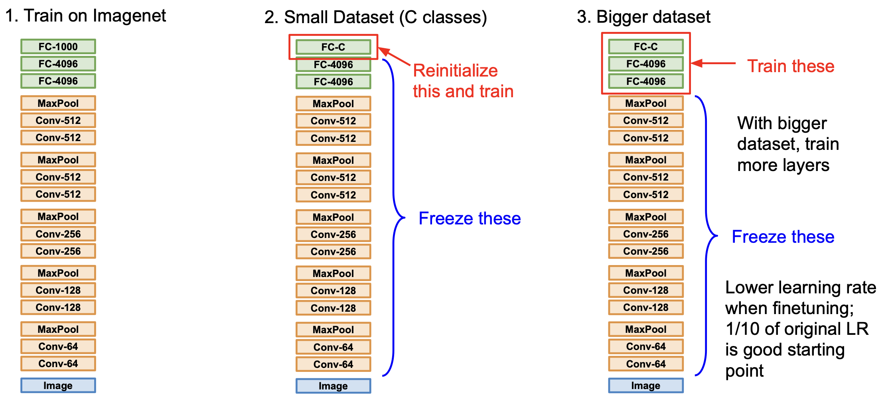

각 경우에 대해 표로 정리해보면 아래와 같이 정리된다.  

||비슷한 데이터셋|다른 데이터셋|
|:---:|:---:|:---:|
|적은 데이터|Linear Classifier를 top layer 에 적용|적용하기 힘들다. linear classifier 를 다른 stage 에서 시도해 보거나 해야한다.|
|꽤 많은 데이터|몇몇 layer 에 finetuning|많은 레이어에 finetuning|

보통 ImageNet 으로 학습된 것을 이용하는데 ImageNet 은 1500만 장 이상의 데이터가 이미 축적된 아주 거대한 데이터셋이다.  

이러한 기법은 아주 권장되며 널리 사용되고 있는데, 처음부터 모든 것을 training 시키는 것은 힘들기만 할 뿐 아니라 시간적인 측면에서 비효율적이다.

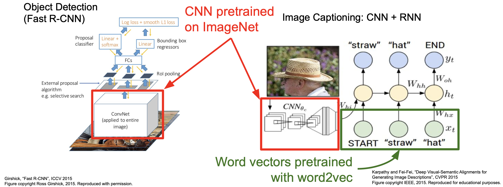

위의 그림은 ImageNet 과 word2vec 으로 pretrained 된 것을 이용한 방법이다.

그러나 _transfer learning_ 이 항상 필요한 것은 아니라는 내용의 연구 결과도 발표([관련 논문](https://arxiv.org/abs/1811.08883))되었는데, 여전히 작은 데이터셋에 대해서는 효과적인 기법이 되겠다.

## CNN Architecture

이제 다양한 CNN 의 구조에 대해서 살펴볼 것이다.  

우선 LeCun 이 1998년에 발표한 LeNet-5 를 잠깐 상기하고 넘어가보자.  

5*5 Conv filter 를 이용한 _LeNet-5_ 는 필기체 인식에 있어서 좋은 성능을 냈었다.  
그 구조는 CONV-POOL-CONV-POOL-FC-FC 를 가지고 있었다.  

### AlexNet

처음 살펴볼 _AlexNet_ 은 CNN 으로 눈에 띌 만한 성과(대회에서 1등)를 낸 첫 CNN 이다.  
구조적으로 _LeNet-5_ 와 비슷하나 조금 더 많은 layer 를 가진다는 차이가 있다.  

위의 도식은 _AlexNet_ 의 실제 구현 구조이다.  
각 레이어와 레이어에서 처리되는 과정을 간략히 표현하면 다음과 같다.  

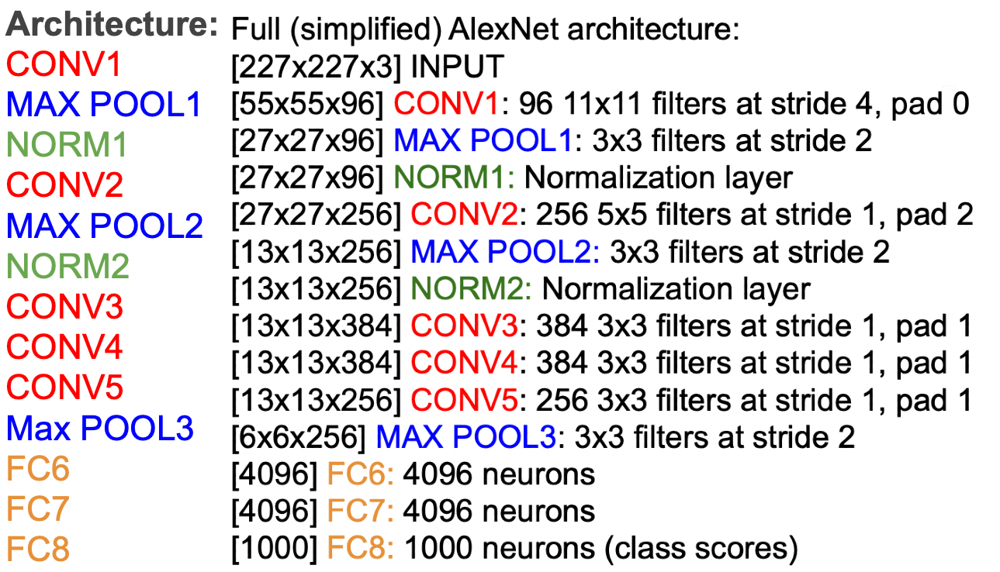

몇 가지 확인을 위해 질문에 답을 해보자.

1. 첫 번째 layer(CONV1) 를 거쳤을 때의 output volume?  
    > stride 가 4이기 때문에 한 쪽(width 또는 height)에 적용되는 filter 는 ${227-11 \over 4} + 1 = 55$ 가 된다. 따라서 $55 \times 55 \times 96$ 이 된다.(총 96개의 필터를 적용)
2. 첫 번째 layer(CONV1) 의 전체 parameter 의 수는?  
    > 필터의 크기가 $11 \times 11$ 이므로 채널(depth)이 3임에 주의하면 답은 총 $(11\times11\times3)\times96$ 임을 알 수 있다.
3. 두 번째 layer(POOL1) 을 거쳤을 때의 output volume?  
    > 1의 문제와 동일하게 접근하면 $27\times27\times96$ 임을 알 수 있다.(depth = 96)
4. 두 번째 layer(POOL1) 의 전체 parameter 의 수는?
    > 이 질문을 받았을 때, "이게 뭔 소리야?" 했다면 정상이다. pooling layer 는 해당 영역을 그냥 보고 선택하게 되기 때문에 학습을 기다리는 parameter 가 없다. 즉, __0__이다.

_AlexNet_ 은 다음과 같은 특징을 가진다.  

- 처음으로 _ReLU_ 를 도입했다.
- Norm layer 를 사용했다.(이제는 쓰지 않음)
- data augmentation 을 많이 사용했다.(논문 확인)
- dropout 을 도입했으며 0.5의 값을 사용
- batch size = 128
- _SGD + Momentum_ 을 최적화 알고리즘으로 사용했으며, momentum = 0.9
- learning rate = 1e-2 로 초기화 했으며 val accuracy 가 평탄해지는 구간에 수동적으로(manually) 10만큼 나눠줬다.
- L2 weight decay 를 적용했으며, 5e-4 로 사용했다.
- 최종 결과에서 좋은 결과를 얻기 위해 7개의 CNN 모델을 앙상블 시켜서 18.2% -> 15.4% 의 성능 향상을 보였다.

여기서 도식과 구조를 보면 조금 다른 점을 알 수 있는데,  

1. 구조는 227\*227 이나 도식에서는 224\*224 이다. 이는 227 이 맞는 수치이다.
2. 도식에서 layer 가 2개로 분할이 되어서 진행이 되는데, 이는 당시 GPU 의 성능이 좋지 못해서(GTX 580, 3gb mem) 두 부분으로 나눠서 각각 GPU 를 하나씩 사용해서 학습할 수 있도록 하였기 때문이다.

2번에 대한 부연 설명을 조금 더 하자면 CONV1, CONV2, CONV4, CONV5 는 동일한 GPU 의 feature map 과 연결이 되어 있다.  
그러나 CONV3, FC6, FC7, FC8 은 바로 전 단계의 모든 feature map 과 연결(즉 2개로 분할된 각각의 레이어와 모두 communication)하여 진행했다.  

이러한 구조의 _AlexNet_ 은 ILSVRC(ImageNet Large Scale Visual Recognition Challenge)에서 CNN 구조를 가진 모델 중 처음으로 우승하게 되었고, 이미지 인식 분야에서 CNN 의 시대가 오게 됨을 알리게 되었다.  
이 _AlexNet_ 의 연구 성과에 힘입어 매년 이미지 인식 모델의 성능은 눈에 띄게 발전하게 된다.

이듬해 _AlexNet_ 을 조금 더 최적화한 _ZFNet_ 이 발표되는데,  
CONV1 : 11\*11 stride 4 -> 7\*7 stride 2  
CONV3,4,5 : 384, 384, 256개의 필터 -> 512, 1024, 512개의 필터  
로 변경된 모델이었다.

### VGG

_AlexNet_ 의 연구 성과를 바탕으로 2년 뒤, _VGGNet_ 이 발표된다. 이 모델은 ILSVRC 2014 에서 2위를 차지<small>(localization에서는 우승)</small>한 모델이다.  

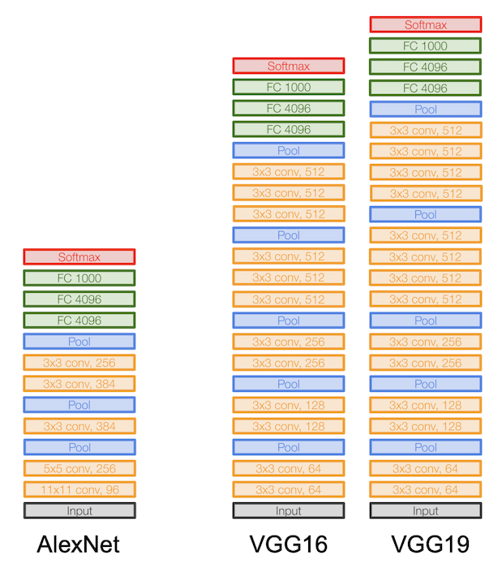

기존의 _AlexNet_ 보다 더 깊어진 network 를 구성하며, 더 작은 필터를 사용하는 것이 주요 골자이다.  

특히 모든 CONV layer 에서 $3\times3$ stride 1, pad 1 을 유지하는 점과,  
MAX POOL 에서 $2\times2$ stride 2 로 유지하는 통일성을 보인다.  

즉 더 심플하면서도 성능은 더 좋은 결과를 보이는 모델이다.  
이는 11.7% 를 기록한 _ZFNet_ (2013) 에서 7.3% 의 성능을 보여준다.  

여기서 우리는 __"왜 더 작은 필터를 쓰는가?"__ 에 대한 의문이 들 수 있다.  
중요한 통찰을 얻을 수 있는 질문인데, ___3개의 3\*3 CONV layer 를 쌓아올리면 7\*7 CONV layer 하나를 적용한 것과 같은 효과를 지닌 receptive field___ 를 얻게 된다.  

> 첫 레이어에서는 3\*3 의 정보만을 얻게 된다. 그러나 두 번째 레이어가 적용이 되면, 가장자리에서 2칸씩 확장이 되어 5\*5 의 정보를 얻게 되고, 마찬가지로 세 번째 레이어가 적용이 되면 7\*7 의 정보를 얻게 되는 것이다.  

이렇게 더 깊어지면서도 더 많은 non-linearity 를 처리할 수 있게 되는 것이다.  

그렇지만 왜 7\*7 필터를 바로 적용하지 않는가라고 되물을 수 있다.  
이는 computational cost 를 고려한 설계이기 때문인데, 레어이당 C개의 채널에 대한 파라미터의 개수를 계산한 $3\times3^2C^2$ 와 $7^2C^2$ 를 비교해보면 쉽게 이해할 수 있다.

각 레이어에 대한 메모리와 파라미터를 계산해보면 아래와 같다.

이미지당 대략 96MB 의 메모리가 필요하다.<small>(이마저도 forward pass 만 고려한 것이고, backward pass 까지 하면 2배)</small>  
자세히 살펴보면 CONV layer 에서 많은 메모리가 필요하며, FC layer 에서 대부분의 파라미터가 필요하다는 것을 알 수 있다.

각 레이어에 대해서 conv1-1, conv1-2, conv2-1, ... 이렇게 부르기도 한다.  

정리하면 _VGGNet_ 은 다음과 같은 특징을 가진다.

- ILSVRC'14 에서 classification 2위, localization 1위
- Krizhevsky 의 2012년의 연구와 비슷한 학습 과정
- local response normalization(LRN)이 없음
- VGG16 또는 VGG19 가 있다(레이어의 차이, VGG19가 아주 조금 더 나으나 더 많은 메모리를 사용한다)
- 더 좋은 결과를 내기 위해 앙상블 사용
- FC7(위에서 두 번째 FC layer)이 feature 를 잘 표현함(good feature representation)

### GoogLeNet

ILSVRC'14 에서 _VGGNet_ 은 괄목할만한 성능의 향상을 가져왔음에도 불구하고 classification 에서 2위를 차지했는데, 이번에는 1위를 차지한 모델에 대해서 알아보자.  

바로 구글의 _GoogLeNet_ 이다.  
총 22개의 레이어를 사용했는데 network 가 더 깊어지면서도 계산 효율이 증대되었다.  

이는 __Inception module__ 을 쌓아올리면서 구현되었는데, _GoogLeNet_ 의 핵심 _Inception module_ 에 대해 알아보자.

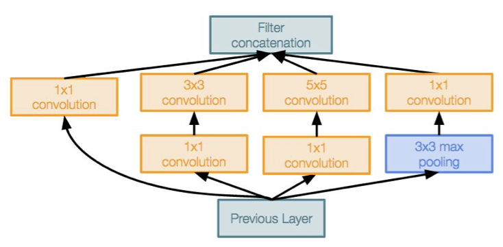

_Inception module_ 은 local network topology 을 아주 잘 설계한 예로, 이 모듈의 끝에 다시 모듈을 쌓아 올리는 방식으로 인공신경망의 구조를 이루게 한다.  

왜 이러한 구조를 가지게 되었는지 하나씩 살펴보자.  
다음은 naive inception modeul 이다.

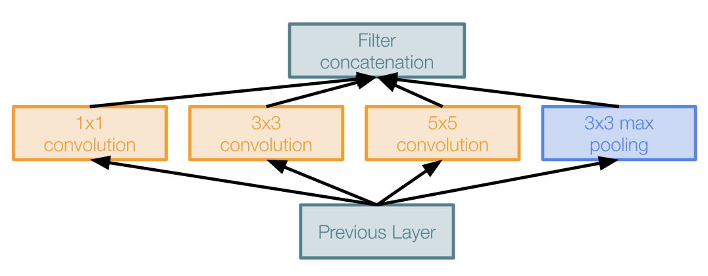

이는 1\*1, 3\*3, 5\*5 CONV layer 와 3\*3 MAX POOL layer 를 평행하게 적용하여 최종적으로 모두 depth-wise하게 이어붙여(concatenation) 출력을 만들어내는 구조이다.  

이렇게 했을 때의 문제점은 바로 computational cost 가 비싸다는 점이다.  

해당 모듈에 28\*28\*256 의 입력이 들어오게 된다면 위와 같은 CONV layer 를 통과하게 되었을 때 computational cost 가 어떻게 되는지 계산해보자.  
1\*1\*128 CONV layer 를 통과하게 된다면 28\*28\*128 의 output 이 나오게 된다.  마찬가지로 모두 다 계산해보면 다음과 같다.  

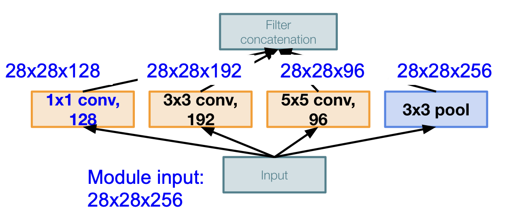

각 필터들 depth-wise 하게 이어붙이면 결국에는 $28\times28\times(128+192+96+256)=28\times28\times672$ 의 output 이 되게 된다.  
뿐만 아니라 연산량(operations)는 무려,  
\[1\*1 conv, 128\] = $28 \times 28 \times 128 \times 1 \times 1\times256$  
\[3\*3 conv, 192\] = $28 \times 28 \times 192 \times 3 \times 3\times256$  
\[5\*5 conv, 96\] = $28 \times 28 \times 96 \times 5 \times 5\times256$  
가 되어 최종적으로 __854M__ 만큼이 된다.

이는 너무나도 비싼 연산이 되는데, pooling layer 도 feature 의 depth 를 유지하기 때문에 결국 concatenation 을 하게 되면 depth 는 매 레이어마다 증가할 수 밖에 없게 된다.  

이를 해결하기 위해 __bottleneck__ layer 를 도입하게 된다.  
이 _bottleneck layer_ 는 1 by 1 CONV layer 인데, 이전 강의에서도 간략히 짚고 넘어갔지만 한 번 더 쉽게 설명하면 다음과 같다.

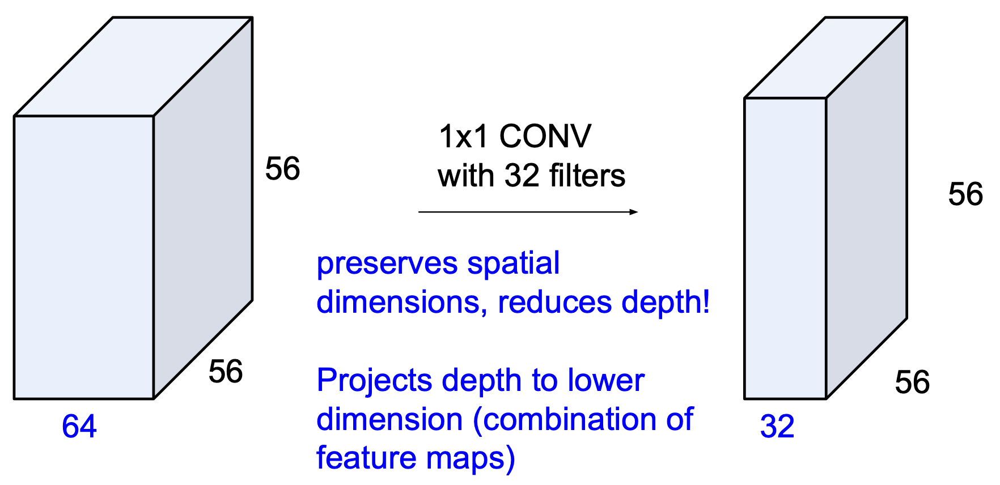

56\*56\*64 의 input 에 대해 1\*1 CONV layer 인 32개의 필터를 적용시키면 56\*56 의 공간은 유지되면서 채널(depth)이 32로 줄어드는 효과를 얻게 된다.  

이러한 _bottleneck layer_ 를 다음과 같이 적용시키므로써 dimension reduction(차원 축소) 을 진행하는 _inception module_ 은 다음과 같이 아주 많은 계산 상의 이점을 가져오게 한다.

최종적으로 filter concatenation 을 하게 되면 28\*28\*480 으로 약 2/3 로 줄어들은 것을 확인할 수 있으며, 연산량을 모두 계산하면 __358M__ 이 되어 절반 정도로 줄어들은 것을 볼 수 있다.  
<small>
\[1\*1 conv, 64\] = $28 \times 28 \times 64 \times 1 \times 1\times256$  
\[1\*1 conv, 64\] = $28 \times 28 \times 64 \times 1 \times 1\times256$  
\[1\*1 conv, 128\] = $28 \times 28 \times 128 \times 1 \times 1\times256$  
\[3\*3 conv, 192\] = $28 \times 28 \times 192 \times 3 \times 3\times64$  
\[5\*5 conv, 96\] = $28 \times 28 \times 96 \times 5 \times 5\times64$  
\[1\*1 conv, 64\] = $28 \times 28 \times 64 \times 1 \times 1\times256$  
</small>

pooling layer 역시 depth 가 낮아지는 것 또한 확인할 수 있다.  

이러한 _GoogLeNet_ 의 전체 구조는 다음과 같다.

구조를 보았을 때 왼쪽 끝에서부터 첫 inception module 전 까지를 'stem network',  
그 다음 마지막 inception module 까지를 'stacked inception modules',  
마지막 4개의 layer 가 'classifier output' 의 부분이다.  

이 때, 'classifier output' 에서 FC layer 가 없음을 확인할 수 있다.  
이는 계산이 많은 계층이기에 삭제되었다.  

중간에 두 개의 Auxiliary classification output 을 확인할 수 있는데, deep 하게 내려가기 전에 출력을 내보내는 mini network 이다. 이런 구조를 가졌을 때 classification 하는데 있어서 더 도움을 주게 된다. 이는 layer 가 깊어질 수록 gradient 가 없어질 수도 있기 때문에 이를 보완하는 효과를 가지고 오게 된다.  

이는 구글에서 다양한 시도 끝에 내린 결론적인 구조이고, 많은 시행착오가 있었을 것이다.  

_GoogLeNet_ 의 특징을 정리하면 다음과 같다.

- 22개의 레이어를 가진다(중간의 mini network 는 세지 않는다)
- 효율적인 inception module 을 쌓아 올리므로써 구현된다.
- multiple FC layer 로 인한 비싼 계산 코스트를 방지하기 위해 FC layer 를 삭제했다.
- AlexNet 보다 12배나 적은 파라미터 수를 갖는다.
- ILSVRC'14 에서 classification 분야 1위(6.7%)

지금까지의 연구 성과를 그래프로 표현하면 다음과 같다.

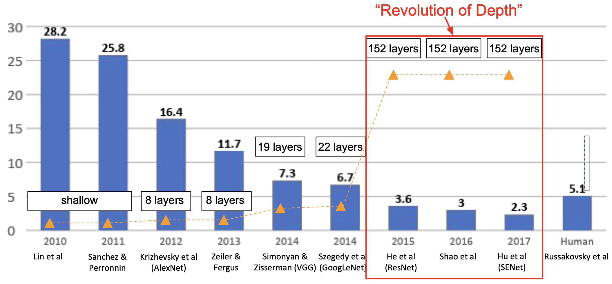

### ResNet

2015년, depth 에 아주 큰 변화가 나타나게 된다. 종전 22개의 layer 에서 무려 152개의 layer 로 늘어나게 되었는데, 마이크로소프트의 (2019년 현재는 페이스북) Kaiming He 가 개발한 ResNet 이 바로 그 주인공이다.  

_ResNet_ 을 한 문장으로 정리하면 다음과 같다.
> Very deep networks using residual connections  
residual(나머지), 무슨 구조를 가지기에 나머지라는 것이 나온 것일까?

우선 신경망을 깊이 만드는 것을 생각하자.  
연구자들은 신경망의 깊이가 깊어지면 성능이 증가할 것이라고 믿었다. 왜냐하면 더 복잡한 정보를 처리할 것이라 생각했기 때문이다.  

그렇다면 plain CNN 에 계속해서 layer 를 쌓으면 어떻게 될까?  

위의 그래프는 VGGNet 에서 레이어를 추가했을 때의 training 과 test 에서의 에러를 나타낸 그래프이다.  
이것이 나타내는 바는 무엇일까?  

overfitting 이라고 생각할 수도 있으나 training 에서도 에러가 증가하는 것을 보면 전체적인 성능이 낮아지는, underfitting 이 일어나고 있는 것을 볼 수 있다.  

He 는 이러한 현상이 일어나는 이유를 layer 가 최적화가 되어 있지 않기 때문이라고 생각했다.  
일반적으로 더 복잡한 정보를 처리하면 성능이 올라가야하지만 그렇지 못했기 때문이다.  

구조적으로 이를 해결하는 방법은 얕은 레이어를 가진 모델에서 학습된 것을 복사한 다음 추가적인 레이어를 identity mapping 을 위해 놓는 것이다.  

_ResNet_ 에서는 위의 문제점에 대한 해결책으로 network layer 를 residual mapping 에 맞추도록 컨셉을 변경한 것이다.  

기존의 방식은 직접적으로 layer 가 요구되는 답을 학습하도록 설계되어 있었다는 점을 상기해보자.  
즉, 기존의 layer 는 출력값 $H(x)$ 를 최적화 하는 방식이었는데, _ResNet_ 의 컨셉은 입력값 $x$ 와 출력값 $H(x)$ 의 차이 $F(x)$ 를 최소화하는 것이 layer 의 목표가 된 것이다. 즉 $F(x) = 0$ 이 되도록 layer 를 다르게 설계하게 되는 것이다.

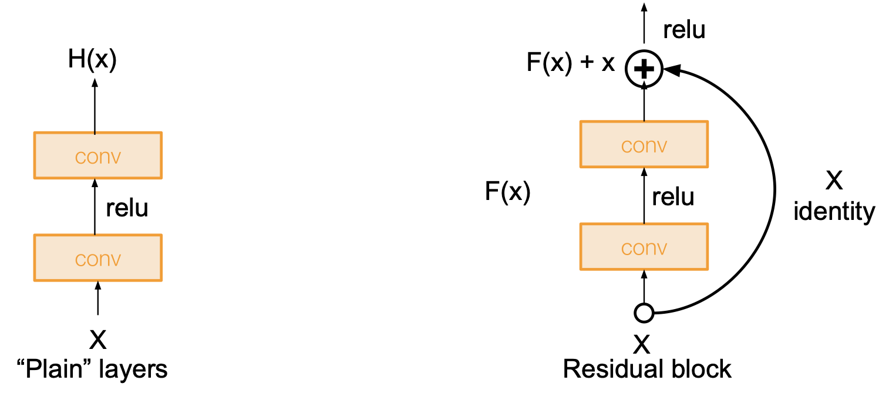

이렇게 했을 때 어떤 이점이 있을까?  

이는 이론적으로 레이어가 학습하는데 더 용이한데, 만일 어떤 H(x) 가 $H(x)=x$ 를 만족하도록 학습해야했다고 하자. _ResNet_ 에서는 $F(x)=0$ 이 되도록 학습하게 되면 어떤 것이 쉽게 학습하게 되는 결과를 가져오게 될까?  
당연히 0 쪽이 더 쉬울 것이다.

이러한 개념을 이용해 _ResNet_ 은 다음과 같은 구조를 갖는다.

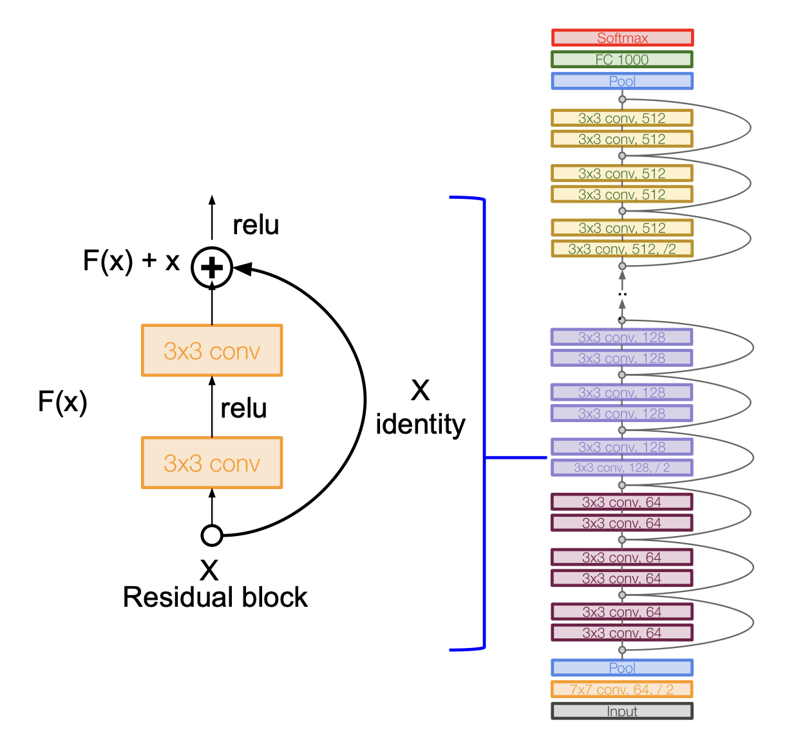

- __residual block__ 을 쌓아 올리는 것이 핵심이며, 모든 residual block 은 2개의 3\*3 CONV layer 를 갖는다.  
- 주기적으로 두 배의 filter 를 주고 stride 2 를 이용해 공간적인 downsampling 을 진행하도록 한다.  
- 시작할 때 7\*7 CONV layer 를 이용한다.
- 마지막 CONV layer 뒤에 global average pooling layer 로 pooling 을 진행한다.
- FC layer 는 output class 만을 위해 있고 더는 없다(no multiple FC layer).

이런 구조를 가진 _ResNet_ 은 34, 50, 101, 152 의 레이어를 갖는다.

50보다 깊은 레이어를 가진 _ResNet_ 은 _GoogLeNet_ 처럼 bottleneck layer 를 이용한다.

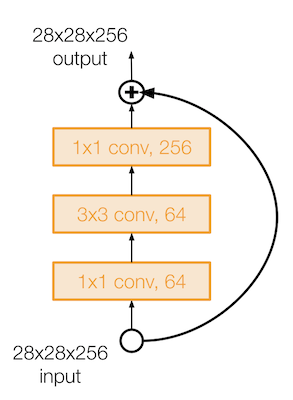

이렇게 앞뒤로 1 by 1 CONV layer 를 이용해 입/출력의 depth 는 유지하면서 계산에서는 효율적이게 만들었다.  

실제 _ResNet_ 의 학습은 다음의 설정으로 이루어졌다.

- 매 CONV layer 가 진행되면 batch normalization
- Xavier /2 initialization 을 이용
- SGD + Momentum (momentum = 0.9) 이용
- learning rate = 0.1, valid error 가 평탄함을 보일때 마다 10만큼 나눠주며 decay
- 미니 배치의 크기는 256
- weight decay = 1e-5
- dropout 은 사용하지 않음

이렇게 사용된 _ResNet_ 은 ImageNet 에서는 152개의 레이어, CIFAR 에서는 무려 1202개(!)의 레이어를 사용해도 성능의 저하 없이 학습이 가능했다.  
_ResNet_ 으로 인해 매우 깊은 네트워크에서도 작은 training error 를 얻을 수 있게 되었다.  

그리고 ILSVRC'15 의 모든 분야에서 압도적인 성능을 나타내며 1위를 차지하였다.  
classification 분야에서 3.6%의 top5 error 를 보였는데, 이는 인간의 능력(5%)를 상회하는 결과이다.  

각 신경망들의 complexity 를 비교한 표를 보고 가자.

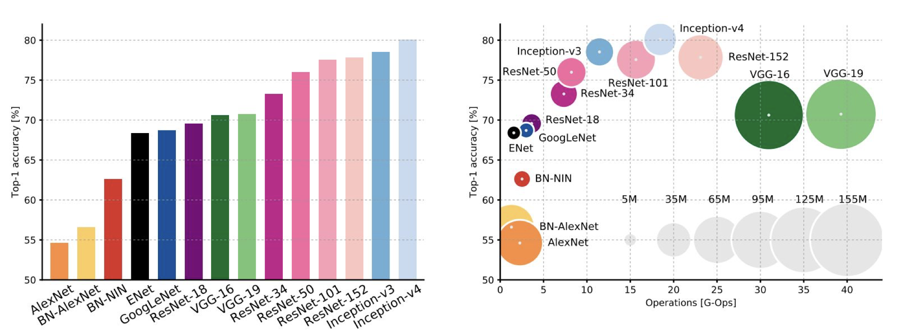

- 가장 높은 성능을 보이는 Inception-V4 는 사실 ResNet + Inception 이다.  
- VGG는 많은 메모리와 연산이 필요한 것을 확인할 수 있다.
- GoogLeNet 이 굉장히 효율적이다.
- AlexNet 은 연산량이 작음에도 불구하고 메모리를 많이 필요로 하며 성능 역시 높지 않다.  
- ResNet 은 모델에 따라 효율이 조금씩 다르지만 아주 높은 성능을 보인다.

#### Deep Feature Fusion

이렇게 아주 좋은 성능을 내는 _ResNet_ 이 발표되고 성능을 더 높이고자 하는 시도들이 이루어졌다.  
ILSVRC'16 에 classification 에서 1위를 차지한 _Fusion_ 은 Inception, Inception-ResNet, RestNet, Wide ResNet 모델을 multi-scale 앙상블을 통해 성능을 높인 것이다.  

#### SENet

_SENet(Squeeze-and-Excitation Networks)_ 는 adaptive feature map reweighting 을 이용한 모델이다.  
'feature recalibration' 을 추가해 feature map 에 가중치를 적응형으로 다시끔 부여하는 학습이 가능하게 했다.  
global average pooling layer 와 두 개의 FC layer 를 사용해서 feature map 의 가중치를 결정했다.

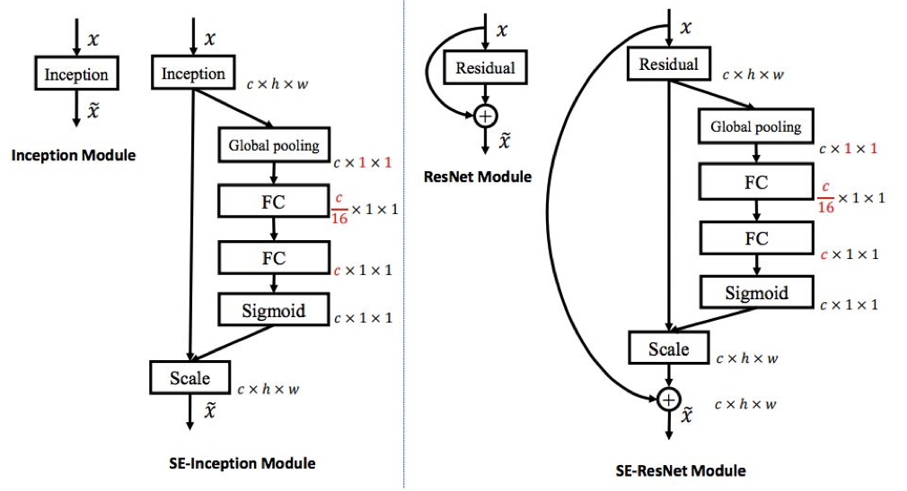

위와 같은 구조로 ILSVRC'17 에서 classification 분야 1위를 하게 되었다.  
이 때 ResNeXt-152 를 base architecture 로 사용했다.

2017년을 기점으로 ImageNet competition 은 열리지 않게 되고 Kaggle 로 넘어가게 되었다.

---

#### Network in Network(NiN)

잠깐 몇 가지 추가적인 설명을 하고 넘어가자.

각 Conv layer 내에 'micronetwork' 가 있는 MLPConv layer 는 로컬 패치(local patch)에 대한 추상적인 특징(abstract feature)을 계산해내는데 더 좋다.  
이 'micronetwork' 는 MLP(Multilayered Perceptron)에 사용되었으며 이 개념이 GoogLeNet 과 ResNet 에 사용된 bottleneck layer 의 선구자이다.

local network topology 에 영향을 미친 개념이 바로 NiN 이 되겠다.

#### Identity Mappings in Deep Residual Networks

identity mapping 을 이용해 _ResNet_ 의 block 에 대한 설계를 향상 시킬 수 있었으며,  
정보를 직접적으로 전파하는 방식을 이용해 더 좋은 성능을 내게 해준 것으로 자세한 것은 [논문](https://arxiv.org/abs/1603.05027)을 확인해보자.

> 위에서 잠깐 언급한 identity mapping 이란 무엇일까?  
> ResNet 의 residual block 에서 언급했던 $H(x)$ 를 identity mapping 을 위한 shortcut connection 이라 했지만 실제적으로 이는 identity 함수(f(x)=x 라던가) 와 residual 함수의 합에 ReLU 를 적용시킨 것이라 완전한 identity mapping 이라고 보기에 어렵다.  
> 논문에서는 f 가 identity 함수라면 어떨까에 대한 접근을 보여주고 있다. <small>언젠가 자세히 리뷰할 날을 꿈꾸며</small>

#### Wide Residual Networks

_ResNet_ 을 향상시킨 또하나의 방법인 Wide Residual Network 이다.  
2016년 Zagoruyko 가 발표한 [논문](https://arxiv.org/abs/1605.07146)에서 자세히 확인할 수 있지만 간단히 정리하면 다음과 같다.

- depth 가 아니라 residual 이 중요한 것이라 주장
- F 개의 필터에 대해 k factor 를 곱해준 만큼의 필터를 하나의 block 으로 이용
- 그 결과 50-layer wide ResNet 이 152-layer ResNet 보다 좋은 성능을 보임
- depth 를 높이는 것 보다 width 를 늘리는 것이 계산 상 효율적임을 보임(parallelizable)

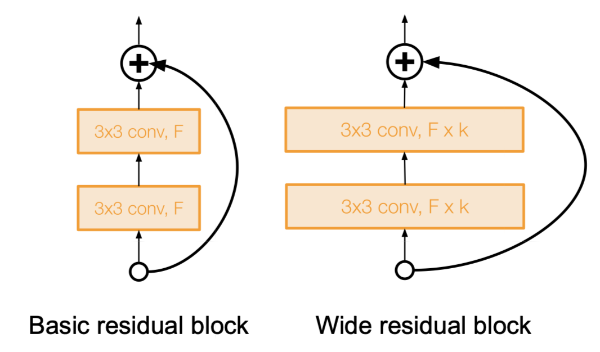

> 컴퓨터는 dense 한 연산에 대해 더 강한 모습을 보이는데, 이는 dropout 을 통해 deep 하지만 sparse 한 모델보다 dense 한 모델이 더 성능이 좋다는 것과 같은 결을 가진다.

#### ResNeXt

ResNet 으로부터 탄생한 또 하나의 모델인 ResNeXt 는 여러개의 평행한 pathway(cardinality)를 이용해 width 를 늘리는 방식을 이용한다.  
이 평행한 pathway 는 Inception module 의 그것과 유사하다.

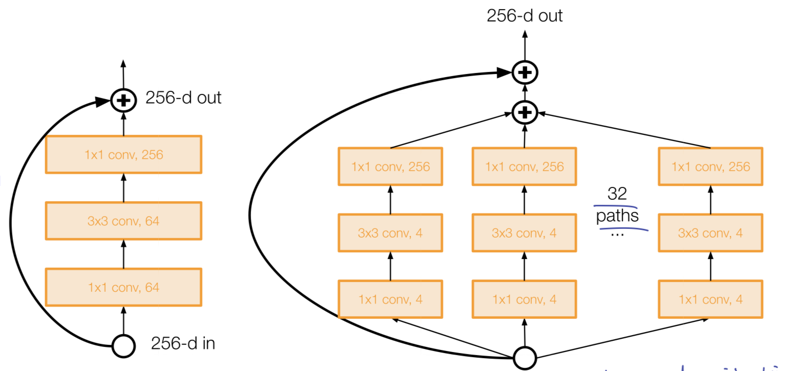

### FractalNet

이처럼 ResNet 을 이용해 성능의 향상을 도모하는 연구들이 많이 있으나, ResNet 과는 다른 구조이면서도 좋은 성능을 내는 것들도 연구되었다.

_FractalNet_ 이 그 중 하나인데, 이름에서도 알 수 있듯이 fractal 구조로 네트워크가 구성되어 있다.  
여기서는 residual representation 이 필요하지 않으며, 전달을 잘 하는 것이 중요하다고 주장한다.  

training 시에 sub-path 들을 dropout 하는 식으로 학습시키며 테스트에서는 full network 를 사용한다.

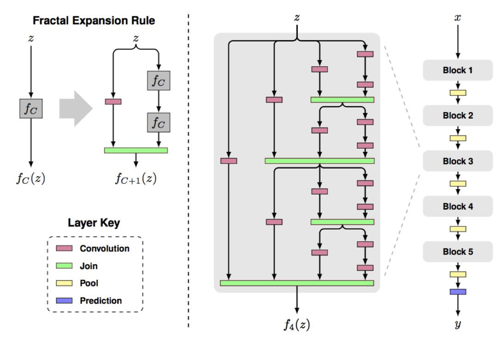

### Densely Connected Convolutional Networks

앞 쪽 레이어들에 대해 각기 연결되는 dense block 을 이용하는 것이 핵심이다.  
이러한 구조를 갖게 되면 다음의 이점을 얻는다.

- vanishing gradient 를 약화
- feature 의 전파를 강화
- feature 의 재사용을 장려하게 됨(계속 보내니까)

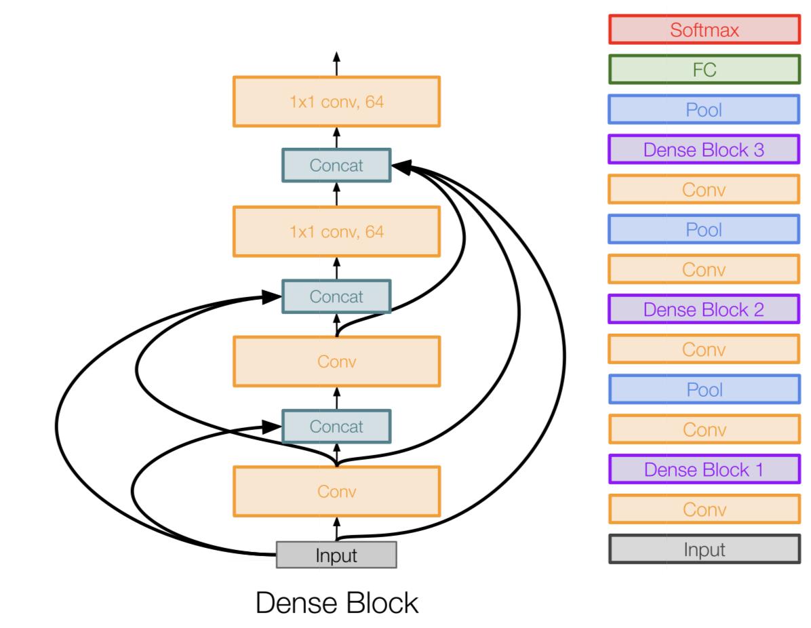

### MobileNets

신경망은 기본적으로 많은 연산량과 파라미터를 필요로 한다.  
이는 모바일 같은 리소스의 제약이 존재하는 기기에서는 사용하는데 어려움을 주는 요소이다.  

연구자들은 조금 더 가볍고 효율적인 신경망에 대해 연구하였고, _MobileNet_ 은 그 연구 성과 중 하나이다.  

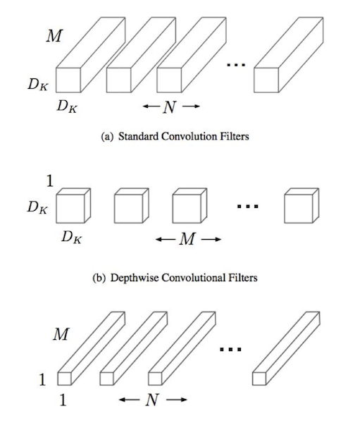  

이는 다음과 같은 특징을 가진다.

- standard convolution 을 대체하는 depthwise separable convolution 을 이용한다. 그림의 $D_k \times D_k \times 1$ 이 그것이다.
- loss 의 손실이 적으면서 많이 효율적이다.
- MobileNetV2(Sandler, 2018) 에 의해 더욱 개량되었다.
- ShuffleNet(Zhang 2017) 이라는 다른 연구도 있다.

> 모바일 환경이 대세로 자리잡은 요즘, 이와 관련하여 더 공부해보도록 하자!  
> standard Conv 은 채널당 N 개의 $D_k \times D_k \times M$ 의 필터를 적용했는데,  depthwise Conv 에서는 각 채널당 1 개의 $D_k \times D_k \times 1$ 을 적용하게 된다.  
> 이를 통해 얻는 효과는 다음과 같다.  
>> 파라미터 수의 변화 :  
>> &emsp; standard=$M \times D_k \times D_k \times N$  
>> &emsp; depthwise=$D_k \times D_k \times M + M \times N$  
> 
> 과정을 간략히 표현하면 다음과 같다.  
> 각 채널에 $D_k \times D_k \times 1$ 필터를 적용해 중간 단계의 $H_1 \times W_1 \times M$ 을 얻는다. 그리고 여기서 1 by 1 conv 를 적용해 linear combination 을 수행해주면 $H_2 \times W_2 \times N$ 이 나오게 된다.  
> stride 를 조절하면 $H_1 = H_2, W_1 = W_2$ 가 될 수도 있고 다를 수도 있다는 것을 참고하라.  
>  
> [reference](https://arxiv.org/abs/1904.03775)

### Meta-learning

메타 학습 _(Meta-learning)_ 은 learn network architecture 를 학습을 하는 것이다. 즉, 네트워크의 구조 자체를 학습하는 것이라 볼 수 있다.  

2016년 Zoph 의 [논문](https://arxiv.org/abs/1611.01578) Neural Architecture Search with Reinforecement Learning(NAS) 에 다음의 내용이 소개된다.

- 'controller' 네트워크는 좋은 네트워크 구조를 학습한다. 즉, 출력값이 네트워크의 디자인이 된다.
- 다음의 과정을 반복한다.
    1. search 공간에서 샘플 구조를 추린다.
    2. 정확도에 따른 '보상' R 을 얻기 위한 구조를 학습한다.
    3. 샘플 확률에 대한 gradient 를 계산하고, R 로 scale 하여 controller parameter 업데이트를 진행한다. 즉 좋은 구조의 확률(likelihood)은 증가시키고, 나쁜 구조의 확률은 감소시킨다.

Zoph 는 이듬해 [논문](https://arxiv.org/abs/1707.07012) Learning Transferable Architectures for Scalable Image Recognition 에서 그 후속 연구를 진행했다.  

- _NAS_ 에 ImageNet 같은 거대한 데이터셋을 적용하는 것은 비싼 작업이다.
- block _(cells)_ 을 쌓는 것은 유연하게 이루어 질 수 있다.
- _NASNet_ 은 _NAS_ 를 이용해 가장 좋은 cell structure 를 CIFAR-10 데이터셋과 유사한 곳에서 찾고 이 구조를 ImageNet 에 전이한다.
- 이와 관련해 AmoebaNet, ENAS 등의 후속 연구가 진행되고 있다.

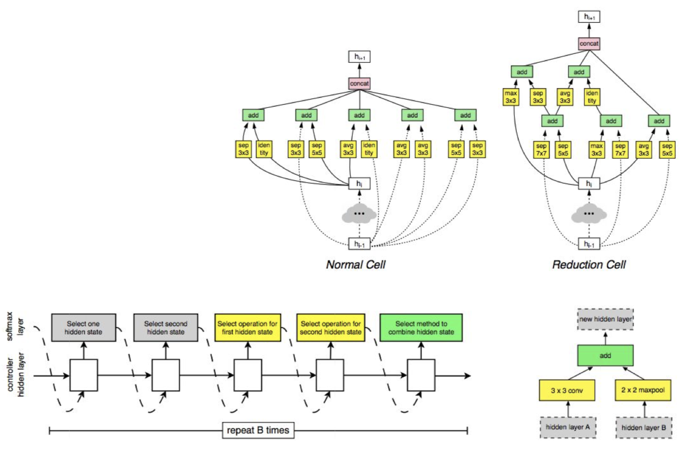

---

이번 강의를 요역하면 다음과 같다.

우리는 여기까지 CNN 의 다양한 구조 _(AlexNet, VGG, GoogLeNet, ...)_ 에 대해 학습했다.

실험적으로 _ResNet_ 과 _SENet_ 이 좋은 성능을 나타낸다.  
네트워크는 계속해서 깊어지고 있으며 네트워크의 구조 역시 계속 연구되며 향상되는 중이다.  
그리고 이제는 네트워크 구조 자체를 학습하는 __meta-learning__ 의 연구로 나아가고도 있다.

> 이 포스트는 스탠포드의 [cs231n](http://cs231n.stanford.edu) 강의를 보고 공부한 포스트입니다.  
> 잘못된 것이 있을 수 있습니다.  
> 댓글로 알려주시면 감사합니다!  
