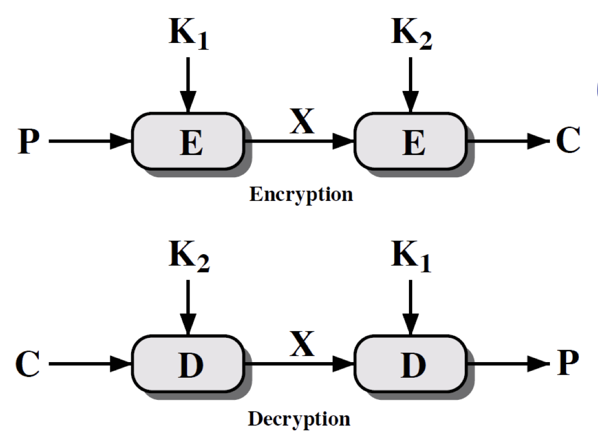
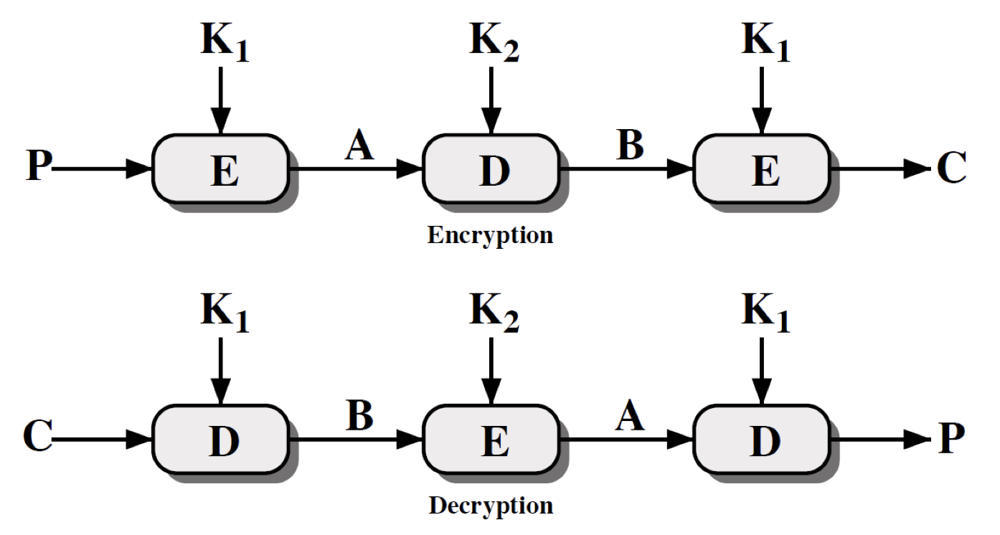
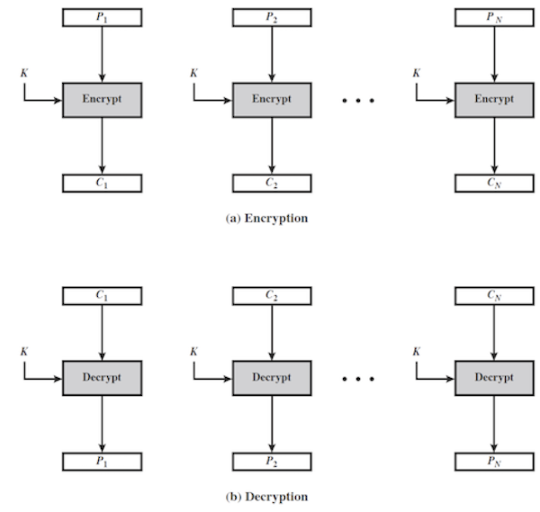
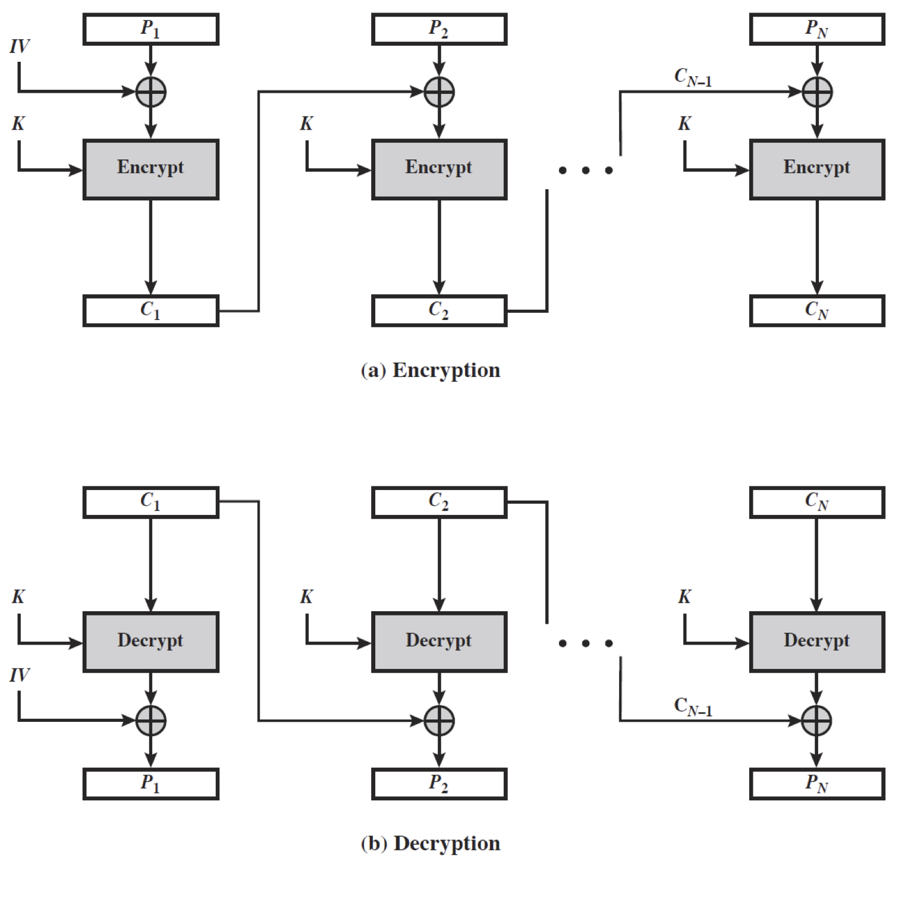
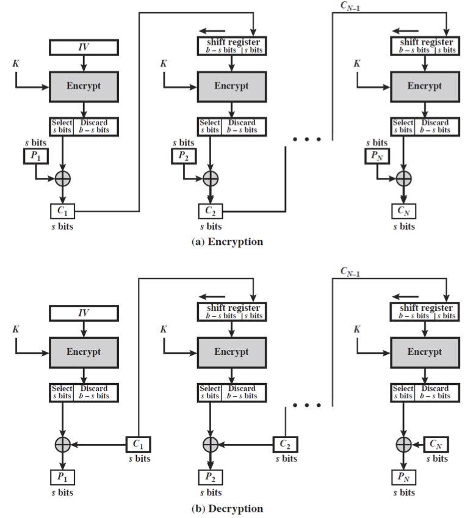
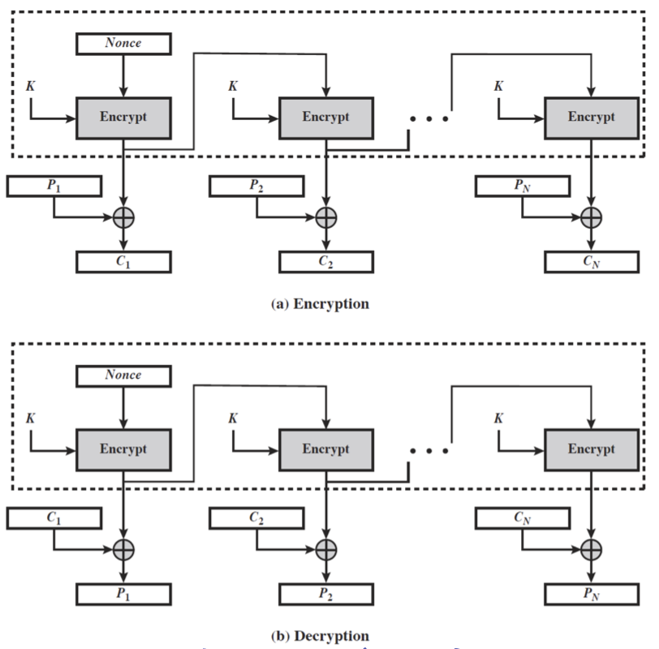
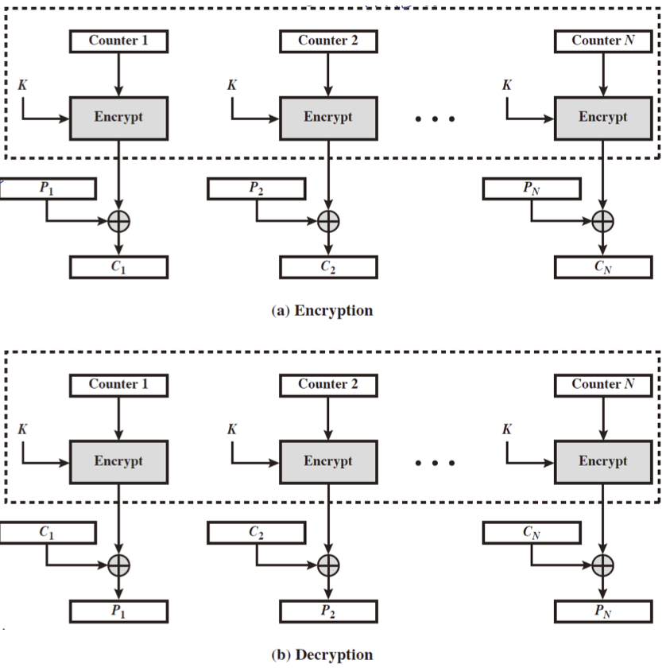
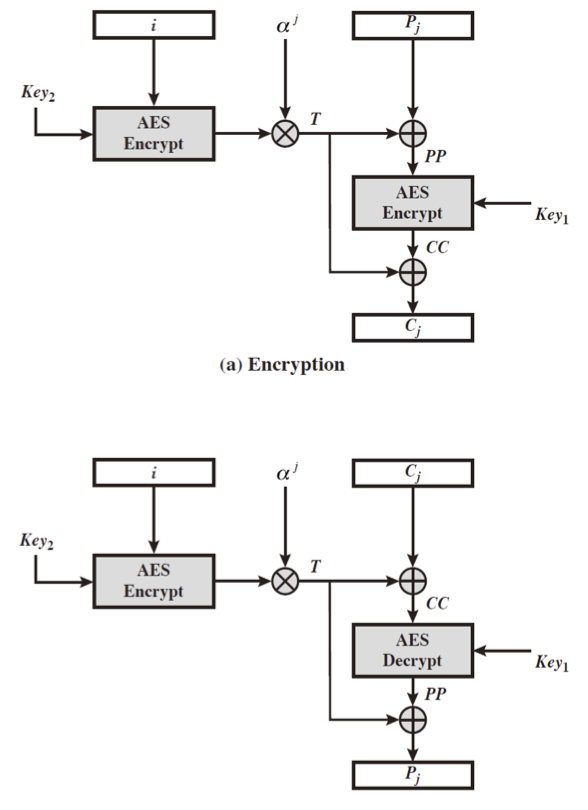
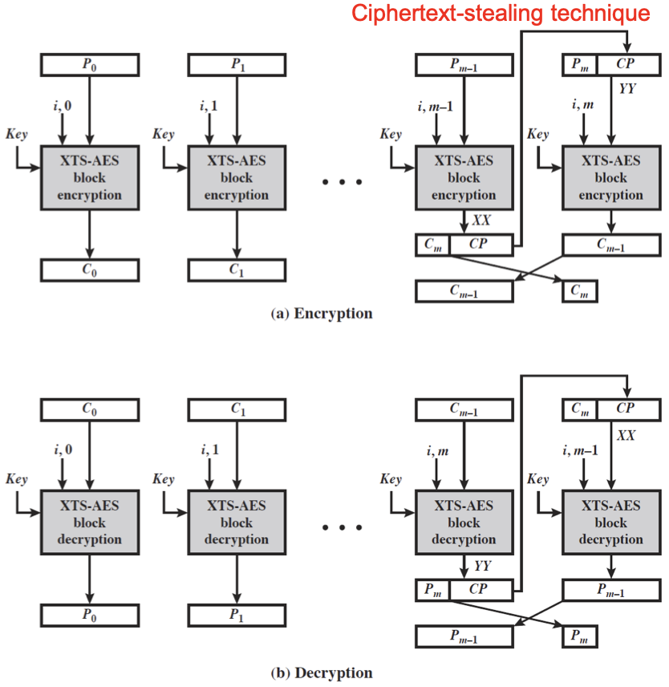

이전 [포스트](../Advanced-Encryption-Standard/) 에서 _DES_ 에서 더 보안성이 강화된 _AES_ 까지 알아보았다.  

_DES_ 는 그 자체로 아주 잘 설계된 암호화 알고리즘이지만, key size 의 한계(64-bit)로 더 이상 안전하다고 볼 수 없게 되었다.  

그렇다면 key size 를 늘려서 DES 를 적용하면 괜찮지 않을까?  

## Mutltiple Encryption

key size 를 늘리는 간단하고 떠올리기 쉬운 방법은 바로 같은 구조를 여러 번 사용하는 것이다. 그렇다면 키를 2배, 3배 늘릴 수 있게 된다.  

그렇게 생각해 낸 것이 multiple encryption with DES structure 이다. 

### Double-DES

_double-DES_ 는 두 개의 _DES_ 가 블록을 암호화 하는 방식이다.  

$$
C = E_{K2} \left( E_{K1} \left( P \right) \right) \\
P = D_{K1} \left( D_{K2} \left( C \right) \right)
$$

위와 같이 표현할 수 있으며 도식으로는 다음과 같다.

이렇게 두 배로 설계된 double-DES 는 얼마나 안전할까? 두 배로 안전할까?  
놀랍게도 __하나도 안전하지 않다.__

이는 _MITM(Meet In The Middle) attack_ 때문이다.  
이 공격 때문에  double-DES 는 single-DES 로 완화되어버리는데, 이는 double-DES 가 아무 의미가 없어지는 효과를 가지고 온다.

#### Meet In The Middle

이것은 Known-Plaintext attack 의 일종으로 plain-chiper pair 를 공격자가 알고 있을 때 일어나는 공격이다.  

> Man In The Middle 공격과 헷갈릴 수도 있다. 그러나 이는 중간자(communication 내)가 공격하는 것으로 확연하게 다르다.  

이 공격 기법은 두 번 cipher 하는 과정에 대해 언제나 작동하는 기법으로 다음과 같은 중간 X 를 이용하는 것이 핵심이다.

$$
X = E_{K1}(P) = D_{K2}(C)
$$

plaintext P 를 모든 가능한 키(K1) 조합으로 암호화해서 테이블에 적음으로써 공격을 하게 된다.  
C 를 테이블을 이용해 K2 로 복호화해서 X 가 되도록 하면 K1 과 K2 를 다 찾을 수 있게 된다.  
이는 $O(2^{56})$ 으로 $O(2^{112})$ 로 생각했던 예상과는 너무 다른 수치이다.

### Triple DES

두 번이 안된다면 세 번은 어떤가?  

세 번 하는 방법은 꽤나 효과가 있었다.  

> '있었다'인 이유는 안전하다고 생각했던 이 방법이 최근 위험하다는 연구 결과에 부딪혔기 때문이다. 자세한 것은 [논문](./On_the_Practical_(In-)Security_of_64-bit_Block_Ciphers.pdf)에서 확인할 수 있다.  

이렇게 세 번 _DES_ 를 거치게 되면 _meet in the middle attack_ 의 cost 는 $O(2^{112})$ 로 증가하게 되어 해당 공격에 대해 위협이 낮아지지만, 세 개의 키(168-bit key)가 필요하다는 단점이 생긴다.  

그래서 _Triple-DES_ 를 두 개의 키만 가지고 사용할 수 있도록 암호화-복호화-암호화 기법을 적용하게 되었다.  

$$
C = E_{K1}(D_{K2}(E_{K1}(P)))
$$

이를 도식화하면 다음과 같다.

Encryption 시 중간에서 암호화를 한 번 진행한다는 것을 확인할 수 있다.  

이러한 구조는 K1 = K2 일 경우 _single-DES_ 와 같은 효과를 얻게 되는 측면도 있다.  

이렇게 _DES_ 를 세 번 적용하게 되면 안전하지 않을까?  

라고 믿어져 왔는데 앞서 링크한 논문에 의해 이는 더이상 practical 하게 안전한 것이 아니라고 밝혀졌다.  

그럼에도 불구하고 이는 완전탐색(brute-force) 공격에 대해 $O(2^{112})$ 의 코스트를 가지며 어느 정도 보안성이 있긴 하다.  

_Triple-DES_ 에 대한 다음의 공격 기법을 생각해보자.

- Chosen-plaintext attack
    이 공격은 공격자가 악의적인 공격을 수행함에 있어 plain-cipher pair 를 선택할 수 있다는 가정이 있다.  
    우선, 공격자는 plaintext $P_i$ 중 첫 번째 암호화의 출력값 A = 0(또는 고정된 어떤 값(constant)) 를 만들어내는 $P_i$ 를 찾는다.  
    그리고 meet-in-the-middle 공격으로 두 개의 키(K1, K2)를 찾게 된다.  
  
    - 이 때 $P_i$ 를 chosen plaintext 로 하고 이에 해당하는 ciphertext $C_i$ 를 구한다.  
    - 각 $C_i$ 에 대한 중간 값인 $B_i$ 를 계산해낸다.
    - $B_i = P_j$ 인 i, j를 찾는다.

    이러한 과정은 테이블에 $P_i$ 를 기록하는 것으로 시작되는데, 이처럼 테이블에 존재하는 것들에 대해 모두 테스트하면서 비교해보는 것이다. 따라서 $O(2^{56})$ 만큼의 코스트가 필요하다.
- Known-plaintext attack  
    이 공격은 공격자에게 (P, C) 의 pair 가 주어진 상태이다. 이를 P 에 대해 정렬된 값으로 테이블(table 1)을 작성한다.
    임의의 값 a 를 설정에 다음과 같은 table 2 를 작성한다.  
  
    - 각각의 K1 = i 에 대해 평문 $P_i = D_i(a)$ 의 값을 계산한다.
    - table 1 의 $P_i$ 을 이용해 table 2 에다가 K1 의 i 에 대한  $B=D_i(C)$ 를 작성하고 B 에 대해 정렬한다.

    가능한 K2 = j 에 대해 두 번째 중간값인 $B_j = D_j(a)$ 를 계산한다.
  
    - 각 단계마다 $B_j$ 를 table 2 에서 확인한다.
    - 만약 일치하는 키 i 가 table 2 에 있다면 j 가 바로 (K1, K2) 에 해당하게 되는 candidate value 가 된다.

    이러한 공격의 예상 소요 시간은 $\left(2^{56} \right){2^{64}+1 \over n+1} \approx 2^{120- \log_2 n}$ 로 표현 가능하다.  
    이는 공격자에게 주어진 pair 의 수가 많으면 많을 수록 그 속도가 기하급수적으로 빨라짐을 의미한다.  

뿐만 아니라, _Triple-DES_ 에 세 개의 키를 적용할 수도 있다. 이는 두 개의 키만을 이용했을 때 위에서 본 것 과 같은 문제점에 대한 해결책으로 제시되었는데 각 단계마다 그냥 각기 다른 키를 이용하는 것이다. 즉,

$$
C=E_{K3}(D_{K2}(E_{K1}(P)))
$$

이러한 기법이 인터넷 어플리케이션(PGP, S/MIME)에 적용되었으며, SSL/TLS, IPSEC 와 같이 인터넷 보안 프로토콜에 적용되기도 하였다.  

그러나 역시 앞서 소개한 논문에 따르면 이는 보안 위협을 내재하게 되는데, 해당 논문에서는 64-bit block 의 구조적 취약점(exploit collision)을 드러낸 것이기 때문이다.

## Mode Operation

우리가 살펴 본 block cipher 는 일정한 크기의 블록으로 암호화를 진행하게 된다.  
현실적으로 우리의 데이터는 일정한 크기를 가지지 않는데 그러므로 현실의 데이터를 암호화하기 위해서는 임의의 길이를 가진 데이터에 대해 암/복호화 가 가능해야한다.  

NIST SP 800-38A 에서는 5가지 모드에 대해 정의내리는데, block 과 stream 모드로 광범위한 어플리케이션에서 적용되도록 하고 있다.  

|Block Mode|Stream Mode|
|:---:|:---:|
|Electronic codebook(ECB) Cipher block chaining(CBC)|Cipher feedback(CFB) Output feedback(OFB) Counter(CTR)|

위와 같은 종류의 모드가 있으며 각 모드들에 대해 정리하면 다음과 같다.  

|Mode|Description|Typical Application|
|:---|:---|:---|
|Electronic Codebook(ECB)|각 64-bit 평문으로 된 블록은 같은 키로 독립적이게 암호화 된다.|단일 정보에 대한 보안 전송이 필요한 경우(e.g. an encryption key)|
|Cipher Block Chaining(CBC)|각 블록은 이전 블록이 암호화 된 것과 XOR 연산 후 암호화를 거치게 된다.|<ul><li>일반적인 block 기반의 데이터 전송이 필요할 때</li><li>인증(Authentication)</li></ul>|
|Cipher Feedback(CFB)|입력의 s-bit 가 한 번에 진행된다. 이전의 암호문은 암호화 알고리즘의 입력으로 쓰여 pseudo-random output 을 만들어내게 된다.|<ul><li>일반적인  stream 기반 데이터 전송이 필요할 때</li><li>인증(Authentication)</li></ul>|
|Output Feedback(OFB)|CFB 와 비슷하지만 암호화 알고리즘에 이전 암호문이 사용되지 않고 전체 블록이 사용된다.|stream 기반의 데이터 전송이 noisy channel 에서 이루어질 때(e.g. satelite communication)|
|Counter(CTR)|각 평문 블록이 암호화된 counter 와 XOR 된다. 각 부분 블록의 연산 후에 counter 가 증가한다.|<ul><li>일반적인 block 기반 데이터 전송이 필요할 때</li><li>고속 전송이 요구될 때 유용</li></ul>|

### Electronic Codebook(ECB)

먼저, _electronic codebook_ 에 대해 살펴보자.  
이는 가장 간단한 모드이며 메세지는 각각의 독립적인 블록으로 분할되어 하나의 키에 의해 각각 암호화된다.  

$$
C_i = E_K(P_i)
$$

이는 하나의 값을 전송하는 데 있어서 쓰일 수 있다.  
예) 세션 키를 마스터 키로 암호화하여 전송

이는 몇 가지 문제점을 가지고 있다.  

우선, 반복되는 메세지를 알 수 있게 된다. 같은 키로 암호화하기 때문에 같은 입력에 대해 같은 출력을 가질 수 밖에 없고 이것을 공격자가 알 수 있게 된다. 그리고 이렇게 되면 앞서 학습했던 공격 기법들에 의해 분석당할 수 있다.  

또한, 해당 블록들의 순서가 없게 되는데, 이는 데이터가 섞일 수도 있고 공격자가 악의적으로 다른 정보를 끼워넣어도 수신자 입장에서는 알 수가 없다는 문제점이 있다.  
이로 인해 _ECB_ 는 인증과 같은 것에서 사용할 수 없다.  

이와 같은 문제점이 일어나는 이유는 각 블록이 독립적으로 암호화되기 때문이다.

### Cipher Block Chaining(CBC)

_Cipher Block Chainig_ 기법은 블록에 대해 암호화 하는 것은 동일하나 동일한 입력에 대해서 다른 암호문을 얻을 수 있도록 설계하였다.  

이는 이전 블록의 암호화 내용을 봄으로써 가능한데, 메세지는 블록으로 쪼개지면서 링크가 생기게 된다(순서를 부여). 링크에서 이전의 블록의 암호문을 이용해 현재 블록의 암호화에 영향을 주도록 한다. 첫 번째 블록은 이전의 암호문이 없기에 _initial vector(IV)_ 를 이용한다.

$$
\begin{aligned}
C_i &= E_K(P_i \space \text{ XOR } \space C_{i-1}) \\
C_{-1} &= IV
\end{aligned}
$$

이 모드로 bult data 에 대한 암호화가 가능하며 __인증__ 에서도 사용할 수 있다.  
예) 이메일, FTP, web, ...  

위의 도식을 보면 알 수 있듯이 각 블록은 연결 관계를 가지게 된다.  

여기서 마지막 블록에 대해 생각을 하고 넘어가야 하는데, 마지막 블록은 blocksize 가 다를 수 있기 때문이다. 따라서 이를 해결하기 위해 _Message Padding_ 을 해주게 된다. 보통 0을 채워넣거나 블록의 끝에 패딩의 크기를 알려주는 식으로 구현한다.  
e.g. \[b1 b2 b3 0 0 0 0 5\] -> 3개의 data bytes 와 5 bytes를 패딩 + 카운트 표시  
이렇게 메세지 패딩을 진행하면 추가적인 블록이 필요할 수도 있다.  

_CBC_ 기법은 블록의 변화가 있을 경우 출력값에도 변화가 생겨 중간에 데이터의 변화가 있는지 없는지 알 수 있다.  

이 기법은 구조적으로 _initialization vector(IV)_ 를 필요로 하는데, 송/수신자가 반드시 알고있어야하며 다른 이들에게는 알려져서는 안된다.  

만약 _IV_ 가 공격자에게 알려지면 어떤 일이 벌어질까?  
이는 공격자가 데이터의 변화를 주고도 최종적으로 같은 출력값을 내도록 할 수 있게 해준다. 이 상황에서 수신자는 원본 입력, 즉 plaintext 가 바뀌었는지 알 수 없다.  

해당 기법은 인증에서도 쓰일 수 있는 방법인데 plain info 가 바뀌어도 code(output)가 바뀌지 않는다면 공격으로 사용될 수가 있다.

---

지금까지는 Block mode 에 대해 학습했는데, 이제 Stream mode 에 대해서 학습해보자.  

stream mode 는 작거나 real-time data 를 암호화 하는데 사용된다. 이는 streaming application 같은 곳에 적용될 수 있다. 또한, 패딩이 필요 없다는 점도 있다.  

block cipher 를 pseudo-random-number genator 를 위해 사용한다.

### Cipher Feedback(CFB)

먼저, _Cipher feedback(CFB)_ 에 대해 알아보자. 여기서 메세지는 bit 의 흐름으로 다루어진다.  
결과값으로 나온 것을 다음 stage 에 사용하는 특징(feedback)이 있고, 1, 8, 64, 128 등의 길이를 가진 bit 가 피드백으로 사용될 수 있다.  

다음과 같은 수식으로 표현 가능하다.  

$$
\begin{aligned}
C_i &= P_i \text{ xor}\left( E_K(C_{i-1}) \right) \\
C_{-1} &= IV
\end{aligned}
$$

_CFB_ 는 block mode 에서 _CBC_ 처럼 reliable channel(TCP) 에서 이용되며, authentication 에 적용 가능하다.

첫 stage 에는 이전 결과물이 없으므로 Initial Vector(IV) 를 이용하게 된다.  

보다시피 decryption function 이 없는데, 이는 pseudo random numer generator 를 이용하기 때문이다.  

_CFB_ 의 장점으로는 인증에 사용할 수 있으며 bit 단위 처리가 가능하다는 점이다.  
그러나 단점 역시 존재하는데,  

- 매 n-bit block encryption 후에 값을 저장하고 있어야 한다.
- 순서대로 처리되어야 해서 parellel encryption 과 access 가 불가능 하다.
- 중간에 잘못 처리되면 error 가 뒤로 전파되어 reliable channel 에서 전송이 이루어져야 한다.

### Output FeedBack(OFB)

_Output Feedback(OFB)_ 역시 메세지를 bit 의 stream 으로 다루게 되는데, _CFB_ 와 다르게 feedback 이 독립적인 차이가 있다.  

$$
\begin{aligned}
O_i &= E_K(O_{i-1})  \\
C_i &= P_i \text{ xor } O_i \\
O_{-1} &= IV
\end{aligned}
$$

위와 같이 수학적으로 표현되며, noisy channel 에서의 stream encryption 시에 이용된다.  

도식에서 확인할 수 있듯이 encrypt 과정을 거친 중간 결과물이 다음 encrypt 의 input 으로 들어가게 된다.  

이럴 경우 _CFB_ 와 비교했을 때 어떤 장점이 있을까?  
> error propagation 이 이루어지지 않아 unreliable channel 에서 사용 가능하며, pre-computation 이 가능해진다. 이는 훨씬 더 효율적이라는 의미가 된다.  
> 또한 $C_1$ 이 끝나지 않아도 $C_2$ 에 대한 계산이 가능해서 partial parellel 이 가능하다. partial 인 이유는 중간 결과물이 다음 encrypt 에 영향을 여전히 끼치고는 있기 때문이다.  
> 또 하나의 이점은 arbitrary length 를 가진 data 에 대해 암호화가 가능한 점인데, 이는 메세지의 순서에 상관이 없이 암호화가 진행되기 때문이다.

이 때 nonce(IV) 는 매번 unique 한 것이 사용되어야 하는데, 재사용될 경우 공격자가 알 수 있게 된다.  
또한, 인증(authentication)에 쓰일 수 없는데, error 가 전파되지 않으므로(single-bit 만 영향을 받는다) 위변조가 일어났는지 수신자 입장에서 확인할 수 없다.  
stream 하게 이루어지기에 송/수신자가 sync 된 상태로 있어야 한다.

### Counter(CTR)

_Counter(CTR)_ 는 우리가 흔히 알 수 있는 count 정보를 이용해 암호화를 진행하는 기법이다. _OFB_ 과 비슷하나 피드백 대신 counter 값을 이용한다는 차이가 있다.  

이 때, 각각의 plaintext block 에 새로운 counter value 와 다른 키값이 적용되어야 한다.  

$$
\begin{aligned}
O_i &= E_K(i)  \\
C_i &= P_i \text { xor } O_i
\end{aligned}
$$

위와 같이 표현되며, 빠른 속도로 네트워크 통신에 있어서 암호화가 필요할 경우 사용하게 된다.

구조를 보면 알 수 있듯이 각각의 암호화 과정은 완전히 독립적(independant)이다. 따라서 parallel 하게 진행할 수 있으며 이로 인해 굉장히 빠르게 암호화가 이루어질 수 있다.  

counter value 는 보통 1씩 증가하지만, 상호(송/수신자) 합의가 있다면 다른 값도 가능하다.  

이러한 counter 를 이용하는 핵심적인 기능 중 하나는 해당 암호화문이 어느 위치의 평문이 암호화 된 것인지 알 수 있다는 점이다. (배열을 접근할 때 index 를 보고 접근하듯 여기서는 counter 가 index 의 역할을 하게 된다.)  

이렇듯 counter 를 이용한 stream cipher 는 매우 효율적이며 h/w 와 s/w 에서 모두 parallel encryption 이 가능하다. 또한 random access(index를 이용)을 통한 접근이 가능하며 다른 모드들과 동등한 수준의 보안성을 가진다.  

다만, 키와 counter 의 값이 재사용되거나 예측 가능해서는 안된다.(특히 initial value 에 대해 더 신경써야함)

---

지금까지 네트워크 환경에서 통신을 함에 있어서 필요한 암호화 과정을 살펴 보았다.  
그렇다면 local 에 저장된 데이터는 어떻게 암호화해두어야 할까?  

> 만약 다 같은 것으로 동일하게 암호화 되어있다면 어떤 문제가 있을까?  

## XTS-AES Mode  

이 방법은 block cipher 를 약간 변형한 개념을 가진다.  

주요한 원리는 같은 평문이더라도 저장된 위치(sector)에 따라 다르게 암호화 된다는 것이다.  

각 블록에 대해 _AES_ 를 두 번 사용하여 암호화 하며 수학적으로는 다음과 같다.  

$$
\begin{aligned}
T_j &= E_{K2}(i) \text{ (modular multiplication) } \alpha^j \\
C_j &= E_{K1}\left( P_j \text{ XOR } T_j \right) \text{ XOR } T_j
\end{aligned}
$$

여기서 $i$ 는 seed info 로 사용되는 128-bit tweak 이고, $j$ 는 sector number 이다.  
_modular multiplicaion_ 은 GF($2^{128}$) 에서 이루어지며 $m(x) = x^{128} + x^7 + x^2 + x + 1$ 이다.

여기서 중간 결과값 T 는 pseudo-random number 과 같은 것이 되고, 이 값은 modular(polynomial) multiplication 을 통해 구해지게 된다.  

암호화와 복호화에서 $i$ 는 동기화된 상태여야 제대로 동작하며, 복호화 과정에 있어서 decrypt 의 과정은 두 번이 아니라 마지막에 한 번 만 있다는 사실에 주의하자.  

이는 섹터에 대해 _XTS-AES_ 가 적용된 것을 의미하는데, 각 섹터는 독립적으로 cipher 가 진행되지만 sector number 의 차이로 평문이 같더라도 암호문은 다를 수 있다.  

마지막 부분은 padding 의 개념이 도입된 것으로 arbitrary length of message 를 처리할 수 있게 해준다. 여기서 사용되는 것이 ciphertext-stealing technique 이다.  
마지막 출력에 의한 결과 $C_m$ 이 padding info 가 된다.  

이렇게 stored data 에 대해 _XTS-AES_ 로 암호화를 진행하는 것은 _Counter_ 와 유사한 효율성을 가지고 있으며 이는 parallel 과 random access 가 가능하기에 나올 수 있는 결과이다.  

그러나 _CTR_ 과는 다르게 stored data 를 다루기 위해 nonce(i) 와 counter(j) 두 개가 필요하다.

> 본 포스트는 _정보보호_ 를 공부하며 정리한 글 입니다.  
> 잘못된 내용이 있다면 알려주세요!  
> 감사합니다 :)
