<small>최종 수정일 : 2019-10-22</small>  

## 우리가 사용하는 컴퓨터의 통신은 어떻게 이루어지는가

이제 컴퓨터를 하루라도 쳐다보지 않는 날은 굉장히 드문 날이 되어버린 것 같다.  
공부를 할 때도, 일을 할 때도, 휴식 시간에 무언가를 찾아 헤매일 때도 컴퓨터를 쓰니까.  

컴퓨터는 그 자체로도 많은 작업을 수행할 수 있는데, 이를 더 강력하게 만들어주는 것은 아무래도 통신이 가능하다는 점인 것 같다.  

인터넷에 접속하여 필요한 정보를 찾고, 자료를 다운받고 하는 모든 활동들이 다른 기기들과의 상호작용이 이루어지는 것이고 그것이 가능하게 하는 것이 바로 통신이니까.  

지금까지 그냥 주어진 환경에서 쓸 수 있는 기능들을 쓰기만 했지 정확히 어떤 원리로 작동하는지에 대해 자세히 생각해 본 적이 없던 나날들에서, 이제는 적어도 어떤 식으로 이 통신이 이루어지는지 짧게나마 알아가보자.  

---

본격적으로 들어가기에 앞서, 통신을 하기 위해서는 어떤 과정이 거치게 될까?  

단순하게 생각했을 때, 내가 말하면 상대방이 듣고 다시 나에게 말하면 되는 것이다.  

그런데 우리가 '통신'이라고 했을 때, 이런 것들을 들어봤을 것이다.  
3G, LTE, WiFi, 5G, ...  
이는 통신을 할 때 쓰는 방법 같은 것들인데, 이들이 다를 때 통신이 이루어지지 않는다.  

> 엥 통신되는데요? 라고도 생각할 수 있는데 이는 안보이는 곳에서 열심히 각 통신 방식들에 대해 바꿔주는 일이 진행되어서 우리가 최종적으로 볼 때는 통신이 그냥 되는 것처럼 보일 뿐이다.(한국어와 영어로 서로 말하고 있으면 소통이 될까? 그런데 중간에 아주 깔끔한 번역기가 있다면?)  

이렇게 다른 통신 방식에 대해 중간에서 바꿔주는 이 부분을 middleware 라고 지칭하는데, 이 middleware 가 단순할까 복잡할까?  

단순한 것이 좋겠지? 왜냐하면 세상에는 많은 다양한 방식의 통신 방법이 있는데 복잡하다면 그 처리가 어려울 것이기에...  
그런데 이렇게 중간에 있는 것이 단순하다보니 말단(end) 부분이 복잡해질 수 밖에 없는 문제가 있다.  

어쩄든 이렇게 common middleware 를 이용해 우리는 통신을 하게 되고, 이러한 약속을 우리는 _Protocol_ 이라고 부른다.

## 프로토콜(Protocol)

프로토콜은 일종의 약속이다.  

송신자가 어떤 메세지를 보낼 때 규칙에 따라 이렇게 저렇게 메세지를 처리해서 보내면, 중간에 일련의 과정을 거쳐 수신자가 메세지를 받게 되고 마찬가지로 프로토콜의 약속(규칙)대로 해석해서 메세지를 읽게 되는 것이다.  

즉 프로토콜의 정의는 다음과 같이 내릴 수 있다.  
"송신자와 수신자 그리고 중간의 모든 기기들이 효율적으로 통신하거나 특정한 목적을 달성하기 위해 지켜야하는 규칙"  

효율적인 통신은 알겠다. 그런데 특정한 목적은 뭘까?  

예를 들면, 어떤 프로토콜은 속도를 중시해 빠르게 보내는 것이 최우선 목적이고, 어떤 프로토콜은 덜 빠르더라도 중간에 메세지가 손실되지 않는 것을 최우선 목적으로 가질 수 있다. <small>나중에 배울 UDP, TCP를 한줄로 줄여버리기!</small>  

이처럼 다양한 목적에 따라 각기 다른 프로토콜이 될 수 있으며 자세한 프로토콜의 내용은 메세지의 포맷에 따라 결정된다.  
이 메세지 포맷은 프로토콜마다 각기 다르며 프로토콜을 설계할 때는 어떤 목적을 달성할 것인지 __(1)__, 목적의 내용이 담기는 메세지의 포맷을 확실하게 정하는 것 __(2)__이 중요하다.

이러한 프로토콜은 세가지로 구성되는데, format, order, action 이 바로 그것이다.  

지금은 이렇구나 라고 생각하고 넘어가자.

---

프로토콜 계층화 _(protocol layering)_ 이라는 것이 있다.  

이는 추상적인 개념으로써 프로토콜을 각기 나눈 것인데, 곧 보게될 _OSI 7 Layer_ 가 바로 그것이다.  

왜 계층으로 나누는 작업이 필요했을까?  
하나의 프로토콜(layer 1)만으로 통신을 하는 것을 생각해보자.  
여기서 주고받고, 메세지 내용도 보고, 필요에 따라 암호화도 하고, ...  
딱봐도 복잡해질 것으로 보인다.  

이렇게 복잡한 프로토콜은 유지/관리가 힘들다.  
그래서 우리는 역할을 크게 나누어 모듈화를 통해 조금 더 효율적으로 관리하고자 프로토콜을 계층적으로 나누게 된 것이다.  

이렇게 계층적으로 나누게 되면 유지보수도 편할 뿐 아니라, 관련 프로토콜을 이용해 무언가를 만들어야하는 입장에서 해당하는 프로토콜에 맞춰 개발만 하면 되는 이점이 있다.  

이러한 protocol layering 이 가능한 원리는 서로 통신하는 양 쪽의 통신 주체의 protocol 이 동일하게 있어야 통신이 원활하다.

여기서 최우선적으로 생각하는 목표는 상호 연결된 네트워크 간에 multiplexing(sharing) <small>하나의 통신로를 다분할하여 개별 독립신호를 송수신할 수 있도록 하는 다중화</small>이 가능해야하는 것이다. 통신망을 생각했을 때 여러 기기 간에 네트워크 통신이 있을 때 통신망은 필연적으로 공유될 수 밖에 없는데 이러한 상황에 있어도 통신이 제대로 터져야하기 때문이다.

이 최우선 목표를 달성하면서도 다른 추가적인 목표들도 있는데, 어떤 것이 있는지 간단하게 봐보자.

1. 어딘가의 네트워크 망이나 게이트웨이(gateway)가 고장나도 통신은 계속 이루어져야 한다.  
    state 는 통신의 양 끝 end 에서만 관리가 되어야 하고, 목적지 주소만을 보고 통신해야 고장시 우회가 가능하다.
2. 여러 통신 서비스를 지원해야한다.(TCP, UDP)
3. 다양한 네트워크를 수용할 수 있어야 한다.  
    이는 앞서 말했듯이 다양한 통신 방식(wifi, lte, ...) 이것을 가능케 하는 레이어가 바로 IP 이다.
4. 자원(resources)의 분산 관리를 허락해야 한다.  
    한 예로, 라우팅 테이블(routing table)의 entry 의 양이 많을 경우를 생각해보자. 이 경우는 한 라우터(Autonomous System)에서 다른 곳으로의 연결을 많이 책임지고 있는 경우라고도 할 수 있는데, 만약 이 라우터가 고장이날 경우 다른 곳으로의 통신이 안될 수도 있기 때문이다. 그러나 이는 이론적인 것이고 실제로 이럴 경우는 적다.
5. 효율적이어야한다. <small>마법의 단어 그것은 효.율.</small>  
    통신을 하는 packet 을 보면 header 가 덧붙여져 있다. 이는 필연적으로 전송되는 데이터의 크기를 키우지만 헤더정보에 있는 값을 이용하면 패킷의 유실이 있을 경우 재전송을 하는데 더 적은 cost 가 들도록 할 수 있다. 이러한 tradeoff 로 전체적인 관점에 있어서 더 효율적으로 통신이 일어나게 할 수 있다.
6. 호스트 연결에 있어서 적은 비용이 들어야 한다.  
    IP 와 다른 것들이 쉽게 연결이 되어야 통신을 하는데 있어서 서로 편리할 것이다. 그러나 이는 end 단에서 개발 코스트가 커지는 단점이 있다.
7. 자원(resource)의 사용에는 책임성이 뒤따라야한다.<small>(누가 그 자원을 썼는지 자원을 쓴 사람이 책임을 질 수 있어야 함)</small>  
    이는 사용량의 문제와도 연관이 되어있는데 이런것이 있다는 것 정도만 알고 넘어가자! 돈은 쓴만큼 내야지!(또는 쓴 만큼 책임을 져야지!)

___circuit switch vs. packet switch ?___  

이는 꽤 오래된 논쟁거리인데, packet switching 에서는 누구나 공유하는 link 를 쓰기에 통신 품질이 떨어질 수 있다. 그러나 circuit switch 는 물리적으로 하나의 통신만을 허용하는 방식인데, end node 의 숫자가 많아지면 효율이 안좋아진다는 단점이 있다.  
우리가 쓰는 대부분의 방식은 packet switch 방식인데 이는 조금만 생각해봐도 알 수 있듯이 우리가 통신을 하는데 있어서 packet switch 방식이 더 적합하다. 이 때 link 가 복잡해질 수도 있는데, 이 때는 buffer 를 하고 있다가 덜 바빠지면 forwarding 하는 방식으로 진행이 된다.  

___TCP vs. UDP ?___

TCP 는 전송되는 패킷의 순서가 바뀌지 않는 프로토콜이고, UDP 는 패킷 소실이 있을 수 있으나 빠른 전송 속도를 위한 프로토콜이다. 이들은 _transport layer_ 에서 QoS(Quality of Service)를 생각할 때 이용된다.(다른 레이어에서는 QoS 를 신경쓰지 않는다.)

## OSI 7 Layer

이제 본격적으로 7개로 나뉘어진 계층적 구조에 대해 알아볼 것이다.  

먼저, 간략하게 한가지를 짚고 넘어가보자.  

각 레이어가 바라보는 다음은 어디일까?(what is the next hop?)  
이는 다음 주소의 동일한 레이어이다.  
아니 이게 무슨 말일까?  
즉, 7번 째 계층인 application layer 는 다음 application layer 가 바라보는 다음 위치이고, 2번 째 계층인 datalink layer 가 바라보는 위치는 다음 datalink layer 가 되는 것이다.  

뭔소릴까? 다음의 그림을 보면서 조금 더 자세히 알아보도록 하자.

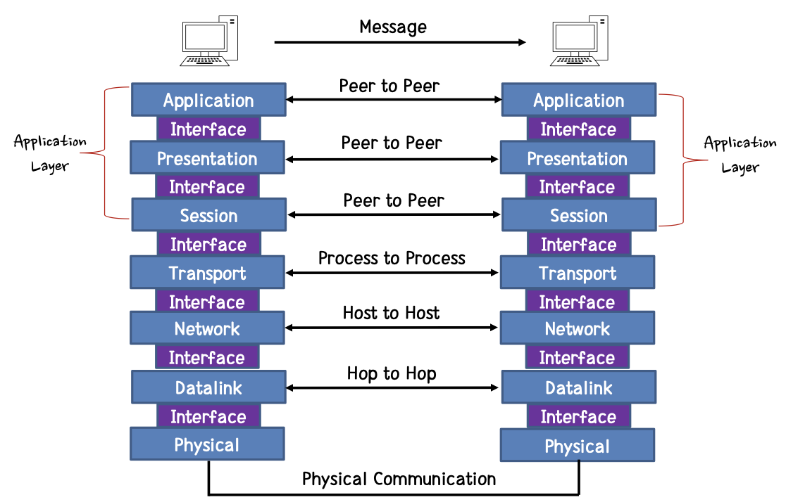

우리는 각 레이어의 목표와 동작방식에 초점을 두어 학습을 진행할 것이다.  

### 7. Application Layer

가장 윗 부분의 계층인 어플리케이션 계층(Application Layer)부터 알아보자.  

이 부분은 유저에게 보이는 부분으로 인터넷 브라우저같은 것들이 되겠다.  
유저와 직접적인 소통(네트워크와 데이터를 주고 받는 작업)이 가능한 부분이다.

### 6. Presentation Layer

여기서는 application 포맷을 network 포맷으로 바꿔주는 작업을 진행한다.(vice versa)  
예를 들어 다음의 작업들이 있을 수 있다.  

- 암/복호화
- 인코딩(e.g. html -> ASCII)
- 데이터 압축

### 5. Session Layer

엔드 유저들 간의 세션을 여닫는 작업을 담당한다.  
즉, 첫 연결을 만들어내는 역할과 비결정적인 길이의 시간안에 데이터를 주고받는 역할을 한다.<small>세션이 열리고 유지되는 시간은 다양하니까</small>  

주요한 기능은 다음과 같다.

1. dialog control : 두 시스템이 하나의 다이얼로그(dialogue)에 들어오도록 하여 누가 전송할 차례인지 추적
2. synchronization : 데이터의 스트림에 동기화 체크포인트를 추가  

결과적으로 이 세션은 'logical connection' 이 되게 된다. 예를 들어 내가 지금 쓰고 있는 기기의 물리적인 위치가 변해도 로그인은 유지되는 것을 생각할 수 있다. 이러한 것은 세션 키가 세션의 유지 시간동안 일정하게 유지되고 있기 때문에 내가 로그아웃을 하지 않고 동일한 세션 키를 유지한 상태라면 로그인이 풀리지 않는 것이다.  

이렇게 세션이 다이얼로그(dialogue)를 유지하는데는 토큰(token)을 이용한다.  

그리고 multiplexing 과 error correction 도 수행한다.  

이렇게 7~5 계층을 통틀어서 application layer 라고 칭하기도 한다.

### 4. Transport Layer

이제 본격적으로 네트워크 간 통신이 일어나는 부분이다.  

_Transport layer_ 는 이름처럼 메시지가 하나의 process 에서 다른 process 로 전송되는 것을 책임지는 계층이다.  
'통신의 신뢰성'이라고 생각할 수 있다.

예를 들어 위에서 언급한 TCP/UDP가 있다.  

다시 정리해보면 TCP 는 reliable, 즉 신뢰할 수 있는 전송을 우선시해서 패킷의 순서가 바뀌거나 유실되지 않는 것을 최우선적인 목표로 하는 프로토콜이 된다.  

UDP 는 빠른 통신을 위한 것으로 신뢰도는 TCP 보다 떨어질 수 있다.  

_Transport layer_ 는 다음의 기능들을 수행한다.

1. 연결 관리(Connection management) <- UDP 는 해당이 없다.  
    이는 연결을 만들고 유지하는 것을 의미한다. 이 때, 두 기기간의 가상 회로(Virtual Circuit)을 만들게 된다.
2. connection multiplexing  
    다양한 어플리케이션이 동시에 데이터를 송/수신 할 수 있게 한다.(소켓<small>socket</small> 활용)  
3. segmentation  
    큰 데이터는 쪼개서 전송할 수 있도록 한다. 받는 입장에서 나중에 모아서 데이터를 재구성한다.
4. 데이터의 전송
    reliable, 즉 신뢰성 있는 전송이라고도 하는데 실제로 신뢰성이 100% 존재하지는 않는다. TCP 가 신뢰성 있는 기능을 해주는 것이고 네트워크상(channel)에서는 유실이 일어날 수 있다. 그러나 완벽한 데이터를 받는 것 같아 보이는 이유는 데이터를 복구하거나 재전송받아 완벽하게 만든 후 위의 layer 로 올려 우리가 볼 때는 신뢰성있어 보이게 되는 것이다.  
5. flow control 과 congestion control  
    보내는 쪽 성능이 좋아 빠르게 보내는데 받는 쪽의 성능이 안좋으면 수신자에 맞춰서 control 하는 것이 _flow control_ 이고, 네트워크의 수용처리량에 맞춰 packet 을 조정하는 것이 _congestion control_ 이다.(e.g. 모두가 한 장소에서 wifi 를 쓰는 상황이라면 네트워크가 한계치까지 로드가 걸릴테고, 이 때 congestion control 이 적용될 수 있다.)

### 3. Network Layer - IP

모든 인터넷 전송 프로토콜은 Internet Protocol(IP) 를 이용해 데이터를 source 에서 destination host 로 전송하게 된다.  

즉 이 IP 계층이 실질적으로 전송을 책임지는 프로토콜이라고 볼 수 있다.  

이때, IP 는 end-to-end 전송을 항상 보장하지는 않고 최대한 노력할 뿐이다.  
이렇게 IP를 거쳐야만 통신이 가능한 원리는, wifi와 lte를 예를 들었을 때 이들 둘은 직접적인 데이터 전송이 불가능하다. 그래서 IP로 변환되어서 데이터가 전송되는 것이 된다.  

여기서 보내게되는(그리고 보내는) 주소가 필요한데, 여기서의 주소는 logical addressing 의 역할을 하게 된다.  

다양한 네트워크들은 함께 더 큰 네트워크를 구성할 수 있다. 이러한 logical addressing 의 주소로 각 기기들이 유니크하게 구별될 수 있도록 해준다.  

___Routing___ 은 쉽게 말해 길을 찾는 것이라 할 수 있다. 네트워크 망에서 데이터를 전송할 때 하나의 길만 있지 않을 수 있으므로, network layer 는 그 중에서 최선의 route(or path) 를 갈 수 있도록 결정해주는 역할을 한다.  

조금 더 있다가 자세히 알아보도록 하자.

### 2. Datalink Layer  

네트워크에서 직접적으로 연결된 것들의 통신을 하는 계층인 _Datalink layer_ 는 패킷의 목적지에 대한 물리적/논리적 연결을 처리한다. 이 때 network interface 를 사용하게 된다.  

이 레이어는 error-free transfer 를 제공하는데, flow control 과 error control 을 통해 이러한 것을 가능케 한다. 여기에서의 flow control 은 앞서 봤던 transport layer 에서의 그것과 scope(범위) 가 다르다.  

조금 더 있다가 자세히 알아보도록 하자.

### 1. Physical Layer

가장 아래쪽에 위치한 레이어이며 물리적인 수준에서 bit stream 을 전송하는 주체이다.  

우리가 하드웨어적인 접근을 하지는 않을 것이기에 다음 기회에 자세히 알아보도록 하자ㅎㅎ

---

이렇게 총 7개의 계층으로 나뉜 통신의 구조는 다음과 같은 이점을 갖는다.  

- 한 계층이 변화해도 다른 계층에 영향을 주는 것을 방지할 수 있다.
- 산업 표준으로 하기에 유리하다.
- 큰 구조를 작게 나누었으니 소프트웨어 개발, 설계, troubleshooting 이 쉬워진다.
- 네트워크 관리자 입장에서도 편하다.<small>?!</small>
- 배우기도 쉽다!<small><small>아...이건 좀... :)</small></small>

## IP(IPv4) 맛보기

이제부터는 IPv4에 대해 간략히 학습해보기로 하자.<small>(위에서도 간략하게 본다고 해놓고 꽤 내용이 많았던 것 같은건 기분탓..)</small>  

_identifier_ 라고 '내가 나임을' 식별하게 해주는 것이 있다.  
이는 _identity_ 와는 다른데, 표로 간단하게 표현해보았다.  

|identity|identifier|
|:---:|:---:|
|나를 표현할 수 있는 __unique__ 한 것|나를 표현하는 identifier, 즉 이름/주소/연락처 등 여러개가 될 수 있다.|  

네트워크에 있어서 이 identifier 는 아래와 같다.

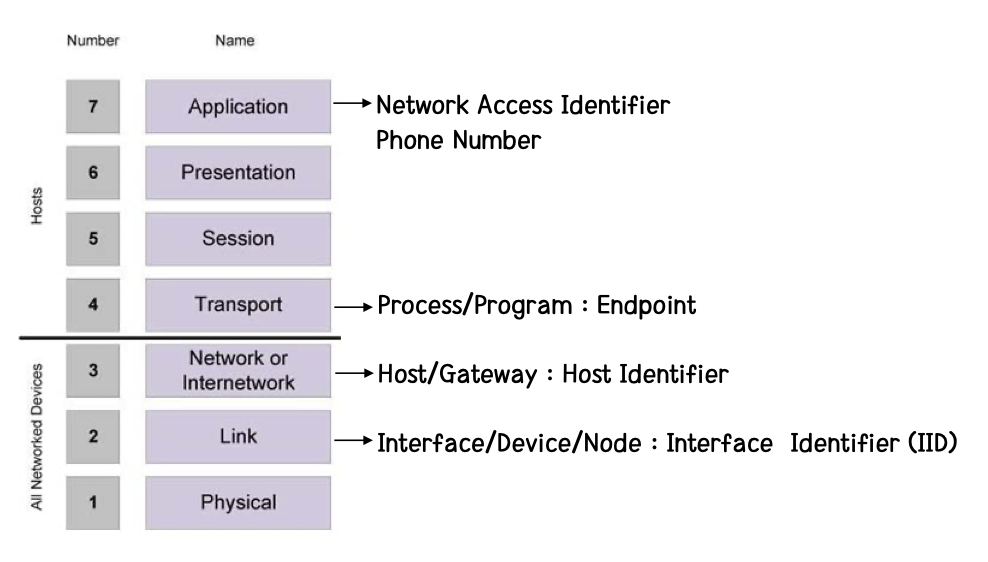

IPv4 주소는 _unique_ 하면서 _universal_ 하다. 그러니까 이 주소는 IP network 상의 기기를 정확하게 식별시켜주는 것이라는 의미다.  

이는 32-bit 로 구성되어 있는데 두가지 표현이 가능하다.

- 128.11.3.4  
- 10000000 00001011 00000011 00000100

IPv4 는 다섯 개의 클래스를 갖는데 이를 classful IPv4 address 라고 하며 IPv4 를 설계할 때 각 클래스는 다음과 같다.

|Class|Description|
|:---:|:---:|
|A|0 으로 시작, network prefix 8-bit(octec 1)|
|B|10 으로 시작, network prefix 16-bit(octet 1, 2)|
|C|110 으로 시작, network prefix 24-bit(octet 1, 2, 3)|
|D|1110 으로 시작, multicasting 을 위함|
|E|1111 로 시작, future use 를 위함(사실 이미 모두 소모됨)|

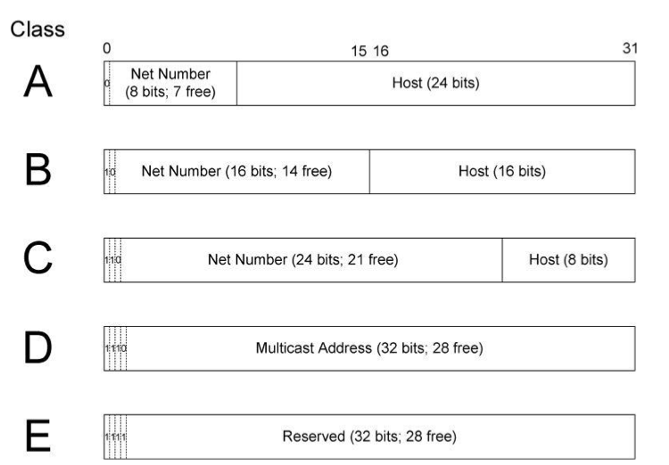

위의 표현법은 비트단위 주소이며 network prefix 는 할당될 때 정해지는 것이고 할당을 받으면 나머지 비트 공간은 관리자가 마음대로 부여할 수 있다.  

예) A 클래스를 할당받으면 무려 $2^{24}$ 개를 할당가능하게 된다.(e.g. 스탠포드 대학교)

아니 근데 network prefix 는 뭐람?  

IP 주소는 네트워크 부분(network part)과 호스트 부분(host part)으로 나뉘게 된다.  
이렇게 앞부분의 network part 는 어디 네트워크인지 구분하게 해주고, host part 는 해당 네트워크의 어떤 호스트인지 식별할 수 있게 해주는 체계인 것이다.  

왜 이렇게 class 로 구성되는 주소체계를 가지게 되었을까?  
이는 결국 관리의 효율성 때문인데, 어떤 기관에서 모든 IP 주소(약 42억개)를 관리하기 어렵기 때문에 조금 더 효율적으로 관리하기 위해 클래스로 나누게 된 것이다.  

이렇게 classful 하게 나뉜 주소를 이용해 routing 과 forwarding 도 수행할 수가 있다.  

이러한 IPv4 주소 체계에서 몇가지 special 한 주소들이 있다.

1. 0.0.0.0 : 이것은 통신을 위해 임시로 넣는 주소로 source 주소로 사용할 때 __자기자신__ 을 의미한다.
2. 0.(HOST) : 이 때 (HOST)부분은 스스로 만들어서 '나'임을 표시한다. 이 때 MAC 주소(48-bit) 를 이용해 이 부분을 만들 수 있다. 0 의 부분은 관리자가 주는 prefix 이다.
3. 255.255.255.255 : local network 에서 broadcast 주소를 의미한다. 이 말은 local network 내의 아무나 내 통신을 받으라는 뜻이다.
4. (Network).(나머지 비트 모두 1) 이는 해당 네트워크의 아무나 내 통신을 받으라는 뜻이다. (e.g. 163.152.255.255 -> 163.152 의 네트워크에 있는 아무나 봐줘!)  
    이는 전체 네트워크가 아닌 특정 네트워크에 대해 broadcast 를 사용하는 것이다.  
5. 127.(아무거나) : 127 은 자기 자신을 나타낸다. 즉 이는 loopback(되돌아 옴)을 의미한다.  
6. 10.(아무거나) 또는 172.16.(아무거나) 또는 192.168.(아무거나) : private 주소이다. 이는 전세계적으로 unique 한 주소가 아닌 속해있는 network 에서만 유효한 주소이다.  
    즉, universally unique 한 74.125.9.1 같은 IP address 를 지닌 것이 관리하는 네트워크 안에 192.168.0.9 가 있을 수 있고, 145.2.45.128 이 관리하는(또는 속한) 네트워크 안에 192.168.0.9 가 있을 수 있다. 이 두 192.168.0.9 는 같은 주소이지만 다른 네트워크에 있기에 서로 다른 기기에 할당된 것이다.  

IPv4 에서는 다음과 같은 세가지 packet forwarding 방법이 있다.

- Unicast : 일대일 통신이고 제일 흔하다.
- Broadcast : 위에서 말했듯이 그냥 다 보라는 것이다.
- Multicast : broadcast 와 비슷한데, 특정한 IP network 들(multi)만 보라는 방법이다.

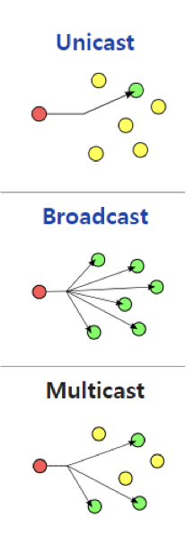

이렇게 IPv4 에 대해 간략히 살펴보았는데, 클래스를 나누는게 조금 이상하지 않는가? A클래스는 대체 몇개나 할당을 받은거야?  

라고 생각하면 정상이다.  
맞다. __비효율__ 적이다.  
또한 이러한 주소 체계는 라우팅에서도 문제가 있는데, 라우팅 테이블(routing table)은 무한정 키울 수 없는 것인데, 너무 많은 entry(개개의 IP address를 기록한 것) 를 가지게 되면 성능이 안좋아질 수 밖에 없게 된다.

이러한 문제를 해결하기 위해 _Classless Inter-Domain Routing(CIDR)_ 이라는 것이 생겨났다. 이는 network prefix 에 변화를 여러 주소를 클래스와 다르게 묶는 방법이다. 이 때 새롭게 바뀐 network prefix 에 대한 정보를 주기 위해 슬래시(/)를 사용한다.  

즉, 원래의 클래스 B는 172.16.0.0 인데 여기다가 __network mask__ 로 255.255.0.0 을 적용해 CIDR 표기법으로 172.16.0.0/16 이라고 표현하게 되는 것이다. 이 의미는 앞의 16개 비트가 network prefix 로 사용되고 있다는 것을 의미한다.

### Subnet Mask

_subnet_ 은 IP 주소 상에서 논리적으로 부분분할된 부분네트워크이다.  

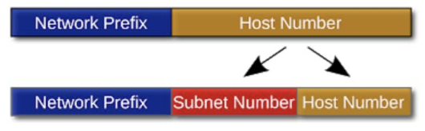

어떤 식으로 계산이 이루어지는 지 예를 통해 알아보자.  

예)

```
192.168.0.1/24  
1100 0000.1010 1000.0000 0000.0000 0001 - IP address  
1111 1111.1111 1111.1111 1111.0000 0000 - Subnet mask(1이 24개)  
1100 0000.1010 1000.0000 0000.0000 0000 - Subnet network(IP address & subnet mask)
```

단순한 &(AND) 연산을 통해 서브네트워크의 값을 구해 낼 수 있다.

이는 IP 주소가 오직 클래스로만 구분지어진다는 문제점 때문에 나타난 것이다.  
만약 어떤 네트워크가 거대한 클래스(A 또는 B)를 할당받고도 주소를 조금 밖에 부여해서 사용하고 있다면 이는 큰 낭비이기에 이러한 subnetting 을 통해서 해당 클래스 내의 다른 IP 주소를 다른 네트워크에서도 사용할 수 있게끔 하는 것이다.  

이러한 서브네트워크(Subnet) 은 site 내에서만 보이며, 이는 다음과 같이 subnetted address 로 변환시키는 것이다.  

또한 이러한 서브넷은 다음과 같은 범위를 같는다.  
예) 127.97 의 네트워크에서 -> 127.97.0.1 ~ 127.97.255.254  
위의 예제에서 0.0과 255.255 가 빠진 것을 알아야 한다. 이들 두 개는 특별한 주소이다.(자기 자신과 broadcast 주소)  

127.97.8.254/24 라고 표현을 해놓았다면, 8은 subnet ID 가 되며 24개의 비트가 subnet mask 라는 의미이다.  

조금 더 이해를 위해 다음의 예제를 생각해보자.  

1. IP address : 201.222.10.60  
    Subnet Mask : 255.255.255.248  
    Class : ?  
    Subnet : ?

    > Class = C, Subnet = 201.222.10.56/29
2. 211.100.10.0/24 의 네트워크를 네트워크당 60개의 호스트를 갖도록 subnetting 할 때  
    1. subnet mask ?
    2. number of subnets?
    3. 가능한 IP address의 개수?
    4. 마지막 서브넷을 대표하는 router 의 주소?  
        > 1. 255.255.255.192 (211.100.10.0/26)
        > 2. 2 * 2 = 4
        > 3. 211.100.10.1 ~ 211.100.10.62 = 62개
        > 4. 211.100.10.192

이렇게 큰 네트워크를 쪼개는 것만 있을까?  
라고 생각할 수는 없으니 작은 네트워크를 늘리는 supernetting 에 대해서도 보고 가자.  
즉, 조금 작은 클래스 C 를 묶어서 하나로 사용하는 것이다. 무엇을 위해? B 클래스를 하나 줘버리는 것보다는 훨씬 효율적이기 때문에!

예를 들어서 생각해보자.  
A.B.32.1~A.B.32.254 / A.B.33.1~A.B.33.254 / A.B.34.1~A.B.34.254 / A.B.35.1~A.B.35.254  
위와 같은 네 개의 C 클래스 주소가 있는데 이들이 모두 한 회사에서 쓰고 있다거나 하는 등의 이유로 하나의 네트워크로 합치고 싶다면 다음과 같게 라우터에 연결되어 supernetting 으로 하나의 네트워크임을 표시할 수 있다.  

A.B.32.0/22 (이전에는 C 클래스 였으므로 A.B.32.0/24 였을 것이다.)

## IPv6

그런데, IPv4 는 고갈났다며?  
그래서 우리는 IPv6 를 만들게 되었다. 이 주소체계는 종전 32-bit 에서 128-bit 의 주소체계로 바뀌게 된 것인데, 어떤 구조를 가지는지 살펴보자.<small>얘는 고갈 안나겠지?</small>

여기서 잠깐, 사실 이 IP 주소는 기기에 할당된다고 보기 보단 interface 에 할당되는 것임을 짚고 넘어가자! 노드가 아니라 인터페이스에 할당된다는 뜻이다. 즉, 하나의 컴퓨터에 세 대의 interface 가 있다면, IP 주소는 세 개가 할당될 수 있는 것이다.  
interface 가 뭔데? 라고 되물을 수 있겠다. 간단하게 설명하면 link 에 달려있는 node 인데, 컴퓨터에 LAN 포트가 2개, WAN 포트가 1개 있다면 세 개의 interface 가 있는 거라고 대충 생각하고 넘어가자.<small>나중에 제대로 정리하는 날을 기다리며...</small>

128-bit 나 되는 이 주소체계는 비트나 10진법으로 표현하기에는 좀 길어서 16진법으로 보통 표현을 하게 된다.  
즉, x\:x\:x\:x\:x\:x\:x\:x 과 같이 표현되는 것이다. 여기서 x는 0~F 까지의 16진법 수 1개에서 4개로 구성된다.  
예) 2001:DB8:0:0:8:800:200C:417A  

또한 이 주소체계가 가질 수 있는 주소의 개수는 너무 많아서 많은 비트가 0으로 채워지는 경우가 있다. 이러한 경우 0을 표현하는 것은 낭비이기에 "::" 라는 표기법으로 16비트 그룹의 0을 생략해 버린다.  

- 2001:DB8:0:0:8:800:200C:417A -> 2001:DB8::8:800:200C:417A
- FF01:0:0:0:0:0:0:101 -> FF01::101
- 0:0:0:0:0:0:0:1 -> ::1
- 0:0:0:0:0:0:0:0 -> ::  

한결 깔끔하게 표현이 되게 되었다!  

모든 인터페이스들은 최소한 하나의 link-local unicast 주소를 가져야하며, 하나의 인터페이스가 여러 개의 IPv6 주소를 여러 개의 타입(uni/any/multicast) 가질 수도 있다.

IPv6 에서도 마찬가지로 subnet 이 가능하며 CIDR 표현법으로 표기할 때 prefix 부분은 10진법으로 표기한다. e.g.)2001:410:0:1:0:0:0:45FF/128

앞서 언급한 세 개의 주소 타입에 대해 살펴보자.

- Unicast : 하나의 인터페이스의 식별자
- Anycast : 인터페이스 집합(set of interfaces)의 식별자
- Multicast : 인터페이스 집합(set of interfaces)의 식별자  

음? anycast 와 multicast 의 설명이 같은데 조금의 차이는 이렇다.  
_anycast_ 는 주변에서 가까운 노드들과의 통신을 하도록 하고, _multicast_ 는 집합 내의 interface 에 모두 패킷이 전송된다.  

_Unicast_ 에는 다음과 같은 것들이 있다.  

1. global unicast address  
    public IPv4 와 동일하며 globally routable 한 IPv6 주소이다.  
    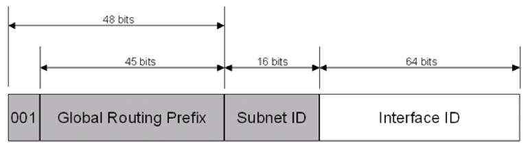  
    첫 비트는 001로 조정되며 현재 글로벌 주소로 사용되는 address prefix 는 2000::/3 이다.
2. link-local address  
    이 주소는 link-local 내에서만 전송되어야 하며 router 를 통과해 밖으로 나가면 안된다.
3. site-local address(사이트 관리자가 할당해야 하는 것으로 이는 개념적으로만 있다)
4. unique local IPv6 unicast address
5. special address  
    unspecified address : 0:0:0:0:0:0:0:0 또는 :: 는 주소가 없을 때만 쓰는 것으로 IPv4 에서의 0.0.0.0과 같다.
    loopback address : 0:0:0:0:0:0:0:1 또는 ::1 은 한 컴퓨터 내에 server-client 구조를 가지거나 내 컴퓨터 안에서만 돌아서 도착해야할 경우에 쓰인다. IPv4 의 127.0.0.1 과 같다.

unicast 의 scope 는 다음의 순서로 넓어진다.  
link-local $\subset$ unique-local $\subset$ global  
각각에 대한 부연 설명을 덧붙이면 다음과 같다.  
link-local scope : 같은 layer 2 domain 에서의 모든 호스트  
unique-local scope : administrative site 또는 multiple distinct link 를 포함하는 도메인 내의 모든 도달할 수 있는 기기  
global scope : 인터넷 상의 모든 도달할 수 있는 기기  

이러한 IPv6 주소는 IPv4 와 당연하게도 호환 가능하지만 아직 많이 쓰고 있지 않은데, 옛날 기기들이 IPv6 주소 체계를 지원하지 않아 호환성 문제가 있기 때문이다. 즉 IPv4 -> IPv6 가 안되서 잘 안쓰는 중!  

### Anycast

이는 물리적으로 다른 두 개의 서버가 같은 anycast 주소를 씀으로써 구현되는데, 이 두 서버가 기능적으로 같은 동작을 한다면, 같은 주소를 써서 클라이언트와 가까운 서버가 응답할 수 있도록 하는 것이다. 이렇게 해서 같은 anycast 주소라면 한 쪽이 고장나도 다른 쪽에서 응답이 가능해진다.  
이는 traffic loadbalancing 과 네트워크 중복(network redundancy)에 쓰일 수 있다.  

여기서 잠깐, 라우터가 어떻게 가장 가까운 path 를 찾는지 언급하고 넘어가자면, router 들 끼리는 routing protocol 을 계속해서 돌리면서 계산을 꾸준히 해주고 있다. 그래서 anycast 를 쏘면 알아서 잘 찾아가게 된다고 보면 된다.  

### Multicast  

이는 prefix 를 하나 만들어 놓고 그 link 내에서 알아서 통신하라는 의미이다.  
따라서 이 주소는 source 주소로 이용될 수 없다.  
주요 목적은 link bandwidth 를 줄이기 위함이다.

__Modified EUI-64 format__ 은 알아서 64-bit 의 interface ID 를 만들어내는 것이다.  
쉽게 설명하면, 이런 통신이 가능한 기기를 만드는 회사들에는 고유한 prefix 가 있고, 이 회사에서 나머지 부분의 주소값은 unique 하게 회사에서 부여한다. 이것이 기기별로 들어가는 MAC 주소가 되는데 이 MAC 주소를 이용해 interface ID 를 스스로 만들어내서 사용할 수 있도록 하는 방법이다.  
이렇게 주소를 만들어 낼 경우 운이 나쁘면 충돌할 수 있는 경우가 생기게 되고, 이러한 일을 방지하기 위해 해당 기기 주변에서 이 주소를 쓰는 사람이 있는지 찾아서 unique 함을 보장 받아야 한다.  
이와 반대로 DHCP 서버를 이용해 주소를 할당 받는 방법이 있는데 이 방법은 DHCP 서버가 IP 주소를 관리하므로 이와 같은 충돌의 문제는 발생하지 않는다.  

### Solicited-Node multicast address

unicast address 가 interface 에 할당될 때 이에 대응되는 solicited-node multicast address 가 자동적으로 사용 가능하게 된다. 이 주소는 local-link scope 를 가지게 된다.

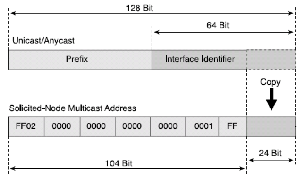

이렇게 변환되는 주소는 다음과 같이 사용된다.

예) unicast address : FE80::2AA:FF:FE28:9C5A -> converted Solicited node multicast address : FF02::1:FF28:9C5A,  
이 때, FF02::1:FF 가 prefix 가 되고, 나머지 24-bit 를 그대로 사용하게 된다.  

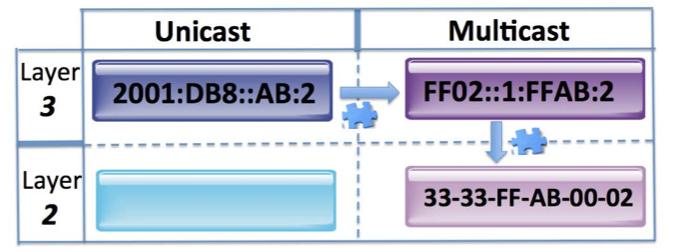

이는 A->B 통신에 있어서 A의 MAC(layer 2) -> B layer 2 => IP 로 올림 과 같은 방식으로 MAC 주소를 불러온다.

그래서 이것을 왜 하는데? 쉽게 생각하면 MAC 주소를 탐색하기 위함이다. Neighbor Discovery Protocol(NDP)이 연결 가능성을 검색하기 위해 사용하는 주소라고 대충 이해하고 넘어가자.

IPv6 에서는 broadcast 가 사라졌는데 이는 좋지 못하기 때문이다. 아무한테나 뿌리는게 어찌 좋겠는가?

## Transport 와 Datalink

transport layer address 에서 unique endpoint 는 network layer address + port 가 된다.  

이때 TCP 또는 UDP 가 사용되는데,  

- UDP : local endpoint  
  - IPv4 : Port = 4+2 bytes
  - IPv6 : Port = 16+2 bytes  
- TCP : <local,peer> endpoint  

가 된다.

이 port 는 자신의 기기(컴퓨터)에서만 unique 하면 되며, Application-to-Application 간에 port 번호를 통해 통신할 수 있도록 하는 것이다.  
즉, 어플리케이션간의 통신을 구별짓기 위한 추가적인 정보(port)라고 생각할 수 있다.

이는 IP layer에서 Transport layer 로 올릴 때 목적지 IP 주소가 자신일 경우 올리게 되는 것이고, transport layer 에서는 port 번호만 보고 위의 application 중 해당하는 port 에다가 패킷을 올려버리는 것이다.

TCP 는 local IP, local port, remote IP, remote port 총 네 개의 쌍이 필요하며,  
UDP 는 local IP, local port 총 두 개의 쌍이 필요하다.

port 번호는 random 하게 할당한다고 보면 된다.(몇몇 정해진 port 제외)  

### Socket

소켓(Socket)은 application 과 kernel 이 통신하기 위한 하나의 인터페이스(또는 문)이라고 생각할 수 있다.  
이 소켓에 정보를 담아 통신을 하게 되는데, 이 때 Application layer 에서 transport layer 로 반드시 목적지(통신하고 싶은 상대)의 IP 주소를 알려줘야 한다.  
이걸 어떻게 알아서 넣어주냐고? 어떻게든 찾아내서 넣어주어야한다! 이는 조금 있다가 더 알아보자.  

Internet protocol 그림 페이지?
각 프로토콜에서 상위 layer 로 올릴때는 각각 다른 필드(field)를 보고 부합하면 올리고 아니라면 넘겨버린다.  
방금 전 위에서도 언급을 하였지만, 다시 한 번 더 설명해보면 다음과 같다.  
IP layer 에서 목적지 주소만 보고 이 주소가 나의 주소가 맞다면 상위 layer 로 넘기게 된다.  
transport layer 에서 TCP 를 쓰고 field 를 봤을 때 protocol == TCP 라면 위로 올린다. 위에서는 이제 소켓이 패킷을 받게 된다.

### Link Layer

_Link Layer_ 에서는 아까도 잠깐 언급했듯이 orgarnization(회사)에 할당된 주소 3 octets 과 나머지 3 octets 은 회사에서 알아서 unique 하게 배분한 주소인 MAC 주소를 다룬다.  

이렇게 24-bit 씩 총 48-bit 를 가진 MAC 주소가 만들어지는데, 이 자신의 MAC 주소로 Multicast 주소를 만들어서 사용하게 된다.  
예를 들어, device A가 2001::AA:BB 라는 주소라면, 이는 33:33:FF::AA:BB 로 multicast 주소를 만든다(주소를 만드는 방법 : 앞에 33:33:FF 로 고정, 뒤에 나머지는 (상대 IP의) 나머지 주소).  
상대방의 IP 주소를 사용하기에 콕 집어서 보낼 수 있고, Layer 2 에 Solicited IP 주소를 바로 알려주어야 한다.  

이것이 IPv6 에서 수신자 layer 2 의 입장으로 본 packet 을 받았을 때 내것인지 확인하는 과정이다.(IPv4 는  broadcast 로 아무나 받아라)

아 갑자기 무슨 소리세요? 라고 생각할 것이다.  

여기서 Application layer 에서 부터 상대방으로 가는 경로(통신의 과정)가 어떻게 이루어지는지 단계별로 살펴보자.  

___A->B___  

1. application layer 에서 소켓을 생성하고 상대방 IP 주소를 얻는다.(DNS 이용) 이 주소를 소켓에 담아 transport layer 로 전송한다.(내 IP, port, destination IP, destination port) 여기서 서버의 port 는 well-known 이다. 즉, 이거 정도는 알려져 있다는 뜻이다.  
2. transport layer 에서 IP layer 로 목적지 IP 주소를 알려주게 된다.
3. next hop 의 주소를 구한다.(routing table 이용)
4. IP layer 에서 Data-link layer 로 next hop 의 IP 주소를 알려준다. 이 IP 주소는 (최종)목적지 IP 주소와는 다른, 현재 IP layer 가 바라보는 다음 IP layer 의 IP 주소이다. 즉, 중간에 있는 어떤 기기가 된다.(라우터라던가)
5. data-link layer 에서 질문을 돌린다. 이 질문은 다음 IP layer (방금 위에서 설명한 것) 까지 도달하게 된다. (중간에 없이 바로 도달할 수도 있다.) 이 질문에는 A의 MAC 주소가 source 로 들어가고 destination 은 next hop 의 IP 주소에서 따와서 만들어 낸 33:33:FF:(IP 주소 따온 것의 나머지) 가 들어가 있다.
6. 이 중간 기기 C 가 이 질문은 받았을 때 확인하는 방법이 바로 위에서 뜬금없이 설명했던 과정이다. C 가 next hop 이 자신임을 알았으므로 답신을 보낸다. 이것이 다시 A 까지 도달하게 된다.
7. 이제 Data-link layer 의 next hop 도 찾았다. 나머지는 physical layer 에서 실제 bit stream 을 전송하면 된다.
8. 반복해서 B 까지 보낸다.

## DHCP

_DHCP(Dynamic Host Configuration Protocol)_ 을 우리말로 우선 바꿔보자. 직역하자면 동적 호스트 구성 프로토콜. 무엇을 구성한단 말인가?  

자신의 IP 주소가 되겠다. 처음에는 할당받지 못한 상태이니까 IP 주소가 없는 상태이고 네트워크에서 통신하기 위해서는 IP 주소가 반드시 필요하기 때문이다.  
위에서 A->B 로의 통신 경로를 학습했는데 전체적인 흐름을 다시 정리해보면 다음과 같다.  

1. 내 IP 주소를 어떻게 얻는가? DHCP 로 얻는다!
2. 상대방의 IP 주소는 어떻게 얻는가? DNS protocol(도메인 네임을 DNS protocol에 보내면 IP 주소로 변환해준다.)로 얻는다!  
3. transport layer 에 알려준다.(source port 는 알 수 있고, destination port 는 Application layer 에서 보통 알려주는데 서버측 port 는 well-known 이다.)  
4. IP layer 에는 (최종)목적지 IP 주소를 넘겨준다. 이를 routing table lookup 을 통해 IP 가 보는 next hop 의 IP 주소를 알게 된다.
5. Datalink layer 에서 목적지 IP 는 위에서 구한 next-hop 이 같은 link 상이라 볼 수 있고, 이를 IP layer 에서 알려준다. MAC 주소를 쓰기 때문에 MAC 주소를 찾는 protocol(IPv4:ARP, IPv6: NDP)를 사용한다.  

Solicitation Multicast 를 조금 더 복습해보자.  

예) AA:BB::FEE4:0 일 때, link-layer 의 주소?  
일단 아는 것은 목적지 IPv6 주소이고, 알고싶은 것이 목적지 MAC 주소가 된다. 이 때, IPv6 에서는 broadcast 를 쓰지 않기 때문에 destination 주소를 알기 어려워지는데,  33:33:FF 로 앞을 채우고 뒤에는 IP 주소를 가져와서 link-layer 주소로 만들고 IP가 link-layer 에 알려주도록 한다. 이 주소를 받게 되면 자신에게 온 것임을 알 수 있기 위해.  
이렇게 목적지 IP로 주소를 만들어서 NDP 를 통해 쏴주면 상대방에서 받을 수 있게 되는 것이다.  

---

이제 본격적으로 _DHCP_ 에 대해 알아보자.  

IP 주소를 할당하기 위해 존재하는 프로토콜인데, IP 주소 할당을 위한 서버인 DHCP 서버가 이를 관리한다. 이러한 서버 없이도 내 컴퓨터 주소를 static 하게 할 수 있으나 이 방법은 관리가 힘들게 된다.  

사실 IP 주소만 있다고 통신이 되는 것은 아니기에 DHCP 서버로부터 꽤 많은 정보를 받게 된다.  

이런 DHCP 서버는 host-specific configuration parameter 를 호스트에게 전달해주는 역할을 수행한다.  

DHCP 는 application-layer protocol 이다. 다음의 세 가지 매커니즘을 통해 IP 주소를 할당하게 된다.

- 자동 할당(automatic allocation) : client(host) 에게 영구적인 IP 주소를 준다.
- 동적 할당(dynamic allocation) : 기간 제한이 있는 IP 주소를 할당한다.
- 수동 할당(manual allocation) : 관리자가 직접 할당한다.

DHCP 는 이렇게 할당하는 주소가 unique 함을 보장할 수 있어야한다.  
또한 client 가 재부팅할 때에도 해당 client 에게 동일하게 재부팅할 수 있어야하며, 새로운 client 에게 자동적으로 parameter 들을 구성해줄 수 있어야 한다.  

이는 다음과 같은 순서로 진행이 된다.

1. Discover : 클라이언트 쪽에서 IP 주소를 할당받기 위해 DHCP 서버를 찾는다. 이 때 전송하는 패킷에서의 src 주소는 0.0.0.0 이 되고, dst 주소는 255.255.255.255 가 된다.
2. Offer : 해당 패킷을 받은 서버(DHCP)에서 A 라는 주소를 쓰라고 제안을 하게 된다. 이 때 전송하는 패킷에서의 src 주소는 B(DHCP 서버의 주소), dst 주소는 255.255.255.255 가 된다.
3. Request : 해당 패킷을 받은 클라이언트 측은 해당 주소를 쓰겠다고 요청한다.(또는 다른 주소를 요청할 수도 있음) 이 때 전송하는 패킷에서의 src 주소는 0.0.0.0(아직 할당을 받은게 아니기 때문에), dst 주소는 255.255.255.255가 된다.  
    > 왜 dst 주소가 B(DHCP 서버 주소)가 아니라 255.255.255.255 일까?
4. Acknowledge : 해당 패킷을 받은 서버는 IP 주소와 함께 필요한 정보들(DNS 서버 주소 등)을 담아 클라이언트에게 전송. src 주소는 B, dst 주소는 255.255.255.255 이다.

위의 과정이 모두 완료되어야 비로소 client 의 interface 에 IP 주소가 할당된다.  

그 뒤로 IP 주소 갱신(renew)가 필요할 경우에는 3, 4의 과정만 반복한다.  

그런데 라우터는 255.255.255.255 인 목적지 주소를 가진 주소에 대해 통과시켜주지 않는 경우가 대부분이다. 그러나 이렇게 주소를 할당받기 위해 어쩔 수 없이 패킷을 통과시켜줘야 할 경우가 있는데(현재 망 안에 DHCP 서버가 없어서) 이 때는 router 에 relay agent role 을 부여해 255.255.255.255 주소를 DHCP 서버의 주소로 바꾸게 한다.

### DHCP message format  

DHCP message 의 format 에서 각 필드들이 어떤 의미를 가지는지 알아보자.  

- Message Type(op) : 1 - reg / 2 -res  
- Ethernet(htype)  
- HW length(hlen) : 이더넷(Ether)는 6이다.  
- Hop : relay agent 를 넘어갈 때 마다 +1  
- Transaction ID(xid) : random하게 부여한다. 이는 고유한 아이디 값으로 이를 통해 복수의 DHCP 서버로 부터 응답 메세지를 받아도 식별할 수 있으며, 마찬가지로 복수의 클라이언트로부터 메세지를 받아도 식별할 수 있게 된다.  
- Secs : 부팅 이후 경과 시간(초)
- Flags
- __ciaddr(Client IP address)__ : 클라이언트 IP 주소로 할당 전에는 0.0.0.0
- __yiaddr(your (client)IP address)__ : 서버가 보는 client 의 ID 로 서버가 보는 것에는 쓰여있다. 즉, 할당될 IP 주소
- siaddr(IP address of next server to use in bootstrap) : bootstrap 에서 사용하기 위한 서버의 주소. dhcp offer/ack 에서 자신의 IP 주소를 돌려주게 된다.
- giaddr(Relay agent IP address) : relay agent 가 보내야 있는 정보
- chaddr(Client hardware address) : 요청한 클라이언트의 MAC 주소
- sname(Optional server host name) : 서버 호스트 이름
- __options(Optional parameters field)__ :
  1. prefix : 어디까지가 prefix 인지 알려준다.
  2. default gateway address : routing table 에 목적지에 대한 정보를 알 수 없을 때 보내야한 GW 의 주소. 보통 end 단에서는 목적지 주소를 알기 어렵기에 default GW 로 많이 보내게 된다.
  3. DNS server address : DNS 서버와 통신 할 수 있도록 알려준다.

DHCP 는 패킷을 잃어버리거나 손실해도 큰 문제가 없기에 UDP 를 사용한다.  

DHCP 서버는 여러 대가 존재할 수 있는데, 이 때 broadcast 로 받은 모든 서버들이 클라이언트에게 응답하게 된다. 이 때 클라이언트는 하나의 서버를 선택해 다음 과정을 진행하게 된다.  

이런 DHCP 의 이점은 아래와 같다.

- 중앙 관리형이라 관리가 쉬움.
- 동적으로 호스트 구성이 가능
- 원활한(Seamless) IP 호스트 구성이 가능.
- 유연하고 확장가능하다(서버를 여러 대 둘 수 있기 때문에 자연스럽게 생기는 이점)

그러나 DHCP 서버는 할당이라는 개념 때문에 공격받을 수 있는데, 계속 request 를 보내 IP 주소풀을 고갈시키는 공격이 가능하고, 같은 link 내에서 spoofing 을 통해 패킷 정보를 알아내 공격자가 default router 라고 속여서 패킷에 대한 정보를 빼 낼 수 있게 된다.  

또한, 고정 주소(static) 을 사용하는 네트워크의 경우 다음의 예시와 같은 문제가 있을 수 있다.  
예) gateway 주소가 192.168.0.1 이고 192.168.0.2~192.168.0.10 까지 static 으로 사용되고 있을 때, 할당 가능한 IP 주소의 풀이 192.168.0.2 부터 시작하게 된다면 충돌이 일어나 인터넷이 안되게 될 수 있다.  
이러한 문제점을 해결하기 위해서는 주소풀을 옮기면 해결된다.

## DNS

_DNS(Domain Name System)_ 는 도메인 이름과 IP 주소를 매핑하기 위해 이용된다.  
사람은 숫자보다 문자열을 더 외우고 식별하기 용이한데, 단말의 주소는 숫자로 구성되어 있으니 이러한 불편함을 해소하고자 만든 시스템이 되겠다.  

DNS 는 세 가지 component 를 가진다.

- Domain name space  
  흔히 우리가 생각하는 주소(e.g. www.google.com) 에서 뒤로 갈 수록 상위 도메인이 된다. 또한 원래는 com 뒤에도 . 을 찍어야 하나 편의성을 위해 생략하는 것이다.
- Name Server  
  DNS 서버는 여러 개가 있을 수 있다. 이들은 numeric IP address 와 이에 대응되는 domain name 을 알고 있다. 어떤 주소에 대한 요청이 들어왔을 때 이를 테이블에서 lookup 하고 없다면 다른 DNS 서버에서 그 정보를 찾을 수 있게끔 되어있다.
- Resolver  
  이 resolver 가 도메인 이름으로 IP 주소를 찾을 수 있도록 작동하는 프로그램이다. 보통 중간 network node 에 위치시키는데, 이 resolver 의 작동 방식은 2가지다.  
  1. iterative  
  iterative(반복적) 방식은 해당 서버에서 하나씩 반복적으로 쿼리를 다른 곳으로 날리면서 주소에 대한 정보를 알아보는 방식이다.
  2. recursive
  recustive(재귀적) 방식은 해당 서버에서 다른 서버로 쿼리를 날리는데, 이 때 해당 쿼리를 받은 서버에서 알아서 정보를 모아서 요청한 서버로 응답을 해주는 방식이다.

  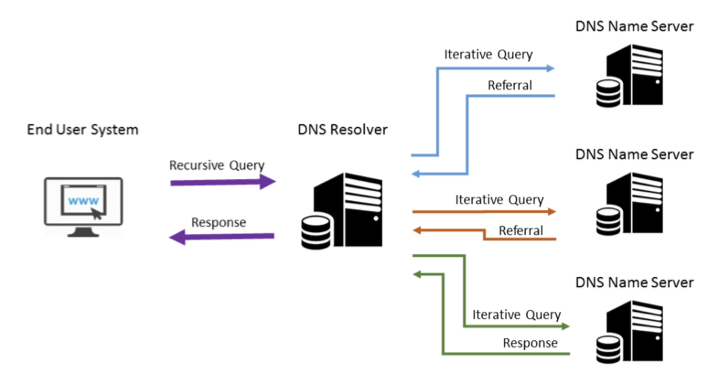

_delegation_ 은 쉽게 생각해서 DNS 서버 관리 영역을 zone 과 같은 것으로 자르는 것이다.

## IP 좀 더 맛보기

여기까지 네트워크에서 어떻게 통신이 이루어지는지 간략하게<small>(정말 간략한 것일까 이게?)</small> 살펴보았다.  

그 중에서도 핵심적인 _Internet Protocol(IP)_ 에 대해서 조금 더 학습해볼까 한다.

IP 는 source 에서 destination 까지 datagram 을 잘 전송하는 것이 그 목적이며, packet-switched 통신에서 사용되고자 설계되었다.  

다음과 같은 두가지 기능이 있는데 __addressing__, __fragmentation__ 이 되겠다.  

_Routing_ 이라고 부르는 path 를 찾는 과정은, routing protocol 을 사용해서 가능하게 한다. IP 는 routing table 을 가지고 있는데 여기에 기록된 정보를 가지고 목적지로 가는 경로(path)를 찾아내게 된다. 이 테이블에 기록할 수 있도록 routing protocol 이 계속 정보를 수집하게 되고, 이 정보로 next hop 에 패킷을 넘기게 되는 것이다.  

즉 IP 는 routing 을 한다기 보다 그 결과물을 input 에 사용하는 것이다.(실제는 routing protocol 이 하는 것이라고 보면 됨)  

IP datagram 에는 __Header__ 와 Data 두 부분이 있는데, Header 에는 다양한 정보가 담긴다.  
이 헤더의 정보를 보고 어떤 정보를 나타내고 있는지 알 수 있어야 한다. 한 번 살펴보자.  

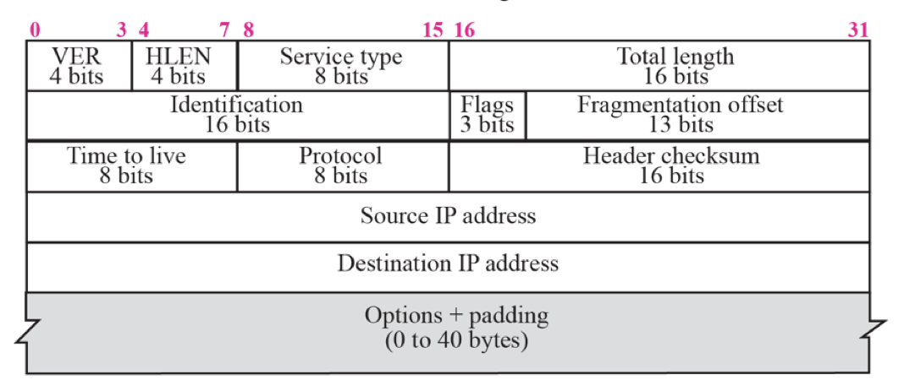

헤더의 크기는 보통 20bytes 인데, options 이 추가되어 60bytes 까지 늘어날 수 있다.  

- Version : IPv4 또는 IPv6
- Header Length(HLEN) : 4byte(32-bit) 단위로 헤더의 길이 표현
  > HLEN = 8 이라면 options 의 길이는? : 32-20 = 12 bytes
- Total Length : byte 단위로 헤더를 포함한 전체 datagram 의 길이 표현
- Protocol : next level protocol 을 의미한다.(1:ICMP, 2:IGMP, 6:TCP, 17:UDP, 89:OSPF)
- Type of Service(Tos) : QoS 를 지원하기 위해 필요하다.
- Tmie to live(TTL) : 남은 시간을 의미한다. 이는 node 를 하나 거칠 때 마다 TTL 이 1 씩 감소하게 되는데, 패킷이 네트워크 공간에서 영원히 떠도는 것을 방지하기 위해 부여한다.(windows:128, UNIX:64, others:255)
- Address : IP 단에서 명확하게 알아야 할 정보로써, 노드는 unique 하게 구분짓는 identifier 이자 특정 노드가 위치한 locator(network field(prefix))로도 작용한다.
- identification : 다른 datagram 의 fragment가 섞이지 않도록 구별해주기 위한 필드
- fragment offset : 수신자에게 해당 패킷의 datagram 이 original 의 어디서부터 잘려서 온 것인지 알려주는 필드. 8-octet(64-bit) 의 단위로 계산된다.
  > offset value = 800 으로 도착한 패킷의 HLEN=5, total length=100 이라면 first byte 와 last byte 의 숫자는 어떻게 되는가?  
  > HLEN=5 이므로 헤더 길이는 20-byte, 전체 길이가 100-byte 인 패킷이므로 data 의 길이는 80-byte 가 된다. 즉, __800~879__ 가 된다.
- flags : datagram 을 재구성하는데 필요한 정보를 담는다. 3-bit 이며 하위 2개의 비트는 다음과 같다.
  - D : Do not fragment, 이 flag 가 활성화되어 있을 경우 datagram 을 네트워크 상에서 fragment 하지 않고 보내게 된다. 이는 특별한 경우로, 수신자 입장에서 datagram 재조립 능력이 부족하거나 할 때 사용하게 된다. 이렇게 되면 end 에서 fragmentation 을 따로 해서 보내게 된다.
  - M : More fragment, M=0 일 경우 마지막이다. 이 datagram 을 받으면 재조립을 수행한다.
  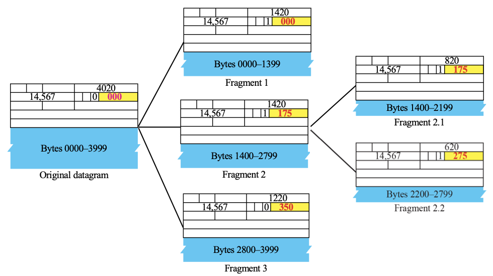
  위의 예제에서 MTU=800 인 것으로 보인다.
- header checksum : 헤더로만 계산하는 checksum 으로 헤더가 (악의적으로)변경되었는지 체크한다. checksum 방법은 헤더를 2-byte 로 배열해 &(AND) 연산을 취한 뒤 1의 보수로써 계산한다.
  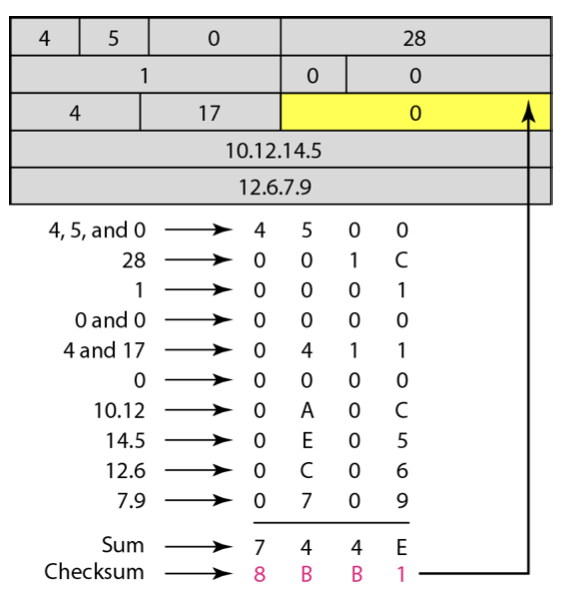

### Fragmentation

_fragmentation_ 는 큰 datagram 에 대해 잘라서 보낼 수 있도록 하는 것이다.  
헤더에는 이와 같은 정보도 함께 담기는데, 이때 네트워크 망이 수용할 수 있는 _Maximum Transmit Unit(MTU)_ 의 내에서 datagram 이 전송될 수 있도록 자르게 된다.  

### Routing and Forwarding

_Forwarding_ : 패킷을 어디로 보내는 행위  
_Routing_ : 어디로 보낼지 찾는 행위  

forwarding 에는 direct forwarding 과 indirect forwarding 이 있다.  

- direct forwarding : 목적지가 같은 link-local 내에 있을 경우 가능
  이는 network prefix 를 보고 금방 판단할 수 있는데, 같은 network 에 있는 것이 prefix 를 통해 확인이 되면 같은 네트워크 안에서 (아마 많은 장비들을 거쳐서) 전송되게 될 것이다. 같은 네트워크 안에 있기에 목적지를 찾는 것이 수월하다.(ARP 테이블 어딘가에 기록되어 있음)  

  ```
  B->A 의 경우
  src-MAC = MAC-B / dst-MAC = MAC-A (datalink layer(level 2))
  src-IP = IP-B / dst-IP = IP-A (IP layer(level 3))
  ```

- indirect forwarding : 목적지가 어딘가 다른 곳에 있을 경우  
  이 경우에는 같은 네트워크 안에 목적지가 존재하지 않으므로 gateway 를 거쳐서 외부로 나가야 한다.  

  ```
  B->D 의 경우 (GW: C)
  src-MAC=MAC-B / dst-MAC = MAC-C (datalink layer(level 2))
  src-IP=IP-B / dst-IP=IP-D (IP layer(level 3))
  ```

이처럼 direct 와 indirect 에 있어서 패킷에 담기는 정보가 다른 것을 확인할 수 있다.  

routing table 을 보는 방법은 routing table 에 기록된 interface 에 목적지 ip 주소가 매칭이 되는지 안되는지를 살펴보면 가능한데, 이 때 테이블을 lookup 하면서 일치하는 entry 가 있더라도 lookup 을 멈추지 않고 끝까지 보게 된다. 왜냐하면 여러 개의 entry 에 대해 매칭이 일어날 수 있는데, 가장 scope 가 적은 것(prefix 가 가장 긴 것)을 채택하게 된다.  
default gateway 의 경우 항상 일치하게 되는데, 여러 개의 default GW 가 있을 수 있다. 이럴 때는 metric 을 이용해 GW 의 우선순위를 정해놓는다.  

게이트웨이는 routing 과 관련해 최적의 path 에 대한 정보를 많이 가지고 있어서 어떠한 요청에 대해 더 빠른 길이 있으면 ICMP redirect message 를 통해 그 경로를 알려주게 된다.(e.g. A->B 의 직접적인 경로가 있는데 GW 에 물어보는 경우)

GW 는 보통 여러 개를 두는데, 이는 하나의 GW 가 죽더라도 통신이 가능하게끔 하기 위함이다. 어떤 router 가 GW 가 되면 해당 네트워크에 주기적으로 이 network 에 속해있다는 메세지를 뿌리게 된다. 이 메세지가 어느 순간 도달하지 않게 되면 해당 GW(router)가 죽은 것임을 알 수 있게 된다.

> 이 글은 컴퓨터 네트워크를 공부하면서 정리한 글 입니다.  
> 틀린 것이 있다면 댓글로 알려주세요!  
> 감사합니다 :)
