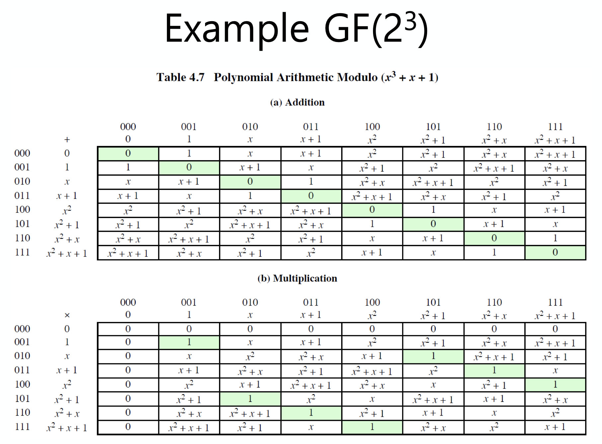
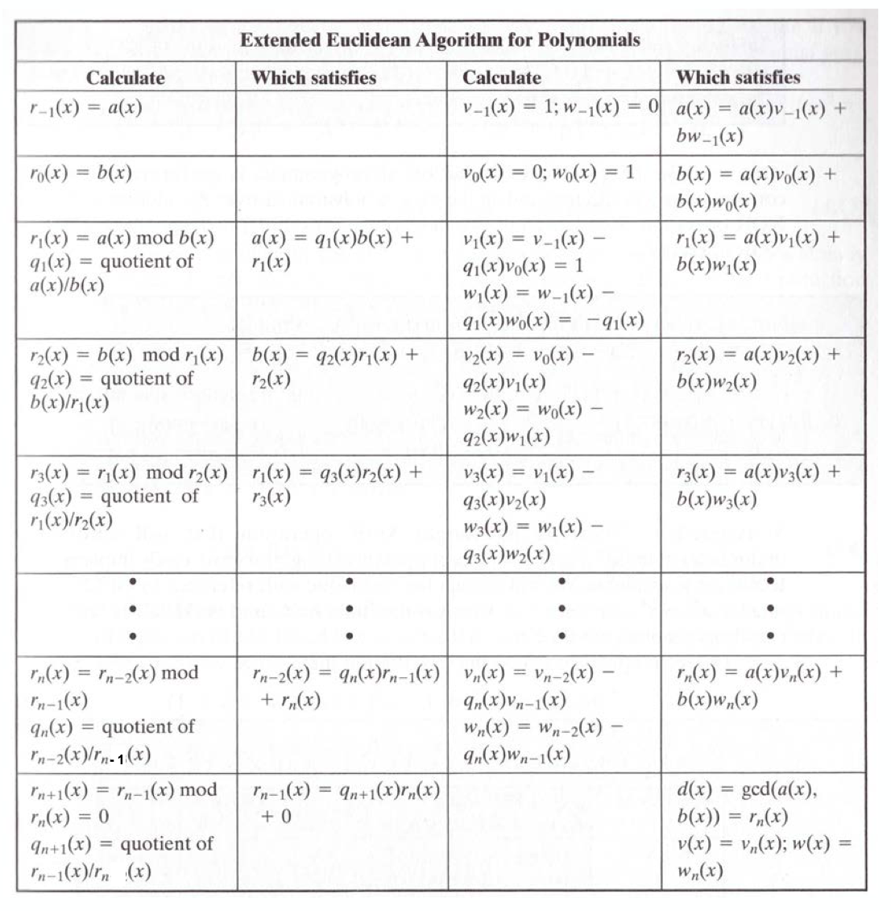
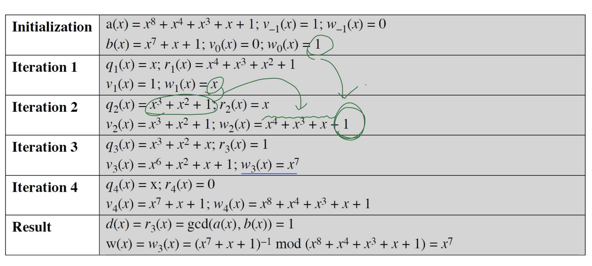
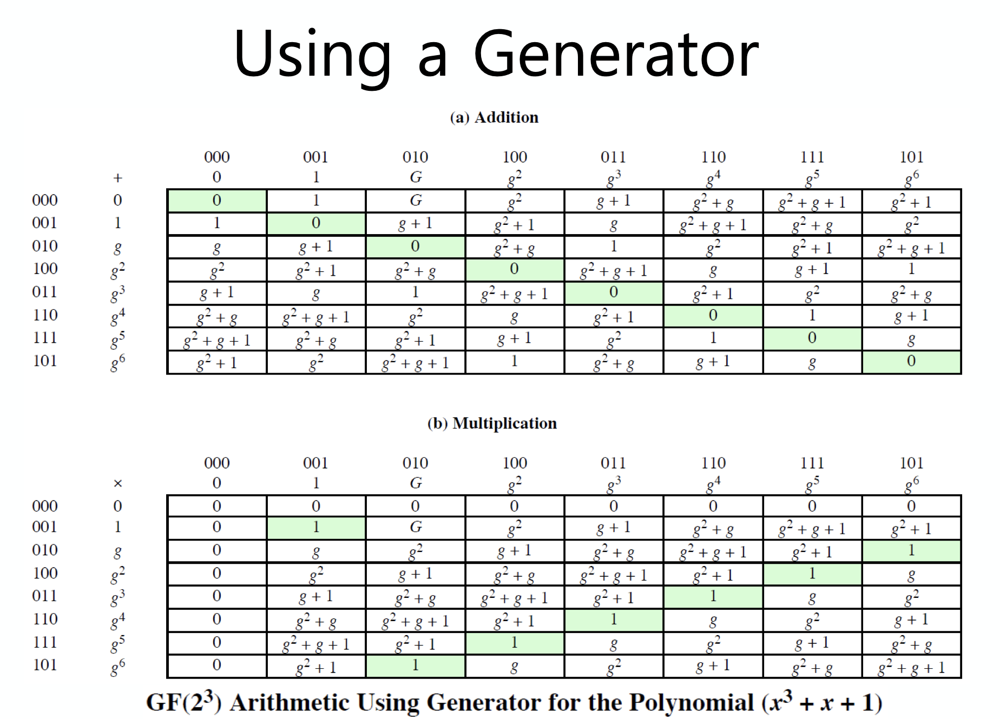

정보보호와 암호학에 대해 공부를 하다보면 마주하게 되는 수학이 있다.  
여기서 정수론(Number Theory)에 대해 간략하게 맛보고 가보자.  

왜 정수론의 내용이 필요할까?  
아마 이런 이야기를 들어봤을 수도 있겠다.  

> 소수를 구할 수 있는 공식이 발견되면 암호체계가 붕괴될 것이다!  

<small>그러나 그런 일은 벌어지지 않았다고 한다...</small>  

위의 말이 틀렸다고 볼 수는 없다. 소수를 이용한 암호화 알고리즘들이 존재하기 때문이다.  

정수론. 각종 수에 대한 성질을 대상으로 하는 수학의 한 분야이며, 소수와 같은 것을 다루는 학문이다.  

수학이 조금 어려울 수 있으나, 여러 암호체계에서 이용되는 정수론의 기반 내용을 모르면 작동 방식이나 원리를 이해하기 어려우니 최선을 다해보자! ^_^

## Euclidean Algorithm

유클리드 알고리즘은 두 양의 정수에 대한 최대공약수(Greatest Common Divisor, GCD)를 구하는 알고리즘으로 gcd(60, 24) = 12 와 같은 결과를 의미하게 된다.  

여기서 gcd(0 0) = 0 으로 정의한다.  

만일, gcd(a, b) 에서 a와 b 가 서로소(relatively prime)라면, gcd(a, b) = 1 이 된다.  

이 알고리즘의 작동 방식은 매우 간단하다.  

$$
a = q_1b + r_1 \qquad \text{ 0 < } r_1 \text { < b } \\
b = q_2r1 + r_2 \qquad \text{ 0 < } r_2 \text { < } r_1 \\
r_1 = q_3r_2 + r_3 \qquad \text{ 0 < } r_3 \text { < } r_2  \\
... \\
r_{n-2} = q_nr_{n-1} + r_n \qquad \text{ 0 < } r_n \text{ < } r_{n-1} \\
r_{n-1} = q_{n+1}r_n + 0 \\
d = gcd(a, b) = r_n
$$

### Modular Arithmetic

모듈러 연산(Modular Arithmetic)은 $a \mod{n}$ 과 같이 표현이 된다.  
이것이 의미하는 바는 $a$ 를 $n$ 으로 나눴을 때의 나머지 $r$이 된다.  
이 $r$ 을 residue 라 부르며, 예를 들면 다음과 같다.  

```
12 mod 7 = 5  
```

이 때, $a = qn + r$ 을 만족하여, $0 \leq r \lt n$, $q = \lfloor a/n \rfloor$ 을 만족해야한다.  
다음의 예제를 보자.  

```
-12 mod 7
= -5 mod 7
= 2 mod 7
= 9 mod 7
```

여기서 중요한 점은 r 이 0이상이어야 한다는 것이다.

#### congruent modular

합동(congruent modular)은 어떤 두 수를 하나의 수로 나눴을 때 나머지가 같은 관계를 의미한다.  
즉, $a \mod{n} = b \mod{n}$ 의 식을 만족하며 이 때,

$$
a \equiv b \quad \left( mod \ n \right)
$$

로 나타내게 된다.
예를 들면 다음과 같다.

$$
73 \equiv 4 \left( mod \ 23 \right)
$$

이러한 모듈러 연산은 다음과 같은 속성을 가지고 있다.

$$
\left[ \left( a \mod{n} \right) + \left( b \mod{n} \right) \right] \mod{n} = \left(a + b \right) \mod{n} \\
\left[ \left( a \mod{n} \right) - \left( b \mod{n} \right) \right] \mod{n} = \left(a - b \right) \mod{n} \\
\left[ \left( a \mod{n} \right) \times \left( b \mod{n} \right) \right] \mod{n} = \left(a \times b \right) \mod{n}
$$

### Multiplicative Inverse

곱셈에 대한 역원(Multiplicative Inverse)는 어떤 연산에 있어 이 역원을 사용하게 되면 항등원(identity)이 나오게 되는 것이다.  
모듈러 연산에서 곱셉에 대한 항등원은 1임을 쉽게 알 수 있으므로 곱셈에 대한 역원은 어떤 수를 곱하게 되었을 때 모듈러 연산 값이 1이 나오면 되는 것이다.  

예를 들어 살펴보자. 다음은 modulo = 8 일 때의 결과이다.

|  w  |$w^{-1}$|
|:---:|:------:|
|  0  |        |
|  1  |    1   |
|  2  |        |
|  3  |    3   |
|  4  |        |
|  5  |    5   |
|  6  |        |
|  7  |    7   |

Multiplicative Inverse 가 없는 경우도 있다는 사실을 알아야 한다.  
이러한 경우가 어떤 경우인지 생각을 해보면, GCD 가 1 이 아닐때 임을 볼 수 있다.  
이는 서로소(relatively prime)가 아니라는 것과 같은 의미인데, 암호학에서 inverse 가 존재해야 의미있는 encryption 과 decryption 의 set 으로써 사용할 수 있다.  

이 말의 의미는 사용할 수가 소수(prime number)여야지 암호화에 있어서 좋은 수라는 의미이다. 이 때, 소수가 아니라 finite field 안에 존재하는 수들이어도 된다.

### Extended Euclidean Algorithm

이제, 확장 유클리드 알고리즘(Extended Euclidean Algorithm)에 대해 알아보자. 이는 유클리드 알고리즘을 이용해서 주어진 방정식의 정수해를 찾을 수 있는 방법이다.  

이 때, 주어진 방정식은 다음과 같아야 한다.

$$
ax + by = d = \gcd{(a,b)}
$$

보통 이러한 문제를 풀 때, $d = 1$의 값을 많이 주게 되는데, 이 의미는 $a, b$ 가 서로소 라는 의미이다.  

즉,  

$$
ax \equiv d \ (mod \ b) \\
by \equiv d \ (mod \ a)
$$

이렇게 확장 유클리드 알고리즘을 사용하게 될 떄, Inverse 값을 GF(Galois Field)에서 구하게 되면 그 답을 쉽게 구할 수 있게 된다.  

우선 예제를 통해 확장 유클리드 알고리즘 한 문제를 풀어보자.

- $a = 1759, b = 550$
- solve $1759x + 550y = \gcd{(1759, 550)}$

$i$|$r_i$|$q_i$|$x_i$|$y_i$
:---:|:---:|:---:|:---:|:---:
-1|1759||1|0
0|550||0|1
1|109|3|1|-3
2|5|5|-5|16
3|4|21|106|-339
4|1|1|-111|355
5|0|4||
  
<br />

$$
\therefore d=1; x=-111; y=355
$$

이 나오게 된다.

위의 방식이 어떻게 계산되는지는 아래의 pseudo code 를 보자.

```
Extended Euclid(m, b)
1.  (A1, A2, A3) = (1, 0, m)
    (B1, B2, B3) = (0, 1, b)
2.  if B3 = 0
        return A3 = gcd(m, b); // no inverse
3.  if B3 = 1
        return B3 = gcd(m, b); // B2 = b^-1 mod m
4.  Q = A3 div B3
5.  (T1, T2, T3) = (A1 - QB1, A2 - QB2, A3 - QB3)
6.  (A1, A2, A3) = (B1, B2, B3)
7.  (B1, B2, B3) = (T1, T2, T3)
8.  goto 2
```

<small>[여기](https://www.acmicpc.net/problem/3955)에서 관련 문제를 풀어봄으로써 이해를 조금 더 해 볼 수 있다.</small>

## Groups, Rings, and Fields

군(Group), 환(Ring), 체(Field)는 추상대수학의 일부분이다.

### Group

군(Group) 은 추상대수학에서 결합법칙과 항등원과 각 원소의 역원을 갖는 이항 연산을 갖춘 대수 구조이다. 그 이항 연산을 $\cdot$ 이라고 하면 즉, 그 표현을 {G, $\cdot$} 이라 할 수 있으며  

- Closure(닫힘)  
    a 와 b 가 G 에 속할 경우, a$\cdot$b 도 G에 속한다.
- Associative(결합법칙)  
    $a \cdot (b \cdot c) = (a \cdot b) \cdot c$ 가 G 에 속한 모든 a,b,c 에 적용된다.
- Identity element(항등원)  
    G 안에는 $a \cdot e = e \cdot a = a$ 를 만족하는 e 가 존재한다.
- Inverse element(역원)  
    G 안에는 $a \cdot a^{-1} = a^{-1} \cdot a = e$ 를 만족하는 $a^{-1}$ 이 존재한다.

이 중, 유한개의 숫자를 가질 경우 Finite Group 이 되며, 교환법칙(Commutative)를 만족하게 될 경우 Abelian group(아벨 군) 이 된다.

Cyclic Group 은 $a^k$ 꼴로 나타나는 군을 의미하며 이때 항등원은 $a^0$ 가 되며, $a$ 를 생성원(generator)라고 부른다.

### Ring

환(Ring)은 추상대수학에서 덧셈과 곱셈이 정의된 대수 구조의 하나이다. 환은 덧셈에 대하여 아벨 군을 이루고, 분배법칙과 곱셈의 결합법칙을 만족시키지만, 곱셈에 대한 항등원이나 역원은 존재하지 않을 수 있다.  

즉, 환은 덥셈, 뺄셈 그리고 곱셈이 가능한 집합인 셈이다.

만약 $ab = ba$ 를 만족하게 되면 이는 commutative ring(가환환)이라고 부른다.

이 때, 곱셉의 항등워ㅓㄴ과 0으로 나누는 원소(영인자)가 없는 가환환은 정역(integral domain)이라고 한다.

### Field

체(Field)는 추상대수학에서 사칙연산이 자유로이 시행될 수 있고 산술의 잘 알려진 규칙들을 만족하는 대수 구조이다. 모든 체는 가환환이지만, 그 역은 성립하지 않는다.

체를 F 라고 표현할 때, {F, +, $\times$} 라고 표현할 수 있으며, 여기서 F 는 intergral domain 이 된다.

즉, 체는 가환환인 나눗셈환이다.  

실수(real numbers), 복소수(complex numbers) 등은 체이나 정수(integers)는 체가 아니다.

## Finite Fields of the Form GF(p)

Finite Fields(Galois Fields)는 유한체라고 불리우며, 암호학에서 많이 쓰인다.  
보통 GF(p) 또는 GF($2^n$)을 많이 사용하게 된다.

이 때, {0,1,...,p-1} 의 집합을 prime p 로 modular arithmetic 을 적용시키면 GF(p) 가 되고, 여기서 multiplicative inverse 를 Extended Euclidean Algorithm 을 활용해 역원을 구하게 된다.  

다음의 예를 잠깐 살펴보자.

$\times$|0|1|2|3|4|5|6
:---:|:---:|:---:|:---:|:---:|:---:|:---:|:---:
0|0|0|0|0|0|0|0
1|0|___1___|2|3|4|5|6
2|0|2|4|6|___1___|3|5
3|0|3|6|2|5|___1___|4
4|0|4|___1___|5|2|6|3
5|0|5|3|___1___|6|4|2
6|0|6|5|4|3|2|___1___

이처럼 모든 원소(0 제외)에 곱셈에 대한 역원이 존재한다는 것을 알 수 있다.  

만약 이렇게 소수가 아닌 수를 이용해 곱셈에 대한 역원이 없는 경우는 어떻게 될까?  

보통 암호 시스템에서는 덧셈, 뺄셈, 곱셈, 나눗셈이 사용되는데, 이 때 곱셈에 대한 역원이 없는 경우 암호화 과정 또는 복호화 과정에서 문제가 일어날 수 있게 된다.  

## Polynomial Arithmetic

이제 다항식의 연산(Polynomial Arithmetic)으로 영역을 확장해보자.  
다항식에 대한 사칙연산은 매우 간단하다.  
다음의 예제를 살펴보자.

$$
f(x) = x^3 + x^2 + 2, \ g(x) = x^2 - x + 1 \\
\begin{aligned}
f(x) + g(x) &= x^3 + x + 1 \\
f(x) - g(x) &= x^3 + x + 1 \\
f(x)\times g(x) &= x^5 + 3x^2 - 2x + 2 \\
f(x) \div g(x) &= x+2, \ \text{residue} = x
\end{aligned}
$$

이 때, 다항식을 GF(p) 에서 다루게 된다면 어떨까?  
이는 coefficient(상수)가 모두 0 또는 1이 됨을 의미한다.  
즉, 위의 예제에서  

$$
f(x) = x^3 + x^2, \ g(x) = x^2 + x + 1 \\
\begin{aligned}
f(x) + g(x) &= x^3 + x + 1 \\
f(x) \times g(x) &= x^5 + x^2
\end{aligned}
$$

가 된다.  

자, 이제 다항식을 다음과 같이 바꿔서 써보자.  

$$
f(x) = q(x)g(x) + r(x) \\
r(x) = f(x) \mod{g(x)}
$$

이 때, $f(x)$ 가 divisor 를 가지지 않는다면(자기 자신과 1 제외) __irreducible__(prime) 이라고 부르며, prime polynomial 이 된다.  

다시 말해, $f(x) = x^3 + x + 1$ 은 GF(2) 에서 irreducible 이다.  
이 말은 GF(2)에서 가능한 모든 다항식으로 $f(x)$ 를 나누어 떨어지게 만들 수 없다는 것이다.

## Finite Fields of the Form GF(2^n)

조금 더 알아보자.  
GF($2^3$)에서는 두 개의 prime polynomial 이 있다.

$$
x^3 + x^2 + 1 \\
x^3 + x + 1
$$

위의 두 다항식이 GF($2^3$)의 field(체)에서 다항식들을 나눌 때 마치 소수처럼 modulo 연산을 했을 때와 같은 결과를 이끌어내게 되는 것이다.  

위의 prime polynomial 중 $x^3 + x + 1$ 을 적용한 결과를 확인해보자.



GF($2^3$) 에서는 총 $2^3 = 8$의 다항식을 산정할 수 있다.  

덧셈과 곱셈에 대한 항등원이 모두 나타나는 것을 확인해보자.  

이 때, 곱셈에 대한 역원을 각 다항식에서 계산해 볼 수 있는데 이를 빠르게 구하는 방법이 위에서 보았던 Extended Euclidean Algorithm 이고, 그 방법을 정리하면 아래와 같다.



이렇게 다항식에 대해 확장 유클리드 알고리즘을 사용해 다음의 예제를 풀어보자.  

- solve inverse of $x^7 + x + 1 \mod{x^8 + x^4 + x^3 + x + 1}$



조금 더 쉬운 방법으로는 생성원(generator)을 이용한 방법이 있다.  



아까 봤던 예제에서 generator 인 $g$ 를 이용해서 위와 같이 반복을 통해 계산해 낼 수 있다.

<small>최종 수정일: 2019-11-25</small>