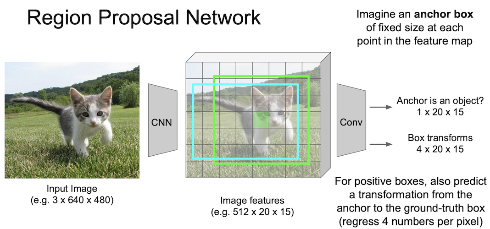
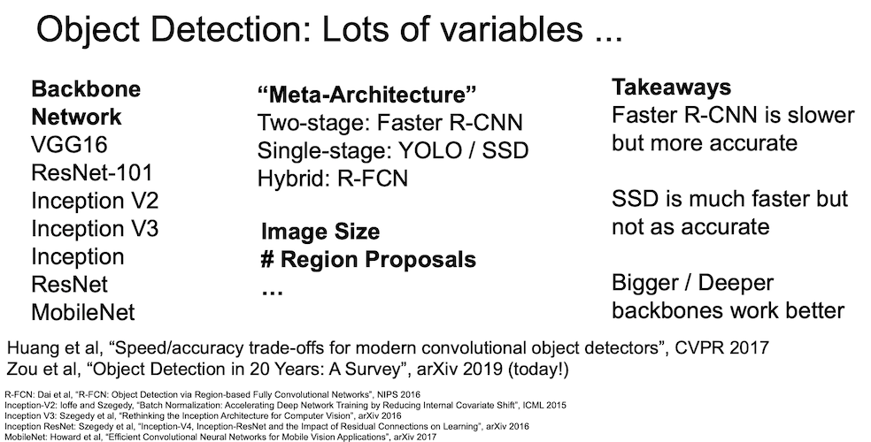
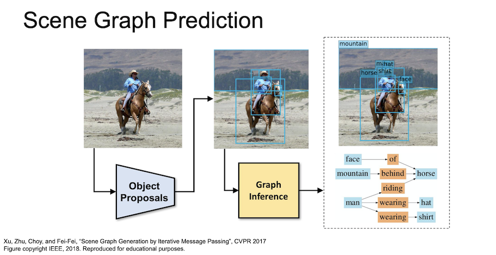

<small>최종 수정일 : 2019-11-21</small>

## Computer Vision Tasks

지금까지 Neural Network 를 이용해 이미지 속에 있는 물체가 무엇인지 판별하는 것을 학습했다.  

컴퓨터 비전에 있어서 이는 단순한 작업이고, 해야할 것들이 더 남아있는데 위의 예시들이 바로 그것을 짧게 요약한 것이다.  

물체를 분류하는 classification.  
각 부분이 무엇을 의미하는지 구별하는 semantic segmentation.  
이미지 속에 있는 물체를 구별하고 위치까지 표현하는 object detection.  
pixel 단위로 object detection 을 수행하는 instance segmentation.  

그 중 object detection 과 instance segmentation 은 여러 물체에 대해서 작동해야하는 것을 볼 수 있다.  

하나씩 살펴보자.

## Semantic Segmentation

_semantic segmentation_ 에서는 각 pixel 에 대해 category 를 나누게 된다.  
즉, 물체(object)와는 상관이 없이 pixel 단위로 segmentation 이 이뤄진다.

segmentation 을 하는 방법에 sliding window 기법이 있는데, 일정한 크기의 patch 를 원본 이미지와 쭉 비교해보면서 해당 부분의 pixel 이 어떤 category 값을 가지는지 확인한다. 즉 매 번 _CNN_ 을 통과시키게 된다.  

이는 매우 비효율(computational cost 가 큼)적인 방법인데, 중복되는 patch 들 간의 공유된 feature 를 재사용하지 않는다.

위에 나타난 sliding windows 기법의 단점을 극복하기 위해 전체 이미지를 convolution 하는 방법을 고안하게 되었다. 3x3 filter 를 이용해 이미지 크기를 유지하면서 convolution 을 수행하여 한 번에 이미지 전체를 _CNN_ 에 넣을 수 있고 이를 이용해 pixel 을 한 번에 전부 예측할 수 있다.  

그러나 전체 이미지를 _CNN_ 에 통과시키는 것은 여전히 비효율적인 방법이다.<small>입력 이미지의 spatial size 를 계속 유지해야하기 때문</small>  

그래서 maxpooling 또는 strided convolution 을 통한 downsampling 을 진행해서 크기를 줄인 후, unpooling 을 통해 upsampling 을 하면서 연산을 효율적이게 만들어 보게 되었다.  

이렇게 하는 이유는 줄어든 spatial resolution 을 원본 크기로 맞추기 위함이다. 이 과정이 바로 upsampling 이다.

### Unpooling

말 그대로 pooling 을 undo 하는 것이다.  
unpooling 지역의 receptive field 값을 복사해서 채워넣게 된다.  

그러나 오른쪽의 경우와 같이 나머지 값이 0일 경우 매우 좋지 못한 결과(bed of nails)를 얻게 될 것이다.

### Max Unpooling

_Max Pooling_ 이 어땠는지 생각해보며 _Max Unpooling_ 에 대해 알아보자.  
이는 max 값과 위치(공간 정보)를 기억해 둔 뒤 나중에 upsampling 할 때 해당 값만 복구 시킨 후 나머지는 0의 값을 채워 넣는 것이다.

이 때 fixed function 을 사용하게 된다.  

### Learnable Unpooling : Transpose Convolution

_Transpose Convolution_ 은 학습이 가능한 방법이다.  

위의 방법이 일반적인 convolution 의 연산이다.  
여기서 strided convolution 은 2칸(stride = 2)씩 움직인다. 출력이 한 픽셀 움직일 때 입력은 두 픽셀이 움직이게되는 것이다.

_Transpose Convolution_ 은 위에서 진행된 과정의 반대이다. 입력과 출력의 크기가 반대가 된 것을 확인하자.  

위에서는 내적(dot product)을 수행하였지만 여기서는 feature map 에서 값을 선택하고 선택한 scalar 값과 필터(3x3)를 곱해준다. 그리고 출력의 3x3 공간에 넣게된다.  
filter 의 크기와 stride 의 크기에 의해 overlap 되는 부분이 생기게 되는데, 이 부분에 대해서는 summation 을 진행한다.

<small>이에 대한 보충자료는 [여기](https://medium.com/activating-robotic-minds/up-sampling-with-transposed-convolution-9ae4f2df52d0)에서 더 확인할 수 있다.</small>

## Object Detection

_Object Detection_ 은 _Classification + Localization_ 이라고 볼 수 있다.  
이미지 안에 있는 객체를 분류하고 그 위치까지 판별해야하는 문제이고 그 위치를 범위로써 나타내야한다.

## R-CNN

## Fast R-CNN

### RoI Pool

### RoI Align

## Faster R-CNN

## Single-Stage Object Detectors

## Instance Segmenatation: Mask R-CNN

## Aside

> 이 포스트는 스탠포드의 [cs231n](http://cs231n.stanford.edu) 강의를 보고 공부한 포스트입니다.  
> 잘못된 것이 있을 수 있습니다.  
> 댓글로 알려주시면 감사합니다!  
