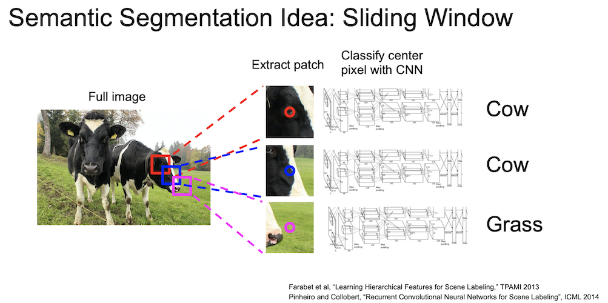
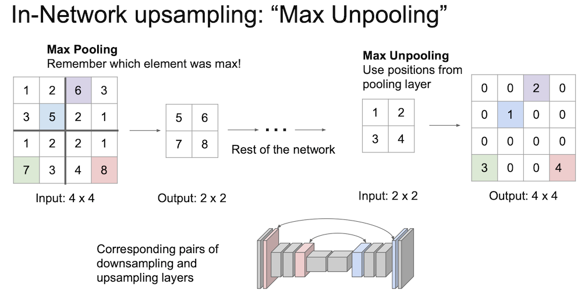
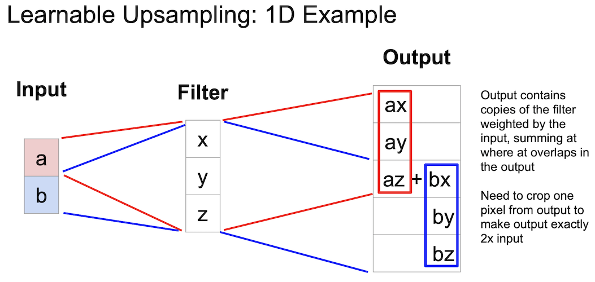
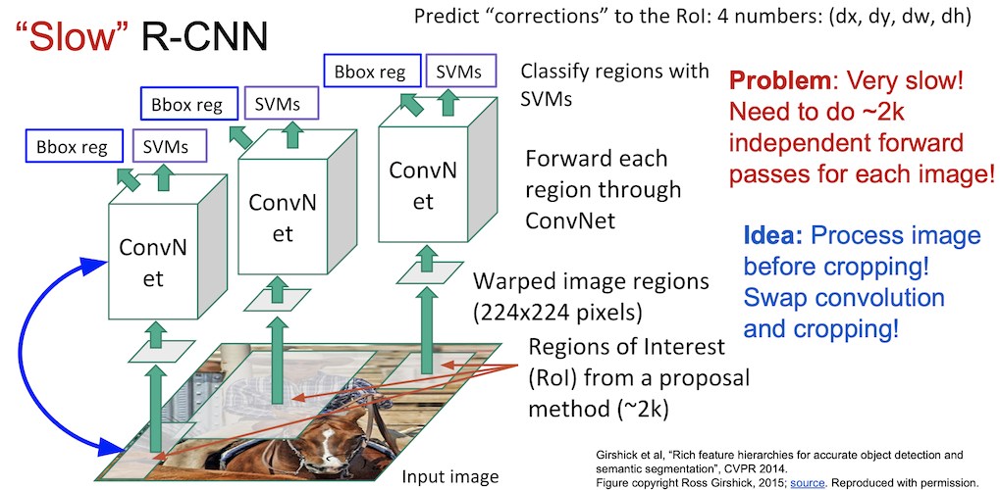
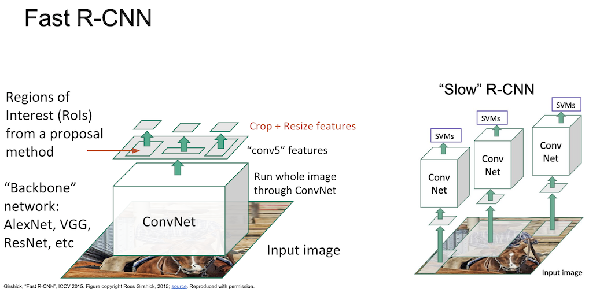
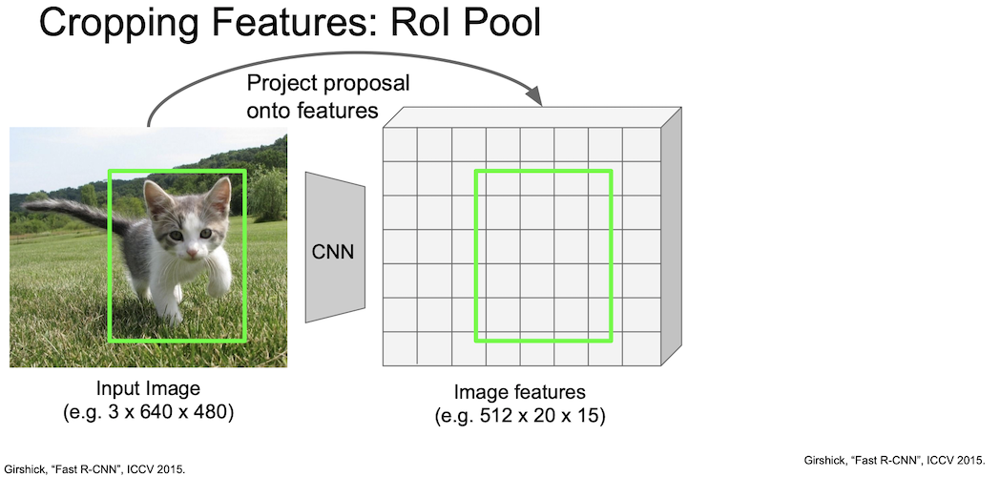
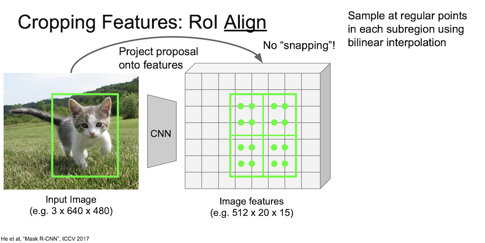
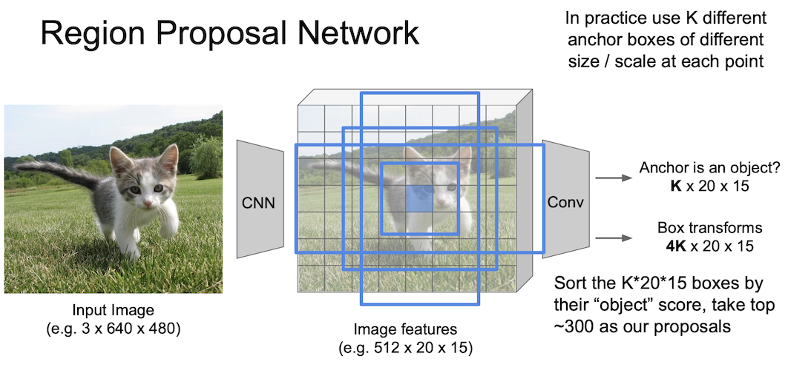
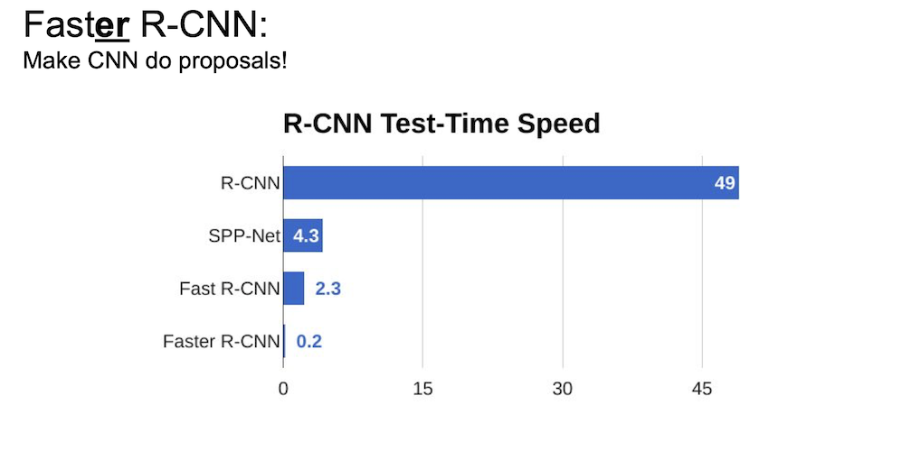
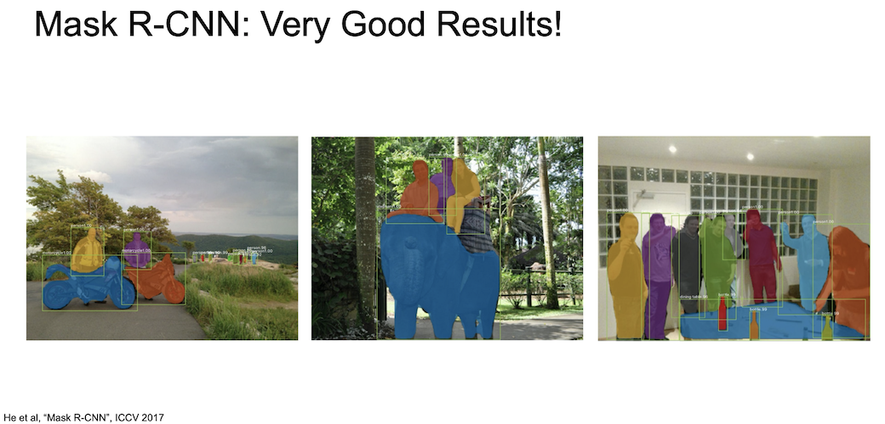

<small>최종 수정일 : 2019-11-22</small>

> 이 포스트는 스탠포드의 [cs231n](http://cs231n.stanford.edu) 12강 강의를 보고 공부 및 정리한 포스트입니다.  
> 잘못된 것이 있을 수 있습니다.  
> 댓글로 알려주시면 감사합니다!  

## Computer Vision Tasks

지금까지 Neural Network 를 이용해 이미지 속에 있는 물체가 무엇인지 판별하는 것을 학습했다.  

컴퓨터 비전에 있어서 이는 단순한 작업이고, 해야할 것들이 더 남아있는데 위의 예시들이 바로 그것을 짧게 요약한 것이다.  

물체를 분류하는 classification.  
각 부분이 무엇을 의미하는지 구별하는 semantic segmentation.  
이미지 속에 있는 물체를 구별하고 위치까지 표현하는 object detection.  
pixel 단위로 object detection 을 수행하는 instance segmentation.  

그 중 object detection 과 instance segmentation 은 여러 물체에 대해서 작동해야하는 것을 볼 수 있다.  

하나씩 살펴보자.

## Semantic Segmentation

_semantic segmentation_ 에서는 각 pixel 에 대해 category 를 나누게 된다.  
즉, 물체(object)와는 상관이 없이 pixel 단위로 segmentation 이 이뤄진다.

segmentation 을 하는 방법에 sliding window 기법이 있는데, 일정한 크기의 patch 를 원본 이미지와 쭉 비교해보면서 해당 부분의 pixel 이 어떤 category 값을 가지는지 확인한다. 즉 매 번 _CNN_ 을 통과시키게 된다.  

이는 매우 비효율(computational cost 가 큼)적인 방법인데, 중복되는 patch 들 간의 공유된 feature 를 재사용하지 않는다.

위에 나타난 sliding windows 기법의 단점을 극복하기 위해 전체 이미지를 convolution 하는 방법을 고안하게 되었다. 3x3 filter 를 이용해 이미지 크기를 유지하면서 convolution 을 수행하여 한 번에 이미지 전체를 _CNN_ 에 넣을 수 있고 이를 이용해 pixel 을 한 번에 전부 예측할 수 있다.  

그러나 전체 이미지를 _CNN_ 에 통과시키는 것은 여전히 비효율적인 방법이다.<small>입력 이미지의 spatial size 를 계속 유지해야하기 때문</small>  

그래서 maxpooling 또는 strided convolution 을 통한 downsampling 을 진행해서 크기를 줄인 후, unpooling 을 통해 upsampling 을 하면서 연산을 효율적이게 만들어 보게 되었다.  

이렇게 하는 이유는 줄어든 spatial resolution 을 원본 크기로 맞추기 위함이다. 이 과정이 바로 upsampling 이다.

### Unpooling

말 그대로 pooling 을 undo 하는 것이다.  
unpooling 지역의 receptive field 값을 복사해서 채워넣게 된다.  

그러나 오른쪽의 경우와 같이 나머지 값이 0일 경우 매우 좋지 못한 결과(bed of nails)를 얻게 될 것이다.

### Max Unpooling

_Max Pooling_ 이 어땠는지 생각해보며 _Max Unpooling_ 에 대해 알아보자.  
이는 max 값과 위치(공간 정보)를 기억해 둔 뒤 나중에 upsampling 할 때 해당 값만 복구 시킨 후 나머지는 0의 값을 채워 넣는 것이다.

이 때 fixed function 을 사용하게 된다.  

### Learnable Unpooling : Transpose Convolution

_Transpose Convolution_ 은 학습이 가능한 방법이다.  

위의 방법이 일반적인 convolution 의 연산이다.  
여기서 strided convolution 은 2칸(stride = 2)씩 움직인다. 출력이 한 픽셀 움직일 때 입력은 두 픽셀이 움직이게되는 것이다.

_Transpose Convolution_ 은 위에서 진행된 과정의 반대이다. 입력과 출력의 크기가 반대가 된 것을 확인하자.  

위에서는 내적(dot product)을 수행하였지만 여기서는 feature map 에서 값을 선택하고 선택한 scalar 값과 필터(3x3)를 곱해준다. 그리고 출력의 3x3 공간에 넣게된다.  
filter 의 크기와 stride 의 크기에 의해 overlap 되는 부분이 생기게 되는데, 이 부분에 대해서는 summation 을 진행한다.

_Transpose Convolution_ 을 어떤 논문들에서는 Deconvolution 이라고도 칭하는데, 이는 잘못된 것이다.  
<small>이 부분에 대해서는 나중에 다시 정리하자!</small>

이것은 1차원에서 learnable upsampling 의 예제를 보여주는 것이다.  

겹치는 부분인 az 와 bx 를 더해준다. az + bx

조금 더 자세한 예제를 살펴보자. 왜 이름에 convolution 이 붙는가?  

convolution 연산은 행렬 곱 연산으로 나타날 수 있는데 위와 같이 계산이 될 수 있다.  
<small>위 슬라이드에서 x,y,x 가 아니라 x,y,z 가 맞다.</small>  

오른쪽은 왼쪽의 transpose conv 이다. 같은 행렬을 사용해서 행렬곱 연산을 수행했지만 transpose 를 취한 형태이다.  

이렇게 되면 왼쪽은 stride 1 convolution 이고 오른쪽은 stride 1 transpose convolution 이 된다.  

a vector($\vec{a}$)를 보면 4 개의 값으로 이루어져있는 것을 볼 수 있는데 이는 transpose 로 인한 것이다.

stride 1 transpose convolution 의 모양을 보면 일반적인 convolution 과 비슷하다.  
padding 을 고려하게 된다면 달라질 수 있긴 한데, stride 2 일 경우는 어떨까?  

왼쪽이 바로 stride 2 convolution 의 행렬곱 연산이다.<small>stride 2 를 알 수 있는 이유는 x,y,z의 움직임이 한 칸이 아닌 두 칸인 것을 보면 알 수 있다.</small>  
만약 stride 가 1 보다 커지게 될 경우 transpose convolution 은 convolution 이 아니게 된다. 그 표현이 어떻게 되는지 생각해보면 알 수 있다.  
따라서, stride 2 가 되었을 경우 normal convolution 과는 다른 연산이 되게 되었다. 그래서 이름을 transpose convolution 이라 칭하게 되었다.  
<small>여기서 a vector($\vec{a}$) 를 볼 때 transpose 만큼 값이 2개 뿐이다. 이것 때문인듯 싶다.</small>

<small>이에 대한 보충자료는 [여기](https://medium.com/activating-robotic-minds/up-sampling-with-transposed-convolution-9ae4f2df52d0)에서 더 확인할 수 있다.</small>

## Object Detection

_Object Detection_ 은 _Classification + Localization_ 이라고 볼 수 있다.  
이미지 안에 있는 객체를 분류하고 그 위치까지 판별해야하는 문제이고 그 위치를 범위로써 나타내야한다.

이 때, localization 은 이미지 안에 물체가 하나만 있는 경우를 상정한다.

_FC layer_ 가 하나 더 있는 것을 볼 수 있는데 이는 x, y, w, h 로 _bounding box_ 의 위치를 의미한다.  
이로써 두 개의 값을 출력하게 되는데 하나는 class score 가 되고 나머지는 위의 bounding box 의 정보가 된다.  

학습을 진행할 때는 두 loss 를 학습하게 되고 이것이 _Multitask Loss_ 가 된다.  

이 때 _CNN_ 구조를 통과시키게 되는데 처음부터 학습하는 것은 쉽지 않고 효율적이지도 않으므로 보통 _ImageNet_ 의 pre-trained 모델을 사용한다.<small>앞서 배웠던 _transfer learning_ 을 상기하고 가자.</small>

_Object Detection_ 은 Computer Vision 에서 핵심적인 task 이다.  
특히 우리는 이미지에 하나의 물체만 담지는 않으므로 보통의 이미지에는 다양한 물체들이 있을 수 있다.  

앞서 보았던 _Localization_ 과의 차이점은 _Object Detection_ 에서는 Multiple Object 에 대해 작업을 수행한다는 것이다.  

첫 이미지에서 보듯 고양이가 한 마리만 있는 이미지라면 bounding box 는 4개의 숫자로 이루어진 하나만 나오면 되겠지만,  
두 번째 이미지에서 보듯 두 마리의 강아지와 한 마리의 고양이가 있다면 이는 세 배가 되게 될테고,  
마지막 오리 사진을 본다면 정말 많이 필요하게 될 것이다.

다른 모양의 crop 을 이용해 object 인지 background 인지 sliding window 기법을 통해 훑어서 판별을 해 볼 수 있다.  

그러나 앞에서 본 애니메이션의 경우는 아주 최적화된 순서라고 볼 수 있는데 실제 이미지에는 어느 위치에 어느 정도의 크기로 물체가 존재하게 될지 모르고, 이는 아주 많은 경우의 수를 시도해보아야 원하는 물체의 위치를 판별할 수 있게 되는 것이다.

마치 위의 파란색 영역 같이 생각해 볼 수 있다.

이를 해결하기 위해 deep learning 이전에서 사용했던 방법 중 하나인 _Selective Search_ 라는 기법이 있다.  
물체가 있을 만한 '후보 영역'을 ~2000개 가량 생성해서 해당 위치만 물체인지 아닌지 판별하는 방식이다.  

위의 아주 많은 경우의 수에 비해 연산량을 많이 줄이긴 했으나 여전히 2000개도 많은 영역이긴 하다.

## R-CNN

고전적인 방법으로 _Object Detection_ 을 수행했을 때 성능은 그리 좋지 않았다. 그러다가 _CNN_ 기법을 이용한 _Object Detection_ 이 등장하게 되었는데, 차례로 살펴보자.

_R-CNN_ 은 _CNN_ 기법을 _Object Detection_ 에 최초로 접목시킨 모델이다.  
Selective Search 를 이용해 ~2k 개의 region proposal(bouding box) 을 생성한다.  

이 영역들의 크기는 각기 다르므로 모두 동일한 size 를 갖게 crop & warp 를 진행한다.  

$224 \times 224$ 의 크기로 만들게 된다.

이제 이 이미지들을 ConvNet 에 통과시키게 된다.  

그 후 나온 결과를 SVM 을 통해 분류하게 된다.

이렇게 나온 결과는 bounding box 가 정확하지 않기 때문에 regression 을 통해 조정을 하여 정확한 영역을 계산하도록 한다.

이는 굉장히 느린데(K40 으로 training 에 84시간) 이는 각각의 이미지가 ConvNet 을 통과하는데 엄청난 연산이 필요하기 때문이다.  

다행히 이 느린 _R-CNN_ 의 문제를 해결하기 위한 방법이 있다.  
각각의 이미지를 ConvNet 에 넣는 것 말고 convolution 과 $224 \times 224$ 의 이미지를 얻는 순서를 바꾸는 것이다.

## Fast R-CNN

_Fast R-CNN_ 에서는 backbone network 로 AlexNet, VGG, ResNet 등을 사용하였으며 input image 를 한번에 ConvNet 에 넣게 된다. 이를 통해 feature map 을 먼저 얻을 수 있고 여기서 region proposal 을 진행하게 되는데, _Fast R-CNN_ 에서는 [__RoI Pool__](#roi-pool) 이라는 개념을 도입했다.

<small>필기가 되어있네..?</small>

이렇게 얻은 후보 영역들에 대해 crop + resize 를 진행하게 되고,

_CNN_ 구조에 후보 영역들을 통과시켜서 물체의 분류는 linear + softmax 로, box offset 은 linear 로 처리하여 계산한다.

### RoI Pool

_Fast R-CNN_ 에서 region proposal 을 수행하기 위해 도입한 _RoI Pool_ 에 대해서 알아보자.  

먼저 이미지를 _CNN_ 에 통과시켜 격자화된 feature map 을 얻는다.  

그리고 여기서 해당 물체가 있는 박스를 grid 상에 위치시킨다.

grid 는 현재 격자화된 상태이기 때문에 박스를 snap 하여 grid 의 격자에 맞춰 위치시킨다.

이를 적당히 4등분(rougly equal subregion)하여 max-pool 을 진행하면 2 by 2 region 이 새롭게 나오게 된다.  

여기서는 예시를 2 by 2 로 했으나 실제 논문에서는 7 by 7 을 하였다.

### RoI Align

_RoI Align_ 에 대해서도 알아보자.  
_RoI Pool_ 에서는 격자화된 grid 에 이미지 박스를 맞추느라 약간의 오차가 생긴다는 것을 눈치챌 수 있다.  
이러한 오차를 줄이기 위해 고안한 방법이 바로 _RoI Align_ 이다.  
이는 _RoI Pool_ 처럼 이미지 박스를 맞추는 과정 없이 해당 위치 그대로 사용하게 된다.

우선 이미지를 _CNN_ 에 통과시켜 feature map 을 얻는다.  
이번에는 snapping 과정을 거치지 않고 그대로 둔 상태에서 subregion 을 나눈다.  

이 때, 각 subregion 에 대해 다시 subregion 을 나누게 되는데 위의 이미지에서 보다시피 각 subregion 에 4개의 점이 있는 것을 볼 수 있다.  
이 점이 나타내는 값을 구하게 될 것인데, 이를 구하는 방법으로 _bilinear interpolation(쌍선형보간)_ 을 사용한다.

하나의 초록색 점은 다음과 같이 _bilinear interpolation_ 으로 계산된다.  
해당 점의 인접한 네 개의 grid cell 의 점수로부터 결과값이 나타나게 되는데,  

$$
f_{xy} = \sum_{i,j=1}^2f_{i,j}\max(0,1-|x-x_i|)\max(0,1-|y-y_j|)
$$

위와 같은 수식을 이용해 계산할 수 있다.  

이렇게 각 값을 계산한 후 max-pool 을 통해 값을 추출한다.  
마찬가지로 예시에서는 2 by 2 로 나왔지만 실제로는 7 by 7 로 진행되었다.

조금 더 정리한 것은 [여기](./roi-pool-roi-align.pdf)에서 확인할 수 있다.

_RoI Pool_ 을 이용한 _Fast R-CNN_ 은 다음과 같이 20배 가량의 성능 향상을 이루어냈지만 region proposal 을 포함했을 경우가 포함하지 않았을 때보다 확실하게 느리다는 것을 확인할 수가 있다.

이 문제를 해결하기 위한 방법 역시 존재하는데, __Region Proposal Network(RPN)__ 을 사용한 _Faster R-CNN_ 이 바로 그 모델이다.  

## Faster R-CNN

_Faster R-CNN_ 에서는 region proposal 을 위해 _RPN_ 을 사용하는데 이는 feature 들로부터 proposal 을 예측하는 네트워크 이다.

그 외 나머지 구성은 _Fast R-CNN_ 과 동일하다.

### Region Proposal Network

_Region Proposal Network_ 에서는 __anchor box__ 라는 개념을 사용한다.

이 _anchor box_ 는 sliding window 의 각 위치에서 bounding box 의 후보로 사용되는 크기가 미리 정의된 상자이다.  

그림에서 보다시피 3 by 3 anchor 를 사용할 수 있는데, 좀 더 자세히 언급하자면 3개의 종횡비과 3개의 크기를 가지는 anchor 를 사용했고 이는 총 9개의 anchor box 임을 알 수 있다.  
이들 anchor box 는 같은 중심을 같는 것을 알고 넘어가자.

이러한 anchor 박스를 이용해 물체인지 아닌지는  

1. 가장 높은 IoU(Intersection over Unit)를 가지는 anchor
2. IoU > 0.7 을 만족하는 anchor

로 positive labeling 처리를 해줄 수 있다.

positive box 에 대해서는 regression 을 통해 좀 더 정확한 위치를 찾을 수 있도록 해준다.

실제로 논문에서는 $k$ 개의 anchor box 를 이용해 물체/배경을 판단하는 $2k$ 개의 classification 출력과 $4k$ 개의 박스의 위치를 조정하는 regression 출력을 얻게 된다.  
이 때 $k=9$ 이다.<small>위에서 언급한 3개의 종횡비(2:1, 1:1, 1:2), 3개의 크기(128, 256, 512)</small>

이렇게 만든 _Faster R-CNN_ 은 _Fast R-CNN_ 의 문제점인 region proposal 에서 효율적인 모습을 보이며 위와 같은 성능의 향상을 가지고 오게 되었다.

_Faster R-CNN_ 의 구조를 다시 한 번 봐보자.  
이는 __Two-stage object detector_ 인데, 

- first stage : 이미지당 한 번 작동
- second stage : 영역(region)당 한 번 작동

하게 된다.

여기서 우리가 정말 second stage 가 필요한 것일까?

## Single-Stage Object Detectors

한 번에 _Object Detection_ 을 수행하게 하면 어떨까?

그런 관점에서 문제를 푸는 것이 바로 _Single-Stage Object Detection_ 이다.

대표적으로 _YOLO_ 와 _SSD_ 가 있는데, 이들은 input image 한 번에 탐색하여 결과값을 출력하게 된다.  
그림에서 보듯 7 by 7 grid 로 만든 후 base box 를 이용해 결과를 낸다.

이 때 _R-CNN_ 계열과는 다르게 5개의 출력값이 나오는데, x, y, w, h 에 confidence 값이 추가되었기 때문이다.

도식이 _RPN_ 과 비슷하게 나타났지만 single-stage 기법은 category-specific 하게 처리하는 것이 차이가 있다.

Object Detection 은 다양하게 변화가 가능한데 구조에 있어서 각기 변경할 부분들이 많이 있기 때문이다.  

일반적으로 bigger/deeper backbone network 를 활용할 경우 성능이 좋게 나타난다.  

그러나 항상 speed / accuracy 간의 trade-off 는 존재한다.

## Instance Segmentation: Mask R-CNN

이제 _Instance Segmentation_ 에 대해서 알아보자.  

여기서 사용한 모델은 _Mask R-CNN_ 인데 mask network 를 각 RoI 에 추가해서 $28 \times 28$ 의 크기를 갖는 binary mask 를 생성하게 된다.

그 구조는 다음과 같다.  

이미지를 _CNN + RPN_ 에 통과시켜 region proposed 된 feature map 을 얻는다. 그 후 roi align 을 통해 $256 \times 14 \times 14$ 의 feature map 으로 만든 후 각각의 Class C 에 대한 mask 를 얻는다.

예시를 보자.  
각 물체에 대한 마스크는 다음과 같이 의자, 사람, 침대 등으로 나타날 수 있다.

이렇게 구현된 _Mask R-CNN_ 의 성능은 상당히 놀라운데, 위의 결과를 보면 다양한 물체들에 대해 아주 잘 segmentation 한 것을 볼 수 있으며, 첫 번째 사진에서 멀리 뒤에 서있는 많은 사람들에 대해서도 segmentation 을 해낸 것을 볼 수 있다.

또한 포즈에 대해서도 제대로 동작하는 것을 볼 수 있다.

## Aside

그 외에도 다양하게 발전해나가고 있다.

object detection 과 captioning 을 결합해 dense captioning 이라고 하는 여러 물체에 대한 caption 을 나타낼 수도 있다.

이는 dense captioning 의 동작 과정이다.

장면에 대한 graph 연결을 실시하여 mapping 을 하는 노력도 있다.

이렇게 mapping 된 정보를 활용해 여러 caption 을 동시에 진행할 수도 있다.

3차원 물체에 대한 탐지도 가능한데, 2차원 물체에 대해서는 (x,y,w,h) 의 정보를 이용했다면, 3차원에 대해서는 (x,y,z,w,h,l,r,p,y) 로 더 많은 정보를 사용해 bounding box 를 구성하게 된다.

_Faster R-CNN_ 과 같은 원리지만 3차원 공간에서 proposal 을 진행하게 된다.

> 참고 : https://blog.lunit.io/2017/06/01/r-cnns-tutorial/
