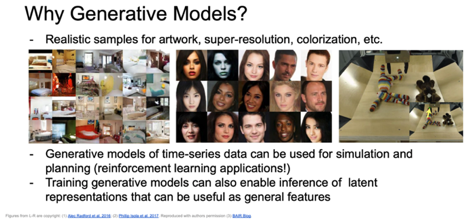
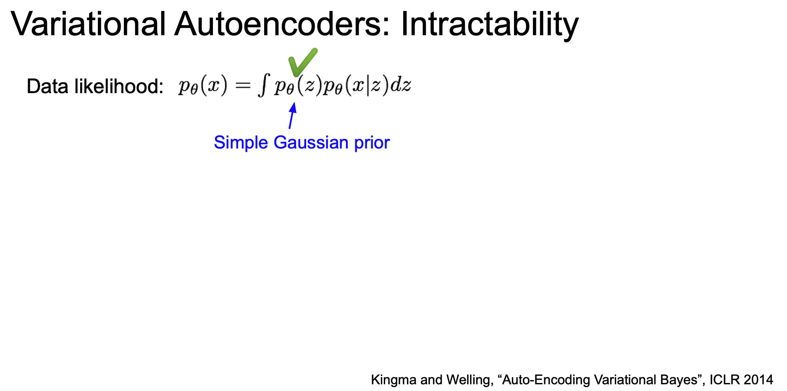

<small>최종 수정일 : 2019-11-29</small>

지금까지 우리는 지도학습 모델(Supervised Learning Model) 에 대해 주로 학습했다.  
이제는 생성 모델(Generative Model) 이라고 하는 비지도학습 모델(Unsupervised Learning Model)의 한 종류에 대해서 알아보자.

## Unsupervised Learning

비지도학습(Unsupervised Learning)은 지도학습과는 반대로 학습을 하는 데 있어서 label 을 제시하지 않는 것이다.  

즉, 지도학습은 데이터 x 에 대한 라벨 y 를 제공하고 학습을 통해 x -> y 의 input -> output 잘 나오도록 하는 것이었다.  

이에 반해 비지도학습은 데이터 x 만 존재하고 모델이 스스로 학습해 어떤 유의미한 결과가 나오도록 하는 것인데, 예를 들면 Clustering, PCA, Autoencoder 등이 되겠다.

비지도학습의 장점은 training 시 label 정보가 없기에 지도학습의 데이터보다 cheap 한 이점이 있으며, 데이터의 숨겨진 구조에 대해 학습하도록 설계되기 때문에 이를 풀어내게 된다면 해당 데이터 세상의 숨겨진 구조를 알아낼 수 있게 된다.<small>holy grail: 성배</small>  

## Generative Models

비지도학습 모델 중 생성 모델(Generative Model)에 대해서 알아보자.  

이 때, $p_{model}(x)$ 가 $p_{data}(x)$ 와 유사하도록 학습시킨다.

생성 모델은 training data 가 주어지면 여기서 새로운 샘플을 생성해내게 되는데, 이 때 distribution 을 유지한 채로 생성되게 된다.

생성 모델을 사용하면 다음과 같은 것을 할 수 있다.

- 미술품에 대한 진짜같은 샘플을 만들어 낼 수 있고, 색 칠하기 등이 가능하다.
- 시간 순서의 데이터에 대해 시뮬레이션과 planning 이 가능해지고 이를 강화학습(reinforcement learning)에 적용시킬 수도 있다.
- latent representation(잠재적 특성) 에 대해 잘 학습시켜 놓는다면 나중에 추론이 가능해지기도 한다.(다른 task 에서 사용한다거나)

이번 강의에서는 3가지 유명한 생성 모델에 대해 알아볼 것이다.  

## PixelRNN and PixelCNN

이미지 x 에 대한 likelihood p(x) 를 모델링할 것이다.  
이 때, chain rule 을 이용해 likelihood 를 decompose 시켜 1-d distribution 의 곱으로 만들어 낸다.  

여기서 모든 이전 픽셀(all previous pixels)을 필요로 하게 된다.  

이 분포가 굉장히 복잡(complex)해서 이를 처리하기 위해 neural network 를 쓰게 되었고, 학습의 결과로 likelihood 를 최대화하는 것이 목표가 된다.

(보고 있는 것은 명시적 density model 의 경우이다.)

### PixelRNN

_PixelRNN_ 에서는 그림의 화살표를 따라 코너에서부터 pixel 을 생성해낸다.  
이 때, 이전 픽셀에 대한 의존성을 바탕으로 _RNN(LSTM)_ 을 이용하게 된다.  

이러한 순차적인 생성은 느리다는 단점이 있다.

### PixelCNN

RNN 대신 CNN 을 이용한다면 어떻게 될까?

그 방법인 _PixelCNN_ 은 다음과 같다.  
_PixelRNN_ 처럼 코너에서 시작해 pixel 을 만들어내게 된다.  

이 때, 특정 context 영역에 대해서만 _CNN_ 을 이용하게 되는데, 역시 이전의 pixel 들에 대한 의존성을 바탕으로 새로운 pixel 을 생성한다.  

이러한 과정들은 likelihood 를 최대화하는 과정이 된다.  

이는 _PixelRNN_ 보다 학습속도가 빠르고 training image 에 대한 context region 을 이미 알기 때문에 병렬화 convolution 진행할 수 있다.  

그러나 순차적으로 생성된다는 점에 있어서 여전히 느리다.

위 예시는 CIFAR-10 과 ImageNet 에서 생성한 샘플들이다.

나름 샘플들이 잘 나온 것을 확인할 수 있다.

즉, 정리하면 다음과 같다.

_PixelRNN_ 과 _PixelCNN_ 은 likelihood p(x) 를 명시적으로 계산해 내고 이렇게 명시적인 likelihood 가 training data 로써 아주 좋은 평가 지표가 되게 된다. 그리고 good sample 을 만들어 낼 수 있음을 알 수 있기도 하다.  

그러나 순차적인 생성이라는 그 구조상 느리다는 단점이 존재한다.

## Variational Autoencoders(VAE)

위에서 배운 것들은 tractable density funcion 을 정의하고 training data 에 대해 likelihood 를 최적화하였다.

이제부터 배우게 될 __VAE(Variational Autoencoder)__ 는 intractable density funcion 을 z 라는 latent 와 함께 정의하고 이는 이전과는 다르게 바로 최적화가 되지 않는다.

### Background of AutoEncoder

본격적으로 _VAE_ 에 대해 알아보기 전에 _Autoencoder_ 에 대해 간략하게 살펴보고 가자.

_Autoencoder_ 는 데이터 생성 목적이 아닌 레이블 되지 않은 training data 의 저차원 feature represenation 을 학습하기 위한 비지도학습의 접근 방법이다.  

즉, 저차원의 모델 분포함수를 알기 위함인데, 왜 저차원일까에 대한 답을 간략히 정리하고 넘어가자.  
<small>1차원 데이터에 대해서는 그 분포를 그리기 쉽지만 이미지 같은 고차원의 데이터에 대해서는 분포함수를 어떻게 그릴 것인지 생각해보면 이해가 빠르다.</small>  

Autoencoder 는 input data $x$ 를 encoder 를 통해 feature $z$ 로 mapping 하는 역할을 해주게 된다. 이 때 $z \lt x$ 의 차원을 갖는데(dimensionality reduction) 중요한 특성만 가지고 가기 위함이다.

이러한 feature z 를 decoder 에 통과시키게 되었을 때 같은 차원의 reconstructed input data $\hat{x}$ 를 만들어내게 된다.  

이 때 다시 원복시킬 수 있도록 특징을 학습하게 된다.

이러한 학습을 위해 L2 loss 를 이용하게 되고, 보다시피 label 을 사용하지 않는 것을 알 수 있다.  

학습이 완료 된다면 이제 decoder 를 사용하지 않게 된다.(throw away)

위에서 보듯이 Encoder 만을 사용하게 된다. 이 때 Encoder 가 학습한 특징을 지도학습 모델의 초기값으로 이용할 수 있다.  
여기서 추가적인 Classfier 를 달아서 predicted label $\hat{y}$ 를 출력하게 하고 이를 label $y$ 를 이용해 loss 를 구하는 식으로 fine-tune 을 수행할 수 있게 된다.

이렇게 Autoencoder 를 이용하면 많은 label 이 없는 데이터로부터 양질의 general feature representation 을 학습할 수 있는 장점이 있다.

여기서 이제 Autoencoder 가 학습을 통해 data 의 variation 을 잘 포착할 수 있다는 것을 알 수 있게 된다.

### VAE

이제 latent factor(잠재 요인) $z$ 를 이용해 image $x$ 를 만들어 낼 수 있음을 기억하며 모델을 통해 샘플을 만들어보도록 하자.  

먼저 $z$ 를 샘플링 한 후 $x$ 를 샘플링하게 된다.

생성 모델이 새로운 데이터를 잘 생성하려면 true parameter $\theta^*$ 를 잘 추정해야한다.  

이 모델은 어떻게 설계할 것인가?  
prior p(z) 가 심플하도록 Gaussian 같은 것으로 하거나, 복잡한 conditional p(x|z) 는 neural network 를 통해 represent 하도록 한다.  

이렇게 설계된 network 를 decoder network 라 하자.

이 모델을 어떻게 학습시킬 수 있을까?  

fully visible belief network 의 PixelRNN/PixelCNN 을 상기시켜보자.  
가장 쉬운 학습 방법은 model parameter 가 likelihood 를 최대로 할 수 있도록 학습시키는 것이다.  

그렇다면 이전에 우리가 했었던 것 처럼 gradient 를 계산해 학습시키면 될 것이다.  

그러나 안타깝게도 위의 적분식으로부터 gradient 를 계산하는 것을 불가능(intractable)하다.  

그렇다면 조금 자세히 살펴보기로 하자.

#### vae intractability

데이터에 대한 likelihood 가 있고, 첫 항은 gaussian prior 인 p(z) 이다.

두 번째 항은 neural network 로 representation 된 Decoder 이다.  

즉, z 만 주어진다면 모든 p(x|z) 도 계산할 수 있는 것이다.

그러나 __모든__ z 에 대해서 적분식을 계산할 수 없는데, p(x|z) 를 계산해 낼 수 없기 때문이다.(intractable)

posterior density 로 표현하기 위해 bayesian rule 를 이용해 전개 한다면 다음과 같이 된다. 그러나 결국 p(z|x) 역시 마찬가지로 불가능 하다.

p(x)를 계산하기 어렵기 때문이다.

이를 해결하기 위한 방법은 추가적인 encoder network 인 q(z|x) 를 정의하는 것인데, 이 때 이는 p(z|x) 에 근사한 것이다.

이를 통해 data likelihood 의 하한을 구할 수 있고, 이렇게 최적화를 진행하게 된다.

#### Encoder and Decoder Network in VAE

우리는 _VAE_ 에서 확률론적 생성(probabilistic generation) 모델을 만들고 싶은 것이다.

위에서 보았던 Encoder 와 Decoder 에 이제 확률론적 의미를 추가하게 된다.

각 출력이 의미하는 것은 평균과 대각 공분산(diagonal covariance)이다.

decoder 에는 파라미터 theta 가 있다.  
$p(z|x)$ 와 $p(x|z)$ 를 얻으려면 이들의 분포로부터 샘플링을 해야한다.  
따라서 encoder/decoder network 는 각각 $z$ 와 $x$ 에 대한 분포를 생성해야 하며 실제 값을 뽑으려면 이 분포로부터 샘플링을 해야 한다.

그리고 이들 네트워크를 'recognition / inference' 와  'generation' 이라고 부르기도 한다.

이제 위에서 본 encoder/decoder 를 생각해 둔 채 data likelihood 에 대해 다시 살펴보자.  

먼저 $p(x)$ 에 log 를 취하고 여기에다가 $z$ 에 대한 expectation(기댓값)을 취해보자.  
여기서 $z$ 는 encoder 로 모델링한 $q(z|x)$ 분포로부터 샘플링 한 값이다.

이제 식을 bayesian rule 로 확장시켜보자.  
그리고 상수(constant)를 곱해주고,  
$q(z|x) \over q(z|x)$ 도 곱해줘보자. 이것은 1을 곱하는 것인데, 나중에 도움이 될 것이다.  

그리고 식을 세 개의 항으로 분리할 수 있는데, 이 새 항을 각각 적당하게 해석할 수 있다.  

여기서 두 개의 KL 항이 존재하는데 KL divergence 는 두 분포가 얼마나 가까운지를 알려주는 것이다.

여기서 첫 번째 항은 샘플링을 통해서 계산할 수 있다.  
이 샘플링 과정에서 미분이 가능하도록 하는 re-parametrization trick 이라는 기법이 있다.

가운데 KL 텀은 encoder 에서 발생하는 분포로 평균/공분산을 가지는 Gaussian 분포이다.  
그리고 앞에서 봤듯이 prior p(z) 역시 가우시안이다.  
이 때, KL 에서 두 개의 분포가 모두 가우시안이면 closed form solution 으로 풀 수 있게 된다.

마지막 KL 텀은 $q(z|x)$ 와 $p(z|x)$ 간의 KL 인데 앞서 $p(z|x)$ 는 계산 불가능이라고 하였다.  
그래서 q 로 근사시킨 것이었다.  
그런데, KL divergence 는 두 분포간의 거리이고 이는 0 이상이라는 의미이다.  

이러한 이유로 우리는 tratable lower bound 값을 알 수 있게 된다.

이제, lower bound 가 최대화되도록 최적화시키는 것이 _VAE_ 를 학습시키는 것이다.

이는 data likelihood 가 적어도 우리가 최대화시킨 lower bound 보다 크다는 것을 의미하게 된다.  

이제 이를 위해 $\theta$ 와 $\phi$ 를 구해야한다.  

첫 번째 항은 모든 샘플 $z$ 의 기댓값이다.  
이 $z$ 는 encoder의 출력이다. encoder로 z를 샘플링하고,
모든 z에 대해서  p(x given z)의 기댓값을 구합니다.  

따라서 복원(reconstruction) 에 대한 것이다.  
첫 번째 항이 말하고자 하는 것은, 첫 번째 항의 값이 크다는
것은 likelihood p(p given z)가 크다는 것이고, 이 값이 크다는 것은 데이터를 잘 복원해내고 있다는 것을 의미한다.  
앞서 Autoencoder에서 다뤘던 것과 유사하다.  
두 번째 항이 말하고자 하는 것은 KL divergence가 작아야 한다는 것이다.  
그러기 위해서는 우리가 근사시킨 분포(q)와 prior의 분포(p)가 최대한 가까워야 한다.  다시말해 잠재 변수 z의 분포가 prior 분포(가우시안)와 유사했으면 좋겠다는 뜻이다.  

여기서 왜 Gaussian 으로 명시하는지 궁금할 수 있는데, 합리적이기 때문이다.  

<small>수학적인 내용이 많으므로 추가적으로 찾아보자. 그렇게 기약없는 숙제되었다고 한다...</small>

이제 lower bound도 구했으니 이를 통해서 _VAE_ 를 학습하는 과정에 대해서 살펴보자.  
우리는 이 lower bound를 최대화하길 원한다.  
우선은 forward pass 과정을 보자.  
입력 데이터 $x$ 가 미니배치로 있다.  

입력 데이터를 encoder에 통과시키면 $q(z|x)$를 얻을 수 있다.

여기에서 계산한 $q(z|x)$는 KL divergence를 계산할 때 이용할 수 있다.

$q(z|x)$를 구헀으면 이 분포로부터 잠재 변수 $z$를 샘플링한다.

그리고 샘플링한 $z$를 decoder에 통과시킨다.  

decoder network의 출력 $p(x|z)$에 대한 평균과 분산이다. 이 분포를 바탕으로 샘플링을 할 수 있다.

이렇게 샘플링을 하면 샘플 출력이 만들어질 것이다.  

그리고 training time에는 log $p(\hat{x}|z)$가 최대가 되도록 학습하면 됩니다.

이 Loss 함수가 말하고자 하는 것은 복원된 이미지에 대한 likehood가 최대가 되었으면 좋겠다는 것이다.

이런 식으로 모든 미니배치에 대해서 forward pass를 계산한다.

이렇게 구한 모든 항은 미분이 가능하므로 backprop할 수 있고, gradient 를 계산하여 encoder/decoder의 파라미터 $\phi$와 $\theta$를 업데이트하고 이를 통해 train data likelihood 를 최대화시켜준다.

_VAE_ 를 학습시키고나면 데이터 생성 시에는 decoder network만 이용한다.

앞서 train time에서는 $z$를 posterior였던 $p(z|x)$에서 샘플링했다.  반면 생성과정에서는 posterior가 아닌 prior(Gaussian)에서 샘플링한다.

그리고 이를 바탕으로 데이터 $x$ 를 샘플링한다.

MNIST 예제를 통해 자세히 살펴보자. _VAE_ 를 MNIST로 학습시키고 샘플들을 생성시킨 결과이다.  

앞서 $z$ 가 데이터의 잠재적인 속성(latent factor)들을 나타낼 수 있다고 했다.  
$z$ 에는 우리가 해석할 수 있을만한 다양한 의미가 담길 수 있다.  
여기 data manifold가 있습니다. 2차원 $z$ 공간입니다.  
2차원 $z$ 분포에서 적절한 백분위 범위에서 Vary $z_1$ 과 Vary $z_2$ 를 뽑아낸 것이다.

오른쪽 이미지는 $z_1$ 과 $z_2$ 의 조합으로 생성된 이미지이다.  
$z_1$ 과 $z_2$ 의 값이 변함에 따라 이미지도 아주 부드럽게(smoothly) 변하고 있는 것을 확인할 수 있다.  

그리고 prior $z$는 diagonal covariance를 가정했기 때문에 (각 차원을 independent 하다고 가정) $z$ 의 각 차원이 독립적이며 이로 인해 각 차원마다
독립적인 해석가능한 요소들이 인코딩될 수 있다.

여기 얼굴 이미지의 예를 보면 Vary $z_1$ 은 위아래로 웃음의 정도(the amount of smile)가 바뀌고 있다.  
위로 갈수록 찡그리고, 아래로 갈수록 웃고 있다.  
그리고 Vary $z_2$ 의 좌우를 보면 머리의 위치가 변하는 것을 볼 수 있다.  

이를 통해 알수있는 점은, _VAE_ 를 학습시킨 결과 $z$ 라는 변수가 좋은 feature representations일 수 있다는 점이다.  

$z$ 에는 해석 가능하고 아주 다양한(미소, 얼굴위치) 의미론적인 요소들이 잘 인코딩되어 있기 때문이다.  

따라서 앞서 학습시킨 $q(z|x)$ encoder network에 새로운 입력 $x$ 를 넣어서 $z$  공간으로 매핑시키면, 이 특징벡터를 classification이나 다른 task 에 사용할 수도 있다.  

_VAE_ 로 생성한 이미지들을 조금 더 살펴보자.  
왼쪽은 CIFAR-10 데이터셋으로 학습시킨 결과이고 오른쪽은 얼굴 이미지를 학습시킨 결과다.

지금까지 살펴본 것 처럼 일반적으로 _VAE_ 가 이미지들을 잘 생성해 내기는 하지만

가장 큰 단점이 있다면 _VAE_ 로 생성한 이미지들은 원본에 비해서 흐릿(blurry)하다는 점입니다.  

이 문제는 지금도 아주 활발히 연구되는 중이다.

_VAE_ 를 요약하면 다음과 같다.  

- _VAE_ 는 autoencoders의 확률론적 변형 버전이다.
- _AE_ 는 deterministic하게 x를 받아 z를 만들고 다시 x를 복원했다면 VAE는 데이터를 생성해 내기 위해서 분포와 샘플링의 개념이 추가되었다.
- 계산할 수 없는(intractable) 분포를 다루기 위해서 하한(lower bound)를 계산한다.
  - variational lower bound 죠.  "variational"은 계산한 수 없는 형태를 계산할 수 있도록 근사시키는 방법을 의미한다. variational autoencoder라고 하는 이유이다. ($p(z|x)$ 를 계산 못하니 $q(z|x)$로 근사)

_VAE_ 와 같은 접근방식의 이점은 다음과 같다.  

- 생성 모델에 대한 원칙적 접근(principled approach) 방법
- 모델에서 $q(z|x)$를 추론

$q(z|x)$ 는 다른 task에서도 아주 유용한 feature representations이 될 수 있다.

VAE의 단점은 아래와 같다.  

- likelihood의 하한(lower bound)을 계산
  - 일반적으로 하안(lower bound) 만으로도 좋은 방향으로 이끌 수 있고, 이에 대한 많은 이론이 존재한다. 그렇기 때문에 어느정도는 괜찮을지 몰라도. 엄밀하게는 pixelRNN/CNN 같이 직접 최적화하는 방법보다는 부족함
- _GAN_ 과 같은 다른 SOTA 생성모델에 비해서는 생성된 샘플이 블러하고(blurry), 퀄리티가 낮은 경향을 보임

_VAE_ 는 여전히 아주 활발하게 연구되고있는 분야이다.
예를 들면, 좀 더 유연한 근사함수(approximations)에 대한 연구가 있다.  
단순히 diagonal Gaussian 을 사용하지 말고 richer approximate posteriors 를 이용해보자는 것이다.  
그리고 또 한가지는 잠재변수에 더 많은 구조적인 정보들을 담으려는 시도가 있다.

우리가 배운건 잠재 변수의 각 차원이 서로 독립적이었지만 사람들은 직접 구조를 모델링하고
다양한 구조들을 서로 엮기도(grouping) 한다.

## Generative Adversarial Networks

앞서 배운 _PixelCNN_ 이나 _VAE_ 는 확률 분포를 explicit 하게 모델링하고 싶어 했다.  

이를 포기하고 샘플만 잘 만들면 어떨까? 에서 출발한 것이 _Generative Adversarial Networks, GANs_ 이다.

여기서는 게임 이론의 접근방식을 취한다. 2-player game 이라는 방식으로 학습 분포를 학습하게 된다.

_GAN_ 에서는 고차원의 학습 분포로부터 샘플링을 진행하는 것이다.  
그러나 이 고차원의 학습 분포를 직접 하는 방법은 없다.
이에 대한 해결책으로 단순한 분포(Gaussian 같은 random noise)로부터 샘플을 만들어 볼 수는 있고, 여기서 학습한 분포로부터 변환(transformation)하는 것을 배우고 싶은 것이다. 이 때 이 complex transformation 을 표현하기 위해 neural network 를 이용하게 된다.  

_GAN_ 에서는 입력으로 random noise 벡터($z$)를 받는다. 벡터의 차원 수 우리가 직접 명시해준다.  
그리고 입력z가 생성 네트워크를 통과하면 학습 분포로부터 직접 샘플링된 값을 출력한다.

따라서 모든 random noise 입력이 학습 분포의 샘플에 매핑되길 원하는 것이다.

### Training GANs

_GAN_ 을 학습시키는 방법안 two player game 을 살펴보자.

하나는 __generator__ 이고 다른 하나는 __discriminator__ 이다.  

generator 는 '플레이어1' 로 참여하여 사실적인 이미지를 생성하여  discriminator를 속이는 것이 목표로 한다.  
'플레이어2'인 discriminator 는 입력 이미지가 `실제`인지 `거짓` 인지를 구별하는 것이 목표다.  

discriminator 는 이미자가 generator 가 만든 위조 이미지인지 아닌지를 가능한 잘 구분해 내야 한다.  

위의 그림을 보면, random noise 가 generator 의 입력으로 들어간다.  

generator 는 이미지를 생성해 내는데, 이 이미지는 generator가 만들어낸 '가짜 이미지' 이다.  
그리고 학습 데이터에서 나온 실제 이미지도 있다.  
discriminator 는 실제/가짜 이미지를 구별할 수 있어야 한다.

discriminator 의 출력은 이미지가 진짜(real)인지 가짜(fake)인지 말한다.

_GAN_ 의 아이디어는 discriminator 가 아주 잘 학습이 되서 진짜인지 가까인지를 아주 잘 구별할 수 있다면 generator 는 discriminator 를 속이기 위해서 더 실제같은
가까 이미지를 만들 수 있어야 한다는 것이다.

이를 통해 우리는 아주 좋은 generative model을 만들 수 있다.

이렇게 생성된 이미지는 학습 데이터셋에 있을 것 처럼 생긴 이미지처럼 보일 것이다.

이렇게 두 플레이어를 통해 `minimax game` 의 형태로 같이(jointly) 학습시키게 된다.  

이 object function 에서는 Generator network 인 _G_ 의 파라미터인 $\theta_g$ 를 최소화시켜야 한다.  

반면 Discriminator network 인 D의 파라미터인 $\theta_d$ 는 최대화시켜야 한다.  

이 objective function 을 살펴보자.  
우선, 데이터에 대한 Expectation $\mathbb{E}\log{D(x)}$ 가 있다.  
$\log{D(x)}$ 는 실제(real) 데이터 x에 대한 discriminator의 출력 값이다.

$\log{D(x)}$ 는 실제 데이터(x)가 데이터 분포 p_data에 속할 likelihood 이다.

두 번째 항을 보자. $p(z)$ 를 따르는 $z$ 에 대한 기댓값(expectation)에서 $z ~ p(z)$ 의 의미는 generator 에서 샘플링한다는 의미이다.  
그리고 $D(G(z))$ 는 생성된 가짜 이미지($G(z)$)에 대한 discriminator 의 출력이다.

그렇다면 가짜 이미지인 $G(z)$에 대한 discriminator 의 출력은 무엇일까?

우리가 하려는 것을 다시 생각해보면 우선 discriminator 는 objectrive function 를 최대화해야한다.
이는 파라미터 $\theta_d$ 를 찾아야 한다. $D(x)$ 의 경우에는 실제 데이터이므로 값이 1이면 좋다.

반면 $D(F(x))$는 가짜 데이터에 대한 것이므로 0일수록 좋다.(반대이므로)  

그리고 discriminator 의 입장에서 objective function 을 최대화시킨다는 것은 진짜인지 가짜인지를 잘 구별해낸다는 의미가 된다.  

discriminator 는 기본적으로 실제/가짜 데이터인지를 분류합니다.

반면 generator는 objective functuon 이 작을수록 좋으므로 $D(G(z))$ 가 1에 가까울수록 좋다.  

$D(G(z))$가 1에 가까우면, $1 - D(G(z))$ 이므로 값이 작아지고, 이는 discriminator 가 가짜 이미지를 진짜라고 잘못 분류하고 있다는 의미이다.  
즉, generator 가 진짜 같은 이미지를 잘 만들고있다는 것!

_GAN_ 은 추가적인 레이블이 필요없는 비지도학습이다.

_GAN_ 의 학습과정을 보자.

_GAN_ 을 학습시키려면 generator 와 discriminator 를 번갈아가면서 진행한다. 
discriminator 의 경우에는 objective function 가 최대가 되는 $\theta$ 를 학습하기 위해 gradient ascent 를 이용한다.

generator는 반대로 gradient descent를 이용한다.

gradient descent 를 통해서 파라미터 $\theta_g$ 를 학습시켜서 object function 이 최소가 되도록 한다.  

Generator 를 학습시키는 경우에는 오른쪽 항만 있으면 된다.  
오른쪽 항만이 generator 의 파라미터인 $\theta_g$ 가 있습니다.

지금까지 GAN을 어떻게 학습시킬지 살펴보았습니다.

하지만 중요한 점이 하나 있는데, 실제로는 generator 의 objective function 이 학습이 잘 안된다는 점이다.
그 이유는 loss landscape 을 살펴보면 알게 된다.

지금 보이는 loss landscape 는 D(G(x))의 loss landscape 이다.  

generator 는 $1 - D(G(x))$ 의 값이 높을수록 좋다.  

그 그래프의 모양을 보자.  
우리는 Loss가 최소가 되길 원하는데 Loss의 기울기가 오른쪽으로 갈수록 점점 커진다.

$D(G(x))$ 가 1에 가까울수록 기울기도 크다는 의미입니다.
즉, discriminator 가 generator 를 잘 속이고 있으면 그레이언트도 점점 더 커진다는 의미이다.  

반면 생성된 샘플이 좋지 않을때, 즉 generator 가 아직은 잘 학습되지 않은 경우라면 discriminator 가 쉽게 구분할 수 있는 상태이므로 X 축 상에서 0 근처인 상태이다.  

이 지점에서는 그레디언트가 상대적으로 평평한 것을 확인할 수 있다.

이것이 의미하는 바는, gradient 가 generator 생성을 이미 잘 하고 있는 지역에만 몰려있다는 의미를 나타낸다.  

하지만 샘플이 안좋은 경우에 더 학습을 더 많이 할 수 있어야(=gradient 가 커야) 한다.

이러한 이유로, generator 를 학습시키는 상당히 어렵다. 학습 능력을 향상시키기 위해서는

그레디언트를 개선시키기 위해서 objective function 을 조금 변경해줘야 한다.  

genrator 에서도 gradient ascent 를 이용할 것이다.
앞서 수식에서처럼 discriminator 가 정답을 잘 맞출  likelihood 를 최소화 시키는 방법 대신에 discriminator 가 틀릴 likelihood 를 최대화 시키는 쪽으로 학습시키게된다.

이는 objective function 을 $\log{D(G(x)}$ 를 최대화시키는 것으로 구현 가능하다.  

우하단 그래프에 이제 음수가 붙어야 한다.$(-\log{D(G(x))}$

이제는 Generator를 최적화할 때 flip object function을 최대화시킨다.  
그래프의 왼쪽의 그레디언트가 커졌다.(안 좋은 샘플을 생성하고 있는 부분)  
그리고 좋은 샘플들을 생성해내고 있는 부분인 오른쪽이 더 평평해 졌다.

따라서 안좋은 샘플들을 만들어내는 곳에서 더 많은 학습이 이루어질 수 있게 된 것이다.

두 objective functions 모두 discriminator 를 속이는 목적은 동일하지만, 실제로는 후자가 훨씬 더 잘된다.

vanilla GAN 의 수식을 따르는 대부분의 _GAN_ 은 이 objective function 을 사용하고 있다.

decriminator/generator 를 번갈아서 같이 학습시키는 것은 상당히 불안정하다.  

기본적으로 이렇게 두 네트워크를 동시에 학습시키는 것 자체가 상당히 어려우며, 또한 loss landscape 에 관련한 이슈들 또한 학습 과정에 영향을 미친다.

앞서 언급했던 내용들을 종합해서 전체 GAN 학습 알고리즘을 살펴보자.  

학습은 반복적으로 진행된다.(for 문)  
학습 순서는 우선 discriminator 을 조금 학습시키고 그 다음 generator 를 학습시키는 방식을 취한다.  

우선 k 번 만큼 discriminator 를 학습시킨다.  

$p(z)$ 에서 미니배치만큼 노이즈를 샘플링한다. 그리고 학습 데이터 x에서 실제 샘플을 미니배치만큼 샘플링한다.  

샘플링한 노이즈를 generator 에 통과시키면 가짜 이미지가 생성된다.  
그러면 미니배치 만큼의 가짜 이미지와 미니배치 만큼의 진짜 이미지가 준비된다.  
discriminator 의 그레디언트를 계산할 때 이렇게 준비한 진짜/가짜 이미지를 사용한다.  

그리고 discriminator 파라미터를 업데이트한다.
그리고 discriminator 를 k step 만큼 학습시킨다.

discriminator 를 어느정도 학습시키고 나면, 두 번째로 generator 를 학습시킨다.

우선 noise prior $p(z)$ 에서 노이즈를 샘플링한다.  
그리고 샘플링된 노이즈를 generator 에 통과시키고 generator를 최적화(학습)시킨다.

generator 는 가능한 discriminator 를 속이려는 방향으로 학습이 될 것이다.

이런 식으로 discriminator/generator를 번갈아가면서 학습시키게 된다.

앞서 discriminator를 학습시킬 때 k 스텝이 있었는데,  
사실 이 부분은 논쟁이 많은 부분이다.

- 각각 한 번식 학습 시키는 게 좋다.
- generator 학습 전 discriminator 를 더 많이 학습시키는 편이 좋다.

하지만 정해진 규칙은 없고 각자의 문제에 따라 더 잘되는 방법을 찾아낸 것일 뿐

이런 문제를 완화시키고자 하려는 최근의 연구가 아주 활발하다.  
D/G 를 번갈아 학습시킬때 그 균형을 효과적으로 잡아보자는 것이다.  

이를 통해 안정적인 학습과 더 좋은 결과를 얻기 위함이다.  

<small>_GAN_ 의 안정적인 학습을 위한 방법을 제안하는 논문 : Wasserstein GAN 을 확인해보자.</small>

_GAN_ 으로 생성시킨 샘플들을 보자.

왼쪽에는 MNIST 의 예가, 오른쪽에는 얼굴이미지의 예가 있다.

노란박스(실제이미지) <-> 생성된 이미지  
에서 박스 바로 옆은 매우 비슷해보이는 것을 알 수 있다.  

이 결과를 보면, 생성 모델이 진짜같은 이미지를 잘 생성해 내며, 이 결과는 단순히 학습 이미지를 외운 결과가 아님을 알 수 있다.

original GAN 논문에 있는 CIFAR10 이미지의 예도 볼 수 있다.

오래되고 단순한 모델이라 결과가 좋지는 않음

### Convolutional Architectures

그 당시에는 단순하게 fully connected network 만을 이용했다.  

original GAN(2014) 이후에 _GAN_ 의 성능을 향상시키기 위한 아주 많은 연구가 있었는데, A. Radford가 ICLR'16에 발표한 CNN 아키텍쳐를 GAN에 적용한 연구가 GAN의 성능을 극적으로 끌어올리게 된다.(_DCGAN_)

위의 내용이 GAN이 더 좋은 샘플링을 할 수 있도록하는 전체적인 GAN 아키텍쳐 가이드라인이다.  

_DCGAN_ 에서 _GAN_ 에 적용한 _CNN_ 아키텍쳐를 살펴보면 입력 노이즈 벡터 z가 있고 z를 다음과 같은 과정으로 샘플 출력으로 변환(transform)시킨다.

large CNN 아키텍쳐를 사용한 _GAN_ 의(_DCGAN_) 결과를 보면 상당히 좋아보인다.

잘 만들어진 침실 샘플들을 볼 수 있다.

그리고 GAN이 어떤 일을 하려하는지 조금은 해석해보자.  
여기에서는 $z$ 포인트를 두개 잡는다. $z$ 는 두개의 random noise vector 다. 그리고 그 사이를 interpolate 한다.  

여기 이미지의 각 행들은 두 개의 랜덤 노이즈 $z$ 를 interpolation하여 이미지를 생성한 결과이다.

이 결과를 보시면, 두 이미지간에 부드럽게 이미지가 변하는 것을 볼 수 있다.

다른 방식의 해석도 있다.  

벡터 z 가 의미하는 바를 조금 더 이해하기 위해서 벡터 z 를 가지고 벡터연산을 해 볼 수도 있다.

예를 들어 웃고있는 여성의 이미지, 웃고있지 않은(neutral) 여성의 이미지, 웃고있지 않은 남성의 이미지를 이용해서 뽑은 벡터 z 들에 각 평균을 취한다.  

이 때 (웃는 여성의 평균 벡터) - (그냥 여성의 평균 벡터) + (그냥 남성의 평균 벡터) 라는 벡터연산을 수행하면 웃는 남성을 얻게 된다.

다른 예도 있다.  

### Aside & Examples

아주 많은 _GAN_ 관련 자료가 있다.(The GAN Zoo)

GAN 을 통한 아주 다양한 샘플들을 확인해 볼 수 있다.

2019년에는 이정도 수준까지 되었다.

구별이 가능한가?

_GAN_ 을 요약하면 다음과 같다.

- Implicit density
- Game Theoritic Approach
- two player game

_GAN_ 의 장점은 generator 가 생성한 데이터의 퀄리티가 SOTA라는 점이다.

단점이라면 학습시키기 까다롭고 불안정하는 점과 objective function 을 직접적으로 최적화하는게 아니라는 점이다.

## Recap

2019년 cs231n 11강 Generative Modles 를 정리하면 다음과 같다.

1. PixelRNN/CNN
    - explicit density model
    - PixelRNN/CNN 은 likelihood 를 직접 최적화하므로 좋은 샘플들을 얻을 수 있었지만, 순차적으로 생성해야 하는 단점이 있음
2. VAE
    - likelihood 의 하한을 최적화시켰고 아주 유용한 latent representation 을 얻을 수 있음
    - inference queries가 가능하나 blurry 함
3. GAN
    - 게임이론
    - ___SOTA___
    - 학습하기 까다롭고 너무 불안정
    - VAE와는 달리 inference queries가 불가능

> 이 포스트는 스탠포드의 [cs231n](http://cs231n.stanford.edu) 11강 강의를 보고 공부 및 정리한 포스트입니다.  
> 잘못된 것이 있을 수 있습니다.  
> 댓글로 알려주시면 감사합니다!  
