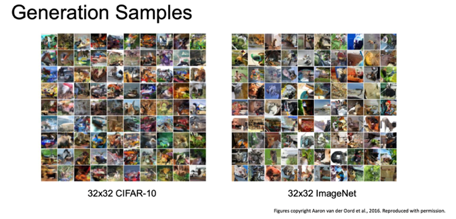

<small>최종 수정일 : 2019-11-28</small>

지금까지 우리는 지도학습 모델(Supervised Learning Model) 에 대해 주로 학습했다.  
이제는 생성 모델(Generative Model) 이라고 하는 비지도학습 모델(Unsupervised Learning Model)의 한 종류에 대해서 알아보자.

## Unsupervised Learning

비지도학습(Unsupervised Learning)은 지도학습과는 반대로 학습을 하는 데 있어서 label 을 제시하지 않는 것이다.  

즉, 지도학습은 데이터 x 에 대한 라벨 y 를 제공하고 학습을 통해 x -> y 의 input -> output 잘 나오도록 하는 것이었다.  

이에 반해 비지도학습은 데이터 x 만 존재하고 모델이 스스로 학습해 어떤 유의미한 결과가 나오도록 하는 것인데, 예를 들면 Clustering, PCA, Autoencoder 등이 되겠다.

비지도학습의 장점은 training 시 label 정보가 없기에 지도학습의 데이터보다 cheap 한 이점이 있으며, 데이터의 숨겨진 구조에 대해 학습하도록 설계되기 때문에 이를 풀어내게 된다면 해당 데이터 세상의 숨겨진 구조를 알아낼 수 있게 된다.<small>holy grail: 성배</small>  

## Generative Models

비지도학습 모델 중 생성 모델(Generative Model)에 대해서 알아보자.  

이 때, $p_{model}(x)$ 가 $p_{data}(x)$ 와 유사하도록 학습시킨다.

생성 모델은 training data 가 주어지면 여기서 새로운 샘플을 생성해내게 되는데, 이 때 distribution 을 유지한 채로 생성되게 된다.

생성 모델을 사용하면 다음과 같은 것을 할 수 있다.

- 미술품에 대한 진짜같은 샘플을 만들어 낼 수 있고, 색 칠하기 등이 가능하다.
- 시간 순서의 데이터에 대해 시뮬레이션과 planning 이 가능해지고 이를 강화학습(reinforcement learning)에 적용시킬 수도 있다.
- latent representation(잠재적 특성) 에 대해 잘 학습시켜 놓는다면 나중에 추론이 가능해지기도 한다.(다른 task 에서 사용한다거나)

이번 강의에서는 3가지 유명한 생성 모델에 대해 알아볼 것이다.  

## PixelRNN and PixelCNN

이미지 x 에 대한 likelihood p(x) 를 모델링할 것이다.  
이 때, chain rule 을 이용해 likelihood 를 decompose 시켜 1-d distribution 의 곱으로 만들어 낸다.  

여기서 모든 이전 픽셀(all previous pixels)을 필요로 하게 된다.  

이 분포가 굉장히 복잡(complex)해서 이를 처리하기 위해 neural network 를 쓰게 되었고, 학습의 결과로 likelihood 를 최대화하는 것이 목표가 된다.

(보고 있는 것은 명시적 density model 의 경우이다.)

### PixelRNN

_PixelRNN_ 에서는 그림의 화살표를 따라 코너에서부터 pixel 을 생성해낸다.  
이 때, 이전 픽셀에 대한 의존성을 바탕으로 _RNN(LSTM)_ 을 이용하게 된다.  

이러한 순차적인 생성은 느리다는 단점이 있다.

### PixelCNN

RNN 대신 CNN 을 이용한다면 어떻게 될까?

그 방법인 _PixelCNN_ 은 다음과 같다.  
_PixelRNN_ 처럼 코너에서 시작해 pixel 을 만들어내게 된다.  

이 때, 특정 context 영역에 대해서만 _CNN_ 을 이용하게 되는데, 역시 이전의 pixel 들에 대한 의존성을 바탕으로 새로운 pixel 을 생성한다.  

이러한 과정들은 likelihood 를 최대화하는 과정이 된다.  

이는 _PixelRNN_ 보다 학습속도가 빠르고 training image 에 대한 context region 을 이미 알기 때문에 병렬화 convolution 진행할 수 있다.  

그러나 순차적으로 생성된다는 점에 있어서 여전히 느리다.

위 예시는 CIFAR-10 과 ImageNet 에서 생성한 샘플들이다.

나름 샘플들이 잘 나온 것을 확인할 수 있다.

즉, 정리하면 다음과 같다.

_PixelRNN_ 과 _PixelCNN_ 은 likelihood p(x) 를 명시적으로 계산해 내고 이렇게 명시적인 likelihood 가 training data 로써 아주 좋은 평가 지표가 되게 된다. 그리고 good sample 을 만들어 낼 수 있음을 알 수 있기도 하다.  

그러나 순차적인 생성이라는 그 구조상 느리다는 단점이 존재한다.

## Variational Autoencoders(VAE)

위에서 배운 것들은 tractable density funcion 을 정의하고 training data 에 대해 likelihood 를 최적화하였다.

이제부터 배우게 될 __VAE(Variational Autoencoder)__ 는 intractable density funcion 을 z 라는 latent 와 함께 정의하고 이는 이전과는 다르게 바로 최적화가 되지 않는다.

### Background of AutoEncoder

본격적으로 _VAE_ 에 대해 알아보기 전에 _Autoencoder_ 에 대해 간략하게 살펴보고 가자.

_Autoencoder_ 는 데이터 생성 목적이 아닌 레이블 되지 않은 training data 의 저차원 feature represenation 을 학습하기 위한 비지도학습의 접근 방법이다.  

즉, 저차원의 모델 분포함수를 알기 위함인데, 왜 저차원일까에 대한 답을 간략히 정리하고 넘어가자.  
<small>1차원 데이터에 대해서는 그 분포를 그리기 쉽지만 이미지 같은 고차원의 데이터에 대해서는 분포함수를 어떻게 그릴 것인지 생각해보면 이해가 빠르다.</small>  

Autoencoder 는 input data $x$ 를 encoder 를 통해 feature $z$ 로 mapping 하는 역할을 해주게 된다. 이 때 $z \lt x$ 의 차원을 갖는데(dimensionality reduction) 중요한 특성만 가지고 가기 위함이다.

이러한 feature z 를 decoder 에 통과시키게 되었을 때 같은 차원의 reconstructed input data $\hat{x}$ 를 만들어내게 된다.  

이 때 다시 원복시킬 수 있도록 특징을 학습하게 된다.

이러한 학습을 위해 L2 loss 를 이용하게 되고, 보다시피 label 을 사용하지 않는 것을 알 수 있다.  

학습이 완료 된다면 이제 decoder 를 사용하지 않게 된다.(throw away)

위에서 보듯이 Encoder 만을 사용하게 된다. 이 때 Encoder 가 학습한 특징을 지도학습 모델의 초기값으로 이용할 수 있다.  
여기서 추가적인 Classfier 를 달아서 predicted label $\hat{y}$ 를 출력하게 하고 이를 label $y$ 를 이용해 loss 를 구하는 식으로 fine-tune 을 수행할 수 있게 된다.

이렇게 Autoencoder 를 이용하면 많은 label 이 없는 데이터로부터 양질의 general feature representation 을 학습할 수 있는 장점이 있다.

여기서 이제 Autoencoder 가 학습을 통해 data 의 variation 을 잘 포착할 수 있다는 것을 알 수 있게 된다.

### VAE

이제 latent factor(잠재 요인) $z$ 를 이용해 image $x$ 를 만들어 낼 수 있음을 기억하며 모델을 통해 샘플을 만들어보도록 하자.  

먼저 $z$ 를 샘플링 한 후 $x$ 를 샘플링하게 된다.

생성 모델이 새로운 데이터를 잘 생성하려면 true parameter $\theta^*$ 를 잘 추정해야한다.  

이 모델은 어떻게 설계할 것인가?  
prior p(z) 가 심플하도록 Gaussian 같은 것으로 하거나, 복잡한 conditional p(x|z) 는 neural network 를 통해 represent 하도록 한다.  

이렇게 설계된 network 를 decoder network 라 하자.

이 모델을 어떻게 학습시킬 수 있을까?  

fully visible belief network 의 PixelRNN/PixelCNN 을 상기시켜보자.  
가장 쉬운 학습 방법은 model parameter 가 likelihood 를 최대로 할 수 있도록 학습시키는 것이다.  

그렇다면 이전에 우리가 했었던 것 처럼 gradient 를 계산해 학습시키면 될 것이다.  

그러나 안타깝게도 위의 적분식으로부터 gradient 를 계산하는 것을 불가능(intractable)하다.  

그렇다면 조금 자세히 살펴보기로 하자.

#### vae intractability

데이터에 대한 likelihood 가 있고, 첫 항은 gaussian prior 인 p(z) 이다.

두 번째 항은 neural network 로 representation 된 Decoder 이다.  

즉, z 만 주어진다면 모든 p(x|z) 도 계산할 수 있는 것이다.

그러나 __모든__ z 에 대해서 적분식을 계산할 수 없는데, p(x|z) 를 계산해 낼 수 없기 때문이다.(intractable)

posterior density 로 표현하기 위해 bayesian rule 를 이용해 전개 한다면 다음과 같이 된다. 그러나 결국 p(z|x) 역시 마찬가지로 불가능 하다.

p(x)를 계산하기 어렵기 때문이다.

이를 해결하기 위한 방법은 추가적인 encoder network 인 q(z|x) 를 정의하는 것인데, 이 때 이는 p(z|x) 에 근사한 것이다.

이를 통해 data likelihood 의 하한을 구할 수 있고, 이렇게 최적화를 진행하게 된다.

#### Encoder and Decoder Network in VAE

우리는 _VAE_ 에서 확률론적 생성(probabilistic generation) 모델을 만들고 싶은 것이다.

위에서 보았던 Encoder 와 Decoder 에 이제 확률론적 의미를 추가하게 된다.

각 출력이 의미하는 것은 평균과 대각 공분산(diagonal covariance)이다.

## Generative Adversarial Networks

> 이 포스트는 스탠포드의 [cs231n](http://cs231n.stanford.edu) 11강 강의를 보고 공부 및 정리한 포스트입니다.  
> 잘못된 것이 있을 수 있습니다.  
> 댓글로 알려주시면 감사합니다!  
