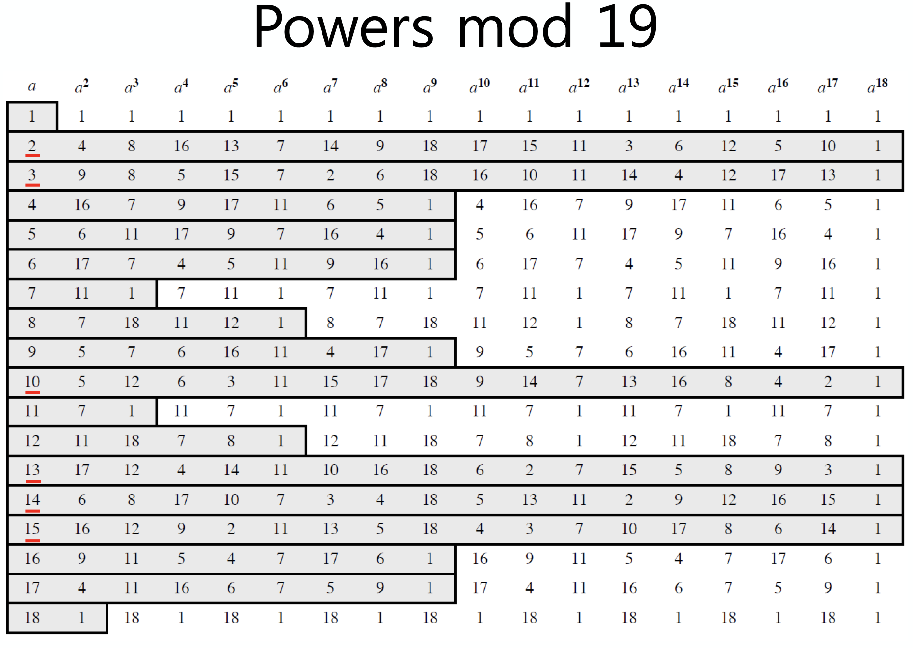
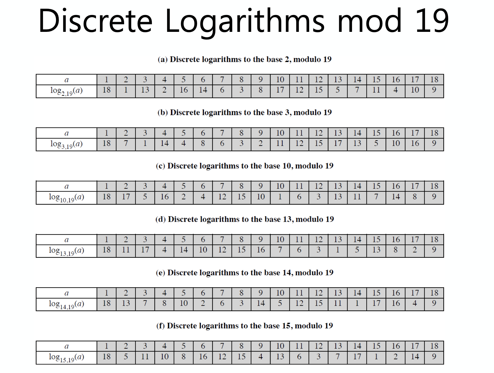

[지난 포스트](https://cheong.netlify.com/posts/introduction-to-number-theory-for-information-security-1/) 에 이어 암호학에 있어서 어떤 수학적인 내용들이 사용되는지 살펴보자.

## Prime Numbers

소수(Prime Numbers)는 1과 자기 자신으로만 나누어떨어지는 수를 말한다.<small>여기서 소수를 갑자기 보고 넘어가기엔 너무 멀리 온 것 아닐까 이미..?</small>  

정의에 의하면 1도 소수이긴 하나 딱히 쓸모가 있지는 않으므로 넘어가고 2부터 생각을 많이하게 된다.  

소수는 정수론(Number Theory)에서 아주 중요한 위치에 있다.

소인수분해(Prime Factorization)를 통해 모든 정수를 소수들의 곱으로 표현이 가능하며, 이러한 성질을 이용해 암호를 만들어 낼 수도 있다.  

소인수분해를 수식으로 표현해보면 다음과 같다.

$$
\prod_{p \in P}p^{a_p}, \ a_p \geq 0
$$

## Fermat's Theorems

페르마 소정리라고 불리는 것에 대해 알아보자.

$$
a^{p-1} \equiv 1  \mod{p}, \ \gcd(a,p) = 1, \quad \text{p is prime}
$$

이는 어떤 수가 소수일 간단한 필요 조건에 대한 정리인데, 이는 합동식으로 쉽게 증명이 가능하다.  

또한 다음과 같이 변형이 가능하다.  

$$
a^p \equiv a \mod{p}
$$

이전 식과 다른 점은 gcd(a,p) = 1 이 불필요하다는 점이다. 이는 모듈러 연산의 곱셈 법칙을 떠올리면 이해하기 쉽다.

간단하게 $3^{201} \mod{11}$ 을 풀어보고 가자.

<small>답은 3이다.</small>

## Euler Totient Function

오일러 파이 함수(Euler Totient Function)는 수론에서 정수환의 몫환의 가역원을 세는 함수이다.  

다시 말하면, n이 양의 정수일 때, $\phi(n)$은 n 과 서로소인 1부터 n 까지의 정수의 개수와 같다.  
예를 들어 n=10 인 경우, {1,3,7,9} 가 되는 것이다.  

여기서 $\phi(1)=1$ 이 된다.  

이 $\phi(n)$ 은 곱셈적 함수이다. 즉, 두 정수 m, n 이 서로소라면 다음이 성립한다.  

$$
\phi(mn) = \phi(m)\phi(n)
$$

p 가 소수일 때는 다음이 성립한다.

$$
\phi(p) = p-1
$$

소수 $p$ 의 거듭제곱 $p^k$ 의 오일러 파이 함수의 값은 $\phi(p^k) = p^{p-1}\left(p-1 \right)$ 가 된다.

### Euler's Theorem

여기서 우리는 오일러 정리를 살펴보고 가자.  

오일러 정리는 $a^{\phi(n)} \equiv 1 \mod{n}$ 이 $\gcd(a,n) = 1$ 일 때 성립한다는 것이다.  

예를 보자.

$$
a=3, n=10 \\
\phi(10) = 4 \\
3^4 = 81 = 1 \mod{10}
$$

이를 위에서 본 페르마 소정리와 같이 생각하면 다음과 같이 쓸 수 있다.  

$$
a^{\phi(n)+1} \equiv a \mod{n}
$$

## Primality Testing

많은 암호화 알고리즘들은 아주 큰 소수를 이용하고 있다. 즉, 이러한 암호화 알고리즘을 풀어내려면 그 큰 소수를 계산해내야하는 것이다.  

그렇다면 주어진 수가 소수인지 아닌지 판별을 해야하는 것이고, 아직까지 주어진 수에 대해서 소수인지 아닌지 결정짓는 간단한 방법은 밝혀지지 않았다.  

무식하게 brute-force 로 접근하면 풀어낼 수 있으나 수십~수백 자리의 자릿수를 지닌 소수에 대해 언제 2부터 모든 수를 대입하며 찾아볼 수 있을까? 이는 현대 컴퓨팅 능력으로는 불가능한 상황이다.  

## Testing for Primality

대신 pseudo-prime 인지 판별하는 방법들은 고안이 되었는데, pseudo-prime 이라고 불리는 이유는 모든 prime number 는 해당 property 를 만족하나 몇몇 합성수(composite number)들도 그 property 를 만족하기 때문이다.  

그러나 먼저 pseudo-prime 으로 걸러 놓은 후 소수인지 아닌지 결정짓도록 한다면 이는 많은 자원의 절약을 이끌어 낼 수 있을 것이다.

### Two Properties of Prime Numbers

다음의 두 속성을 만족하면 위에서 언급한 pseudo-prime 이 된다.(또는 소수일 수 있다.)

1. Property 1  
    - p 가 소수이고, a 가 a < p 를 만족하는 양의 정수일 때,
    - $a^2 \mod{p} = 1$ iff $a \mod{p} = 1$ 또는 $a \mod{p} = -1 \mod{p} = p-1$ 을 만족한다.

2. Property 2  
    - 2보다 큰 소수 p 에 대해 $p-1 = 2^kq$ 를 만족하는 k>0, 홀수인 q 에 대해,
    - $1 \lt a \lt p-1$ 인 $a$ 에 대해서
    - $a^q \mod{p} = 1$ 을 만족하거나
    - $1 \leq j \leq k$ 의 범위 안의 어떤 j 에 대해 $a^{2^{j-1}} \mod{p} = -1 \mod{p} = p-1$ 를 만족한다.

### Miller-Rabin Algorithm

위의 두 property 는 페르마 소정리에서 유도할 수 있다.  

이를 이용한 Miller-Rabin Algorithm 을 살펴보자.  

```
TEST (n) is:
1.  Find integers k, q, with k>0, q odd, so that (n-1) = (2^k)q
2.  Select a random integer a, 1<a<n-1
3.  if a^q mod n = 1 then return ("inconclusive")
4.  for j=0 to k-1 do
    5.  if (a^(2^j)q mod n = n-1)
        then return("inconclusive")
6.   return("composite")
```

다시 풀어쓴 알고리즘은 다음과 같다.

__입력__: n: 소수인지 검사할 숫자 , k: 소수판별법을 몇회 실행할지 결정하는 인자.  
__출력__: n이 합성수이면 합성수이다, 아니면 아마 소수일 것 같다는 것을 반환한다.  
$\displaystyle 2^{s}d$ 형태로 바꾼다.  
다음을 k 번 반복한다.  
$\displaystyle [1,n-1]$에서 임의의 $a$를 선택한다.
[$\displaystyle [0,s-1]$의 모든 $r$에 대해 $\displaystyle a^{d}\,{\bmod {\,}}n\neq 1$이고 $\displaystyle a^{2^{r}d}\,{\bmod {\,}}n\neq n-1$이면 합성수이다.  
위 조건을 만족하지 않으면 소수일 것 같다.  
제곱을 반복하는 방법으로 모듈로 지수승을 계산하면 이 알고리즘의 시간복잡도는 $\displaystyle {\color {Blue}O}(k\,\log ^{3}n)$이다.($k$는 $a$의 개수이다.) 이때 FFT를 이용하여 곱셈의 횟수를 줄이면 시간복잡도를 $\displaystyle {\color {Blue}{\tilde {O}}}(k\,\log ^{2}n)$로 줄일 수 있다.

이제, 두 가지 예제를 풀어보자.

- $n=29$ 에 대해, $a=10$ 일 때와 $a=2$ 일 때 각각 $n$ 이 소수인지 아닌지 판별하라.
- $n=2047$ 에 대해, $a=2$ 일 때 $n$ 이 소수인지 아닌지 판별하라.

<small>답은 모두 inconclusive</small>  

이렇게 밀러-라빈 소수판별법으로 합성수(composite)라고 반환되면 명백히 소수가 아닌 수이며, inconclusive 는 pseudo-prime 이 된다.  
이렇게 pseudo-prime 을 판별할 확률은 $1 \over 4$ 보다 작으며, t 번 반복하게 된다면 해당 수가 소수로 판별되는 확률은 $1-4^{-t}$ 가 되게 되고, 10 번만 해보아도 0.99999 보다 커지게 된다. 즉, 소수일 확률이 매우 커지는 것이다.  

그러고 나서 _AKS test_ 를 진행한다면 소수인지 아닌지 판별할 수 있을 것이다.  

팁으로, 작은 수에 대한 판별은 Pomerance, Selfridge, Wagstaff, Jaeschke 에 의하면 다음과 같다.

- n<1,373,653일 경우 a=2,3에 대해서만 검사해보면 충분하다  
- n<9,080,191일 경우 a=31,73에 대해서만 검사해보면 충분하다  
- n<4,759,123,141일 경우 a=2,7,61에 대해서만 검사해보면 충분하다  
- n<2,152,302,898,747일 경우 a=2,3,5,7,11에 대해서만 검사해보면 충분하다  
- n<3,474,749,660,383일 경우 a=2,3,5,7,11,13에 대해서만 검사해보면 충분하다  
- n<341,550,071,728,321일 경우 a=2,3,5,7,11,13,17에 대해서만 검사해보면 충분하다  

### Prime Distribution

소수의 분포와 관련해서 대략적으로 ln(n) 만큼마다 소수가 하나씩 나온다고 한다.  
그러나 이는 대략적인 것으로 아직까지 정확한 소수의 분포에 관련한 공식은 밝혀지지 않았다.

## The Chinese Remainder Theorem

중국인의 나머지 정리는 어떤 쌍마다 서로소 자연수들에 대한 연립 합동식의 해의 유일한 존재에 대한 정리이다.  

이는 어떤 수 M 으로 모듈러 연산을 했을 때의 결과값을 빠르게 구할 수 있게 해주는 정리인데, $M = m_1m_2...m_k$ 라면 다음과 같다.  

1. $a_i = A \mod{m_i}$ 를 먼저 계산한다.
2. $M_i = {M \over m_i}$ 일 때, $c_i = M_i \times \left( M_i^{-1} \mod{m_i} \right)$ 를 만족하는 $c_i$ 를 구한다.  
3. 이 때, $A \equiv \left( \sum_{i=1}^ka_ic_i \right) \mod{M}$ 이 된다.  

예제를 풀어보자.

- $x \equiv 5 \mod{7}$, $x \equiv 3 \mod{11}$, $x \equiv 10 \mod{13}$ 일 때, $x \mod{1001}$?  
- $x \equiv 2 \mod{3}$, $x \equiv 3 \mod{5}$, $x \equiv 2 \mod{7}$ 일 때, $x \mod{105}$?

<small>894, 23</small>

## Primitive Root

원시근(Primitive Root)은 기약잉여계에서 모든 원소를 원시근의 거듭제곱으로 표현할 수 있게 만드는 원소이다. 위에서 살펴본 생성원(generator)을 다시 생각해보며 그 내용을 살펴보자.  

오일러 정리(Euler's Theorem)에서 $a^{\phi(n)} \mod{n} = 1$ 이었다.  
그렇다면 $a^m \mod{n}=1, (\ \gcd(a,n)$ 을 만족하는 $m$이 존재하고$\phi(n)$ 보다 작을 수도 있다.  

이 때, $m = \phi(n)$ 인 경우, $m$ 이 원시근이 된다.  

소수 p 에 대하여 primitive root 가 성공적으로 mod p 에 대한 group 을 만들어 낼 수 있다.  

- $a, a^2, ... , a^{p-1}$ 이 모두 다르다.
- 예를 들어, 소수 19 에 대한 원시근은 2, 3, 10, 13, 14, 15 이다.



위의 표에서 보다시피, 소수 19 에 대한 원시근은 2, 3, 10, 13, 14, 15 임을 확인할 수 있다.  

이러한 원시근은 모든 정수가 갖지는 않으며 $n = 2, 4, p^\alpha, 2p^\alpha$ 의 형태에 대해서만 존재함이 밝혀져있다.  
이 때, $p$ 는 홀수인 소수이며, $\alpha$ 는 양의 정수이다.  

## Discrete Logarithms

이산 로그(Discrete Logarithms)는 이산 대수라고도 하며, $a^x = b$ 꼴을 만족하는  $x$ 를 가리킨다.  

이는 우리가 위에서 본 inverse problem 등에 대한 것과 같은 맥락을 지니게 되는데, 모듈러 연산에서 $b=a^i \mod{p}$ 을 만족하는 $i$ 를 구하는 것을 생각해보자.  

이 때, $i = d\log_ab \mod{p} = d\log_{a,p} b$ 라 쓸 수 있다.  
여기서 $a$ 는 원시근일 경우 $i$ 가 반드시 존재하게 되며 그렇지 않을 경우 존재하지 않ㅇ르 수 있다.  



위의 표는 모듈러 19 연산에 대한 원시근들의 이산 로그를 계산한 표이다.  

이러한 이산 로그는 asymmetry property 를 가지게 된다.  
이는,  

- $y = g^x \mod{p}$ 라는 식이 주어질 때,
- $g, x, p$ 가 주어진다면 $y$ 는 쉽게 구할 수 있으나,
- $y, g, p$ 가 주어진다면 $x$ 는 구하기가 어렵다.

이고, 아직까지 이산 로그를 효율적으로(다항시간 안에) 계산해내는 방법은 밝혀지지 않았다.  

이러한 이산 로그는 이 후에 작성될 포스트의 주제들인 Diffie-Hellman Key Exchange, Digital Signature Algorithm(DSA), ElGamal Encryptyion 등의 public key algorithms 에 핵심적인 요소이다.  

> 더 알아보기  
> [이산 로그](http://www.secmem.org/blog/2019/05/17/이산-로그/)

<small>최종 수정일: 2019-11-26</small>

> 본 포스트는 _정보보호_ 를 공부하며 정리한 글 입니다.  
> 잘못된 내용이 있다면 알려주세요!  
> 감사합니다 :)
