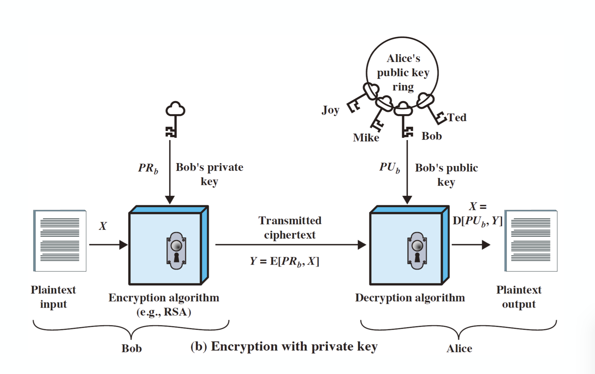
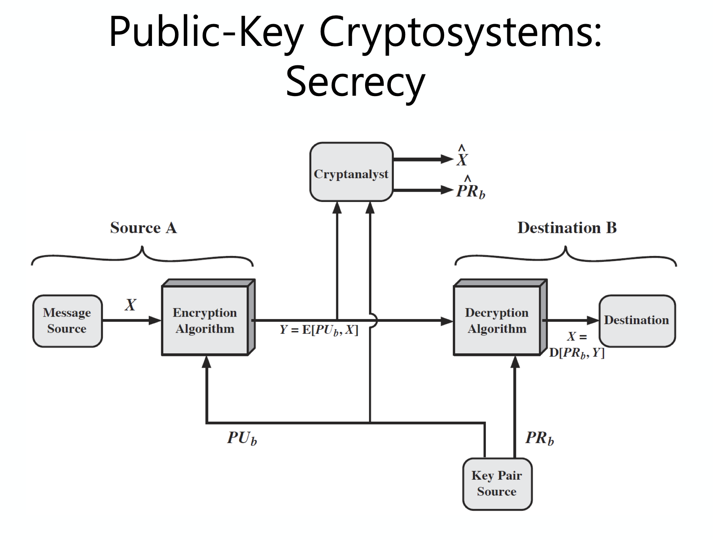
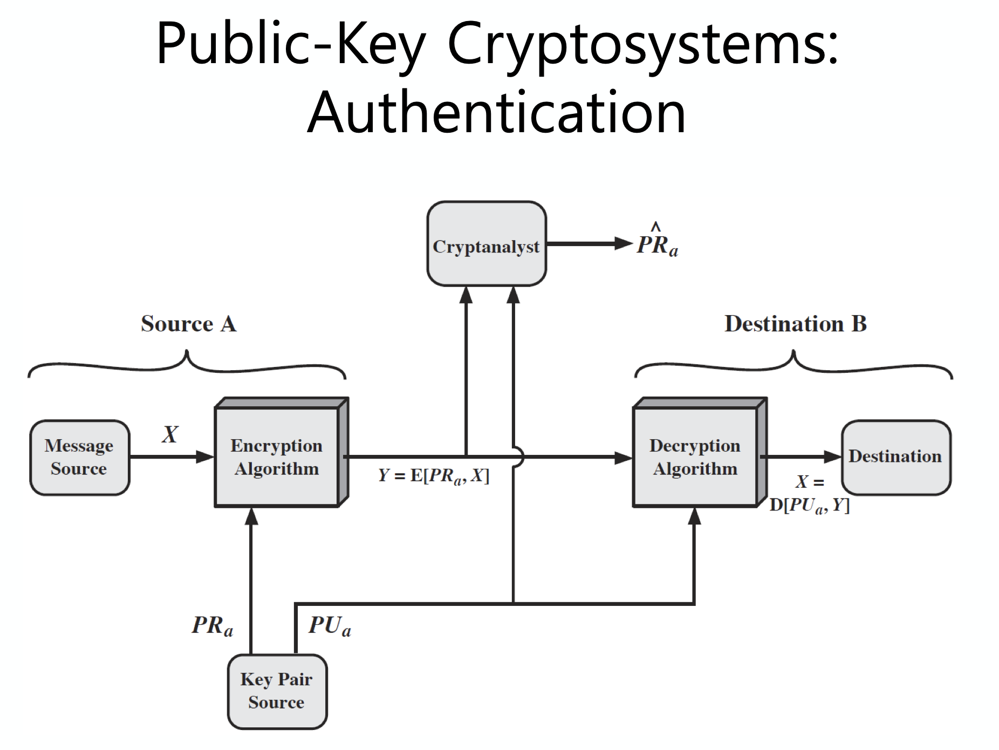
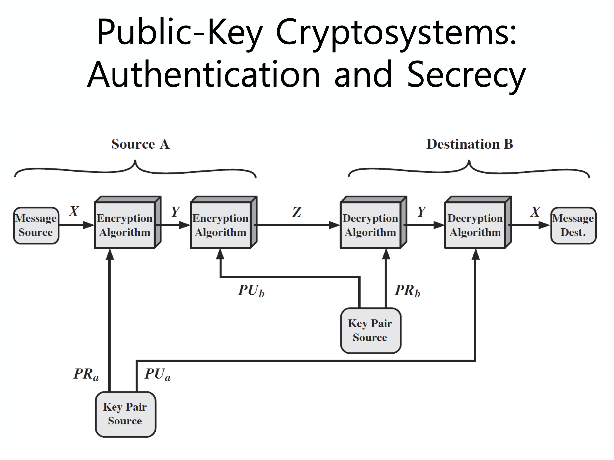
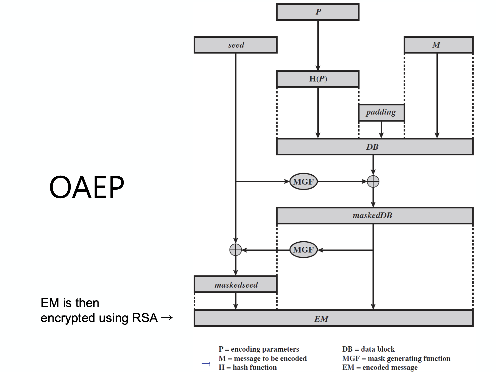

<small>최종 수정일: 2019-12-01</small>

이제 공개키 암호화 방식에 대해서 알아보자.
전통적인 private/secret/single key 암호화 방식은 하나의 키를 이용한다.  
이는 해당 키를 sender 와 receiver 가 같이 공유한다는 것을 의미하고, 이 키가 노출될 경우 위험해진다.  

그래서 이를 대칭(symmeytic)키 방식이라고 부르기도 하며, 여러 명이 함께 통신하는 경우에 key 가 multi-user 에게 공유되어있게 되고, 이렇게 되면 누가 해당 메세지를 generate 했는지 구별하기 어렵다는 점이 있다.  

## Public-Key Cryptography

공개키(Public-Key) 방식은 public & private key 두 개를 사용한다.  
이는 비대칭(Asymmetric)적인 방식으로 작동되는데, 다음의 두 문제를 해결하기 위해 고안되었다.

- Key distribution : 통신상에서 key 를 안전하게 공유하는 것은 굉장히 어려운 일이다.
- Digital signature : 해당 메세지가 위변조되지 않았는지(integrity) 확인해야 한다.

이러한 공개키 방식의 키에 대해서 간단하게 살펴보자.

- Public-key
    - 모두가 알고 있다.
    - 메세지를 암호화하고, signature 를 검증한다.
- Private-key
    - 개인만 알고있는 키이다.
    - 메세지를 복호화하고, signature 를 만들어낸다.

이 때, public key 로부터 private key 를 알기 쉬워서는 안된다.


public key 로 암호화 하여 메세지를 보내는 경우이다.  
이렇게 함호화를 할 경우, receiver 만 복호화 할 수 있게 된다.  

즉, data confidentiality 가 지켜지는 것이다.



private key 로 암호화를 할 경우 signature 를 하게 되는 것이다.  
이 경우, 네트워크 상의 모두가 복호화를 진행할 수 있기 때문에 data confidentiality 가 지켜지지는 않지만, 해당 메세지가 특정한 누군가로부터 만들어졌는지는 확인할 수 있게 된다.  

만약 이렇게 sign 해야할 정보가 중요하다면, public key 로 한 번 더 암호화해주어야 한다.

need|Conventional Encryption|Public-Key Encryption
---|:---:|:---:
Needed to Work|1. 암호화와 복호화에 같은 알고리즘과 키가 사용되어야 함.<br>2. sender 와 receiver 가 알고리즘과 키를 공유하고 있어야함|1. 하나의 알고리즘이 key pair 를 이용해 암호화 및 복호화 됨.<br>2. sender 와 receiver 가 각각 matching 되는 key pair 를 가지고 있어야함.
Needed for Security|1. 키가 안전하게 지켜져야 함.<br>2. 다른 정보가 없다면 메세지를 해독하는게 불가능해야 함.<br>3. 알고리즘에 대한 정보와 ciphertext 의 예들로부터 키를 알아내는게 불충분해야 함.|1. 두 키 중 하나는 안전하게 지켜져야 함.<br>2. 다른 정보가 없다면 메세지를 해독하는게 불가능해야 함.<br>3. 알고리즘에 대한 정보와 하나의 키, ciphertext 의 예들로부터 키를 알아내는게 불충분해야 함.



Data Confidentiality 가 지켜지는 모습이다.



누가 이 메세지를 만들었는지 알 수 있어야 한다.



confidentiality 와 authentication 을 둘 다 적용하는 모습이다.  

이처럼 Public-Key 는 3가지 카테고리로 나눌 수 있다.

- En(De)cryption : provide secrecy
- Digital Signatures : provide authentication
- Key Exchange : session key exchange

아래와 같이 각 알고리즘이 보장하는 카테고리를 확인할 수 있다.

Algorithm|En(De)cryption|Digital Signature|Key Exchange
:---:|:---:|:---:|:---:
RSA|Y|Y|Y
Elliptic Curve|Y|Y|Y
Diffie-Hellman|N|N|Y
DSS|N|Y|N

### Public-Key Requirements

이러한 공개키 방식의 특성에 대해 알아보자.

1. party B 가 쌍($PU_b$, $PR_b$)를 만드는데 계산상 효율적이다.
2. sender A 가 public key 와 암호화된 메세지를 알고 있을 때 해당하는 ciphertext $C=E(PU_b, M)$ 를 만드는데 계산상 효율적이다.
3. receiver B 가 private key 를 가지고 암호화된 메세지를 복호화한 $M = D(PR_b, C) = D[PR_b, E(PU_b, M)]$ 을 만드는데 계산상 효율적이다.
4. 공격자 입장에서 public key 를 안다고 했을 때 private key 를 알아내는게 어렵다.
5. 공격자 입장에서 public key 를 알고 ciphertext C 도 안다고 해도 original message M 을 알기 어렵다.
6. (optional) 두 키가 순서 상관 없이 적용 가능하다. 즉, $M = D[PU, E(PR, M)] = D[PR, E(PU, M)]$ 가 가능하다.(_RSA_ 의 경우)

이러한 공개키 방식은 one-way function 으로 작동해야하기에 trapdoor 가 필요하다.  

One-way function 은  

- $Y=f(X)$ 는 쉽고,
- $X = f^{-1}(Y)$ 는 어렵다.

trapdoor one-way function 은

- $Y=f_k(X)$ 가 $k, X$ 를 알 때 쉽다.
- $X=f_k^{-1}(Y)$ 가 $k, Y$ 를 알 때 쉽다.
- $X=f_k^{-1}(Y)$ 가 $Y$ 는 알고 $k$ 를 모를 때 어렵다.

이러한 알고리즘을 잘 설계해야하는 것이다.  

이론적으로는 brute-force 는 항상 가능한 공격방법이나, 현실적으로 계산 cost 가 높아지게 된다면 불가능한 공격방법이 된다. 따라서 large key 를 이용하는 것이 좋은 방어방법이 된다.  

즉, brute-force 를 방어하기에 충분히 길면서, 암/복호화에 있어서 빠르게 수행될 수 있도록 현실적으로 적당한 크기의 길이를 가져야 한다.  

어쩔 수 없이 private key scheme 보다는 느릴 수 밖에 없다.  

따라서 small security information(session key 라던가) 을 암호화하는데 많이 사용된다.

## RSA algorithm

이제 _RSA_ 알고리즘에 대해 알아보자.  
이는 Rivest, Sharmir, Adleman 의 이름의 앞글자를 따서 붙여진 이름이고, 1977년 MIT 에서 개발되었다.  

public-key scheme 에서 아주 광범위하게 사용되고 있으며 소수와 유한체(Galois field)를 이용한 모듈러 연산에 바탕을 두고 있다.  
굉장히 큰 자릿수의 수를 사용하며(1024, 2048 bits, ...) 이를 이용한 보안성을 기반으로 사용 중이다.

### RSA En/Decryption

- Encryption : sender 는 메세지 M 을 암호화하기 위해
    - receiver 의 public key PU={e,n} 를 얻고,
    - ciphertext $C=M^e \mod{n}, \text{where } 0 \leq M \lt n$ 을 계산한다.
- Decryption : receiver 는 ciphertext C 를 복호화하기 위해
    - __private key__ PR={d,n} 을 사용해
    - $M = C^d \mod{n}$ 을 계산한다.
이 때, M 은 modulus n 보다 작아야 한다. 즉, 필요하다면 block 형식으로 쪼개야한다.

### RSA Key Setup

이런 _RSA_ 의 키는 큰 소수의 쌍으로 나타내는데, 이를 각각 $p, q$ 라고 해보자.
$n=p\times q$ 로 하면, 이전 포스트에서 살펴봤듯이 $\phi(n) = (p-1)(q-1)$ 이 된다.  
여기서 $1 \lt e \lt \phi(n), \gcd{(e, \phi(n))}=1$ 를 만족하는 random $e$ 를 정한다.  
이로부터 decryption key d 를 $e \times d = 1 \mod{\phi(n)}, 0 \leq d \leq n$ 으로 구한다.  

public key PU={e,n} 이 되고, private key PR={d,n} 이 된다.

왜 _RSA_ 가 동작하는지 살펴보자.  

오일러 정리에 따라  

$$
a^{\phi(n)} \mod n = 1, \gcd(a,n)=1
$$

이 성립한다.

_RSA_ 를 보자.
- $n = p \times q$
- $\phi(n) = (p-1)(q-1)$
- $e, d$ 를 $\mod \phi(n)$ 에서 적당하게 구하고
- $e \times d = 1 + k\times \phi(n)$ 이 되는 $k$ 가 있으면 다음과 같다.  

$$
\begin{aligned}
C^d &= M^{e \times d} = M^{1+k \times \phi(n)} = M^1 \times \left( M^{\phi(n)} \right)^k \\
&= M^1 \times \left(1 \right)^k = M^1 = M \mod{n}
\end{aligned}
$$

즉, _RSA_ 가 잘 동작하는 것을 확인할 수 있다.  

예를 통해 계산 과정을 살펴보자.  

```
p = 17, q = 11
n = pq = 17 x 11 = 187
phi(n) = (p-1)(q-1) = 16 x 10 = 160
e:gcd(e, 160)=1; 에서 e=7 을 선택
d: de = 1 mod 160, d<160 이므로 d=23 일 때, 23 x 7 = 161 = 1 x 160 + 1
PU = {7, 187}
PR = {23, 187}

M = 88 일 때,
C = 88^7 mod 187 = 11
M = 11^23 mod 187 = 88
```

이러한 _RSA_ 는 'Square and Multiply' 알고리즘을 사용할 수 있다.  
이는 exponentiation 을 효율적으로 처리하는 알고리즘으로, $O(\log_2n)$ 으로 동작한다.  

이는 지수의 거듭제곱 꼴을 2의 거듭제곱 꼴로 반복해 표현하게 하는 것이다.  
비트를 이용한 표현 방법이라고 생각해도 괜찮을 것 같다.  

예를 들면 다음과 같다.  

$$
88^7 \mod{187} = (88^1 \mod{187})(88^2 \mod{187})(88^4 \mod{187})
$$  

### Efficient En/Decryption

앞서 살펴보았듯 _RSA_ 는 $e$ 의 지수꼴로 암호화를 진행하기 때문에 위에서 본 알고리즘을 이용해 빠르게 계산할 수 있게된다.  

$e=65537(2^{16}+1)$ 또는, $e=3, e=17$ 을 많이 사용하나, $e$ 가 작을 수록 공격당하기 쉬워진다.  

다음의 상황을 생각해보자.

세 명의 _RSA_ 유저가 $e=3$ 을 사용하고 각각 ($n_1, n_2, n_3$) 를 modulus 로 이용할 때,  

- 어떤 한 유저가 message M 을 암호화해서 보내게 된다면 각각
    - $C_1 = M^3 \mod{n_1}, C_2 = M^3 \mod{n_2}, C_3=M^3 \mod{n_3}$ 를 받게 된다.
- $C_1 = M^3 \mod{n_1}, C_2 = M^3 \mod{n_2}, C_3=M^3 \mod{n_3}$ 를 받게 될 때, 한 명은 $M^3 \mod{(n_1, n_2, n_3)}$ 를 CRT 를 이용해 계산할 수 있다.  
- _RSA_ 의 특징 중, $M^3 \lt n_1n_2n_3$ 이므로 $M^3$ 의 세제곱근을 구해서 $M$ 을 구할 수 있게 된다.

만약 $e$ 가 고정되어 있다면, $\gcd(e, \phi(n)) = 1$ 이고 이는 어떤 $p, q$ 에 대해서도 $e$ 와 서로소가 아니게 된다.  

복호화에는 거듭제곱에 대한 지수 d 를 이용한다. 마찬가지로 이는 매우 커야하는데, 그렇지 않다면 brute-force 공격에 의해 위험하게 된다.

그러나 수가 크게 된다면 계산이 오래걸리게 되는데, 이를 해결하기 위해 CRT 를 이용해 mod p & q 를 각각 계산하고 나중에 합쳐서 원하는 답을 얻을 수 있게 된다.  

$M = C^d \mod{n}$ 에 대해

- $C^d \mod{p} = C^{d \mod{(p-1)}} \mod{p}$ 를 계산한다.
- $C^d \mod{q} = C^{d \mod({q-1)}} \mod{q}$ 를 계산한다.
- $C^d \mod{n}$ 을 CRT 를 통해 계산한다.

이러한 방법을 이용하게 되면 바로 하는 것에 비해 3배 정도 빠르게 계산을 할 수 있게 된다.  

이 때, private key 의 주인(p, q 의 값을 아는 사람)만이 이 방법을 사용할 수 있게 된다.

자, 이제 다음의 예제를 한 번 풀어보자.

> encryption M using RSA, n=33, e=7, M=20, C=?  
>> C = 26  

> 암호화를 했으면 이제 다시 복호화도 해보자.  

이러한 _RSA_ 방식을 공격하기 위해서는 factorization(인수분해) 을 시도해야하는데, 아직 이를 효율적으로 하는 방법이 발견되지 않았다. 이로 인해 아직까지 _RSA_ 를 널리 사용하고 있는 것이다.  

### RSA Key Generation

_RSA_ 를 사용하는 유저는 반드시

- random prime $p, q$ 를 사용해야하고
- $e$ 또는 $d$ 를 선택해 다른 한 쪽을 계산해야한다.

이 때, $n=p \times q$ 이게 되는데, $p, q$는 간단한 소수이면 안된다.  
즉, 충분히 커야한다는 뜻이고, 이를 통해 보안성을 높여야 한다.  
이렇게 높아진 보안성은 probabilitistic test 로 추측되어질 수 있다.  

그리고 $e, d$ 에 대한 거듭제곱의 형태로 값이 계산되기 때문에 이를 다시 계산하기 위해 inverse algorithm 을 이용해야한다.

### RSA Security

자, 그렇다면 이제 _RSA_ 를 공격할만한 방법들에 대해 생각해보자.

1. Brute-foce key search - 큰 사이즈에 대한 수에는 적합하지 않다.
2. Mathematical attacks - $\phi(n)$ 과 modulus $n$ 을 계산하는 것이 쉽지 않다.
3. Timing attacks - 복호화 단계에서 시도해볼만 하다. 이는 side channel attack 이다.
4. Chosen ciphertext attacks - _RSA_ 는 그 특성상 해당 공격에 vulnerable 하다.

#### Factoring Problem

앞서 살펴본 4개의 공격 방법 중, 2번째인 Mathematical attack 에 대해서 조금 더 자세히 살펴보자.  
이 방법은 3가지로 나뉠 수 있는데, 

1. $n=p \times q$ 이므로, $\phi(n)$ 를 계산하고 $d = e^{-1} \mod{\phi(n)}$ 를 구하는 방법이다. 즉, $p, q$ 를 먼저 구한다.
2. $p, q$ 를 구하지 않은 상태로 $\phi(n)$ 을 먼저 구하고 $d = e^{-1} \mod{\phi(n)}$ 를 계산한다.
3. $d$ 를 직접적으로 바로 계산한다.

이 세 가지 경우에 대한 difficulty 는 모두 비슷한 수준이다.

이는 factoring 을 수행하는데 있어서 그 난이도가 모두 같다고 보기 때문이다.  

인수분해는 큰 수 $n$ 이 있을 때, 그리고 이 수가 큰 소수들로 이루어져있을 때 굉장히 어렵다.  

그러나 점차 풀이 방법들이 발전하고 있어서 엄청나게 어려운 일은 아니게 되었다.  

- Lattice Sieve(격자체)를 활용하면 200자리 수도 계산이 가능하다
- 알고리즘 발전 : Quadratic Sieve(QS) -> Generalized Number Field Sieve(GHFS) -> Lattice Sieve(LS)
- 오늘날에는 1024 - 2048 bits 의 키가 _RSA_ 에서 안전하다고 생각한다.

#### Timing Attack

이제 시간차 공격에 대해서 조금 더 살펴보자.  

이는 연산을 하는데 있어서 시간을 밝혀냄으로써 그 미세한 차이를 활용해 공격하는 방식이다.  
이는 하나의 ciphertext only attack 이 된다.  

이러한 공격을 막는 방법으로 시간을 indistinguishable 하게 만드는 방법이 있다.

- 일정한 시간이 걸리게끔 통일
- random delay 를 발생
- 계산에 사용되는 값을 blind

#### Chosen Ciphertext Attacks

앞서 얘기했듯 _RSA_ 는 Chosen Ciphertext Attack(CCA) 에 취약하다.  

이는 _RSA_ 의 property 를 ciphertext 로부터 추출해 cryptanalysis 가 가능하도록 할 수 있기 때문이다.  
이는 다음의 식으로부터 나타난다.

$$
E(PU, M_1) \times E(PU, M_2) = E(PU, [M_1 \times M_2])
$$

Decrypt $C = M^e \mod n$

- $X = \left( C \times 2^e \right) \mod n$
- $X$ 를 Chosen ciphertext 로 제출하고 $Y=X^d \mod n = (C \times 2^e)^d \mod n = ((2M)^e)^e \mod n = 2M \mod n$ 을 얻는다.  
- Deduce $M$

이러한 CCA 를 방어하는 방법은 다음과 같을 수 있다.

- random pad of plaintext
    - 그러나 CCA 를 더 복잡하게 시도한다면 이는 불충분한 대응책이 된다.
- Optimal Asymmetric Encryption Padding(OAEP)
    - RSA Security Inc. 에서 개발한 것으로
    - Feistel network 의 형태를 이용해 asymmetric encryption 전에 plaintext 를 처리하는 방식이다.



OAEP 를 이용해 homomorphism(동질성)을 제거할 수 있게 된다.

<hr />

_RSA_ 를 뚫기 위해 다음과 같은 공격 방식들도 있다.

- Coppersmith's attack
    - factorization of RSA Moduli
- Bleichenbacher attack
    - Adaptive CCA attack againt PKCS#1 v1.5
    - Practical attack against SSL/TLS server
- Manger's attack
    - Asaptive CCA against PKCS#1 v2.0 RSA-OAEP encryption

논문을 조금 더 읽어보도록 하자.

> 본 포스트는 _정보보호_ 를 공부하며 정리한 글 입니다.  
> 잘못된 내용이 있다면 알려주세요!  
> 감사합니다 :)
