## Hash Functions

해쉬 함수(Hash Function)는 어떤 임의의 길이를 갖는 메세지를 fixed size 로 압축(condense)하게 된다.  

$$
h = H(M)
$$

좋은 해쉬 함수는 

- 골고루 분포 -> no bias
- apparently random -> deterministic 하지 않게 random 으로 나타남

위의 두 가지 성질을 지녀야 하는데, 보통 이런 해쉬 함수는 사용됨에 있어서 public 하다. 즉, 잘 알려져 있다는 의미이다.  

이 해쉬 함수의 목적은 data integrity 를 위함인데, 해당 메세지가 바뀌었는지 바뀌지 않은 원본인지 판별하기 위함이다.  

암호화 기법에서 해쉬 함수는 다음 두가지 성질을 지녀야 한다.

- One-way property
    - 어떤 해쉬에 대해서 data mapping 이 이루어지는 것을 구하기 쉽지 않아야 한다. 즉, 이전 포스트에서도 보았지만 한쪽 방향의 계산(X -> Y)은 쉽지만 반대쪽 방향의 계산(Y -> X)은 어려워야 한다는 의미이다. 이는 다르게 말해서 image 를 알아도 pre-image 를 알기 어려워야 한다는 것이다.
- Collision-free property
    - 해쉬 함수는 태생적으로 충돌(collision)이 일어날 수 밖에 없다. 여기서의 의미는 image 를 알아도 각 충돌이 발생하게 하는 pre-image 들을 아는게 어렵도록 하는 것이다.

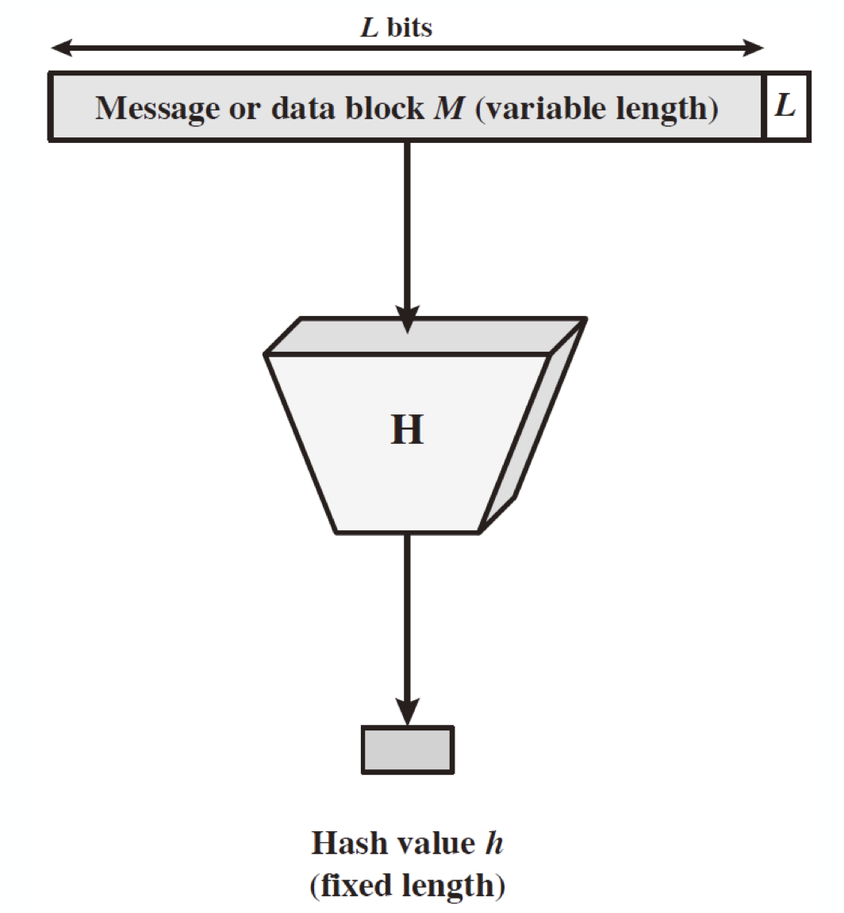

해쉬 함수를 도식화하면 위와 같이 나타낼 수 있는데, 이 때 언급했다시피 모두가 해쉬 함수를 사용할 수 있다고 가정한다. 이는 MAC(Message Authentication Code)에서와는 다른 특성이다.  

어쨌든 이러한 해쉬 함수는 다음과 같이 사용할 수 있는 곳이 굉장히 다양하다.

- Message Authentication
- Digital Signature
- One-way password file
- Intrusion detection
- Pseudorandom function
- Pseudorandom number generator
- ...

하나씩 간단하게 살펴보도록 하자.

### Hash Functions & Message Authentication

1. Message Confidentiality
    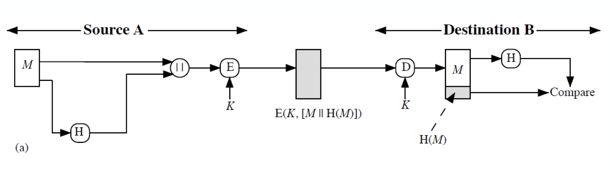
    메세지 M 을 Hash 한 후 원본과 concatenation 을 한 후 Symmetric Algorithm 으로 암호화 시킨 것이다.  
    이렇게 할 경우 메세지의 confidentiality 를 얻게 된다.
2. Message Authentication Code
    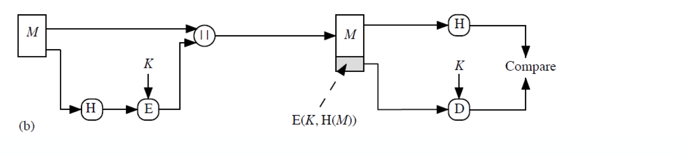
    메세지 M 을 hash 한 것을 암호화 한 후 원본과 concatenation 한다. secret information 이 없다면 모두가 이 메세지에 대해서 verify 할 수 있게 된다. 이 암호화된 hash 는 MAC 로 사용되게 된다.
3. Efficient
    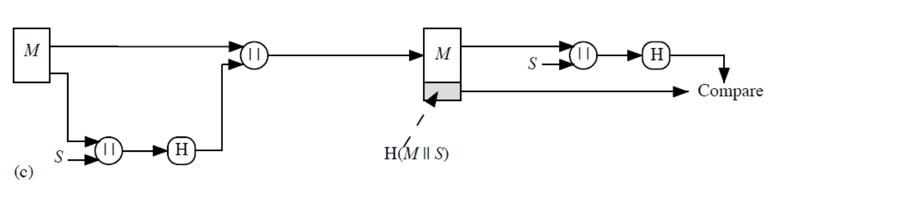
    메세지 M 과 secret information 을 concatenation 한 후 hash 한다. 이를 다시 원본 메세지와 concatentation 하여 전송하게 되는데, 이 과정에서는 encryption 이 없기 때문에 효율적이게 되고, 이로 인해  많이 쓰이는 방식이다.
4. All together
    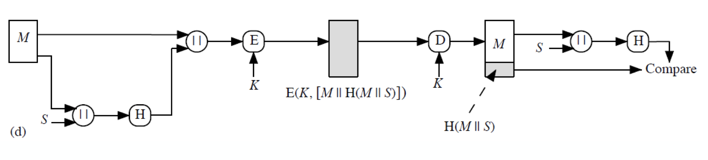
    위의 과정들을 적절하게 섞어 놓은 방식이다. 데이터 전송에 있어서 모든 과정이 필요한 경우에 사용하는 scheme 이라 볼 수 있다.

위의 hash 를 하는 방법에서 더 흔하게 메세지 인증을 위한 방법으로 사용되는 것이 __Message Authentication Code(MAC)__ 를 이용하는 방법이 있다. 이는 __keyed hash function E(K, H(M))__ 라고 알려진 것이다.

### Hash Functions & Digital Signature

이번에는 해쉬 함수와 전자 서명(Digital Signature)을 함께하는 것을 알아보자.

1. encryption once
    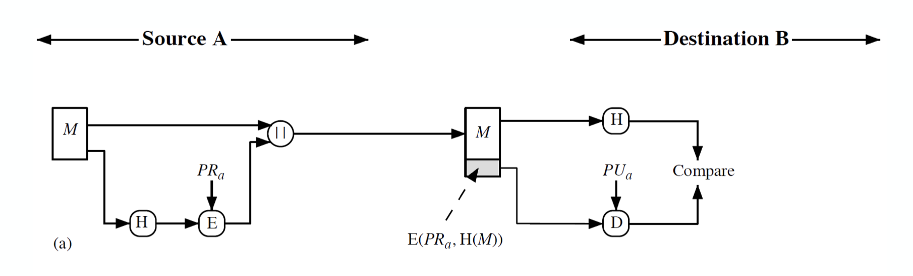
    먼저 메세지 M 을 해쉬한 H 를 public key algorithm(RSA, ElGamal 등) 으로 암호화 한다. 이 때 private key 를 이용한다. 이 후, 원본 메세지 M 과 concatenation 을 취한 후 전송하게 된다.
2. encryption twice
    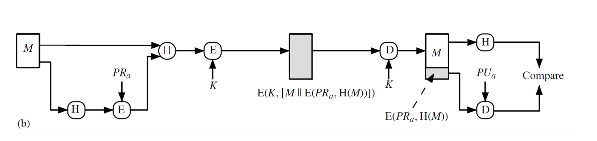
    1번과 비슷하나 전송 전에 concatenation message 를 symmetric algorithm 으로 암호화한다. 이를 통해 confidentiality 를 적용할 수 있게 되고, 이를 hybrid system 이라고 부르기도 한다. 이는 실제로 많이 쓰이는 방법이다. 이 때 전송 전에 asymmetric algorithm 으로는 암호화할 수 없는데, 메세지가 가변길이를 가지기 때문이다.

### Hash Functions & Other Uses

해쉬 함수는 그 외에도 다른 곳에 쓰일 수 있다.

- one-way password file  
    흔히 비밀번호를 저장하는 방법이다. 실제 데이터가 아닌 hash 된 데이터만 저장해 이것이 일치하는지만 확인한다.
- intrusion detection(침입 탐지) & virus detection
    file 이나 system 의 해쉬값을 지속적으로 확인함으로써 탐지하게 된다.
- pseudorandom function(PRF) 또는 pseudorandom number generator
    대칭키를 만드는데 사용한다.

## Two Simple Insecure Hash Functions

겉으로 보기에 그럴싸해보이지만 안전하지 못한 두 가지 해쉬 함수에 대해 알아보자.

1. bit-by-bit exclusive-OR(XOR) of every block $C_i = b_{i1} \oplus \ ... \ \oplus b_{im}$  
    - $C_i$ : hash code 의 $i$ 번째 bit, $1 \leq i \leq n$
    - $m$ : 입력인 n-bit block 의 개수
    - $b_{ij}$ : $j$ 번째 block 의 $i$ 번째 bit  

    이는 longitudinal redundancy check 라고도 알려져 있다. random data 에 대한 data integrity check 에 꽤 효과적이나 예측 가능한 형식의 데이터에 대해서는 덜 효과적이다.<small>parity check 를 생각해보자</small>

2. Rotated XOR : One-bit circular shift 를 hash 값에 적용하는 것이다.  
    - n-bit 해쉬 값을 0 으로 초기화 한다.
    - 그 다음 n-bit block 에 대해
        - rotate current hash value to left by 1 bit
        - XOR the block into the hash value  

    이러한 방법은 input 에 대해 randomizing 을 할 수 있고 regularity 에 대해 극복할 수 있게 된다. 이 역시 data integrity 에 대해 좋을 수 있으나 암호화된 해쉬 값이 평문메세지와 같이 사용하게 될 경우 보안성이 쓸모 없어지게 된다.

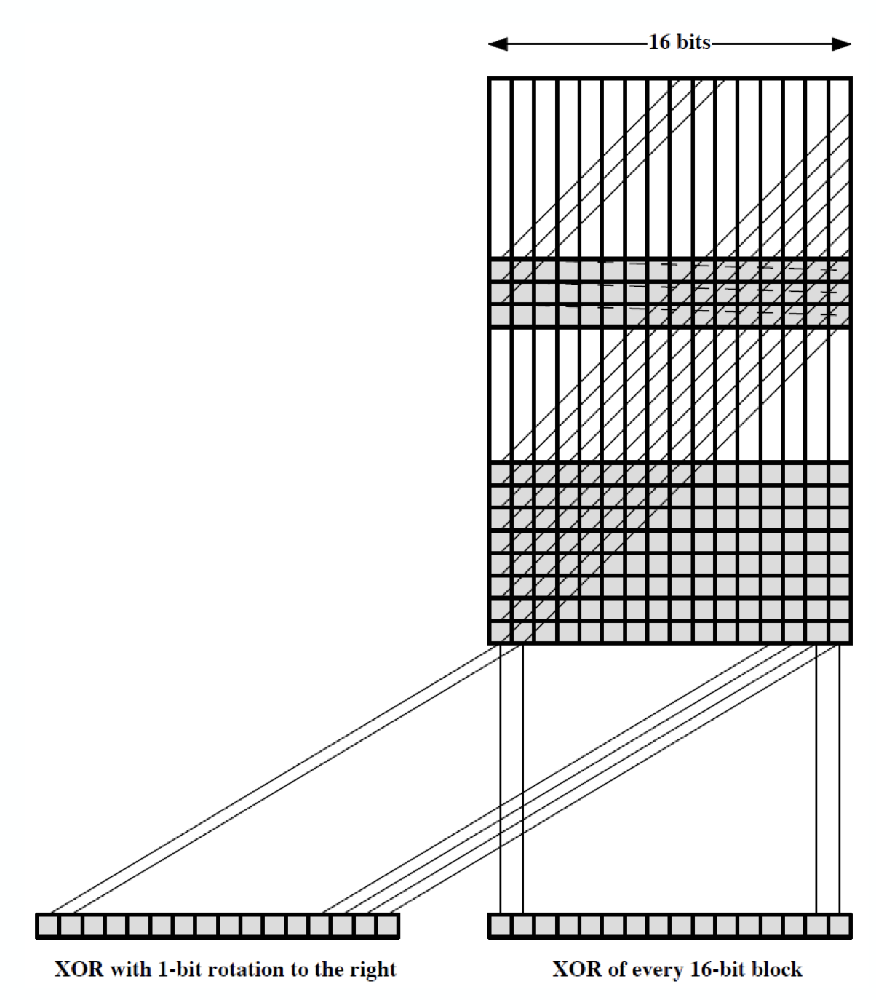

## Hash Function Requirements

hash function $h = H(x)$ 에 대해서 $x$ 는 $h$ 의 pre-image 이다.  

이 때, 해쉬 함수는 필연적으로 collision 을 가지고 있을 수 밖에 없는데, collision 은 $x \neq y$ 이지만 $H(x) = H(y)$ 인 경우를 의미한다.  
이는 구조적으로 당연한데, hash function 은 $n$ 의 길이를 가질 때, 입력 사이즈 $b$ 에 대해 $b \gg n$ 으로 설계되는 경우가 많기 때문이다.  

이 때, 각 hash 값은 $2^{b-n}$ 의 개수의 preimage에 대해 collision 을 가질 수 있다.(evenly distributed 의 경우 = 잘 설계된 경우)

해쉬 함수는 다음의 requirement 를 가진다.

Requirement|Description
:---:|:---:
Variable input size|H can be applied to a block of data of any size
Fixed output size|H produces a fixed-length output
Efficiency|H(x) is relatively easy to compute for any given x, making both hardware and software implementations practical
Preimage resistant (one-way property)|For any given hash value $h$, it is computationally infeasible to find $y$ such that H($y$)=$h$.
Second preimage resistant(weak collision resistant)|For any given block $x$, it is computationally infeasible to find $y \neq x$ with H($y$) = H($x$)
Collision resistant (strong collision resistant)|It is computationally infeasible to find any pair($x$, $y$) such that H($x$) = H($y$)
Pseudorandomness|Output of H meets standard tests for pseudorandomness

- preimage resistant : 어떤 해쉬값 h 에 대응하는 입력 y 를 찾는다면 깨짐
- second preimage resistant : 입력 x 가 해쉬값 h 를 가리킨다 했을 때, 마찬가지인 해쉬값 h 인 입력 y 를 찾는다면 깨짐
- collision resistant : 아무 입력 쌍(x,y) 에 대해 이 쌍이 같은 해쉬값 h 를 가리키면 깨짐

이 때 중요한 것이 세 가지 resistant 에 대한 것이다.  
어떤 것이 가장 어려울까?(또는 쉬울까?)  

preimage resistant 와 second preimage resistant 의 cost 가 각각 $O(2^m)$(brute-force) 으로 동일하며, collision resistant 의 경우가 $O(\sqrt{2^m})$ 으로 같은 사이즈 m 에 대해 훨씬 취약하다고 알려져있다.  

## Attacks on Hash Functions

자, 이제 해쉬 함수를 공격하는 방법에 대해 생각해보자.  

물론 당연하게도 brute-force 로 공격을 해볼 수 있고, cryptanalysis 를 적용해 볼 수도 있다.  

우선 preimage resistant 와 second preimage resistant 에 대해서는 어떤 값 하나를 선정해서 그 해쉬값과 같은 입력 y 를 찾아보면 된다. 이는 $2^{m-1}$ 만큼의 시도를 취하면 된다. 즉, cost 는 O($2^m$) 이 된다.  
이 때, $m$ 은 hash code 의 길이이다.

Collision resistance 에 대해서는 조금 다르다.  
이는 아무런 값이 쌍을 이루어 같은 해쉬값을 갖기만 하면 되므로, birthday paradox 에 의해 훨씬 그 보안성이 약화된다.  

__birthday paradox__ 는 이론적으로 다음과 같다.

- uniform distribution 에 대해 [0, N-1]의 구간에 random variable 을 선택하게 된다면, $\sqrt{N}$ 만큼의 시도를 통해 중복된 element 를 뽑을 확률이 0.5 가 넘어가게 된다.
- m-bit hash 값에 대해 data block 을 아무렇게 선택했을 경우, 다른 data block 이 같은 해쉬 값을 같게 되기까지 시도해야할 횟수가 $\sqrt{2^m}$ 가 된다는 의미이다.

### Birthday Paradox

이러한 현상인 _birthday paradox_ 는 다음과 같다.  

```
얼마나 많은 사람이 한 그룹에 있어야 같은 생일자가 나타나게 될까?
일년이 보통 365일이니까 1/365 일까?

답은 23명이다
```

아니 왜 23명 밖에 없는데 365일이나 되는 경우에 대해 일치하게 되는 것일까?

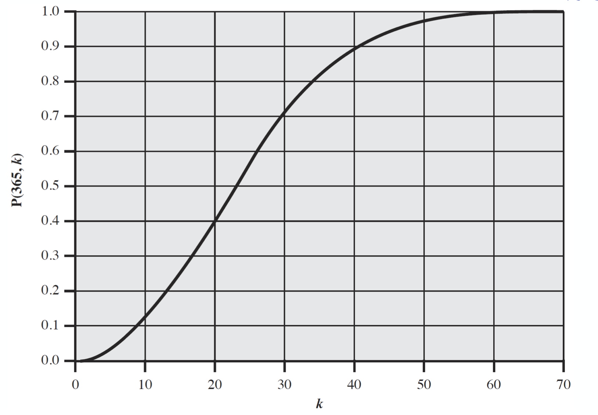

위의 그래프는 k 값에 따른 확률분포를 나타내는 그래프이다.  
사실 23명은 그 확률이 50%가 넘어가는 시점인데, 이는 수학적으로 타당함이 증명되어있다.

이러한 이유로 birthday attack 을 통해서 collision resistant 가 훨씬 더 취약하게 된다.  

결론적으로 더 긴 MAC 코드 또는 hash code 를 사용해야한다.  

따라서ㅓ 128-bit 의 보안성을 얻고 싶다면 hash code 는 256-bit 까지는 가야하는 것이다.  

그리고 현재는 128-bit 는 안전하지 않다고 보여지며, 160-bit 역시 위험하다고 생각되어지고 있다.

## Hash Function Cryptanalysis

Cryptanalytic attack 은 알고리즘의 몇가지 property 를 노출시킬 수 있고 이는 exhaustive search 보다 굉장히 빠르다.  

이는 해쉬 함수의 구조에 기인한다.  
해쉬 함수는 반복되는 구조를 가지고 있는데

- block 단위의 메세지에 대해 진행되며
- 이런 반복적인 구조의 줄기(부분)을 관찰하므로써 가능하게 하고(Merkle and Damgard structure)
- 이는 해쉬 함수가 collision resistant 해도 마찬가지이다!

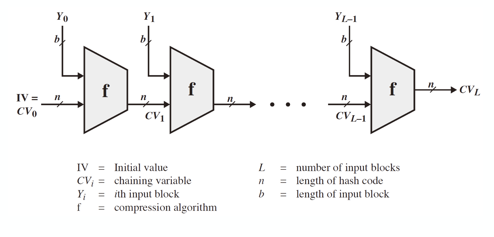

위의 이미지는 해쉬 함수의 구조이다.  
보다시피 반복적인 구조로 되어 있으며, function __f__(condense function) 에 대해서 collision 을 일으키도록 초점을 맞추면 결국 전체 구조에 대해서도 공격이 가능하게 된다.  

이는 iteration 의 횟수를 알아내는 것이 중요한데 이를 어떻게 알 수 있다는 것일까?  

우선 해쉬 함수의 구조에 대해 더 알아보자.  

해쉬 함수에 block cipher 를 적용시킬 수 있다는 것은 이미 배웠다.  
이는 message M 을 fixed-size block 인 $M_1, M_2,\ ...\ , M_N$으로 나눈 후 symmetric encryption E 를 통해 hash code G 를 계산하게 된다. 이 때,  

1. $H_0$ = initial value
2. $H_i = E(M_i, H_{i-1})$
3. $G = H_N$

이며, 이전 해쉬 값이 key 처럼 사용된다.(마치 CBC 처럼)  

이 때, hash 값이 너무 작다면(e.g. DES 64-bit) birthday attack 과 meet-in-the-middle attack 을 동시에 당할 수 있다.(CBC 와 구조적으로 동일하므로 같은 방식으로 공격할 수 있음)

다른 방식으로도 공격당할 수도 있다.  

## Secure Hash Algorithm(SHA)

이러한 보안 취약점으로 인해 NIST 와 NSA 에서 1993년 _SHA(Secure Hash Algorithm)_ 를 만들어내게 되었다.  
최초의 _SHA_ 를 _SHA-1_ 이라고도 하는데, MD4(또는 MD5)를 기반으로 설계되었다.<small>안전하지 않다는 의미다.</small>  

_SHA_ 의 이론적 보안수준은 $2^80$ 이나, 이미 2005년 $2^69$ 만큼으로도 붕괴되는 것을 확인하였다.  

그러므로 NIST 는 2002년에 _SHA_ 의 세 가지 추가 버전을 내놓게 되었다.  

SHA-256, 384, 512 가 바로 그 것이고 이들을 _SHA-2_ 라고 부른다.  

이는 AES cipher 와도 호환될 수 있도록 설계되었으며 구조와 세부적인 사항은 SHA-1 과 닯아있긴 하다.  

그러므로 분석 역시 비슷할 수 밖에 없는데 hash code 의 길이가 늘어난 덕에 보안성은 증가하게 되었다.  

간략하게 SHA 의 버전들을 확인하고 가자.

version|SHA-1|SHA-224|SHA-256|SHA-384|SHA-512
:---:|:---:|:---:|:---:|:---:|:---:
Message digest size|160|224|256|384|512
Message size|$\lt 2^{64}$|$\lt 2^{64}$|$\lt 2^{64}$|$\lt 2^{128}$|$\lt 2^{128}$
Block size|512|512|512|1024|1024
Word size|32|32|32|64|64
Number of Steps|80|64|64|80|80

### SHA-512

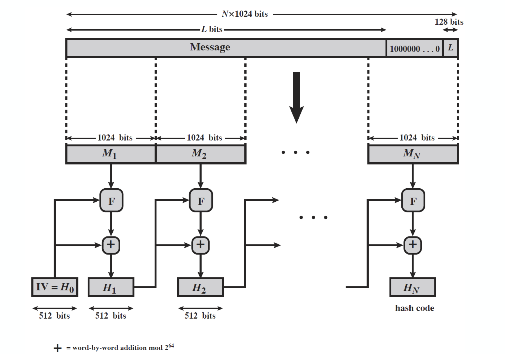

간략하게 SHA-512 의 구조를 보고 가자.  
F 는 Merkel-Damgard structure 이고, + 는 word by word addition mode 이다.

### SHA-3

SHA-1 은 아직 깨지지는 않았다.  
그러나 MD5 와 SHA-0 와 비슷하기 때문에 보안성에 대한 우려가 있다.  
<small>MD5, SHA-0 는 이미 깨졌고, 아까 언급했듯이 $2^{69}$ 만에 collision 이 확인되긴 했으나 뚫린 것은 아니다.</small>

SHA-2 는 보기에 안전해보이기는 하다.  
그러나 이는 구조적으로 이전 버전과 유사하기 때문에 우려사항이 존재하기는 한다.  

그래서 연구자들은 SHA-3 를 필요로 했고, 2012년 Keccak 이 채택되었다.  

이 SHA-3 의 requirement 는 다음과 같다.  

- SHA-2 를 대체할 수 있을 것. 즉, hash size 가 같아야 한다.
- SHA-2 의 online nature 를 유지할 것. 즉, small block(512/1024 bits)로 진행될 것.
- Evaluation criteria
    - security : 잠재적인 SHA-2 에 대한 공격에 안전해야함.
    - cost : time / memory 가 효율적이여야함
    - characteristics: 확장 가능해야 하고 단순해야 함(flexibility & simplicity)

이쯤 되서, 한 가지 문제에 대해 생각해보자.  

> RSA 와 알려진 키가 있다고 하자.  
> 연속적인 block 에 대해 다음의 연산을 진행한다고 하자.  
> - 첫번째 block 을 암호화한다.
> - 그 결과를 두 번째 block 과 XOR 하고 암호화 한다.
> - RSAH(B1, B2) = RSA(RSA(B1) $\oplus$ B2)
> - 이를 반복해서 시행한다.
> 이 때, weak collition resistance(second preimage resistance)를 만족하지 않음을 보여라.
>  
>> 같은게 나오게 하는 C1, C2 를 찾으면 된다.  
>> 즉, random C1 에 대해 다음과 같이 연산을 취해줄 수 있다.  
>> RSA(C1) $\oplus$ RSA(B1) $\oplus$ B2 = C2  
>> RSA(C1) $\oplus$ C2 = RSA(B1) $\oplus$ B2  
>> RSAH(C1, C2) = RSAH(B1, B2)

## Hash Collision Attacks in TLS

추가적으로 TLS 인 상황에서 hash collision attack 을 간단하게 살펴보자.  

- SLOTH attack  
    transcript collision attacks on underlying hash constructions in key exchange protocols (e.g., TLS, IKE, SSH)
- K. Bhargaven and G. Leurent, 'Transcript Collision Attacks: Breaking Authentication in TLS, IKE, and SSH', NDSS 2016 이라는 논문을 확인해 보자.

또한, hash 의 counter-cryptanalysis 라고 새로운 패러다임이 하나 있으며 흥미롭게 볼만한 분야이다.  
이는 이미 약한 암호화 기법들에 대해 cryptanalytic 공격을 탐지하고 방어하는 분야이다.  

<small>언젠가 해결할 숙제를 또 한번 내며,,,</small>

> 본 포스트는 _정보보호_ 를 공부하며 정리한 글 입니다.  
> 잘못된 내용이 있다면 알려주세요!  
> 감사합니다 :)

<small>최종 수정일: 2019-12-02</small>
