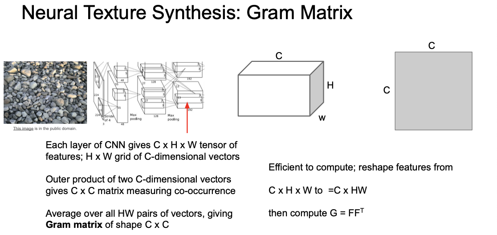

> 이 포스트는 스탠포드의 [cs231n](http://cs231n.stanford.edu) 13강 강의를 보고 공부 및 정리한 포스트입니다.  
> 잘못된 것이 있을 수 있습니다.  
> 댓글로 알려주시면 감사합니다!  

<small>최종 수정일: 2019-12-09</small>

이번 강의에서는 다양한 예제를 보게 될 것이다.  
_ConvNet_ 을 시각화해보고 이를 통해 어떤 해석을 해 볼 수 있는지 생각해보자.

## Inside ConvNet

우리는 지금까지 _ConvNet_ 을 이용해 classification, object detection, segmentation 등을 수행해보았다.  

이러한 _ConvNet_ 은 어떻게 동작하는 것일까?  
특히, 그 내부에서는 무슨 일이 벌어지고 있는 것일까?  

이제부터 그 내부에서 어떤 일이 일어나는지 살펴보자.  

다양한 색상과 선 모양의 패턴들을 확인할 수 있다.

사람도 시각피질의 원초적인 부분(단계)에서 이러한 것을 본다고 알려져있다.  
즉, 사람과 네트워크 모두 초기 단계에 물체를 인식하는데 비슷한 양상을 보인다는 의미이다.  

흥미로운 점은, 어떤 모델을 이용해 학습시키더라도 초기 레이어에서 위와 같이 나타난다는 것이다.

그렇다면 레이어를 조금 더 내려가면 어떻게 될까?

한 눈에 보기에도 이해하기 어려워 보이는 결과를 볼 수 있다.  
즉, 초기 레이어와 같은 방식의 시각화 방식으로는 해석이 어렵다는 의미이다.  

두 번째 레이어에서 찾고 있는 것은 무엇일까?  
우리가 보고 있는 것은 _두 번째 레이어의 결과를 최대화시키는 첫 번째 레이어의 출력 패턴이 무엇인지_ 이다.  

이렇게 이미지의 관점에서 레이어를 해석하기란 쉽지 않다.  
이러한 중간 레이어는 조금 다른 기법의 해석 방식이 필요하다.  

이러한 이미지들은 가중치를 0~255 의 값으로 normalize 한 값이다.  
사실 가중치에는 한계가 없기 때문에 시각화를 할 때 필터만 진행하게 된 것이고 bias 는 고려되지 않은 상태가 된다.  
따라서 이러한 결과를 그대로 받아들이면 안된다.  

이번에는 _CNN_ 의 마지막 레이어를 생각해보자.  

AlexNet 에서는 4096-dim vector 가 마지막 레이어로부터 출력된다.  
많은 이미지를 돌려서 해당 vector 를 모두 저장한다.  
이를 활용해서 마지막 레이어를 시각화하는 방법은 무엇이 있을까?  

여기서 해 볼 방법은 Nearest Neighbour 이다.  
CIFAR-10 데이터들의 이미지 픽셀 공간에서 NN 을 시도한 결과 위의 이미지 처럼 가장 왼쪽 이미지를 기준으로 비슷한 이미지들을 잘 찾아낸다는 것을 볼 수 있다.  

그런데 이러한 픽셀 공간에서의 NN 은 비슷한 이미지를 나타내게 할 텐데, 2번째 사진(왼쪽 모음 중)의 흰 강아지 사진과 어떤 흰 덩어리 사진은 그 거리가 가깝다고 나타내게 될 것이다.  

그러나 특징 벡터 공간에서의 NN 은 어떨까?  
오른쪽 모음의 두 번째 사진인 코끼리 사진을 보자.  

코끼리의 모습이 반대(좌-우)임에도 잘 찾아내는 것을 볼 수 있다.  
이는 픽셀 공간에서 보면 이미지의 거리가 멀다고도 볼 수 있을텐데 특징 벡터 공간에서는 그그 거리가 가깝다고 하는 것이다.  

이는 네트워크가 학습을 통해 이미지의 semantic content 한 특징을 잘 찾아낸 것이라 볼 수 있다.  

또 다른 방법으로는 최종 레이어에서 차원 축소(Dimensionality Reduction)의 개념으로 접근해 볼 수도 있다.  

PCA 는 4096-dim 과 같은 고차원 특징벡터들을 2-dim 으로 압축시키는 기법이다.

이 방법을 통해서 특징 공간을 조금 더 직접적으로 시각화시킬 수 있다.

조금 더 복잡한 t-SNE(t-distributed stochastic neighbor
embeddings)라는 알고리즘을 활용하면 더 잘 시각화 할 수도 있다.

MNIST 예시를 보자. t-SNE dimensionality reduction 를 통해 시각화한 모습이다.  

MNIST의 각 이미지는 Gray scale 28x28 이미지이다.

여기에서는 t-SNE가 MNST의 28x28-dim 데이터를 입력으로 받게 된다(raw pixels). 그리고 2-dim으로 압축해 시각화한다.

그 결과 군집화된 모습을 볼 수 있으며 이는 MNIST의 각 숫자를 의미한다.

이런 식의 시각화 기법을 ImageNet 을 학습시킨 네트워크의 마지막 레이어에도 적용해보자.

우선 엄청나게 많은 이미지들을 네트워크에 통과시킵니다.

그리고 각 이미지에 대해서 최종 단의 4096-dim 특징 벡터들을 기록한다.

그러면 4096-dim 특징 벡터들을 아주 많이 모을 수 있을 것이고 t-SNE을 적용하면
4096-dim에서 2-dim으로 압축된다.

이를 통해 2-dim 특징 공간의 각 grid에 압축된 2-dim 특징들이 시각화시킨다.

이를 통해 학습된 특징 공간의 모습을 어렴풋이 추측해 볼 수 있게 된다.

<small>온라인에서 고해상도 이미지로 확인해보자.</small>

좌하단의 초록색 군집은 다양한 종류의 꽃들이 있는 곳이고, 다른 곳에는 이제 강아지, 동물, 지역 등등이 있다.  

이를 통해 우리가 학습시킨 특징 공간에는 일종의 불연속적인 의미론적 개념(semantic notion)이 존재하며 t-SNE을 통한 dimensionality reduction version의 특징 공간을 살펴보며 그 공간을 조금이나마 이해해 볼 수 있었다.  

> 지금까지 FC-layer 에 대해 시각화를 진행했는데, 더 상위 레이어에서도 이러한 과정을 진행해 볼 수는 있다.

중간 레이어의 가중치를 시각화 하는 것은 해석이 어렵다.  
그러나 가중치가 아닌 activation map 을 시각화 하는 방법도 있다.  

위의 이미지에서 초록색 부분의 경우 사람의 얼굴 모양을 보고 활성화되는 것 같아 보인다.  
즉, 네트워크의 어떤 레이어에서는 사람의 얼굴을 찾고 있는 것일 수도 있다.

### Maximally Activating Patches

특정 레이어의 활성을 최대로 하는 패치들을 시각화 하는 방법도 있다.  
각 행에 있는 패치들은 모두 하나의 뉴런에서 나온 것이다.  

여기서 해당 레이어가 convolutional layer 이기에 이미지 전체가 아닌 일부분만 보고 있는 것임을 상기하자. 즉, receptive field 가 작다는 의미다.  

오른쪽 예시의 모양을 보면 동그라미(아마도 눈) 모양을 찾고 있는 것 같아 보인다.  

여기서 한 뉴런은 conv5 activation map 의 한 scalar 값을 의미한다.  
이 때, convolutional layer 이기에 한 채널의 모든 뉴런은 모든 같은 가중치를 공유하게 된다.  

오른쪽 아래 이미지의 그룹은 더 깊은 layer 로부터 추출된 패치들인데, 이는 receptive field 가 넓다는 의미다. 즉, 이미지를 더 넓게 보고 있는 것이다.  
이미지를 잘 보면 사람의 모습(얼굴, 2번째 행) 등을 찾고 있음을 알 수 있다.  

## Saliency Map

여기 재미있는 실험이 있다.  

'Occlusion Experiment' 라 하여, 어느 부분이 분류를 결정짓는 근거가 되는지 알아보는 실험이다.  

이미지를 가리고 이미지의 평균데이터를 넣었을 때 어느 부분이 가려졌을 경우 네트워크의 예측확률이 크게 변하는지를 체크해본 결과 오른쪽의 Map 을 통해 나타나는 것이다.  

> 이러한 과정은 학습하는데 어떤 도움을 주거나 하는 것은 아니다.  
> 그러나 이는 인간이 네트워크의 학습 과정을 _이해_ 하는 도구로써 사용될 수는 있다.  

이렇게 이미지를 가리는 것에서 더 나아가 _Saliency Map_ 이라는 것을 알아보자.  

이 방법은 입력 이미지의 각 픽셀들에 대해 예측한 클래스 스코어의 gradient 를 계산하는 방법이다.  
이는 1차 근사적 방법으로 어떤 픽셀이 영향력 있는지 알려준다.  

이를 통해 map 을 만들어본다면 오른쪽 처럼 개의 윤곽이 드러남을 볼 수 있다.  

다른 이미지들에 대해서도 잘 되는 것을 확인할 수 있다.  

### Grabcut

여기서 _GrabCut_ 이라는 것을 활용하면 segmentation label 없이 segmentation 을 수행할 수 있게 된다.  

_GrabCut_ 은 interactive segmentation algorithm 으로 supervision 으로 만들어지는 결과에 비해 그렇게 좋지는 못하다.

### Intermediate features via (guided) backprop

또 다른 방법으로는 _guided backpropagation_ 이 있다.

이는 클래스 스코어가 아니라 네트워크의 중간 뉴런을 하나 고른다.
그리고 입력 이미지의 어떤 부분이, 내가 선택한 중간 뉴런의 값에 영향을 주는지를 찾는다.

이 때도 _Saliency Map_ 을 만들어볼 수 있을 것이다.

이 경우에는 이미지의 각 픽셀에 대한 클래스 스코어의 gradient 를 계산하는 것이 아니라 입력 이미지의 각 픽셀에 대한 네트워크 중간 뉴런의 gradient 를 계산하게 된다.

이를 통해 어떤 픽셀이 해당 뉴런에 영향을 주는 지 알 수 있다.

이 방법은 backprop 시 _ReLU_ 를 통과할 때 조금의 변형한다.

_ReLU_ 의 gradient 의 부호가 양수 이면 그대로 통과시키고 부호가 음수이면 backprop하지 않는다.

이로 인해 전체 네트워크가 실제 gradient 를 이용하는 것이 아니라 _양의 부호인 gradient_ 만을 고려하게 된다.

방금 보았던 Maximally activating patches 를 상기해보자.  
우리는 첫 행을 보고 동그란 무언가(아마도 눈)를 찾고 있는 것이라고 짐작했는데, _guided backprop_ 의 결과를 보니 우리의 짐작이 어느 정도 맞다고 생각할 수 있게 되었다.  

그러나 이 방법은 고정된 입력 이미지 또는 입력 패치의 어떤 부분이 해당 뉴런에 영향을 끼치는가를 말해줄 뿐이다.  

그렇다면 입력 이미지에 고정되지 않은 방법은 없을까? <small>입력 이미지에 의존적이지 않고 해당 뉴런을 활성시킬 수 있는 _일반적인_ 이미지가 있을까?</small>  

## Gradient Ascent

_Gradient Ascent_ 에 대해 살펴보자.

여기서는 네트워크의 가중치들을 전부 고정시킨다.

그리고 Gradient ascent를 통해 중간 뉴런 혹은 클래스 스코어를 최대화 시키는 이미지의 픽셀들을 만들어낸다.

이는 Gradient ascent는 네트워크의 가중치를 최적화하는 방법이 아니다. 가중치들은 모두 고정되어 있고 대신 클래스 스코어가 최대화될 수 있도록 입력 이미지의 픽셀 값을 바꿔주는 방법이다.  

regularization term을 추가함으로서, 우리는 생성된 이미지가 두 가지 특성을 따르길 원하는 것이다.  

하나는 이미지가 특정 뉴런의 값을 최대화시키는 방향으로 생성되길 원하는 것이고 그리고 다른 하나는 이미지가 자연스러워 보여야 한다는 것이다.  

생성된 이미지가 자연 영상에서 일반적으로 볼 수 있는 이미지이길 원하는 것이다.

이런 류의 regularization term의 목적은 생성된 이미지가 비교적 자연스럽도록 강제하는 역할을 한다.

Gradient Ascent를 위해서는 초기 이미지가 필요하다.  
이 이미지는 zeros, uniform, noise 등으로 초기화시킨다.  

초기화를 하고나면 이미지를 네트워크에 통과시키고 여분이 관심있는 뉴런의 스코어를 계산하게 된다.

그리고 이미지의 각 픽셀에 대한 해당 뉴런 스코어의 gradient 를 계산하여 backprop 을 수행한다.

여기에서는 Gradient Ascent 를 이용해서 이미지 픽셀 자체를 업데이트한다.  
해당 스코어를 최대화시키게 되고, 이 과정을 계속 반복하고나면 아주 멋진 이미지가 탄생하게 된다.

덤벨과 컵의 예제를 보면 많이 중첩된 모습을 볼 수 있다.  

달마시안의 경우에는 달마시안의 특징이 아주 잘 나타난 것을 확인할 수 있다.

여기서 색상이 무지개 색인 이유는 _Gradient Ascent_ 가 unconstrained value 이기 때문에 0~255 의 pixel value 로 normalize 하면서 나타나는 오류라고 볼 수 있다.  

> regularization term 이 없이 할 경우에도 이미지는 나타날 것이나 이는 random noise 처럼 보이게 된다.  
> 그러나 이는 또 다른 의미를 갖는데 곧 확인해보자.

L2 norm 에다가 주기적으로 Gaussian blur 를 적용하는 방법도 있다.  
그리고 값이 작은 픽셀들은 0 으로 만들고, gradient 가 작은 값도 0 으로 만든다.  
<small>(일종의 projected Gradient descenct)</small>

이렇게 만든 방법은 훨씬 더 깔끔한 이미지를 위와 같이 얻게 만들어준다.  

## Fooling Image / Adversarial Examples

## DeepDream

## Feature Inversion

## Texture Synthesis

### Gram Matrix

### Neural Texture Synthesis

## Neural Style Transfer

### Fast Style Transfer

