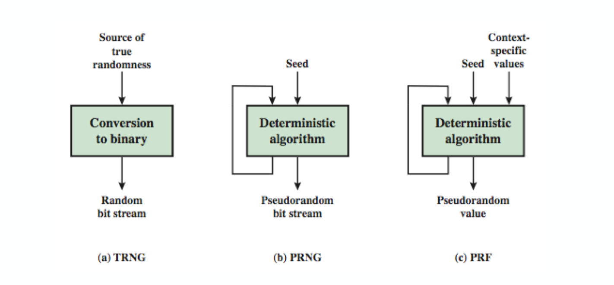

<small>최종 수정일: 2019-12-01</small>

이전 [포스트](https://cheong.netlify.com/posts/public-key-cryptography-and-rsa/)에서 공개키와 _RSA_ 에 대해 학습했었다.  

이번에는 또 다른 공개키 방식의 암호화 기법들에 대해 알아보자.  

## Diffie-Hellman Key Exchange

Diffie-Hellman Key Exchange 는 key 를 교환하는데 있어서만 사용되는 방식이다.

공개키 방식에서 키는 다음과 같이 나누어져야 한다.

- 임의의 메세지를 교환하는데 사용될 수 없다.
- 그 대신 공통 키를 설정할 수 있다.
- 두 참여자만 알아야 한다.

그 키의 값은 참여자들에 따라 다르다.(private / public key information 에 따라)  

이는 finite(Galois) field 안에서 거듭제곱의 꼴을 바탕으로 만들어져있고, discrete logarithms(이산 로그) 을 계산하는 난이도와 관련이 있다.  

### Diffie-Hellman Setup

모든 유저가 global parameter 를 알고 있다.

- large prime integer 또는 polynomial $q$
- $a$ which is a primitive root of $q$

각 유저는 각자의 키를 만들어낸다.

- secret key 를 각자 정한다 : $x_A \lt q$
- public key 를 계산한다 : $y_A = a^{x_A} \mod q$


위는 Diffie-Hellman Key Exchange 의 진행 과정을 나타낸 것이다.  
User A 가 먼저 generate 를 한다.  

이러한 방식이 과연 안전한가?  

> secret key 를 모르면 알 수 없긴 하다.  
> 그러나 다른 공격 시나리오가 존재할 수 있다.
>> secret key 를 계산해낼 수 없다면 내가 만든 secret key 를 agree on 하게 할 수는 없는가?

공격 방법은 나중에 알아보도록 하고, 키 교환 과정을 조금 더 살펴보자.

키 교환 시, session key 를 secret information 으로 만들어서 서로 알고 있기로 하게 되는데, 이는 다음과 같이 쓸 수 있다.  

$$
\begin{aligned}
K_{AB} &= a^{x_A \cdot x_B} \mod{q} \\ 
&= y_A^{x_B}\mod{q} \\
&= y_B^{x_A}\mod{q}
\end{aligned}
$$

여기서 $K_{AB}$ 는 A, B 사이의 private-key encryption scheme 에서의 session key 로 사용되게 된다.  

A, B 가 새롭게 통신하지 않는다면 이전과 동일한 키를 계속 사용할 것이다.  

공격자는 키를 결정하기 위해 discrete logarithm 을 풀어내야 한다.

예를 봐 보자.

$q=353, a=3$ 인 상황에서 $x_A = 97, x_B = 233$ 으로 각각 설정했다고 하자.  
public key 를 먼저 계산해 보면,

- $y_A = 3^{97} \mod{353} = 40$
- $y_B = 3^{233} \mod{353} = 248$

이 되고, 여기서 session key 를 계산해보면,

- $K_{AB} = y_B^{x_A} \mod{353} = 248^{97} = \mod{353} = 160$ (A)
- $K_{AB} = y_A^{x_B} \mod{353} = 40^{233} = \mod{353} = 160$ (B)

### Key Exchange Protocol

1. 유저는 random privte/public DH key 를 매 통신마다 만들 수 있어야 한다.
2. 또한 유저는 알려진 private/public DH key 를  만들 수 있어야 하고, 이를 통신에서 안전하게 이용할 수 있어야 한다.

위의 내용이 키 교환을 위한 프로토콜의 요구 사항이다.  

그런데 두 가지 내용 모두 Man-In-The-Middle(MITM) Attack 에 취약하다.  

이는 Authentication of the key 를 통해 보완되어야하는 부분이다.  
이는 필연적으로 다른 추가적인 information 을 함께 보내야지 가능한 방법이다.

### Man-In-The-Middle Attack

다음은 중간자공격(MITM)의 시나리오이다.

1. D 가 private/public key 를 준비한다.
2. A 가 그의 public key 를 B 에게 전송한다.
3. D 가 이 통신을 중간에 가로챈 후 D 의 public key 를 B 에게 전송한다. 그리고 D 는 A 와의 shared key 값도 계산해놓는다.
4. B 가 public key 를 받고 나서 shared key 를 계산하게 된다.<small>(이 shared key 는 A 가 아닌 D 와의 것임)</small>
5. B 가 그의 public key 를 A 에게 전송한다.
6. D 가 또다시 이 통신을 가로챈 후 두 번째 public key 를 A 에게 전송한다. 그리고 D 는 B 와의 shared key 를 계산해 놓는다.
7. A 는 key 를 받고 이를 통해 shared key 를 계산한다.<small>(마찬가지로 이는 B 와의 것이 아닌 D 와의 것이다.)</small>
8. D 는 이제 intercept, decrypt, re-encrypt, forward 가 모두 가능해졌다.

이러한 중간자 공격에 의해 confidentiality 와 integrity 모두 깨질 수 있다.

## ElGamal cryptography

이번에는 ElGamal Cryptography 에 대해 알아보자.  
이는 DH 와 마찬가지로 discrete logarithm 을 기반으로 만들어진 public-key cryptosystem 이다.  

역시 이산로그의 계산상의 어려움을 바탕으로 안전성을 도모하며, 세 개의 public parameter 가 존재한다.

- 각 유저는 비밀키를 고른다. $1 \lt x_A \lt q-1$
- 공개키를 계산한다 : {$q, a, y_a = a^{x_A} \mod{q}$}
    - 이 때, $a$ 는 소수 $q$ 에 대한 primitive root(원시근) 이다.

### ElGamal Message Exchange

ElGamal Message Exchange 는 DH + Message Encryption 이라 볼 수 있다.  
그 과정은 다음과 같다.

1. B 가 A 에게 다음의 과정을 거친 message 를 보낸다.
    - message M 의 범위는 $0 \leq M \leq q-1$ 이고 이보다 클 경우 block 으로 쪼개서 보내게 된다.
    - random integer k 를 고른다. 이 때, $1 \leq k \leq q-1$ 이다.
    - one-time key $K = y_A^k \mod{q}$ 를 계산한다.
    - M 을 ($C_1, C_2$) 로 암호화한다. 이 때, $C_1 = a^k \mod{q}, C_2 = K \cdot M \mod{q}$ 이다.
2. A 가 message 를 복원한다. 이 때,
    - key $K = C_1^{x_A} \mod{q}$
    - computing $M = C_2 \cdot K^{-1} \mod{q}$
3. 이 때 $k$ 는 항상 새롭게 사용되어야 한다. 재사용될 경우 안전하지 못할 수 있다.

예제를 통해 조금 더 살펴보자.

> GF(19) $q=19$, $a=10$
> A 가 $x_A = 5$ 로 정했다고 하면, $y_A = 10^5 \mod{19} = 3$
> B 가 message $m = 17$ 을 (11,5) 로 보낸다고 할 때,
> - random $k$ 를 $k=6$ 으로 정하면
> - $K = y_A^k \mod{q} = 3^6 \mod{19} = 7$
> - $C_1 = a^k \mod{q} = 10^6 \mod{19} = 11, C_2 = KM \mod{q} = 7 \cdot 17 \mod{19} = 5$
> A 는 original message 를 얻기 위해
> - $K = C_1^{x_A} \mod{q} = 11^5 \mod{19} = 7$
> - $K^{-1} \mod{19} = 7^{-1} \mod{19} =11$
> - $M = C_2\cdot K^{-1} \mod{q} = 5 \cdot 11 \mod{19} = 17$

그렇다면 이제 다음의 문제를 풀어보자.

```
q=71, a=7 이고
receiver B 가 public key = 3, sender A 가 random integer 2 를 정했을 때
M=30 에 대한 ciphertext 는?

(C1, C2) = (49, 57)
```

## Elliptic Curve Cryptography

타원 곡선(Elliptic Curve)은 대수기하학에서 형태의 방정식으로 정의되는 대수 곡선으로 첨점이나 교차점이 없는 특성을 가진다.  

이는 특이한 성질에 의해 공개키 암호화 방식에 적용되어 사용되는데, 이는 기존의 아주 큰 수의 integer 나 polynomial arithmetic 을 이용하던 것과는 꽤 다른 접근 방법이다.  

아무래도 등장한지 얼마 되지 않은 것이라 분석이 많이 이루어지지 않은 분야이기도 하다.  

### Real Elliptic Curve

타원 곡선이 실수에 대해 정의되어 있는 것을 Real Elliptic Curve 라 한다.  
이 타원 곡선은 두 변수 x, y 에 의해 정의되며 다음의 예가 될 수 있다.  

$$
y^2 = x^3 + ax + b
$$

식에 등장하는 모든 상수와 변수는 실수이며, zero point O 또는 infty 가 정의되기도 한다.  

여기에서 해당 방정식을 만족하는 모든 (x, y) 에 대해 E(a, b) 인 점집합을 생각할 수 있다.  


위의 이미지는 타원 곡선의 예제이다.  
이 타원 곡선위의 점 P, Q에 대해서 geometrically sum P + Q 를 할 경우 놀랍게도 다시 타원 곡선 위에 있는 점을 가리키게 된다.

### Finite Elliptic Curve

그런데 우리는 앞에서 본 암호화 기법에 대해 잠깐 상기를 해 볼 필요가 있다.  

우리는 유한체(finite field) 이론을 가볍게 학습하면서 왜 이것이 암호화 기법에 사용될 수 있는지를 이해했다.  
마찬가지로 타원 곡선 역시 아무것이나 쓸 수는 없고, finite field 에 있는 것을 사용해야한다.  

이를 $Z_p$ 또는 GF($2^m$) 에서의 타원 곡선이라고 할 수 있다.

1. prime curve $E_p(a, b)$ defined over $Z_p$
    - use integers modulo a prime
    - best in software
2. binary curve $E_{2^m}(a, b)$ defined over GF($2^m$)
    - use polynomials with binary coefficient
    - best in hardware

그런데 finite field 에서의 명확한 기하학적 해석(geometric interpretation)은 없다.

이러한 타원 곡선을 이용한 암호화(Elliptic Curve Cryptography, ECC)에 대해 알아보자.

- ECC addition 은 analog of modulo multiply 이다.
- ECC repeated addition 은 analog of modulo exponentiation 이다.
- 이는 이산 로그의 계산적 어려움에 필적한다.
    - $Q = KP$ 에서 $Q, P$ 는 prime curve 에 속한다.
    - $k, P$ 가 주어지면 $Q$ 를 계산하기 쉽다.
    - 그런데 $Q, P$ 를 준다고 했을 때 $k$ 를 계산하는 것은 어렵다.
    - elliptic curve logarithm problem 이라고도 알려져 있다.

위의 말을 조금 더 설명하면 다음과 같다.

$Q = KP$ in ECC ~ $b = g^a$ in FF  
여기서 KP - repeated addition 이고, $g^a$ - repeated multiplication 이다.  
이 두 식에서 각각 $K, a$ 를 찾는것이 동등하게 어렵다는 의미이다.  

예를 통해 조금 더 자세히 보자.  

$E_{23}(9, 17)$ 인 예제에서

- $y^2 \mod 23 = (x^3 + 9x + 17) \mod{23}$ 로 정의되며,
- 여기서 이산로그 k of Q = (4, 5) 를 base P = (16, 5) 에서 구해보면?
- brute-force 로 구해보면 다음과 같이 계산된다.
    - P = (16, 5); 2P = (20, 20); 3P = (14, 14); ... 9P = (4, 5)
    - 9P = (4, 5) = Q 이므로 $k=9$ 가 된다.
- 실제 사용될 때는 $k$ 가 아주 큰 수이기 때문에 brute-force 로 접근하기에는 어렵다.

<small>타원 곡선의 덧셈에 대해서는 나중에 정리할 기회가 있을 것이다...</small>

### ECC Diffie-Hellman

그렇다면 타원곡선을 이용한 Diffie-Hellman key exchange 에 대해 알아보자.

- 유저는 적당한 curve $E_q(a, b)$ 를 고른다.
- base point $G=(x_1, y_1)$ 을 정하는데 large order n(nG=0 같은) 을 생각한다.
- A, B 가 각각 $n_A \lt n , n_B \lt n$ 인 private key 를 고른다.
- public key 를 계산한다 : $P_A = n_AG, P_B = n_BG$
- shared key 를 계산한다 : $K=n_AP_B, K=n_BP_A$, 이 때 이는 $K=n_An_BG$와 같다.
- 이러한 경우 공격자는 $G, kG$ 가 주어진 상태에서 $k$ 를 찾아내야 한다.

### ECC En/Decryption

타원곡선을 활용해 암/복호화를 진행할 경우 여러 alternatives 가 존재한다.
그 중, ElGamal encryption 을 활용하게 되는데 다음의 과정을 살펴보자.

- 먼저 message M 을 타원 곡선위의 점 $P_m$ 으로 encoding한다.
- 적당한 curve 와 point G 를 DH 에서와 같이 정한다.
- 각 유저는 private key $n_A \lt n$ 을 정하고 public key $P_A = n_AG$ 를 계산한다.
- $P_m$ 을 암호화 한다 : $C_m = {kG, P_m + kP_B} \text{where } k \text{ is a random integer}$
- $C_m$ 을 복호화 한다 : $P_m + kP_B-n_B(kG) = P_m + k(n_BG)-n_B(kG) = P_m$

여기서 $kG$ 는 세션 키이다.

### ECC Security

ECC 의 보안성은 어느정도일까?  
ECC 는 자주 사용되는 암호화 기법인데, key 의 size 가 작아도 다른 것들과 비슷한 수준의 암호화 수준을 가지는 것이 장점이다. 이는 FF 에서 엄청나게 큰 값들이 다뤄지느라 속도가 느리다는 것을 생각해보면 아주 큰 장점이 되게 된다.  

ECC 는 elliptic curve logarithm problem 에 의존적이며, 이는 $kP, P$ 가 주어졌을 때 $k$ 를 구해야하는 문제이다.  

이 ECC 를 빠르게 구하는 방법은 'Pollard rho method' 라는 것이 있다.<small>나중에 자세히 알아보자</small>

위에서도 언급했듯이 key 의 사이즈가 작아도 효과적인데, 이는 IoT 같은 제한적인 resource 밖에 사용하지 못하는 경우에 좋다.  

같은 길이에 대해서는 계산의 복잡성이 비슷해지기는 한다.  

그러므로 비슷한 보안성에 있어서는 ECC 가 굉장한 computational advantage 를 가지고 온다고 할 수 있다.  

Symmetric scheme (key size in bits)|ECC-based scheme (size of n in bits)|RSA/DSA (modulus size in bits)
:---:|:---:|:---:|
56|112|512
80|160|1024
112|224|2048
128|256|3072
192|384|7680
256|512|15360

### Forward Secrecy in TLS

forward secrecy 는 private key 가 중간에 reveal 되더라도 향후의 session key 들이 compromised 되지 않게 하는 것이다.  

여기서 잠깐 TLS 1.2 버전 까지의 key agreement protocol 을 살펴보고 가자.

1. RSA 
    - server 가 private key 를 보호할 때까지만 안전함
    - forward secure 없음
2. Ephemeral DH(DHE) 또는 Elliptic Curve DH(ECDHE)
    - compromised 될 경우 public key 를 버림
    - forward secure

위의 문제점으로 인해 RSA-based key agreement protocol 은 TLS 1.3 에서 삭제되었다.

조금 더 자세히 살펴보자.  

만약 key 가 compromised 되면 공격자 입장에서 new client 로 접근이 가능해지고 이는 향후의 접속(forward privacy)들이 안전하지 않은 것이다.  

DHE 에서는 C.S 가 random 하므로 한군데서 뚫려도 다음 것이 이전 것을 쓰지 않으므로 각각의 session 은 independent 해서 안전하게 된다.

자세히 알아보고 싶다면 TLS Handshake Protocol 을 참조하자.  

## Pseudorandom Number Generation

_PRNG(Pseudorandom Number Generation)_ 를 이용해 암호화를 진행할 수 있다.  

우선, random 에는 truly/pseudo 두 가지가 있는데, 앞서 우리는 truly random 이 implement 하는 것이 불가능하다는 것을 배웠다.  
그래서 우리는 pseudo-random 을 사용하게 되는데, 이는 deterministic algorithm 이 필요하다.

Asymmetric encryption algorithm 은 random output 을 만들어내는 것을 상기해보자.  
그렇다면 이를 이용해 _PRNG_ 를 만들어 볼 수 있을 것이다.  

그러나 이는 symmtric algorithm 보다는 느리다.  
그래서 마찬가지로 이를 통해서 만들어내는 것은 짧은 암호화 데이터(ex. key)가 된다.  

이 때, RSA 또는 ECC 기반의 PRNG 를 사용하게 된다.  

### Random Numbers

이러한 random data 는

1. statistically random, uniform distribution, independent
2. Unpredictability 를 가져서 이전 값으로 다음 값을 예측할 수 없어야 함

위 두 가지 사항을 만족시켜야 한다.  

### PRNG

언급했듯이 결정론적 알고리즘을 이용해 종종 랜덤(pseudo-random) 넘버를 만들어내게 되는데, 이렇게 만들어 낸 수가 많은 randomness test 를 통과할 수 있다.  



RSA, ECC 기반 PRNG 뿐 아니라 Block Cipher 를 이용한 PRNG 도 있다.  


마스터 키로부터 세션 키를 만들어내는데 종종 사용한다.

CTR : $X_i = E_k[V_i]$  
OFB : $X_i = E_k[X_{i-1}]$


RSA 기반 PRNG 의 모습이다.  

이 때, 전부 다 재사용하는 것이 아니라 r most significan bits 만 다음 라운드에 이용되는 것과, k least significant bits 만 각 라운드에서 추출된 pseudorandom no. 임을 확인하자.

ECC 기반 PRNG 는 어떨까?  

해당 알고리즘은 다음과 같다.  

```
for i = 1 to k do
    set s_i = x(s_{i-1}P)
    set r_i = lsb_240(x(s_{i}Q))
end for
return r1, ..., rk
```

이러한 ECC 기반의 PRNG 는 시스템에 이미 ECC 가 구현되어있을 때만 가능하다.  

<hr>

<small>꽤 어렵고 대충 넘어간 부분들이 많은데 관련 논문들을 확인해서 추가적으로 공부하도록 하자!</small>

> 본 포스트는 _정보보호_ 를 공부하며 정리한 글 입니다.  
> 잘못된 내용이 있다면 알려주세요!  
> 감사합니다 :)
