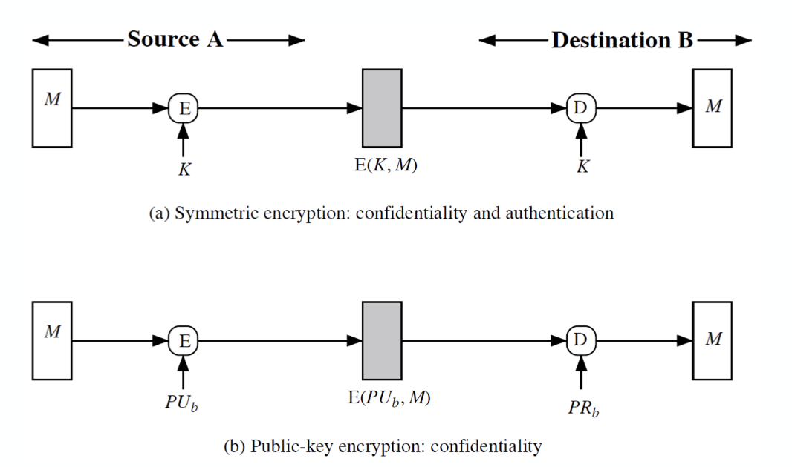
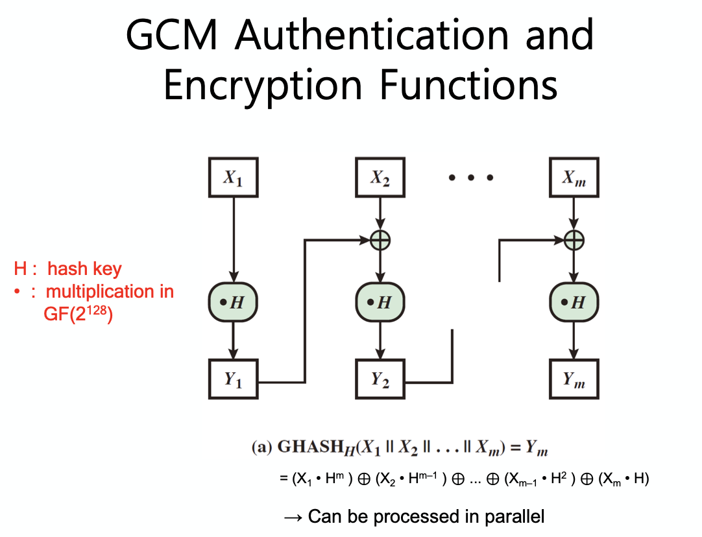
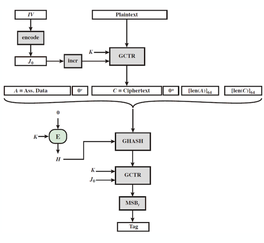

## Message Authentication

- Message authentication is concerned with:
    - Protecting the integrity of a message
    - Validating identity of originator
    - Non-repudiation of origin (dispute resolution)
- Three algternative functions for authenticator
    - Hash function
    - Message encryption
    - Message authentication code(MAC)

- Requirements  

    Attacks|Measures
    :---:|:---:
    Disclosure Traffic analysis | Message hiding (e.g., encryption)
    Masquerade Content modification Sequence modification Timing modification|Message authentication Digital signature
    Source repudiation|Digital signature
    Destination repudiation|Digital signature + additional protocol

### Symmetric Encryption for Message Authentication

Encryption can provide authentication  
    - ciphertext serves as its authenticator

If symmetric encryption is used then:
    - Receiver know  
        1. Sender must have created it since only sender and receiver know key
        2. Content have not been altered  
            - There must be some internal structure to plaintext so that the receiver can distinguish between well-formed plaintext and random bits

### Public Encryption for Message Authentication

Encryption provides no confidence of sender  
    - Since anyone potentially knows public-key

If sender signs message using his private-key  
    - Have both secrecy and authentication

Confidentiality, authentication, and signature at cost of two public-key uses on message  

즉, specific 유저만 generate 가능하며 모두가 식별 가능한 상황이다.

(b) 에서는 confidentiality 가 이루어지고 있다.

(c) 에서 authentication 과 signature 가 가능함을 확인하자.  
그리고 전형적으로 위에 언급된 것들을 섞어서 사용하는 (d) 가 있다.

## Message Authentication Code

_MAC(Message Authentication Code)_ 은 small fixed-size block 을 만들어내는 알고리즘을 통해 생성된다.  
이 때, message 와 key 에 의해 값이 나오게 되는데, encryption 과 비슷하다고 볼 수 있으나 reverse 를 염두할 필요가 없는 과정이라는 것이 차이점이다.  

이렇게 만들어진 _MAC_ 은 message 에 붙어 __signature__ 로 이용되게 된다.  

수신자는 메세지에 대해 같은 과정을 수행해서 _MAC_ 과 비교해보고 이것이 전송과정 중 변경되었는지 아닌지를 확인할 수 있게 된다.  

MAC = C(K, M) 으로 표현 가능한데, Hash Function 에서는 single parameter 를 가졌던 것과 비교해보길 바란다.  

수신자가 받은 _MAC_ 과 계산한 _MAC_ 을 비교해 볼 경우  

1. 수신자는 해당 메세지가 변하지 않았다는 것을 믿을 수 있다.
2. 수신자는 해당 메세지가 의심되는 송신자(sender)로부터 전송되었음을 알 수 있다.
3. 수신자는 메세지가 순서를 나타내는 번호를 가지고 있다면 적합한 순서를 알 수 있게 된다.

_MAC_ 의 기본적인 세 가지 쓰임새를 간략하게 살펴보자.

__a.__ 기본적인 message authentication 에 사용된 모습이다.  
__b.__ authentication 에 confidentiality 를 추가하기 위해 암호화 과정을 한 번 거치게 된다. (MAC before the encryption, MAC from the plaintext) 수신자 입장에서는 복호화를 먼저 한 후 integrity 를 check 하게 된다.
__c.__ 마찬가지로 confidentiality 를 추가하나, 메세지에 대한 암호화를 먼저 하고 MAC 이 ciphertext 로부터 온다는 것이 차이가 있다.(MAC after encryption, MAC from the ciphertext) 이렇게 할 경우 integrity 를 먼저 확인하고 그 후 복호화를 진행하면 되는데 이는 약간 더 효율적이게 된다.

보통 MAC before encryption 을 선호하는데 MAC after encryption 만이 CCA-secure 를 만족한다.  
    - When instantiated using an arbitrary CPA-secure encryption and an arbitrarysecure MAC (with unique tags)

이는 application 별로 다른 시나리오가 존재할 수 있기 때문에 상황에 맞춰서 사용해야 한다.

이러한 _MAC_ 을 암호화 대신 사용하는 이유는 무엇일까?  

- 때로는 authentication 만 있어도 되는 경우가 있다.
- 때로는 authentication 을 암호화보다 더 오래 가지고 가야할 경우가 있다. (e.g., archival use)
- 확장성, ...

그러나 _MAC_ 은 _Digital Signature_ 가 아닌 것에 주의해야하는데, _MAC_ 에서는 secret key 가 shared 되기 때문에 digital signature 가 될 수 없다.(key 가 여러 군데 존재하면 누가 보내는지 특정할 수 없기 때문)

### MAC Properties

- _MAC_ 은 cryptographic checksum 이라 볼 수 있다.  

$$
\text{MAC} = C_K(M)
$$

가변 길이인 message M 이 secret key K 를 통해 fixed-size authenticator 가 되는 것을 생각하자.

- Many-to-One function  
    - potentially many messages have same MAC = collision
    - 그러나 collision 을 찾기란 쉽지 않다.

> MAC 과 Hash 중 어떤 것이 collision 에 더 어려울까?
> 둘 다 collision 을 만들어내는 방법이 도출되지는 않았으나 MAC 이 더 어렵다고 생각된다.
> MAC 은 두 개의 parameter 를 가지고 있기도 하고, MAC 에 birthday attack 을 실행하려면 모든 MAC 코드가 동일한 key 로 만들어져있어야 한다.
> 이는 사실상 불가능하므로 좋지 않은 공격방법이 된다.

### Requirements for MACs

_MAC_ 은 다음과 같은 requirements 를 가진다.

- 공격 유형에 대한 고려가 필요하다.
- 다음의 세 가지 조건을 만족해야 한다.  
    1. message 와 MAC 을 알고 있을 때 같은 MAC 을 가진 다른 메세지를 찾는 것이 어려워야 한다.(message replacement attack, collision)
    2. MAC 은 uniformly distributed 여야 한다.(brute-force attack)
    3. MAC 은 모든 비트에 대해 동등하게 나타나야 한다(bias)

### Security of MACs

Brute-force attack  

- hash function 에서 그 안정성은 hash code 의 길이에 의존적이었다.  
    - 그 코스트는 O($2^{m \over 2}$)
    - 128-bit 는 위험하며 160-bit 정도는 되어야 함.
- _MAC_ 에서는 known message-MAC pair 가 필요하다.  
    - keyspace 또는 MAC 을 공격할 수 있다.
    - 즉, 둘 중 작은 cost 의 공격을 선택하면 된다.($\min(2^k, 2^m)$)
    - 이로 인해 128-bit MAC 이 최소 필요하다.
  
Cryptanalytic attack

- block cipher 처럼 brute-force attack 의 대체 수단으로 사용될 수 있다.
- MAC 의 구조상 그 변형이 훨씬 많이 때문에 generalize 하여 cryptanalysis 를 수행하는게 조금 복잡하기도 하다.

### MAC Based on Hash Function

hash function 을 기반으로 _MAC_ 을 만드는 경우를 생각해보자.  
이 때, hash function 을 이용하는 이유로 hash 를 이용하면 빠를 뿐 아니라 crypto hah function code 가 광범위하게 가능하기 때문이다.(available)

또한 hash 는 메세지에 속한 키를 포함하고 있기도 하다.  
원래의 목적은 KeyedHash = Hash(Key|Messagre) 인데, 이를 활용하면 몇가지 취약점을 확인할 수 있게 된다.  

이로 인해 아예 새롭게 HMAC 이라는 것을 개발해내게 되었다.

## HMAC

_HMAC_ 은 다음의 설계 목표를 가지고 있다.  

- available hash function 을 수정없이 사용할 수 있어야 한다.
- embedded hash function 에 대해 쉬운 교체 가능성을 허락한다.
- 눈에 띄는 약화 과정 없이 원래의 hash function 의 성능이 나올 수 있도록 한다.
- 키를 다루고 사용하는게 간단해야 한다.
- 인증 매커니즘의 strength 에 대한 cryptographic analysis 를 잘 이해한 상태여야 한다.

이러한 _HMAC_ 은 message 에 대해 hash function 을 사용하게 된다.  

$$
\text{HMAC}_K(M) = \text{Hash}\left[\left(K^+ \text{ XOR } \text{opad}\right)\ ||\ \text{Hash}\left[\left(K^+ \text{ XOR } \text{ipad}\right)\ ||\ M\right]\right]
$$

- 여기서 $K^+$ 는 key 가 왼쪽에 b-bit 만큼의 zero-pad 를 가진 것이다.  
- opad, ipad 는 각각 00110110, 01011100 을 b/8 만큼 반복한 특수한 padding constant 이다.

이러한 _HMAC_ 은 설계 목표로 인해 아무 해쉬 함수(MD4, SHA-1, RIPEMD-160, Whirlpool, ...)를 이용할 수 있다.

### HMAC Security

_HMAC_ 은 그 구조상 hash algorithm 의 보안성과 연관이 있다.  

그렇기 때문에 _HMAC_ 을 공격하는 것은 hash 함수를 공격하는 것과 비슷하게 된다.

- brute-force attack on key : O($2^n$)
- birthdat attack : O($2^{n \over 2}$)  
    - 그런데 keyed 되었기 때문에 매우 많은 양의 메세지를 관찰해야만 하게 되었다.
    - 공격자는 같은 키에 대해 $2^n$ 만큼의 메세지 블록을 확인해야 한다.
    - 따라서 128-bit MD5 같은 것도 _HMAC_ 에 사용할 수 있다.

hash function 은 아주 빠른 것들이 존재하기 때문에 보안적인 측면과 속도적인 측면을 고려해 고를 수 있다.

## MAC based on Block Ciphers

hash function 말고도 block cipher 중 chaining mode 인 것에 대해 마지막 블록을 MAC 으로 사용하는 방법도 있다.  

1. Data authentication algorithm(DAA)  
    - 이제는 쓰지 않는다.
2. Cipher-based message authentication code(CMAC)  
    - DAA 의 문제점을 보완해냈다.

### DAA

_DAA_ 는 DES-CBC 를 기반으로 한 MAC 이다.  

- IV = 0, zero-pad 를 마지막 블록에 주게 된다.
- 메세지 암호화를 DES-CBC 로 처리한다.
- 마지막 블록만 MAC 으로 전송하게 된다.<small>또는 16~64 bits 의 leftmost bits 만 전송</small>

그러나 이는 MAC 의 크기가 너무 작아서 문제가 된다.

위에서 확인할 수 있다시피 _DAA_ 는 sequential 하게 진행되는 CBC operation 이다. 이는 순차적으로 진행되기 때문에 performance(speed) 가 낮게 나올 수 있게 된다.  

또한 공격자 입장에서 collision 을 찾으려고 할텐데, 이 때 original message 를 쉽게 바꿀 수 있게 된다면 문제가 될 것이다.

DES 는 앞서 살펴보았듯이 이미 깨진 암호화 기법이므로 이를 더 강한 알고리즘으로 대체하는 것이 좋다.  
그러나 이를 대체한다 하더라도 sequential 한 진행으로 인한 speed 의 문제는 여전히 존재한다.  

이러한 _DAA_ 는 꽤 광범위하게 사용되었는데 결국 구조적 취약점으로 인해 사용하지 않게 되었다.  

_n_ 의 cipher block size 와 _m_ 의 fixed positive integer 가 있다면 _DAA_ 의 결과값은 mn bits 가 되는데, 이러한 메세지 길이의 한계가 있기도 하였다.  

또한 공격자가 쉽게 같은 _MAC_ 을 만들어내는 다른 block 을 찾을 수 있었던 것도 문제이다.  

X 가 one-block message 라고 할 때,  

$$
T = \text{MAC}(K, X) \\
X||(X \oplus T)
$$

위와 같이 X 와 같은 _MAC_ 을 갖는 다른 block 을 찾을 수 있는 것이다.

### CMAC

이러한 _DAA_ 의 문제점을 해결하기 위한 방법으로 3 keys 를 사용해 볼 수 있다.  

그렇게 탄생한 것이 _Cipher-based Message Authentication Code(CMAC)_ 이다.

_CMAC_ 에서는 위의 그림에서 보다시피 multiple key($K, K_1, K_2$) 를 볼 수 있다.  

이 때 최종적으로 나온 암호값의 MSB(Most Significant Bit) 로 T 만큼만 사용하게 된다.  
이러한 구조로 _DAA_ 의 단점을 극복하고 _HMAC_ 과 함께 많이 쓰이는 방식이다.

## Authenticated Encryption

_Authenticated Encryption_ 은 confidentiality 와 authenticity 를 동시에 만족하도록 하는 Concept 이다.  

이는 종종 필요한 경우가 있으나 보통은 따로 분리되어 있다.  

1. Hash-then-encrypt: E(K, (M || H(M)))  
    - WEP protocol (wifi security, WEP2, WPA)
2. MAC-then-encrypt: E(K2, (M || MAC(K1, M)))  
    - SSL/TLS protocols (http)
3. Encrypt-then-MAC: C=E(K2, M), T=MAC(K1, C)  
    - IPsec protocol (VPN, MAC with associated ciphertext)
4. Encrypt-and_MAC: C=E(K2, M), T=MAC(K1, M)  
    - SSH protocol (efficiency, parallelly computed M)

이렇게 두 보안성을 충족시키는 방법으로 두 가지 모드가 있다.

- Counter with Cipher Block Chaining Message Authentication Code(CCM)
- Galois/Counter Mode(GCM)

### CCM

_CCM_ 은 WiFi 를 위한 NIST 표준이다. (SP 800-38C)  

앞서 살펴본 4 가지 경우 중 __encrypt-and-MAC__ 의 한 변형이다.  
사용하는 알고리즘들은 다음과 같다.  

- AES encryption
- CTR mode of operation
- CMAC authentication algorithm

encryption 과 MAC 을 위해 single key 가 사용된다.  

이 때 input elements 는 다음과 같다.

- Plaintext message P of data block  
    - authenticated and encrypted
- Associated data A  
    - Authenticated but not encrypted
- Nonce N(random variable)  
    - Unique and different for every instance
    - Prevent replay attack

_CCM_ 은 위와 같은 방식으로 진행이 된다.  

authentication 을 위해 _Tag_ 를 만들어 내는데, 이 때 _CMAC_ 을 사용한다.  
여기서 _CMAC_ 의 구조상 parallel 하게 처리되지 않음을 상기하자.  

_CTR_ 은 _AES_ 가 counter operation 으로 진행되는 알고리즘이고, $Ctr_0$ 는 intial counter 이다.  

이런식으로 ciphertext 를 만들어내게 된다.  

### GCM

_GCM_ 역시 NIST 표준(SP 800-38D)이다.  

Parallelizible for high throughput, 즉, parallel 한 처리가 가능한 것이 특징이다.  

역시 메세지는 _CTR_ 의 방식으로 암호화되며 유한체(finite(Galois) field) 내에서 ciphertext 가 key 와 message 길이로 곱해져서 authenticator tag 를 생성하게 된다.  

MAC-only mode 와 GMAC 을 지원한다.  

다음과 같은 두 가지 function 을 사용한다.  

1. GHASH - a keyed hash function
2. GCTR - CTR mode with incremented counter

얼핏 보기에 sequential 하게 진행될 것 같으나 각 block 을 따로 계산한 후 XOR 해주면 결과가 나올 수 있다.  

이것이 CCM mode 의 _CMAC_ 과 큰 차이점이다.

- proof  
    - multiplication distributes over addition in a field
    - For field, the XOR operation is the addition operation
    - Consider a message consisting of two blocks
    - The GHASH function is $((X_1 \cdot H) \oplus X_2) \cdot H$
    - Multiplying through by H, we get $(X_1 \cdot H^2) \oplus (X_2 \cdot H)$
    - repeatedly applying other blocks

_GCTR_ 함수의 내부 동작 모습이다.

_GCM_ 을 전체적으로 살펴보면 위와 같다.

## PRNG Using Hash Functions and MACs

_PRNG_ 의 필수적인 요소들은 seed value 와 deterministic algorithm 이다.  

이 때, seed 는 필요한 유저에게만 알려져야 한다.

이러한 PRNG 는 앞선 [포스트](https://cheong.netlify.com/posts/other-public-key-cryptosystems/#pseudorandom-number-generation)에서처럼 암호화 알고리즘을 이용해 만들거나 Hash function 또는 MAC 을 이용해 볼 수도 있다.

### PRNG using a Hash Function

SP800-90 과 ISO18031 에 나온 hash-based PRNG 이다.  

다음의 과정으로 진행하게 된다.

- take seed V
- repeatedly add 1
- hash V
- use n-bit of hash as random value

강한 cryptographic hash (e.g., SHA-2) 를 사용하면 secure 하다.  
<small>만약 MD-5, SHA-1 같은 것을 쓸 경우 collision attack 에 취약</small>

### PRNG using a MAC

MAC-based PRNG 는 SP800-90, IEEE 802.11i, TLS/WTLS 이다. 여기서 802 는 wifi standard 이고 11i 는 security standard 를 의미한다.  

이 방식은 key 를 사용하고 input 은 last hash 를 기반으로 한다.  

이러한 방식은 network communication 에서 광범위하게 사용되고 있다.  

## Multi-user Security of GCM in TLS

MU security 는 네트워크 상에서 통신이 다중 유저 간에 이루어질 때 반드시 필요한 것이다. 이 때 여러 유저 중 한 유저가 공격당해 뚫렸을 때 다른 유저들(sessions)까지 위험에 처한다면 정말 큰일이 될 수 있다.  

이러한 위협은 TLS 1.3 에 명시적으로 고려되기 시작하였다.  
TLS 1.2 까지는 위험한 위협이었는데 single key 가 다른 유저들에게도 사용되었기 때문이다.  

Crypto 2016 에서 'The Multi-user Security of Authenticated Encryption: AES-GCM in TLS 1.3' 이라는 것이 발표되었고, 자세한 것은 이 문건을 확인해보자.

### Lucky Thirteen Attack

_Lucky Thirteen Attack_ 은 _MAC_ 의 timing side channel attack 이다.  

padding oracle attack 의 변형을 통해 공격을 감행하며, TLS 와 DTLS(based on UDP) record protocol 을 뚫는다.  

예를 들어 다음과 같은 상황을 생각해보자.  

> HMAC 이 있다.  
> 이는 구조적으로 hash 를 사용하고, hash 는 iteration 으로 구성되어 있다.  
> 이 때 각각의 message block $M_k$ 는 HMAC 으로 MAC 을 만들게 되는데, 이 hash 의 iteration 에 따라 output 이 나오기 까지 시간의 차이가 생길 것이다.  
> 이것을 이용한 것이 바로 timing attack 이 된다.  
>> 그렇다면 모두 constant time 이 걸리도록 만든다면 어떨까? 예를 들어 10times 만큼 호출하게 하는 것이다.  
>> 그러나 이 역시 완벽한 해법이 아닌데, message M 그 자체로 구조상 미묘하게나마 time difference 가 생기게 된다.  
>> 이는 condense function 의 구조적 문제점으로, M 에 따라 iteration 이 바뀌기 때문이다.

<small>최종 수정일 : 2019-12-5</small>

> 본 포스트는 _정보보호_ 를 공부하며 정리한 글 입니다.  
> 잘못된 내용이 있다면 알려주세요!  
> 감사합니다 :)
