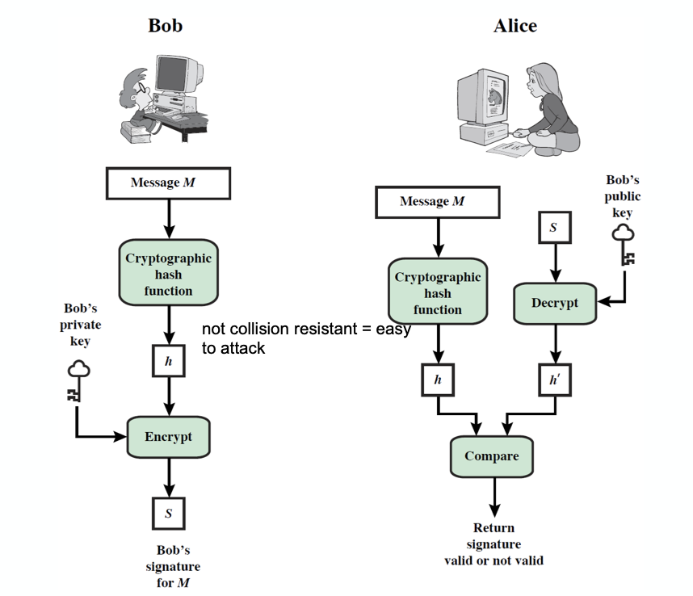

정보보호에서 Digital Signature 란 무엇인지 간략히 학습해보자.  

## Digital Signatures

앞서 우리는 Message Authentication 에 대해서 살펴봤다.  

이를 통해 두 파티 간의 메세지 교환을 third party(공격자)로부터 보호할 수 있긴 하지만 서로 보호할 수는 없는 방식(신뢰할 수 있는 통신의 문제)이다.  

이런 문제점을 해결하기 위해 _Digital Signature_ 를 도입하게 되었다.  
이를 통해 우리는 다음이 가능해진다.

- author, date, time 을 verify 할 수 있다.
- message contents 를 authenticate 할 수 있다.
- 분쟁을 해결하기 위해 third party 가 확인 가능하다.

그러나 이는 unique verification 으로는 불가능하며, authentication function 에 또 다른 것들을 추가하므로써 가능케한다.  

_Digital Signature_ 의 모델은 위와 같다.  

이 때 필요한 elements 들이 위에 나타나있다.  

- Cryptographic hash function  
    - 이는 collision resistant 해야 한다. 그렇지 않으면 공격당하기 쉬워진다.(hash 함수의 특성)
- 이를 통해 만든 해쉬값 $h$ 를 암호화해서 Signature $S$ 를 만든다.
- 수신자(Alice)는 검증의 과정을 거쳐서 해당 signature 가 valid 한지 판별한다.  

### Attacks and Forgeries

이러한 _Digital Signature_ 를 공격하거나 위조하는데 어떤 것들이 있는지 살펴보자.

- Key-only Attack  
    - A 의 public key 만 알 경우(A 의 signature 가 공격당하는 상황)
- Known message attack  
    - message 와 signature 집합에 접근이 가능한 경우
- Generic chosen message attack  
    - 공격 전 A 의 public key 와 독립적으로 메세지 리스트를 고를 수 있다.  
    - 그리고 A 로부터 고른 메세지의 valid signature 를 얻는다.
- Directed chosen message attack
    - A 의 public key 를 알고 메세지 리스트를 고른다.
    - 그리고 메세지의 valid signature 를 얻는다.
- Adaptive chosen message attack  
    - A 를 _orcale_ 로써 사용한다.
    - A 는 이전에 얻은 message-signature pair 에 의존적인 메세지의 signature 를 요청하게 된다.
    - 이는 public key 를 몇 개 얻은 후, 그 다음 것을 고르는 방식이다.

- Break success levels  
    1. Total break  
        - A 의 private key 를 결정짓는다.
        - 매우 어려운 단계이다.
    2. Universal forgery  
        - 해당 algorithm 에 대한 공격이다.  
        - 해당 algorithm 과 동등한 signature 를 만들어내는 효율적인 signing algorithm 을 찾는다.
    3. Selective forgery  
        - 선택한 하나의 메세지에 대해서만 하나의 페어를 찾아낸다.
        - weak collision hash
    4. Existential forgery  
        - 적어도 하나의 signature 를 위조하는 것
        - 전체적인 메세지에 대한 컨트롤은 없다.
        - strong collision hash

### Digital Signatures Requirements

이처럼 다양한 공격의 가능성이 있으므로 _Digital Signature_ 는 다음과 같은 requirements 가 있다.  

- must depend on the message signed
- unique information 을 sender 에게 사용해야 한다.  
    - 이는 양쪽이 위조되고 거부되는 것을 막기 위함이다.
    - unique 하지 않을 경우 더이상 보안이 보장되지 않는다.  
- 상대적으로 생산하기(produce) 쉬워야 한다.
- 상대적으로 인식하고 검증하기 쉬워야 한다.
- 위조하는데는 computationally infeasible 해야 한다.  
    - 새로운 메세지에 대해 기존의 digital signature 가 이를 만족해야 함.
    - 또한 주어진 메세지의 의심스러운 digital signature 에 대해서도 가능해야 함.
- storage 에 현실적으로 저장 가능해야 함.  
    - digital signature 가 비정상적으로 클 경우 storage 에 overhead 가 될 수 있다.

### Direct Digital Signatures

_Direct Digital Signature_ 는 이름 그대로 direct 하기에 오직 sender 와 receiver 만 관여한다.  

그 내용을 간략히 설명하면 다음과 같다.  

- receiver 가 sender 의 public key 를 가지고 있다고 가정한다.  
- sender 에 의해 만들어진 digital signature 로 전체 메세지를 sigining 하거나 private key 를 이용해 hash 한다.
- confidentiality 를 위해 receiver 의 public key 를 이용해 암호화 할 수 있다.
- sign 을 먼저 하고 암호화를 진행하고 signature 로 분쟁(dispute)를 다룬다.  
- sender 의 private key 에 security 를 의존한다.

## ElGamal Digital Signatures

## Schnorr Digital Signatures

### Schnorr Key Setup

## Digital Signatures Standard(DSS)

### DSS vs RSA Signatures

### Digital Signature Algorithm(DSA)

## Public Key Certificate

## Group Signature

## Ring Signature

### Aplication to Cryptocurrency