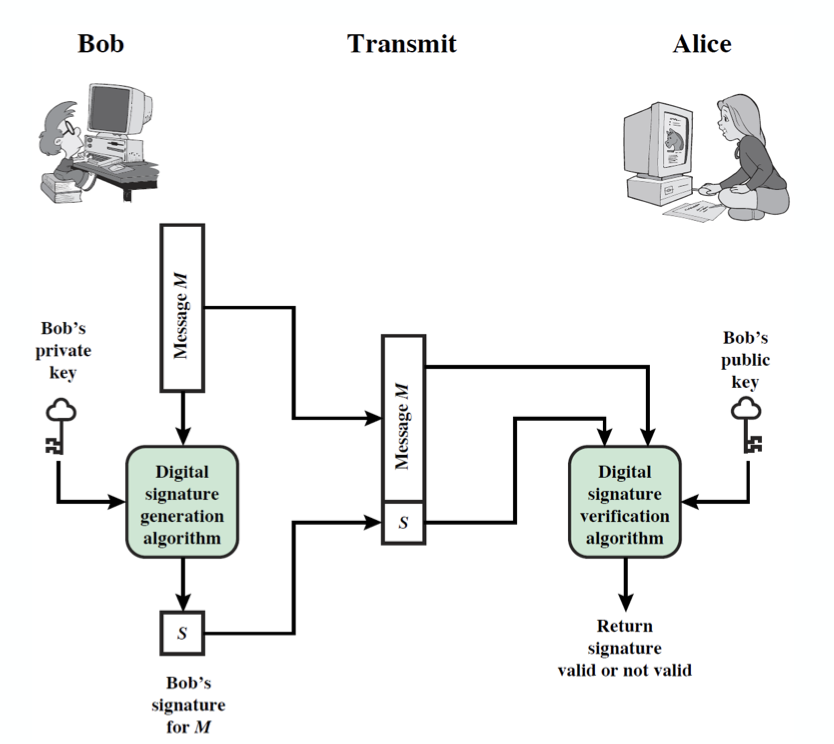

정보보호에서 Digital Signature 란 무엇인지 간략히 학습해보자.  

## Digital Signatures

앞서 우리는 Message Authentication 에 대해서 살펴봤다.  

이를 통해 두 파티 간의 메세지 교환을 third party(공격자)로부터 보호할 수 있긴 하지만 서로 보호할 수는 없는 방식(신뢰할 수 있는 통신의 문제)이다.  

이런 문제점을 해결하기 위해 _Digital Signature_ 를 도입하게 되었다.  
이를 통해 우리는 다음이 가능해진다.

- author, date, time 을 verify 할 수 있다.
- message contents 를 authenticate 할 수 있다.
- 분쟁을 해결하기 위해 third party 가 확인 가능하다.

그러나 이는 unique verification 으로는 불가능하며, authentication function 에 또 다른 것들을 추가하므로써 가능케한다.  

_Digital Signature_ 의 모델은 위와 같다.  

이 때 필요한 elements 들이 위에 나타나있다.  

- Cryptographic hash function  
    - 이는 collision resistant 해야 한다. 그렇지 않으면 공격당하기 쉬워진다.(hash 함수의 특성)
- 이를 통해 만든 해쉬값 $h$ 를 암호화해서 Signature $S$ 를 만든다.
- 수신자(Alice)는 검증의 과정을 거쳐서 해당 signature 가 valid 한지 판별한다.  

### Attacks and Forgeries

이러한 _Digital Signature_ 를 공격하거나 위조하는데 어떤 것들이 있는지 살펴보자.

- Key-only Attack  
    - A 의 public key 만 알 경우(A 의 signature 가 공격당하는 상황)
- Known message attack  
    - message 와 signature 집합에 접근이 가능한 경우
- Generic chosen message attack  
    - 공격 전 A 의 public key 와 독립적으로 메세지 리스트를 고를 수 있다.  
    - 그리고 A 로부터 고른 메세지의 valid signature 를 얻는다.
- Directed chosen message attack
    - A 의 public key 를 알고 메세지 리스트를 고른다.
    - 그리고 메세지의 valid signature 를 얻는다.
- Adaptive chosen message attack  
    - A 를 _orcale_ 로써 사용한다.
    - A 는 이전에 얻은 message-signature pair 에 의존적인 메세지의 signature 를 요청하게 된다.
    - 이는 public key 를 몇 개 얻은 후, 그 다음 것을 고르는 방식이다.

- Break success levels  
    1. Total break  
        - A 의 private key 를 결정짓는다.
        - 매우 어려운 단계이다.
    2. Universal forgery  
        - 해당 algorithm 에 대한 공격이다.  
        - 해당 algorithm 과 동등한 signature 를 만들어내는 효율적인 signing algorithm 을 찾는다.
    3. Selective forgery  
        - 선택한 하나의 메세지에 대해서만 하나의 페어를 찾아낸다.
        - weak collision hash
    4. Existential forgery  
        - 적어도 하나의 signature 를 위조하는 것
        - 전체적인 메세지에 대한 컨트롤은 없다.
        - strong collision hash

### Digital Signatures Requirements

이처럼 다양한 공격의 가능성이 있으므로 _Digital Signature_ 는 다음과 같은 requirements 가 있다.  

- must depend on the message signed
- unique information 을 sender 에게 사용해야 한다.  
    - 이는 양쪽이 위조되고 거부되는 것을 막기 위함이다.
    - unique 하지 않을 경우 더이상 보안이 보장되지 않는다.  
- 상대적으로 생산하기(produce) 쉬워야 한다.
- 상대적으로 인식하고 검증하기 쉬워야 한다.
- 위조하는데는 computationally infeasible 해야 한다.  
    - 새로운 메세지에 대해 기존의 digital signature 가 이를 만족해야 함.
    - 또한 주어진 메세지의 의심스러운 digital signature 에 대해서도 가능해야 함.
- storage 에 현실적으로 저장 가능해야 함.  
    - digital signature 가 비정상적으로 클 경우 storage 에 overhead 가 될 수 있다.

### Direct Digital Signatures

_Direct Digital Signature_ 는 이름 그대로 direct 하기에 오직 sender 와 receiver 만 관여한다.  

그 내용을 간략히 설명하면 다음과 같다.  

- receiver 가 sender 의 public key 를 가지고 있다고 가정한다.  
- sender 에 의해 만들어진 digital signature 로 전체 메세지를 sigining 하거나 private key 를 이용해 hash 한다.
- confidentiality 를 위해 receiver 의 public key 를 이용해 암호화 할 수 있다.
- sign 을 먼저 하고 암호화를 진행하고 signature 로 분쟁(dispute)를 다룬다.  
- sender 의 private key 에 security 를 의존한다.

## ElGamal Digital Signatures

이제 _ElGamal Digital Signatures_ 를 알아보자.  

이는 signature 의 변형 중 ElGamal 을 이용한 것으로, 

- Galois field 에서 exponentiation 을 사용
- 보안성이 Diffie-Hellman 의 discrete logarithms 계산 복잡성에 의존함

이러한 두 가지 특성을 가진다.  

private key 를 이용해 encryption 해서 signing 과정을 진행하고, public key 를 이용해 decrytion 해 verification 과정을 진행한다.  

이 때, 각 유저들은 그들의 키를 생성한다.  

- 비밀 키를 고른다. $1 \lt x_A \lt q-1$
- public key 를 계산한다.  
    - {a, q, and $y_A = a^{x_A} \mod q$}
    - 여기서 a 는 q 의 primitive root 이다.  
<small>이는 앞서 본 ElGamal cryptography 와 유사하다.</small>

signed message M 은 다음과 같이 만들어진다.  

1. $m = H(M),\ 0 \leq m \leq (q-1)$ 가 되도록 M 을 hash 한다.
2. $1 \leq K \leq (q-1)$ 인 random integer $K$ 를 고른다. 이 때, $\gcd(K, q-1) = 1$ 이다.
3. temporary key $S_1 = a^K \mod q$ 를 계산한다.
4. $K^{-1} \mod(q-1)$ 을 계산한다.
5. $S_2 = K^{-1}(m - x_AS_1) \mod(q-1)$ 을 계산한다.
6. $(S_1,\ S_2)$ 가 signature 가 된다.

이렇게 만들어진 signed message M 은 user B(any) 가 다음의 과정을 거쳐서 verify 할 수 있다.  

- $V_1 = a^m \mod{q}$
- $V_2 = y_A^{S_1}S_1^{S_2}\mod{q}$
- $V_1 = V_2$ 일 경우 valid 한 signature 이다.

이를 증명해보면 다음과 같다.

$$
\begin{aligned}
V_2 &= y_A^{S_1}S_1^{S_2} \mod{q} \\
    &= a^{x_AS_1}a^{KS_2} \mod{q} \\
    &= a^{x_AS_1}a^{K\left(K^{-1}\left(m-x_AS_1\right)\right)} \mod{q} \\
    &= a^{x_AS_1}a^{\left(m - x_AS_1 \right)} \mod{q} \\
    &= a^m \mod{q} \\ 
    &= V_1
\end{aligned}
$$

이제 간단한 예제로 ElGamal Signature 를 살펴보자.

> - GF(19) 에서 q=19, a=10 일 때, 원시근(primitive root)은 {2, 3, 10, 13, 14, 15}
> - A 가 key 를 계산  
>   - $x_A = 16$ 이라고 했을 떄, $y_A = 10^{16} \mod{19} = 4$
> - A 가 message 를 hash $m = 14$ 로 sign  
>   - random K = 5 라고 하면 gcd(18, 5) = 1
>   - $S_1 = 10^5 \mod{19} = 3$
>   - $K^{-1} \mod{(q-1)} = 5^{-1} \mod{18} = 11$
>   - $S_2 = 11\left( 14 - 16 \cdot 3 \right) \mod{18} = 4$
>   - signature = (3, 4)
> - B 가 verify 할 때는
>   - $V_1 = 10^{14} \mod{19} = 16$
>   - $V_2 = 4^3 \cdot 3^4 = 5184 = 16 \mod{19}$
>   - 16 = 16 이므로 signature 가 valid 하다.

## Schnorr Digital Signatures

이제 _Schnorr Digital Signature_ 에 대해 알아보자.

이 방식 역시 _ElGamal Digital Signature_ 처럼 Galois field 에서 exponentiation 을 활용하는 방식이다.  
이는 security 가 DH 의 discrete logarithm 에 의존한다는 의미다.  

이 방식의 특징은 message dependent computation 을 최소화한다는 것이다.  

- 주요 작업은 메세지에 의존적이지 않고 idle time 안에 완료될 수 있다.
- Message dependent part 는 2n-bit 정수를 b-bit 정수와 곱해야한다.

이 때, prime modulus p 를 이용하게 되는데, p-1 은 q 라는 적절한 size 의 prime factor(소인수) 를 가진다.  

- 보통 p 는 1024-bit, q 는 160-bit 정도가 된다.

이러한 p, q 를 잘 설정해야 한다.

### Schnorr Key Setup

$a^q = 1 \mod{p}$ 를 만족하는 $a$ 를 고르게 되는데, (a, p, q) 가 global public parameters 가 된다.  

각 유저들은 키를 생성하게 된다.  

- 비밀 키 $s$ 는 $0 \lt s \lt q$ 를 만족한다.
- public key 는 $v = a^{-s} \mod{p}$ 로 계산한다.

이제 _Schnorr Signature_ 의 과정을 보자.  

유저는 message M 을 다음과 같이 signing 한다.

1. random $r$ ($0 \lt r \lt q$) 을 고르고 $x = a^r \mod{p}$ 를 계산
2. message M 을 x 와 합치고 hash 한다. $e = H\left( M\ ||\ x \right)$
3. $y = \left( r + se \right) \mod{q}$
4. signature = (e, y)

다른 유저가 verify 하는 과정은 다음을 따른다.

1. $x' = a^yv^e \mod{p}$
2. $e = H\left( M\ ||\ x' \right)$ 를 계산한다.

위의 과정을 증명해보자.  

$$
\begin{aligned}
x'  &= a^yv^e \mod{p} \\
    &= a^ya^{-se} \mod{p} \\
    &= a^{y-se} \mod{p} \\
    &= a^r \mod{p} \\
    &= x \mod{p}
    \\
\text{hence, }&\ H(M\ ||\ x') = H(M\ ||\ x)
\end{aligned}
$$

## Digital Signature Standard(DSS)

_Digital Signature Standard_ 는 NIST & NSA 에서 90년대 초반 고안했다.  

이는 SHA hash algorithm 을 이용하며 _DSA_ 를 표현한다.<small>_DSS_ 는 표준이고 _DSA_ 는 알고리즘이다.</small>

1991년 FIPS-186에서 publish 되었으며 93, 96, 00년에 개정되었다.

2000년 FIPS 186-2 에서 RSA 와 Elliptic curve cryptography 기반의 DSA 가 포함되었다.

_RSA_ 와는 달리 _DSA_ 는 암호화나 키 교환에 사용될 수는 없다.

여기서 _ECC_ 는 resource limited 한 곳에 사용된다.(특성상 효율적)  

그리고 _DSA_ 는 not reversible 하다.

### DSS vs RSA Signatures

_RSA_ 방식과 _DSS_ 방식의 구조적 차이점을 다음과 같이 확인할 수 있다.

### Digital Signature Algorithm(DSA)

_DSA_ 는 320-bit signature 를 512~1024-bit security 로부터 생성한다.  
이는 _RSA_ 보다 작으면서도 빠른 것이다.  

- 320 vs. 1024 bits, modulo 160-bit

그러나 이는 digital signature scheme 만 할 뿐 암호화나 키 교환을 위해서 사용되지는 않는다.
이 역시 앞서 나왔던 것들처럼 discrete logarithm 의 계산 복잡성에 보안성을 의존한다.  

구조를 잘 살펴보면 ElGamal 과 Schnorr scheme 의 변형임을 확인할 수 있다.

### DSA Key Generation

_DSA_ 는 global public key value (p, q, g) 를 가진다.  

- prime $q$ 는 160-bit 이다.
- large prime $p,\ 2^{L-1} \lt p \lt 2^L$ 를 고른다.  
  - L = 512~1024 bits 를 가진다. 이 때 64의 배수형태를 띄도록 한다.
  - $q$ 는 ($p-1$) 의 prime factor(divisor) 이다.
- $g = h^{\left( p-1 \right) \over q}$ 인 $g$ 를 고른다.  
  - $1 \lt h \lt p-1$ 이고 $h^{\left( p-1 \right) \over q} \mod{p} \gt 1$ 이어야 한다.

이제 private key 를 고르고 public key 를 계산한다.  

- choose random private key $x \lt q$
- compute public key $y = g^x \mod{p}$

### DSA Signature Creation

message M 을 어떻게 signing 하는지 알아보자.  

1. random signature key $k,\ k \lt q$ 를 생성한다.  

    - 이 때 $k$ 는 반드시 random 이어야하며 사용하고나면 재사용하지 않고 destroy 해야 한다. 재사용할 경우 보안성이 깨질 수 있다.

2. signature pair 를 계산한다.  

    - $r = (g^k \mod{p}) \mod{q}$
    - $s = \left[k^{-1}\left(H\left(M\right) + xr\right)\right] \mod{q}$

이렇게 구한 signature pair(r, s) 를 메세지 M 과 같이 보낸다.

### DSA Signature Verification

_DSA Signature_ 를 verify 하는 과정을 살펴보자.  

$$
x = s^{-1} \mod {q} \\ 
u_1 = [H(M)w] \mod{q} \\
u_2 = (rw) \mod{q} \\
v = [(g^{u_1}y^{u_2}) \mod{p}] \mod{q}
$$

이 때 $v = r$ 이면 valid 하다.

위의 과정을 증명해보자.  

$$
\begin{aligned}
    s           &= [k^{-1}(H(M) + xr)] \mod{q} \\
\text{thus, } k &\equiv H(M)s^{-1} + xrs^{-1} \\
                &\equiv H(M)w + xrw \mod{q} \\
\end{aligned}
$$

Since $g$ has order $q \mod{p}$, we have

$$
\begin{aligned}
g^k &\equiv g^{H(M)w}g^{xrw} \\
    &\equiv g^{H(M)w}y^{rw} \\
    &\equiv g^{u_1}y^{u_2} \mod{p}
\end{aligned}
$$

### DSS Overview

위의 과정을 도식으로 보면 다음과 같다.

이 때 메세지에 의존적이지 않은 $r$ 에 대한 마지막 테스트를 하게 된다.<small>Compare 연산인듯 하다</small>

계산이 많이 필요한 부분은 exponential calculation 인 $g^k \mod{p}$ 와 $k^{-1}$ 이다.  

- sign 될 메세지에 의존적이지 않기 때문에 $r$ 과 $k^{-1}$ 을 미리 계산할 수 있다.

## Public Key Certificate

누군가의 public key 를 다른 이에게 전달하기 위해서는 어떻게 해야할까?  

- broadcast 를 한다.
- 편리하지만 누구나 이 announcement(broadcast) 를 위조하기 쉽다.

이러한 물음에 답하기 위해 public ket certificate 를 고안하게 되었다.  

- public key + ID of the key owner 로 구성된다.
- 전체 block 이 신뢰하는 third party, certificate authority(CA) 로부터 sign 된다. (RSA, DSA 사용)

이와 관련하여 X.509 가 universally 하게 accept 된 public-key certificate 이다.(IPsec, TLS, SSH, S/MIME, ...)

여기서 _CA_ 는 모든 시스템으로부터 완전히 신뢰된 것이다.  
이런 신뢰의 문제는 사실 계속 꼬리를 물 수 밖에 없기 때문에 이렇게 공인된 존재가 필요하게 된다.  

## Group Signature

_Group Signature_ 는 Eurocrypt 에서 91년도에 D.Chaum 이 발표한 것으로 그룹에 속한 멤버가 익명으로 signing 을 진행하게 된다.  

이렇게 만들어진 signature 는 어떤 그룹이 서명한 것인지는 알 수 있으나 어떤 유저가 서명했는지는 알기 어렵게 되는 이점이 있다.  
즉, anonymity 가 지켜진다.

그러나 group manager 가 있고 이 group manager 는 누가 signing 을 했는지 알 수 있다.  

_Group Signature_ 의 특징은 다음과 같다.

- Unforgeability  
  - 그룹의 멤버만이 메세지를 정확하게 sign 할 수 있다.
- Anonymity/Traceability
  - 그룹 멤버 중 누가 서명했는지 알 수 없지만 그룹 매니저는 이를 추적할 수 있다.
- Unlinkability
  - 같은 그룹내의 멤버가 두 signature 를 발행(issue)했는지 결정할 수 없다.
- Security against framing attack
  - 어떤 그룹 멤버가 다른 멤버를 위해 대신 signing 할 수는 없다.

## Ring Signature

_Ring Signature_ 는 _Group Signature_ 의 변형 중 하나이다.

- 개별 signature 의 anonymity 를 revoke 할 방법이 없다.
- 어떤 그룹의 유저든간에 추가 설정 없이 그룹으로 사용될 수 있다.

### Application to Cryptocurrency

이러한 _Ring Signature_ 를 활용해 암호화폐를 구현한 것이 __Monero__ 이다.  

__Monero__ 의 특징은 다음과 같다.  

- transaction 간의 linkage 를 숨긴다.(unlinkability, untraceablility)
- Ring signature 가 유저의 account key 를 사용하고 public key 들이 blockchain 으로부터 pull 된다.
- 가능한 signer 들이 'ring' 안에서는 모두 동등하고 valid 하다고 본다.
- 외부자(outsider)가 유저의 account 안에 어떤 signer 가 있는지 말할 수 없다.
- 이로 인해 transaction 이 untraceable 하게 된다.

<small>최종 수정일 : 2019-12-10</small>

> 본 포스트는 _정보보호_ 를 공부하며 정리한 글 입니다.  
> 잘못된 내용이 있다면 알려주세요!  
> 감사합니다 :)
